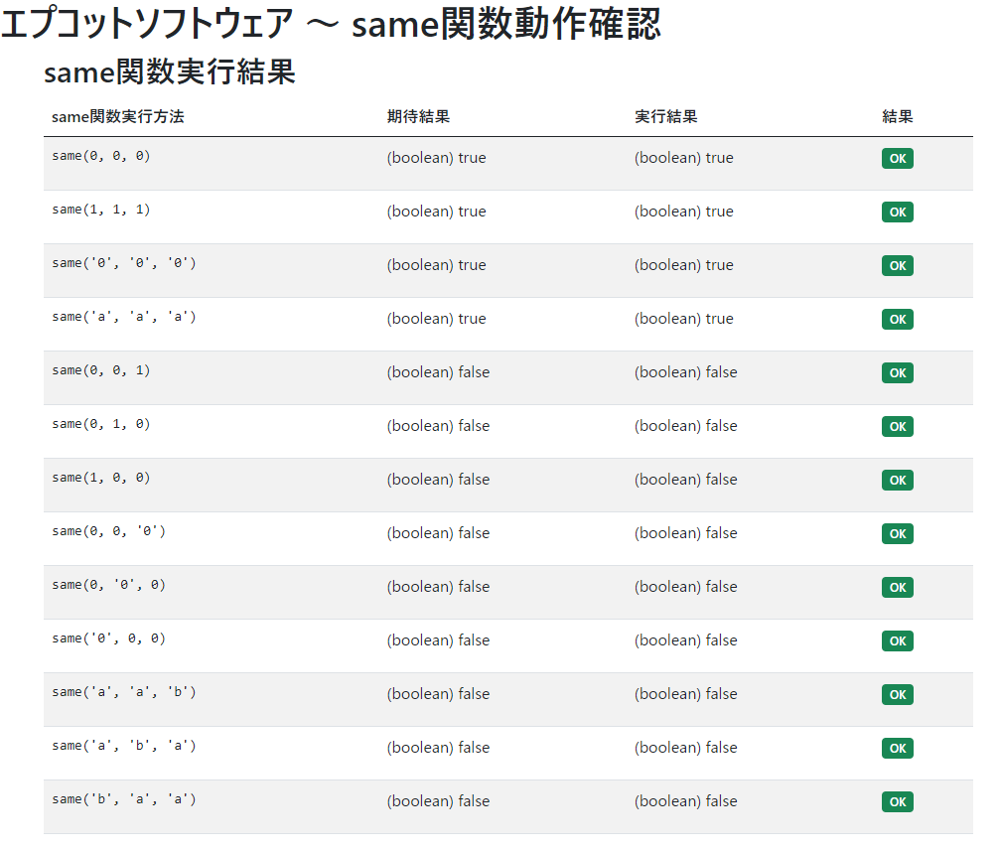

# 試験

「`helper.js`」ファイルを新規作成し、仕様を満たす[same関数](#same関数)を定義してください。  
初めての方は、[参考資料](#参考資料)に学習用の動画・サイトのリンクがあります。  
また、[禁止事項](#禁止事項)には目を通すようお願いいたします。  
  
動作確認には[動作確認用HTMLファイル](#動作確認用htmlファイル)をお使いください。

- 言語
  - JavaScript
- 成果物
  - index.html
    - same関数の動作確認用HTMLファイル
  - helper.js
    - same関数を定義したJavaScriptファイル（確認対象）

## インデックス

| No. |  |
| --- | --- |
| 1 | [動作確認用HTMLファイル](#動作確認用htmlファイル) |
| 2 | [same関数](#same関数) |
| 3 | [例](#例) |
| 4 | [提出について](#提出について) |
| 5 | [参考資料](#参考資料) |
| 6 | [禁止事項](#禁止事項) |

## 動作確認用HTMLファイル

- 以下のZIPファイルを解凍してお使いください。
  - [htdocs.zip](./htdocs.zip)

## same関数

same関数の仕様は以下になります。

### 説明

指定された2つの値が等しいかどうかを判断します。

### 関数名

`same`

### パラメータ(引数)

- `value1`
  - 比較する最初の値。
- `value2`
  - 比較する2番目の値。

### 戻り値(返り値)

指定した2つの値が完全一致した場合は `true(boolean)`、 そうでなければ `false(boolean)` を返します。

## 例

以下は、same関数の使用例です。

### value1 = 1、value2 = 1、戻り値 = true

```js
// same関数を実行
let result = same(1, 1);
// result変数には true が入る
```

### value1 = 2、value2 = 2、戻り値 = true

```js
// same関数を実行
let result = same(2, 2);
// result変数には true が入る
```

### value1 = '1'、value2 = '1'、戻り値 = true

```js
// same関数を実行
let result = same('1', '1');
// result変数には true が入る
```

### value1 = 1、value2 = 2、戻り値 = false

```js
// same関数を実行
let result = same(1, 2);
// result変数には false が入る
```

### value1 = 1、value2 = '1'、戻り値 = false

※ 以下のパターンは、型が違うため不一致とします。

```js
// same関数を実行
let result = same(1, '1');
// result変数には false が入る
```

## 提出について

成果物については「htdocs」フォルダを新規作成し、その中に成果物のファイルを格納し  
ZIP圧縮を行い、担当者までメールでお送りください。  
**iCloudメールやGmail等では、そのまま添付しても送信できないためご注意ください。**  

- 提出前のチェックリスト
  - `index.html` の画面でエラーが出ていないか
  - `index.html` の画面で全パターン「OK」となっているか
  - `helper.js` に `console.log` 等の動作確認のためのコードが残っていないか
  - `helper.js` のTODOコメントが削除されているか  
  （基本的に成果物にはTODOをつけたコメントは残しません）
  - [same関数](#same関数) が仕様通りに定義出来ているか

### iCloudメールで送信する場合

ZIPファイルを添付しても届かないことがあるため  
iCloudファイル共有を利用して、リンクを送信してください。  

- [iCloudファイル共有を使ってほかのユーザとフォルダや書類を共有する](https://support.apple.com/ja-jp/guide/mac-help/mchl91854a7a/mac)

### ZIPファイルが添付出来ない場合

セキュリティ上の理由でファイルを添付出来ないことがあります
添付出来ない場合、ドライブを使用してご送付ください。

- [Gmail](https://mail.google.com/)
  - ZIPファイルを直接添付することが出来ないので  
   「ドライブを使用してファイルを挿入」で添付してください。

### 正常時の画面表示例



### よくある質問

- 全てNGになってしまいます。  
  → なぜNGになるかを考えましょう。実行結果の値があなたの想定通りになっているでしょうか？  
- 「`same(1, '1')`」のパターンがNGになってしまいます。  
  → 「等価演算子」について学習しましょう。  

## 参考資料

### エディタ

JavaScriptを書くには「メモ帳」等のアプリでも可能ですが  
「Visual Studio Code」がおすすめで、HTML講座動画内でも使われています。  
サブのエディタとして「サクラエディタ」等も良いです。  

- Visual Studio Code (ビジュアル スタジオ コード)
  - <https://azure.microsoft.com/ja-jp/products/visual-studio-code/>
- サクラエディタ
  - <https://sakura-editor.github.io/>

### サイト

- JavaScript入門
  - <https://www.javadrive.jp/javascript/>
  - JavaScriptのコードを別のファイルに記述する
    - <https://www.javadrive.jp/javascript/before/index4.html>
  - 関数を定義する
    - <https://www.javadrive.jp/javascript/function/index2.html>
  - 等価演算子
    - <https://www.javadrive.jp/javascript/ope/index12.html>
  - 論理値
    - <https://www.javadrive.jp/javascript/ini/index6.html#section3_4>
- 検索
  - 「ZIP圧縮」
    - <https://www.google.com/search?q=ZIP圧縮>

### 動画

- HTML講座
  - <https://www.youtube.com/playlist?list=PLwM1-TnN_NN457PTxsvNXxVxN8fkbYHKU>
- JavaScript講座
  - <https://www.youtube.com/playlist?list=PLwM1-TnN_NN7-zdRV8YsGUB82VVhfYiWW>

## 禁止事項

- 第三者に本ページのURL・スクリーンショット・記載内容を見せることを禁止する。
- 第三者に本課題の協力を求めることを禁止する。 ※ 研修は本課題のスキルがある前提で進むため。

## 試験資料について

本試験資料はプログラミング言語公式サイトのAPIリファレンス等を参考に作成しています。

- 【C#】 `.NET API ブラウザー`
  - <https://docs.microsoft.com/ja-jp/dotnet/api/>
  - `Math.Max メソッド`
    - <https://docs.microsoft.com/ja-jp/dotnet/api/system.math.max#system-math-max(system-int32-system-int32)>
- 【PHP】 `PHPマニュアル`
  - <https://www.php.net/manual/ja/>
  - `max`
    - <https://www.php.net/manual/ja/function.max.php>
- 【JavaScript】 MDN Web Docs
  - <https://developer.mozilla.org/ja/>
  - `Math.max()`
    - <https://developer.mozilla.org/ja/docs/Web/JavaScript/Reference/Global_Objects/Math/max>
