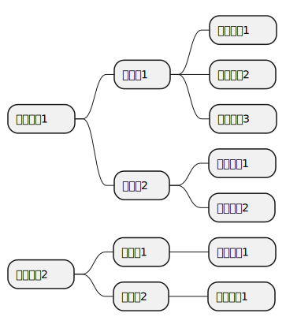
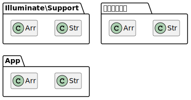

# PHP名前空間の学習

※ このページはエプコットソフトウェアの研修資料の一部です。

## 目次

| No. |  |
| :---: | --- |
| 1 | [用語](#用語) |
| 2 | [名前空間とは](#名前空間とは) |
| 3 | [名前空間・クラス・メソッドの定義](#名前空間クラスメソッドの定義) |
| 4 | [Laravel参考ページ](#laravel参考ページ) |
| 5 | [PHP標準クラス](#php標準クラス) |
| 6 | [useの注意点](#useの注意点) |
| 7 | [PHPマニュアル](#phpマニュアル) |

## 用語

| 用語 | 解説 |
| --- | --- |
| メソッド | クラス内で定義した関数を「メソッド」と呼びます。 |
| クラス | 処理をする機能をひとまとめにしたものを「クラス」と呼び<br>構成要素としてメソッド等を持ちます。 |
| 名前空間 | クラスをまとめたものを「名前空間」と呼びます。 |

- [PlantUML](https://www.plantuml.com/plantuml/umla/SoWkIImgoStCIybDBE3IKdWweVTfP-_pbRjUJfjioAMbfV2uQVtZvfMFctO2UI1kyyB7JNiVDpS_Rkx453724356CSE863FGN654o1K4RN18pKk1-X00)  
  

クラス・名前空間は、厳密には異なる所もありますが  
最初の内は、この覚え方で問題ありません。

## 名前空間とは

PHPを含む一般的なプログラミング言語では同一名称のクラスを定義することが出来ません。  
例えば、PHPフレームワークのLaravelには`Str`クラスというものがありますが  
Laravelで自分が作成したアプリケーションに`Str`という名前のクラスを作りたい場合、作成出来なくなってしまいます。  
また、作りたいクラス名称の重複がないか毎回調べる必要があるので大変です。  

これを解決する方法が「**名前空間(namespace)**」です。  
名前空間はファイルシステムの「フォルダ」のイメージに近く  
同一名前空間に複数のクラスを定義することが出来  
完全修飾名が異なれば同名クラスであっても共存できます。  

例えば以下の8つのクラスは共存が可能です。  

| 名前空間<br>(namespace) | クラス名<br>(class) | 完全修飾名<br>（`\{名前空間}\{クラス名}`） |
| --- | --- | --- |
| `Illuminate\Support` | `Str` | `\Illuminate\Support\Str` |
| `Illuminate\Support` | `Arr` | `\Illuminate\Support\Arr` |
| `App` | `Str` | `\App\Str` |
| `App` | `Arr` | `\App\Arr` |
| なし | `Str` | `\Str` |
| なし | `Arr` | `\Arr` |

- [PlantUML](https://www.plantuml.com/plantuml/umla/SoWkIImgAStDuSh8J4bLo4tDJKejAkRYAaujKSXBp4qjBaXCJWrEBKWiIYp9BrA8YU5ApaaiBbRmpCafpStCIon9ZOa9BYqeo2yg0J9AYXJmoJiM5K6b7GiAmCeHN6JPfnDwdtRsFb-vw-MqoOyRLprkd0vIZ5iMefSBbvqAkhhHGD-bfER5sY6iud98pKi1UXm0)  
    

## 名前空間・クラス・メソッドの定義

以下のように定義を行います。

```php
<?php

namespace 名前空間;

class クラス名
{
    public static function メソッド名1()
    {
        // 処理
    }

    public static function メソッド名2()
    {
        // 処理
    }
}
```

### Strクラス定義例

LaravelのStrクラスは名前空間として「`Illuminate\Support`」が設定されています。  
簡単にすると以下のように定義がされています。  

```php
<?php

// \Illuminate\Support
namespace Illuminate\Support;

// \Illuminate\Support\Str
class Str
{
    // \Illuminate\Support\Str::lower()
    public static function lower($value)
    {
        return mb_strtolower($value, 'UTF-8');
    }
}
```

### Strクラス使用例

LaravelのStrクラスを使う場合、「`\Illuminate\Support\Str`」と指定する必要があります。  
以下は`lower`メソッドを呼び出した例です。

```php
$converted = \Illuminate\Support\Str::lower('Laravel');
```

毎回、上記のような長い名前を指定すると大変なので「use」を使って  
エイリアス（別名）を作成して、短い名前でアクセス出来るようにします。  

```php
// 構文1
use 名前空間\クラス名 as 別名;
// 構文2（別名がクラス名になる）
use 名前空間\クラス名;
```

上記の構文では「名前空間\クラス名」となっていますが  
メソッドの指定や、名前空間だけでも指定が可能です。  
一般的には「名前空間\クラス名」という覚え方で問題ありません。  

```php
// \Illuminate\Support\Str を 「Str」という名前でもアクセス出来るようにする。
use Illuminate\Support\Str as Str;

$converted = Str::lower('Laravel');
```

```php
// use Illuminate\Support\Str as Str と同じ
use Illuminate\Support\Str;

$converted = Str::lower('Laravel');
```

UserControllerというクラスで「`\Illuminate\Support\Str`」クラスを使った例です。  
useはクラスの外に記載します。  

```php
<?php

namespace App\Controllers;

// \Illuminate\Support\Str を 「Str」という名前でもアクセス出来るようにする。
use Illuminate\Support\Str;

class UserController
{
    public function index()
    {
        // \Illuminate\Support\Str::lower('Laravel') と同じ
        $converted = Str::lower('Laravel');
        var_dump($converted);
    }
}
```

### 例

今度は独自のクラスを定義してみましょう。

#### クラス定義

```php
<?php

namespace Helpers;

class StringHelper
{
    public static function upper($value)
    {
        return mb_strtoupper($value, 'UTF-8');
    }
}
```

#### 定義したクラスを使用

```php
<?php

namespace App\Controllers;

// use Helpers\StringHelper as StringHelper と同じ
use Helpers\StringHelper;

class UserController
{
    public function index()
    {
        $converted = StringHelper::upper('Laravel');
        var_dump($converted);
    }
}
```

## Laravel参考ページ

LaravelのStrクラスの参考資料です。

- `Laravel 9.x ヘルパ`
  - <https://readouble.com/laravel/9.x/ja/helpers.html>
  - `Illuminate\Support\Str クラス(GitHub)`
    - <https://github.com/illuminate/support/blob/9.x/Str.php>
  - `Illuminate\Support\Str - Laravel API - lowerメソッド`
    - <https://laravel.com/api/9.x/Illuminate/Support/Str.html#method_lower>

## PHP標準クラス

名前空間が設定されているPHPファイルで、名前空間のないクラスを使う際も  
useを忘れないようにしましょう（もしくは完全修飾名にする）。  
「Exception」や「DateTime」等のPHP標準のクラスは名前空間が設定されていないので注意です。  
useを忘れた場合、現在の名前空間の相対クラスにアクセスしようとします。

```php
<?php

namespace App\Controllers;

// \DateTime を 「DateTime」という名前でもアクセス出来るようにする。
use DateTime;

class UserController
{
    public function index()
    {
        // new \DateTime() と同じ、useを忘れた場合「\App\Controllers\DateTime」にアクセスしようとしてエラーになる。
        $dateTime = new DateTime();
        $dateTimeString = $dateTime->format('Y/m/d H:i:s');
        var_dump($dateTimeString);
    }
}

// 実行
(new UserController())->index();
```

## useの注意点

「`use`」はエイリアスを作成する以外にも使われます。  
以下の３つは、別物と考えてください。  

| use | 用途 | 記載場所/記載例 |
| :---: | :---: | --- |
| 名前空間のuse | エイリアス（別名）を作成する | クラス外に記載<br>`use 名前空間\クラス名;`<br>`use 名前空間\クラス名 as 別名;` |
| トレイトのuse | トレイトで定義したメンバーをクラスに追加する | クラス内に記載<br>`use トレイト名;` |
| 無名関数のuse | 親スコープから変数を引き継ぐ | 処理に記載<br>`function () use ($変数1, $変数2) {};` |

## PHPマニュアル

資料作成で参考にしたPHPマニュアルのリンクです。

- `名前空間`
  - <https://www.php.net/manual/ja/language.namespaces.php>
- `トレイト`
  - <https://www.php.net/manual/ja/language.oop5.traits.php>
- `無名関数`
  - <https://www.php.net/manual/ja/functions.anonymous.php>
- `Exception`
  - <https://www.php.net/manual/ja/class.exception.php>
- `DateTime`
  - <https://www.php.net/manual/ja/class.datetime.php>
