# GitHub ブランチ運用

## はじめに

EPKOTで社内開発をする場合のブランチ運用ルールです。  
フローについては「GitHub Flow」に「develop」ブランチを追加した形です。

## フロー

以下のフローで運用します。  
「`main`」、「`develop`」には直接コミットしないようにご注意ください。  

- [Mermaid](https://mermaid.live/edit#pako:eNqNks1uAjEMhF8l8hlR4JgbtBIPwNUXk3h3I_KzCg5ShXj3BrZFhbKUW-QZfzOJcgSTLIOG1sk6U99hNCkEJ8pZjeCiE0deDTMEJdTW8WE2nSNg3GaKplOWD-xTj_E6aZikZH6jO1zoPQeOsrysP5YWZ6mKHZtdKvKEvh1BrMbpq1F64Nzyb_SfODPCfB_iHvS9ZdJNcCB3dXyv_LzufDq7a_lvhRevZV6tsBgqwASqXH22fpEjRqUQpKuRCLoeLTdUvJydp2qlImnzGQ1oyYUnUHpLwh-O2kwBdEN-z6cvGOTlFQ)  
    

| ブランチ | 分岐元 | マージ先 | コミット | 備考 |
| :---: | :---: | :---: | :---: | --- |
| `main` | - | なし(※) | NG | ※ hotfix対応時等で「`develop`」へ 　マージするケースあり |
| `develop` | `main` | `main` | NG | PR(Pull request) でマージを行う。 |
| `feature/{★任意}` | `develop` | `develop` | OK | PR(Pull request) でマージを行う。 「`main`」ブランチへのマージはNG |

## デフォルトブランチをdevelopに設定する

新規リポジトリを作成した場合、デフォルトブランチを`develop`に設定してください。  

- 手順(管理者)
  1. `main`ブランチから`develop`ブランチを作成
  1. GitHubで対象リポジトリのホーム画面を開く
  1. 「Settings」→「Branches」→「Default branch」に`develop`を設定
  1. 再度、GitHubで対象リポジトリのホーム画面を開き、`develop`ブランチがデフォルトになっているか確認する。

## developブランチを作成する理由

EPKOTではGitHubフリープランを利用しているため  
プライベートリポジトリのブランチ保護が出来ません。  
mainブランチに誤ってコミットすることを避けるため  
デフォルトブランチとして`develop`を設定しています。
