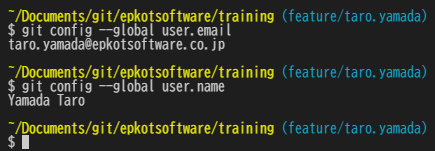
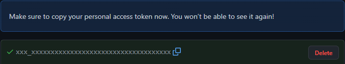

# GitHub

## 目次

| No. | 見出し | 備考 |
| :---: | --- | --- |
| 1 | [GitHub組織アカウント](#github組織アカウント) |  |
| 2 | [GitHub組織アカウントへの参加](#github組織アカウントへの参加) |  |
| 3 | [GitHubアカウント作成](#githubアカウント作成) |  |
| 4 | [Gitインストール](#gitインストール) | 研修生・開発者向け |
| 5 | [Git設定](#git設定) | 研修生・開発者向け |
| 6 | [Git設定確認](#git設定確認) | 研修生・開発者向け |
| 7 | [その他のGit設定](#その他のgit設定) | 研修生・開発者向け |
| 8 | [トークン](#トークン) | 研修生・開発者向け |
| 9 | [ブランチ運用](#ブランチ運用) | 社内開発者向け |

## GitHub組織アカウント

組織アカウントのリンクは以下になります。

- <https://github.com/epkotsoftware>

## GitHub組織アカウントへの参加

- Slack(Teams)にて管理者にGitHubアカウントユーザー名を伝えて、組織アカウントへの招待を依頼してください。
  - GitHubアカウントをお持ちではない方は作成をお願いします。
  - 参加後は以下にアクセス出来る事を確認してください（研修用の資料リンクです）。
    - <https://github.com/epkotsoftware/training>

## GitHubアカウント作成

会社用アカウント作成は必須ではないので  
既にお持ちの方は作成不要です。

- GitHubアカウント作成
  - <https://github.co.jp/>
  - 例
    - Username: `taro-yamada-epkotsoftware` （自由、URLに使用されます）
    - Email address: `taro.yamada@epkotsoftware.co.jp` （会社用アカウントにする場合は会社メールアドレス）
    - Password: 自由
    - Email preferences: どちらでもOK
- GitHubアカウント設定
  - <https://github.com/settings/profile>
  - [`Profile`](https://github.com/settings/profile)
    - 例（フルネームじゃなくてもOK）
      - Name: `Yamada Taro`、`Yamada.T`
  - [`Account security`](https://github.com/settings/security)
    - `Two-factor authentication`(2段階認証) は組織アカウントへの参加時は、今のところ必須にはしていませんが推奨します。

※ **研修生・開発者ではない方はここまでです。**

## Gitインストール

※ **研修生・開発者向け**

### Gitインストール(Windows)

デフォルト設定でのインストールでOKです。

- `Git` (ギット)
  - <https://git-scm.com/downloads>

既にインストール済みの方は、お使いのGitが脆弱性があるバージョンではないかを確認し  
アップデートをお願いします。

- gitバージョン確認コマンド(Git Bash)
  - `git --version`
- Google検索
  - <https://www.google.com/search?q=git+脆弱性>

### Gitインストール(Mac)

Macに標準で入っている「ターミナル」アプリで  
「git --version」とコマンドを打つとポップアップでインストールするか聞かれますので  
インストールしてください。  

既にインストールされている場合、バージョン情報が表示されます。

```sh
# 以下を打ち込んでEnterキー押下
git --version
```

---

上記とは別のインストール方法として  
Homebrew(ホームブリュー)がインストール済みであれば  
「brew install git」コマンドでもGitのインストールが可能です。

```sh
# 以下を打ち込んでEnterキー押下
brew install git
```

- Git - Download for macOS
  - <https://git-scm.com/download/mac>

## Git設定

※ **研修生・開発者向け**

Git Bash等のターミナルで  
以下のコマンドを1行ずつ打ち、Enterキーで設定を行います。  

- GitHub設定確認
  - 「Public profile」<https://github.com/settings/profile>
    - nameを使います。
  - 「Emails」 <https://github.com/settings/emails>
    - Primaryのメールアドレスを使います。

Git Bash （Macの場合、ターミナル）アプリを開き  
以下のコマンドを1行ずつ打ち、Enterキーで設定を行います。  
`user.email`にはGitHubの「Emails」のPrimaryのメールアドレスを設定します。
`user.name`にはGitHubの「Public profile」のnameを設定します。
`core.autocrlf`には「`false`」を設定します。

```bash
# user.email 設定  例: git config --global user.email "taro.yamada@epkotsoftware.co.jp"
git config --global user.email "xxxx"
# user.name 設定  例: git config --global user.name "Yamada Taro"
git config --global user.name "xxxx"
# core.autocrlf 設定
git config --global core.autocrlf false
```

## Git設定確認

※ **研修生・開発者向け**

以下のコマンドで、正しく[Git設定](#git設定)が出来ているか確認してください。  
未設定だとコミット等で失敗します。  

```bash
git config --global user.email
git config --global user.name
git config --global core.autocrlf
```

コマンド実行例は以下です。  

  

※ スクリーンショットに「`git config --global core.autocrlf`」が含まれていませんが「`false`」が表示されることをご確認ください。

## その他のGit設定

※ **研修生・開発者向け**

### core.autocrlf

初期設定では全体設定として「`false`」を設定しています。  
リポジトリ毎の設定に関しては  
リポジトリ管理者・研修講師にご確認ください。

```bash
# ローカル設定(リポジトリ毎)
#   true: チェックアウト・コミット時に改行コードを自動変換
git config --local core.autocrlf true
#   input: コミット時に改行コードを自動変換
git config --local core.autocrlf input
#   false: 改行コードの自動変換は行わない
git config --local core.autocrlf false
```

## トークン

※ **研修生・開発者向け**

トークンは必要になったら作成してください。  
Gitでクローンやプッシュをする際に必要になります。

### トークン作成

- `GitHub 〜 Settings / Developer settings / Personal access tokens`
  - <https://github.com/settings/tokens>
  - Git使用時にパスワードの代わりとしてトークンを使用します。  
    **※ 作成は必要になった時で問題ありません。**
  - 作成方法
    - 「Generate new token」をクリック
    - 以下を入力
      - Note: 目的を設定します。
      - Expiration: 有効期限を設定します（`No expiration` は無期限）。
      - Select scopes: プライベートリポジトリの操作のため `repo` をチェックします。  
        それ以外は任意です。
    - 「Generate token」をクリック
    - トークンが表示されます（2度と表示されないので、忘れたらもう一度作成すること）。  
        

### トークン入力(Mac)

- ターミナルで `git clone` 等を行った際に入力を求められます。  

  ```bash
  Username for 'https://github.com':  ★GitHubユーザー名を入力　例:taro-yamada-epkotsoftware
  Password for 'https://{自分のGitHubユーザー名}@github.com': ★トークンを入力　※入力しても見えないので注意
  ```

### トークン入力(Windows)

- Git Bashで `git clone` 等を行った際に入力を求められます。  
    
  ※ 現在では画面が少し異なります。

---

各画面については 2021/10 時点での内容です。  
それ以降、UIや入力項目等が変更されているかもしれません。  

### ブランチ運用

社内開発におけるブランチ運用については以下を参照してください。

- [ブランチ運用](./branches/index.md)
