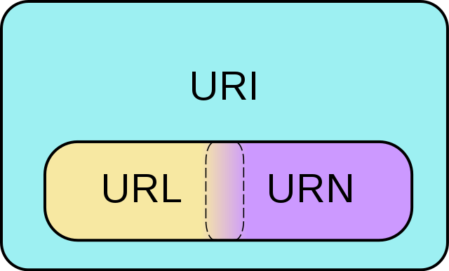
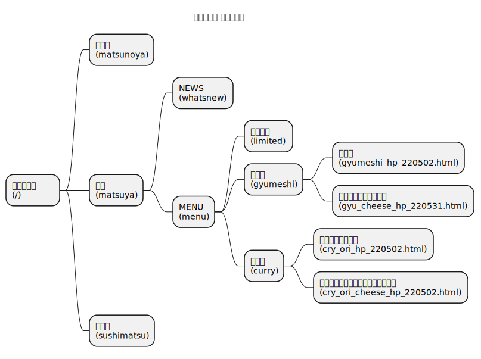
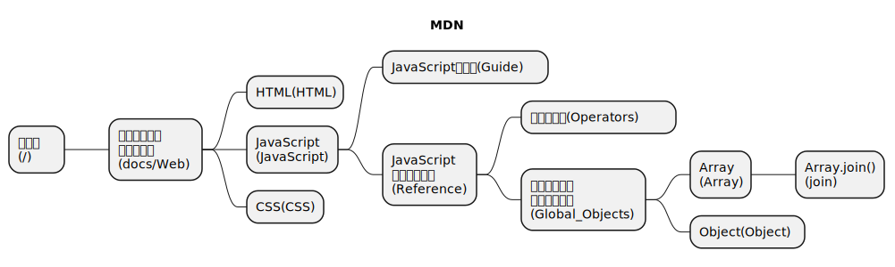
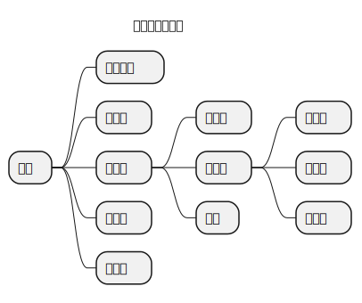
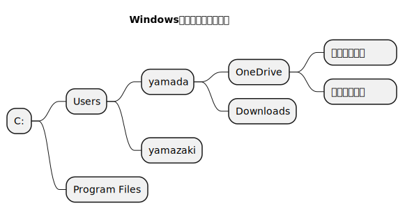
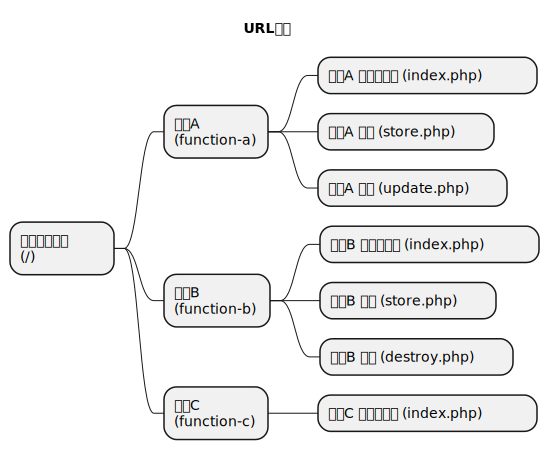
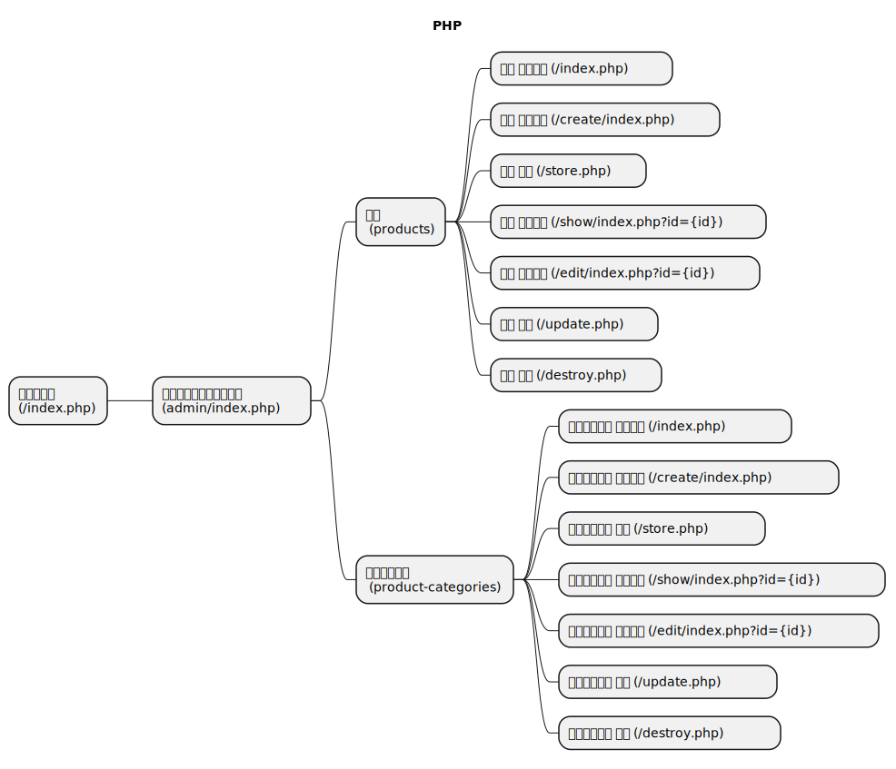
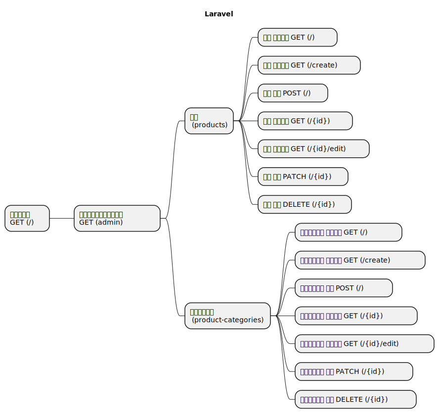

# URL設計

## はじめに

URL設計についてまとめた資料です。

## URLとは

URLとは「Uniform Resource Locator（ユニフォームリソースロケータ）」の略称で  
主にhttpから始まるWebページの住所のようなものと覚えておきましょう。  
例えばGoogleのトップページであれば <https://www.google.com/> になります。

- URLとは？【分かりやすい解説シリーズ #9】【プログラミング】
  - <https://youtu.be/JFmWFh9S4Gs>
- URLの基礎
  - <https://blog.senseshare.jp/url-basic.html>

## URLとURI

**URLとURIは基本的に同じものという考えで問題ありません。**  

URIはURLを抽象化したものなので、幅広い意味になります。  
URNについては実務でも、ほとんど使われることがないため  
覚える必要はありません（恐らく知っている人も少ない）。  

- [Wikipedia - Uniform Resource Identifier](https://ja.wikipedia.org/wiki/Uniform_Resource_Identifier)
- [Wikimedia Commons](https://commons.wikimedia.org/w/index.php?curid=2649934)  
  

## パス

パスの理解は必須です。

- [パス](./../../path/index.md)

## 実サイトの例

### 松屋フーズの例

実際に「松屋フーズ(<https://www.matsuyafoods.co.jp/>)」のサイトを例に見ていきます。  
**※ 2023/01時点のリンクのため、サイト更新などでリンク切れになることも考えられます**

- [PlantUML](https://www.plantuml.com/plantuml/uml/bP8zIyD06CVtV8gEbeBMY7kNZdOHSH52Q0uJo5rBSg5al3k7QfU2gDGNEYW8hHGSH17nopmqqc_XdpG1hOYu_lultFCyruYb6qaU28-xNKi6CcILxEPz_ZWWSqRcZVHhXVGJwJio_Un-aFM7LctLSI3MDgfMBUUaPgIFGBWhuqHqKhTKa2Xn3a5RpVrTi9uFA5Xl2NUQhJr0paII0uIlnulpqyLeE9zTGWa37aZc5UB7yHLfHUe2oc6QS1Rx0QHVDSVlEhPTtwxRwxxaOMabDIPrI-gPz0aPjHni9U-qVSPYLZPiRNvfm9QcP1wGWxUTH54ANWWJCXFIBsJGFFtcYrAd4_thITZltuNbGt_sedI4UN0EkEC4-yWFKhKQJ7Z5D_W4)  
    

| URI | ページ | 備考 |
| --- | --- | --- |
| [/](https://www.matsuyafoods.co.jp/) | 松屋フーズ |  |
| [/matsunoya](https://www.matsuyafoods.co.jp/matsunoya) | 松のや |  |
| [/sushimatsu](https://www.matsuyafoods.co.jp/sushimatsu) | すし松 |  |
| [/matsuya](https://www.matsuyafoods.co.jp/matsuya) | 松屋 |  |
| [/matsuya/whatsnew](https://www.matsuyafoods.co.jp/matsuya/whatsnew) | 松屋 NEWS |  |
| [/matsuya/menu](https://www.matsuyafoods.co.jp/matsuya/menu) | 松屋 MENU |  |
| [/matsuya/menu/limited](https://www.matsuyafoods.co.jp/matsuya/menu/limited) | 松屋 MENU 期間限定 | ページには「おすすめ」となっている |
| [/matsuya/menu/gyumeshi](https://www.matsuyafoods.co.jp/matsuya/menu/gyumeshi) | 松屋 MENU 牛めし |  |
| [/matsuya/menu/gyumeshi/gyumeshi_hp_220502.html](https://www.matsuyafoods.co.jp/matsuya/menu/gyumeshi/gyumeshi_hp_220502.html) | 松屋 MENU 牛めし → 牛めし |  |
| [/matsuya/menu/gyumeshi/gyu_cheese_hp_220531.html](https://www.matsuyafoods.co.jp/matsuya/menu/gyumeshi/gyu_cheese_hp_220531.html) | 松屋 MENU 牛めし → たっぷりチーズ牛めし |  |
| [/matsuya/menu/curry](https://www.matsuyafoods.co.jp/matsuya/menu/curry) | 松屋 MENU カレー |  |
| [/matsuya/menu/curry/cry_ori_hp_220502.html](https://www.matsuyafoods.co.jp/matsuya/menu/curry/cry_ori_hp_220502.html) | 松屋 MENU カレー → オリジナルカレー |  |
| [/matsuya/menu/curry/cry_ori_cheese_hp_220502.html](https://www.matsuyafoods.co.jp/matsuya/menu/curry/cry_ori_cheese_hp_220502.html) | 松屋 MENU カレー → たっぷりチーズのオリジナルカレー |  |

### MDNの例

実際に「MDN(<https://developer.mozilla.org/ja/>)」のサイトを例に見ていきます。  

- [PlantUML](https://www.plantuml.com/plantuml/uml/PL7DIiD04BxdANBS4h2lK56eYBLW1Iy5sIOhfBIRibq5RyskWZy7AsfAZmNH8hKUHD0Iz666_FWMJepr1o6PsPdlPvdPKbTI8TikTzgqOqXNjfXPMLutB1Fq4MWDUb3df5WmBCjy3qwJuIpj7KRzS_3nczOvg1jGjw23-AINZYwGwtXsjxZ56YX1pSfcPOra8IzNwHwjsSBjI6J-50Z-HK5DG5s3FYRbNTTX_t2yMD-1lW8r0Zq1_GZg1Hqts0uJZDkv01LHU0R-E0ula-aWkk-JQeS9AZtHdHFYyJ2U1SdJ0VXlwMk8CPi9hGDGpzbawW4NWTRbbjUWhUrgeybiEPTRvg8GT1_XpupTt-s5fkToKa0qEtnBSWkIftmjIxKQmRzWb1XtlXxZ0m00)  
    

ArrayのjoinメソッドのURIを辿っていきましょう。  

- <https://developer.mozilla.org/ja/docs/Web/JavaScript/Reference/Global_Objects/Array/join>

| URI | ページ | 備考 |
| --- | --- | --- |
| [/](https://developer.mozilla.org/ja/) | トップページ |  |
| [/docs/Web](https://developer.mozilla.org/ja/docs/Web) | 開発者向けのウェブ技術 | `/docs`にアクセスすると `/docs/Web`にリダイレクト |
| [/docs/Web/JavaScript](https://developer.mozilla.org/ja/docs/Web/JavaScript) | JavaScript |  |
| [/docs/Web/JavaScript/Reference](https://developer.mozilla.org/ja/docs/Web/JavaScript/Reference) | JavaScript リファレンス |  |
| [/docs/Web/JavaScript/Reference/Global_Objects](https://developer.mozilla.org/ja/docs/Web/JavaScript/Reference/Global_Objects) | 標準組み込みオブジェクト |  |
| [/docs/Web/JavaScript/Reference/Global_Objects/Array](https://developer.mozilla.org/ja/docs/Web/JavaScript/Reference/Global_Objects/Array) | Array |  |
| [/docs/Web/JavaScript/Reference/Global_Objects/Array/join](https://developer.mozilla.org/ja/docs/Web/JavaScript/Reference/Global_Objects/Array/join) | Array.prototype.join() |  |

## 設計

URL(URI)設計について考えていきましょう。  
現実世界の住所やパソコンのファイルシステム（ファイル・フォルダ）の考え方と同じで  
大項目→中項目→小項目と言ったように階層で考えます。  

- [PlantUML](https://www.plantuml.com/plantuml/umla/SoWkIImgoStCIybDBE0goIp9ILLuihV_MMV3uyPrZvkMF6vU-BXvp-Ec7LpQ2i-cBtqsPmsNjhR2ywNpdYxjUBfzxlCvFI3-qzxc5nCxePndSpS-sRNcPVDUBcqWxycEjK-Nh7lQimlCUx6nw-dcRM0UHBBhsSO5BnPrGxWlbkw7So46GRbWtexrG7rWspPkVBPe1Spg-NkUzu6jTaZDIu5w1000)  
    
- [PlantUML](https://www.plantuml.com/plantuml/umla/SoWkIImgoStCIybDBE0goIp9ILK81_BoouiVDwvxt3prSTFAnysh7pStF6vQyhXvuUFcFO-RTd1fApXRSMbhAuGMfnOLSsa3MPM9kOafYK0caEsVb-fIb5cM2kI1k8-RsnytxNpSjFvnSyVZvkR7pTFX4fsFczO-RbuADdWpK1gYtoM_F2ydFp45ON9LOdOcoBw0elpqeiHS1RVCdDHYBeVKl1Ieqm40)  
    

### PHP設計例1

PHP標準での設計例です。

- [PlantUML](https://www.plantuml.com/plantuml/umla/SoWkIImgoStCIybDBE0goIp9ILK83V9viMBjYnKTNDeAZvix7ZStFswU_hXvrkFcFO-RTiJaQUXhScbhApnREVz5yrv783-jD2-v93C_JpSHA86GGMX-FcNtoxcB53I0rgHMw1La5A2gUpvpzykUJGeQnINvHQcOqizcRtasROE2Hcb1Ic89L1ukxOHiVnAoHYSYxNT2jHzJ-cbdrykPInGqKbABIuhoAz4Su8piW6HadSvu7U2GcfS23NS0)  
    

| URI | 機能・画面名 | 備考 |
| --- | --- | --- |
| / | トップページ |  |
| /function-a/index.php | 機能A トップ画面 |  |
| /function-a/store.php | 機能A 登録 |  |
| /function-a/update.php | 機能A 更新 |  |
| /function-b/index.php | 機能B トップ画面 |  |
| /function-b/store.php | 機能B 登録 |  |
| /function-b/destroy.php | 機能B 削除 |  |
| /function-c/index.php | 機能C トップ画面 |  |

### PHP設計例2

商品と商品カテゴリテーブルの登録・表示・更新・削除を行うシステムの例です。  

- [PlantUML](https://www.plantuml.com/plantuml/uml/SoWkIImgoStCIybDBE0goIp9ILK8y0ZWqbPutDpnkBdvSVFqvrDslvoxA2PFGn-eAhL2ho2ZG9DB6wYWQVlZffsFcziUDozulcxXymbjc5eIKu16e-W3QdmwjUtfvCQOF0MDWgBybDBaacAWE492uScEXXVBbaFCK42p5Q7g-SpTBtismLKb5wKcbgJYLmnKLboINvIAAVzYvURdMpR03IlEo2z766MVcM9RdPbIYwhbsUmjpwOXjAIcP9OGfmMekBGW9R44YpEUTdQzdBa4g20bjRYaAByIFSmUDwq6XNVJbiVDgv32JpSPQ5fwVb5cAYmaCPKJ2bLC7VX2cB16H6ZZLKjIo6Dg9n0BXBLZnWXEnJXYno4rBmMQVm00)  
    

| URI | 機能・画面名 | 備考 |
| --- | --- | --- |
| / | トップ画面 |  |
| /admin/index.php | システム管理トップ画面 |  |
| /admin/products/index.php              | 商品 一覧画面 |  |
| /admin/products/create/index.php       | 商品 登録画面 |  |
| /admin/products/store.php              | 商品 登録     |  |
| /admin/products/show/index.php?id={id} | 商品 詳細画面 | `{id}`は対象テーブルのid |
| /admin/products/edit/index.php?id={id} | 商品 更新画面 | `{id}`は対象テーブルのid |
| /admin/products/update.php             | 商品 更新     |  |
| /admin/products/destroy.php            | 商品 削除     |  |
| /admin/product-categories/index.php              | 商品カテゴリ 一覧画面 |  |
| /admin/product-categories/create/index.php       | 商品カテゴリ 登録画面 |  |
| /admin/product-categories/store.php              | 商品カテゴリ 登録     |  |
| /admin/product-categories/show/index.php?id={id} | 商品カテゴリ 詳細画面 | `{id}`は対象テーブルのid |
| /admin/product-categories/edit/index.php?id={id} | 商品カテゴリ 更新画面 | `{id}`は対象テーブルのid |
| /admin/product-categories/update.php             | 商品カテゴリ 更新     |  |
| /admin/product-categories/destroy.php            | 商品カテゴリ 削除     |  |

※ アクセスする際、**index.phpは省略可**

### Laravel設計例1

フレームワークを使う場合、フレームワークの特性も考慮して設計する必要があります。  
PHPフレームワークLaravelでCRUD(クラッド Create Read Update Delete の略)を実装する際の例です。  

同一URIが存在しますが、LaravelではURIとHTTPメソッドの組み合わせでルートを決定しているため  
問題なく動作します。

- [PlantUML](https://www.plantuml.com/plantuml/uml/SoWkIImgoStCIybDBE0goIp9ILNmIInAB4lDuT9MUDpSyRYv-N7pzETJTh-SkoWcpzqrH453NvDB6oZNjFrnqyx7pMsFcnSyNxVm-OGsxAeJKu2c0tK0jJoTslPqScDCde96GL5-IcboIJ5G726Xy6H7mujboo6w5H1M8HGydxdxPSyc50N9HQc99QdOb2a4-0TZ6l5YvURdMpQW656TcLABgkZPx2tFfc4gqazDoIp1fb8Xm374sGEhKKyxkrxENABWukhZ6k8ALu5GyBXfDIWCcxOyRbw553AwoK1VfUSNPQR2mWXJEPxmmbHCEEmmjI324Q_H1C8KKmFUyCMd2n7MXAp04UvS3gbvAT3K3W00)  
    

| URI | HTTP メソッド | 機能・画面名 | 備考 |
| --- | --- | --- | --- |
| / | GET | トップ画面 |  |
| /admin | GET | システム管理トップ画面 |  |
| /admin/products           | GET    | 商品 一覧画面 | ProductController::index |
| /admin/products/create    | GET    | 商品 新規画面 | ProductController::create |
| /admin/products           | POST   | 商品 登録     | ProductController::store |
| /admin/products/{id}      | GET    | 商品 詳細画面 | ProductController::show `{id}`は対象テーブルのid |
| /admin/products/{id}/edit | GET    | 商品 更新画面 | ProductController::edit `{id}`は対象テーブルのid |
| /admin/products/{id}      | PATCH  | 商品 更新     | ProductController::update `{id}`は対象テーブルのid |
| /admin/products/{id}      | DELETE | 商品 削除     | ProductController::destroy `{id}`は対象テーブルのid |
| /admin/product-categories           | GET    | 商品カテゴリ 一覧画面 | ProductCategoryController::index |
| /admin/product-categories/create    | GET    | 商品カテゴリ 登録画面 | ProductCategoryController::create |
| /admin/product-categories           | POST   | 商品カテゴリ 登録     | ProductCategoryController::store |
| /admin/product-categories/{id}      | GET    | 商品カテゴリ 詳細画面 | ProductCategoryController::show `{id}`は対象テーブルのid |
| /admin/product-categories/{id}/edit | GET    | 商品カテゴリ 更新画面 | ProductCategoryController::edit `{id}`は対象テーブルのid |
| /admin/product-categories/{id}      | PATCH  | 商品カテゴリ 更新     | ProductCategoryController::update `{id}`は対象テーブルのid |
| /admin/product-categories/{id}      | DELETE | 商品カテゴリ 削除     | ProductCategoryController::destroy `{id}`は対象テーブルのid |

### Laravel設計例2

以下を参照してください。  

- [機能一覧](./../examples/feature-list/index.md)
- [画面設計](./../examples/screen/index.md)

## 詳細

URL(URI)を深く学習したい場合は  
以下を参照してください。

- [詳細](./detail/index.md)
