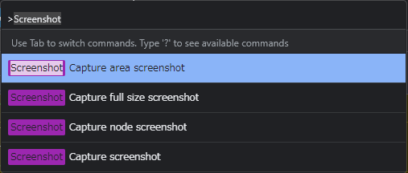
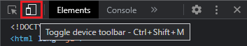
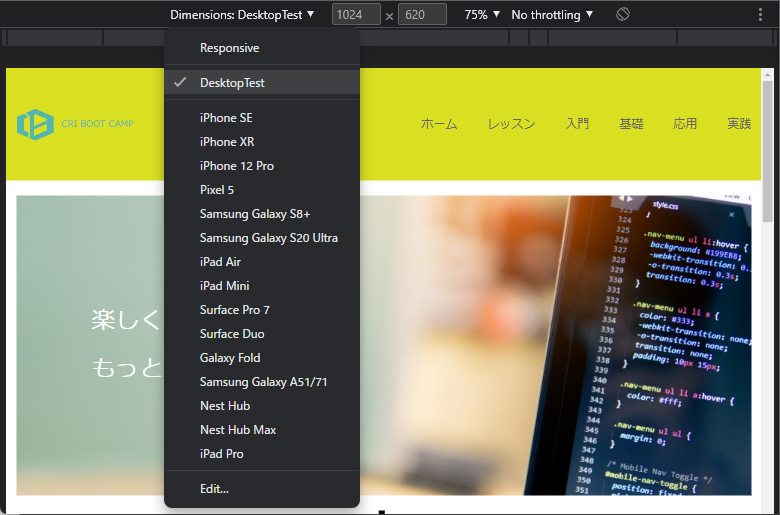
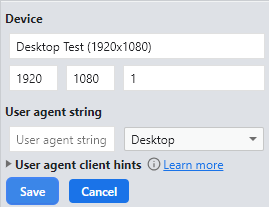

# Google Chrome

## Google Chromeとは

- `Google Chrome（グーグルクローム / GC）とは - 意味をわかりやすく - IT用語辞典 e-Words`
  - <https://e-words.jp/w/Google_Chrome.html>

## インストール

- `Google Chrome`
  - <https://www.google.co.jp/intl/ja/chrome/>

## 設定

インストールした「Google Chrome」を既定（きてい）のブラウザにしましょう（任意）  
研修中は「Google Chrome」を使う前提で進みます。

- Chrome を既定のブラウザにする
  - <https://support.google.com/chrome/answer/95417>

## 使用

### 別タブで開く

研修資料はブラウザで参照します。  
リンクが多いため、そのまま開くと面倒な時があります  
開く時に以下の操作で別タブでページを開く事ができます。

- Windowsの場合
  - `Ctrl`を押しながらリンクをクリック
- Macの場合
  - `command`を押しながらリンクをクリック

### スクリーンショット

- 設計やテストエビデンス等で、スクリーンショットを撮る事が多いです。
  - DevToolで 「Ctrl」 + 「Shift」を押しながら 「P」 を押すと、コマンドパレットが出るので  
    「screenshot」と打つと、いくつかのキャプチャ方法が出てきます。  
      
    - `Capture area screenshot` : 手動で選択範囲を指定してキャプチャ、画面上のカーソルが「+」になるのでドラッグして範囲を決める。
    - `Capture full size screenshot` : スクロールした分も含めてページ全体をキャプチャ
    - `Capture node screenshot` : 選択しているノードをキャプチャ
    - `Capture screenshot` : iPhone等のフレームも含めてキャプチャ、顧客向けの資料作成に便利。

### 横幅を指定した確認方法

1. Google Chrome のDevToolsを開く(Windowsであれば「F12」キー)
1. デバイスツールバーを開く  
  
1. デバイスを選択する  
    

- テスト用デバイス（Desktop Test）を作成
  - 「Edit...」 でデバイスを追加することが可能です。  
    スクリーンショットもこれで作成すると、ファイルサイズが抑えられ、GitHubに添付しても見やすくなります。  
  - デバイス1 〜 2023年時点で最も多い画面サイズ  
      
    - Device Name: Desktop Test (1920x1080)
    - Width: `1920`
    - Height: `1080`
    - Device pixel ratio: `1`
    - User agent string: 未入力
    - User agent type: `Desktop`
  - デバイス2 〜 デバイス1の横幅の約半分（Windowを並べて閲覧することを想定）
    - Device Name: Desktop Test (950x1080)
    - Width: `950`
    - Height: `1080`
    - その他設定はデバイス1と同じ
  - デバイス3 〜 スクリーンショット用
    - Device Name: Desktop Test (1280x720)
    - Width: `1280`
    - Height: `720`
    - その他設定はデバイス1と同じ

### その他

その他便利な使い方は以下を参照してください。

- Google Chromeの便利な使い方15選
  - <https://www.e-conne.co.jp/blog/1584>
- Chrome DevToolsの使い方を徹底解説！Chrome Developer Toolsを使いこなすと開発効率が上がる！
  - <https://youtu.be/awRkFcv51r4>
- `Chrome Developer Toolsの使い方【サイボウズ開運研修2021】`
  - 資料: <https://speakerdeck.com/cybozuinsideout/chrome-developer-tools>
  - 動画: <https://youtu.be/aL9OarYImm0>

## 参考資料

- `Desktop Screen Resolution Stats Japan - Statcounter Global Stats`
  - <https://gs.statcounter.com/screen-resolution-stats/desktop/japan>
