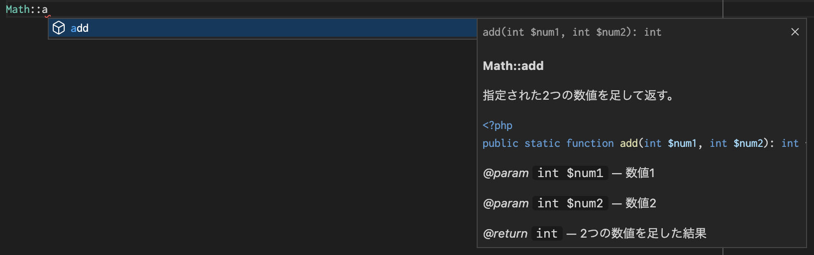

# PHPプログラミング編 関数

## 関数

実務では関数は必ず使うので、しっかり学習しましょう。

- 動画
  - 関数とは？【分かりやすい解説シリーズ #2】【プログラミング】
    - <https://youtu.be/PtQekBoRHZ0>
  - 引数、戻り値とは？【分かりやすい解説シリーズ #7】【プログラミング】
    - <https://youtu.be/aTkXCEU65bg>
  - 【PHP入門#14】関数（function）の使い方
    - <https://youtu.be/olAuZE5b27Q>

PHPの関数もJavaScriptと大きな違いはありません。  

```php
/** 関数定義例 */
function 関数名($引数1, $引数2, ...$引数n)
{
    // 処理
    return 戻り値;
}
```

```php
// 関数実行例
$戻り値 = 関数名($引数1, $引数2, ...$引数n);
```

### 例1

指定した値をインクリメント（+1）して返す関数の例です。  
「`increment`」という関数名で定義してみます。  

```php
<?php

// increment関数定義
//   引数1: $value 数値
function increment($value)
{
    // 処理
    $result = $value + 1;
    // 結果を返す
    return $result;
}

// 関数実行
$result1 = increment(0); // 戻り値: 1
$result2 = increment(2); // 戻り値: 3
$result3 = increment(10); // 戻り値: 11
$result4 = increment(100); // 戻り値: 101

// 関数実行結果出力
var_dump($result1, $result2, $result3, $result4);
// int(1)
// int(3)
// int(11)
// int(101)
```

### 例2

指定した2つの値を足して返す関数の例です。  
「`add`」という関数名で定義してみます。  

```php
<?php

// increment関数定義
//   引数1: $num1 数値
//   引数2: $num2 数値
function add($num1, $num2) {
  $result = $num1 + $num2;
  return $result;
}

// 関数実行
$result1 = add(0, 1); // 戻り値: 1
$result2 = add(0, 2); // 戻り値: 2
$result3 = add(1, 2); // 戻り値: 3
$result4 = add(4, 3); // 戻り値: 7

// 関数実行結果出力
var_dump($result1, $result2, $result3, $result4);
// int(1)
// int(2)
// int(3)
// int(7)
```

## メソッド

PHPの実務では、関数をそのまま定義することはほぼありません  
関数はクラス内で定義します。  
クラス内で定義した関数の事を「メソッド」と呼びます（関数と呼んでも通じる）。

```php
<?php

class クラス名
{
    // static(静的)メソッド
    アクセス修飾子 static function メソッド名($引数1, $引数2, ...$引数n)
    {
        // 処理
        return 戻り値;
    }
}
```

increment関数、add関数を「`Math`」という名前のクラス内で定義してみましょう。  

```php
<?php

// Mathクラス
class Math
{
    // incrementメソッド
    public static function increment($value)
    {
        // 処理
        $result = $value + 1;
        // 結果を返す
        return $result;
    }

    // addメソッド
    public static function add($num1, $num2) {
      $result = $num1 + $num2;
      return $result;
    }
}

// メソッド実行
$result1 = Math::increment(0); // 戻り値: 1
$result2 = Math::increment(2); // 戻り値: 3
$result3 = Math::increment(10); // 戻り値: 11
$result4 = Math::increment(100); // 戻り値: 101

$result5 = Math::add(0, 1); // 戻り値: 1
$result6 = Math::add(0, 2); // 戻り値: 2
$result7 = Math::add(1, 2); // 戻り値: 3
$result8 = Math::add(4, 3); // 戻り値: 7

// 関数実行結果出力
var_dump($result1, $result2, $result3, $result4);
// int(1)
// int(3)
// int(11)
// int(101)
var_dump($result5, $result6, $result7, $result8);
// int(1)
// int(2)
// int(3)
// int(7)
```

- `public`
  - これは一般的に「アクセス修飾子」と呼び、PHPの場合「アクセス権」となっています。  
    「`public`」だとクラスの外からでもアクセスが可能になります。
- `static`
  - これは静的なメンバーである事を表します。  
    簡単にいうと「new」でインスタンス生成しなくても、アクセスが可能なメンバーです。
- `::`
  - これは「スコープ定義演算子」です。const(定数)やstaticメンバーにアクセスする場合に使用します。

```php
// スコープ定義演算子の使用例
クラス名::メソッド名();
クラス名::メソッド名($引数1, $引数2);
クラス名::プロパティ名;
クラス名::定数名;
// クラス内で使用する場合は「self」を指定します。
self::メソッド名();
self::メソッド名($引数1, $引数2);
self::プロパティ名();
self::定数名
```

Laravelの「`Str`」・「`Arr`」クラスの各メソッドも静的メソッドになります。

- `Laravel 9.x ヘルパ`
  - <https://readouble.com/laravel/9.x/ja/helpers.html>
  - `Illuminate\Support\Arr クラス(GitHub)`
    - <https://github.com/illuminate/collections/blob/9.x/Arr.php>
  - `Illuminate\Support\Str クラス(GitHub)`
    - <https://github.com/illuminate/support/blob/9.x/Str.php>

## メソッド例

引数に指定したワードを英訳して戻り値として返す例です。  
実務では1クラス1ファイルとし、処理はControllerクラスのメソッド等に書く事が多いですが  
わかりやすいように1ファイルに記述しています。  

```php
<?php

// LanguageHelperクラス
class LanguageHelper
{
    // 定数 (privateに設定しているため、クラス外からはアクセス不可)
    private const JA_EN_MAP = [
        'りんご' => 'apple',
        'オレンジ' => 'orange',
        'バナナ' => 'banana',
    ];

    public static function translateEn(string $word): ?string
    {
        if (isset(self::JA_EN_MAP[$word])) {
            // JA_EN_MAP連想配列に 引数:word で指定したキーの値が存在していたら値を返す。
            return self::JA_EN_MAP[$word];
        }
        // 上記条件を満たさない場合、 null を返す。
        return null;
    }
}

// メソッド実行
$result1 = LanguageHelper::translateEn('りんご'); // 戻り値: apple
$result2 = LanguageHelper::translateEn('オレンジ'); // 戻り値: orange
$result3 = LanguageHelper::translateEn('バナナ'); // 戻り値: banana
$result4 = LanguageHelper::translateEn('ぶどう'); // 戻り値: NULL

// 関数実行結果出力
var_dump($result1, $result2, $result3, $result4);
// string(5) "apple"
// string(6) "orange"
// string(6) "banana"
// NULL
```

- `const`
  - 定数です。昔は「`define`」が使われていましたが、現在は「`const`(クラス定数)」がよく使われます。
- `メソッドに記載されているstring`
  - これは「型宣言」と呼ばれるものです。PHP5の時代では「タイプヒンティング」と呼ばれていました。  
    引数・戻り値に型を指定することによって必ずその型に変換され、変換不可の型の場合はエラーとなります。  
    「`?`」をつけると「`NULL`」も許容されます（PHP7.1〜）。  
    PHP5だと戻り値の型宣言ができなかったり、スカラー型（int, string, bool等）が型宣言に使用できないので古いバージョンを扱う場合は注意です。
- `isset`
  - 配列の値が存在しているかチェックしています。  
    `isset`を使う注意点としては値がNULLの場合に結果がfalseになります。キーが存在しているか確認したい場合は`array_key_exists`を使用してください。

PHP7.0.x 以降は「Null 合体演算子」が使えます。  
Laravel等のView作成に利用することが多いので覚えておくと便利です。  
上記のコードがシンプルに書けるようになります。

```php
public static function translateEn(string $word): ?string
{
    // JA_EN_MAP連想配列にwordで指定したキーの値が存在していたら値を返す、それ以外は null を返す。
    return self::JA_EN_MAP[$word] ?? null;
}
```

## 戻り値

関数の戻り値について深く学習しましょう。  
まず、戻り値を返すには return を使います。  

```php
return 戻り値;
```

`return`を使った場合、関数の処理はそこで終了し、指定した値を関数の呼び出し元に返します。  
そのため、以下のようにif文を使った場合、本来であれば `else` を使う必要がありますが  
if文内で `return` があった場合、`else` がなくても期待した動作をしてくれます。

```php
if (条件) {
    // 文字列「条件一致」を返し、関数内の処理を終了する（「条件不一致」の処理は実行されない）
    return '条件一致';
    // returnで関数処理が終了するため、以下の処理は行われない。
    echo 'この処理は実行されない';
}
// 文字列「条件不一致」を返し、関数内の処理を終了する。
return '条件不一致';
```

戻り値は、変数にする必要はありません。  

```php
<?php

class Test
{
    public static function exec(bool $value): string
    {
        if ($value) {
            // 文字列「条件一致」を返し、関数内の処理を終了する（「条件不一致」の処理は実行されない）
            return '条件一致';
        }
        // 文字列「条件不一致」を返し、関数内の処理を終了する。
        return '条件不一致';
    }
}

// メソッド実行
$result1 = Test::exec(true); // 戻り値: 条件一致
$result2 = Test::exec(false); // 戻り値: 条件不一致

// 関数実行結果出力
var_dump($result1, $result2);
// string(12) "条件一致"
// string(15) "条件不一致"
```

---

変数「num1」と「num2」を足した結果を返す例です。  
以下はどれも同じ動作をします（クラスと関数定義部分は省略）。

```php
// ①計算を行う。
// ②計算結果を変数resultに代入する。
$result = $num1 + $num2;
// ③変数resultの値を返す。
return $result;
```

```php
// ★最適解
// ①計算を行う。
// ②計算結果の値を返す。
return $num1 + $num2;
```

クラスメソッドの例

```php
<?php

class Test
{
    public static function exec(int $num1, int $num2): int
    {
        return $num1 + $num2;
    }
}

// メソッド実行
$result1 = Test::exec(1, 2); // 戻り値: 3
$result2 = Test::exec(22, 33); // 戻り値: 55

// 関数実行結果出力
var_dump($result1, $result2);
// int(3)
// int(55)
```

---

変数「value1」と「value2」を比較した結果を返す例です。  
比較演算子の結果がbool型(true or false)になるため  
結果を直接返すことが出来ます。
以下はどれも同じ動作をします（クラスと関数定義部分は省略）。

```php
// ①変数value1とvalue2を比較する（一致していたら true、それ以外はfalse）。
// ②比較結果に応じて処理を分岐する。
if ($value1 === $value2) {
    // ③比較結果がtrueの場合 true を返す。
    return true;
}
// ③比較結果がtrue以外の場合 false を返す。
return false;
```

```php
// ①変数value1とvalue2を比較する（一致していたら true、それ以外はfalse）。
// ②比較結果(bool)を変数resultに代入する。
$result = $value1 === $value2;
// ③変数resultに応じて処理を分岐する。
if ($result) {
    // ④変数resultがtrueの場合 true を返す。
    return true;
}
// ④変数resultがtrue以外の場合 false を返す。
return false;
```

```php
// ①変数value1とvalue2を比較する（一致していたら true、それ以外はfalse）。
// ②比較結果(bool)を変数resultに代入する。
$result = $value1 === $value2;
// ③変数resultの値を返す。
return $result;
```

```php
// ★最適解
// ①変数value1とvalue2を比較する（一致していたら true、それ以外はfalse）。
// ②比較結果(bool)を返す。
return $value1 === $value2;
```

クラスメソッドの例

```php
<?php

class Test
{
    public static function exec($value1, $value2): bool
    {
        return $value1 === $value2;
    }
}

// メソッド実行
$result1 = Test::exec(2, 2); // 戻り値: true
$result2 = Test::exec('a', 'a'); // 戻り値: true
$result3 = Test::exec(1, 2); // 戻り値: false
$result4 = Test::exec(1, '1'); // 戻り値: false

// 関数実行結果出力
var_dump($result1, $result2, $result3, $result4);
// bool(true)
// bool(true)
// bool(false)
// bool(false)
```

---

文字列変数「str1」と「str2」を結合した結果を返す例です。  
以下はどれも同じ動作をします。

```php
$str1 = 'Hello ';
$str2 = 'World!';

// ①変数resultに空文字列(string)を代入する。
$result = '';
// ②変数resultに変数str1とstr2を文字列演算子「.=」を使って、変数resultに入っている文字列の右側に連結し変数resultに格納する。
$result .= $str1;
$result .= $str2;
// ③変数resultの値を返す。
return $result;
```

```php
$str1 = 'Hello ';
$str2 = 'World!';
// ①変数str1とstr2を文字列演算子「.」を使って連結する。
// ②連結した結果(string)を変数resultに代入する。
$result = $str1 . $str2;
// ③変数resultの値を返す。
return $result;
```

```php
// ★最適解
$str1 = 'Hello ';
$str2 = 'World!';
// ①変数str1とstr2を文字列演算子「.」を使って連結する。
// ②連結した結果(string)を返す。
return $str1 . $str2;
```

クラスメソッドの例

```php
<?php

class Test
{
    public static function exec(string $str1, string $str2): string
    {
        return $str1 . $str2;
    }
}

// メソッド実行
$result1 = Test::exec('Hello ', 'World!'); // 戻り値: Hello World!
$result2 = Test::exec('A', 'B'); // 戻り値: AB

// 関数実行結果出力
var_dump($result1, $result2);
// string(12) "Hello World!"
// string(2) "AB"
```

---

3つの名称変数(name1〜name3)を配列で返す例です。  
以下はどれも同じ動作をします（クラスと関数定義部分は省略）。

```php
$name1 = 'NAME01';
$name2 = 'NAME02';
$name2 = 'NAME03';
// ①変数resultに空配列(array)を代入する。
$result = [];
// ②変数resultに3つの名称変数を要素として追加する。
$result[] = $name1;
$result[] = $name2;
$result[] = $name3;
// ③変数resultの値を返す。
return $result;
```

```php
$name1 = 'NAME01';
$name2 = 'NAME02';
$name2 = 'NAME03';
// ①3つの名称変数を要素として持った配列を作成する
// ②変数resultに作成した配列(array)を代入する。
$result = [
    $name1,
    $name2,
    $name3,
];
// ③変数resultの値を返す。
return $result;
```

```php
// ★最適解
$name1 = 'NAME01';
$name2 = 'NAME02';
$name2 = 'NAME03';
// ①3つの名称変数を要素として持った配列を作成する
// ②作成した配列(array)を返す。
return [
    $name1,
    $name2,
    $name3,
];
// こう書いても同じ→    return [$name1, $name2, $name3];
```

クラスメソッドの例

```php
<?php

class Test
{
    public static function exec(string $name1, string $name2, string $name3): array
    {
        return [$name1, $name2, $name3];
    }
}

// メソッド実行
$result1 = Test::exec('NAME01', 'NAME02', 'NAME03'); // 戻り値: ['NAME01', 'NAME02', 'NAME03']
$result2 = Test::exec('A', 'B', 'C'); // 戻り値: ['A', 'B', 'C']

// 関数実行結果出力
var_dump($result1, $result2);
// array(3) {
//   [0]=>
//   string(6) "NAME01"
//   [1]=>
//   string(6) "NAME02"
//   [2]=>
//   string(6) "NAME03"
// }
// array(3) {
//   [0]=>
//   string(1) "A"
//   [1]=>
//   string(1) "B"
//   [2]=>
//   string(1) "C"
// }
```

---

## PHPDoc

メソッドの上に変わった記述のコメントを見たことがあるかと思います。  
PHPでは「PHPDoc」と呼ばれるもので、PHPDocを記載したクラスやメソッドを使う時に  
記載した説明が表示されるようになります。  

  

「phpDocumentor」を使うことでPHPDocからドキュメントを生成することも出来ます。  
以下はPHPDocを記述した例です。

```php
<?php

/**
 * Mathクラス  ← ここにクラスの説明
 */
class Math
{
    /**
     * 指定された数値に1を足して返す。　← ここにメソッドの説明
     *
     * @param int $num 数値  ← ここに引数の説明
     * @return int 数値に1足した結果  ← ここに戻り値の説明
     */
    public static function increment(int $num): int
    {
        return $num + 1;
    }

    /**
     * 指定された2つの数値を足して返す。
     *
     * @param int $num1 数値1
     * @param int $num2 数値2
     * @return int 2つの数値を足した結果
     */
    public static function add(int $num1, int $num2): int
    {
        return $num1 + $num2;
    }
}
```

VSCodeの拡張機能を使うと、自動でPHPDocを生成できます。

- `VSCode拡張機能 - PHP DocBlocker`
  - 関数等のメンバーの上で「`/**`」を入力してEnterキーを押すだけで、自動的にPHPDocが生成されます。
  - <https://marketplace.visualstudio.com/items?itemName=neilbrayfield.php-docblocker>

詳しいコメント方法についてはリファレンスを参照してください。

- 参考
  - `phpDocumentor`
    - <https://www.phpdoc.org/>
    - `phpDocumentor - PHPDoc reference`
      - <https://docs.phpdoc.org/3.0/guide/references/phpdoc/index.html>
  - PHPDocリファレンス
    - <https://zonuexe.github.io/phpDocumentor2-ja/references/phpdoc/index.html>
  - `PSR-5: PHPDoc`
    - <https://github.com/php-fig/fig-standards/blob/master/proposed/phpdoc.md>

## PHPマニュアル

資料作成で参考にしたPHPマニュアルのリンクです。

- `return`
  - <https://www.php.net/manual/ja/function.return.php>
- `戻り値`
  - <https://www.php.net/manual/ja/functions.returning-values.php>
- `型宣言`
  - <https://www.php.net/manual/ja/language.types.declarations.php>
- `関数`
  - <https://www.php.net/manual/ja/language.functions.php>
- `アクセス権`
  - <https://www.php.net/manual/ja/language.oop5.visibility.php>
- `static キーワード`
  - <https://www.php.net/manual/ja/language.oop5.static.php>
- `スコープ定義演算子 (::)`
  - <https://www.php.net/manual/ja/language.oop5.paamayim-nekudotayim.php>
- `クラス定数`
  - <https://www.php.net/manual/ja/language.oop5.constants.php>
- `型宣言`
  - <https://www.php.net/manual/ja/language.types.declarations.php>
- `PHP 7.0.x 新機能 スカラー型宣言`
  - <https://www.php.net/manual/ja/migration70.new-features.php#migration70.new-features.scalar-type-declarations>
- `PHP 7.0.x 新機能 戻り値の型宣言`
  - <https://www.php.net/manual/ja/migration70.new-features.php#migration70.new-features.return-type-declarations>
- `PHP 7.1.x 新機能 nullable な型`
  - <https://www.php.net/manual/ja/migration71.new-features.php#migration71.new-features.nullable-types>
- `isset`
  - <https://www.php.net/manual/ja/function.isset.php>
- `array_key_exists`
  - <https://www.php.net/manual/ja/function.array-key-exists.php>
- `PHP 7.0.x 新機能 Null 合体演算子`
  - <https://www.php.net/manual/ja/migration70.new-features.php#migration70.new-features.null-coalesce-op>
