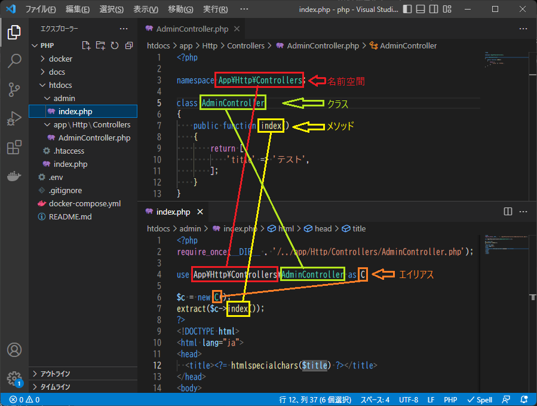

# PHPプログラミング編 名前空間

## はじめに

namespace(名前空間)、useについて学習します。  

  

## 名前空間

別資料に解説と課題を用意しているので  
以下を参照してください。

- 【PHP】namespace（名前空間）、use の解説
  - <https://zenn.dev/seiya0/articles/tech-php-namespace>

## useの注意点

「`use`」はエイリアスを作成する以外にも使われます。  
以下の３つは、別物と考えてください。  

| use | 用途 | 記載場所/記載例 |
| :---: | :---: | --- |
| 名前空間のuse | エイリアス（別名）を作成する | クラス外に記載 `use 名前空間\クラス名;` `use 名前空間\クラス名 as 別名;` |
| トレイトのuse | トレイトで定義したメンバーをクラスに追加する | クラス内に記載 `use トレイト名;` |
| 無名関数のuse | 親スコープから変数を引き継ぐ | 処理に記載 `function () use ($変数1, $変数2) {};` |

## PHPマニュアル

資料作成で参考にしたPHPマニュアルのリンクです。

- `名前空間`
  - <https://www.php.net/manual/ja/language.namespaces.php>
- `トレイト`
  - <https://www.php.net/manual/ja/language.oop5.traits.php>
- `無名関数`
  - <https://www.php.net/manual/ja/functions.anonymous.php>
- `Exception`
  - <https://www.php.net/manual/ja/class.exception.php>
- `DateTime`
  - <https://www.php.net/manual/ja/class.datetime.php>
