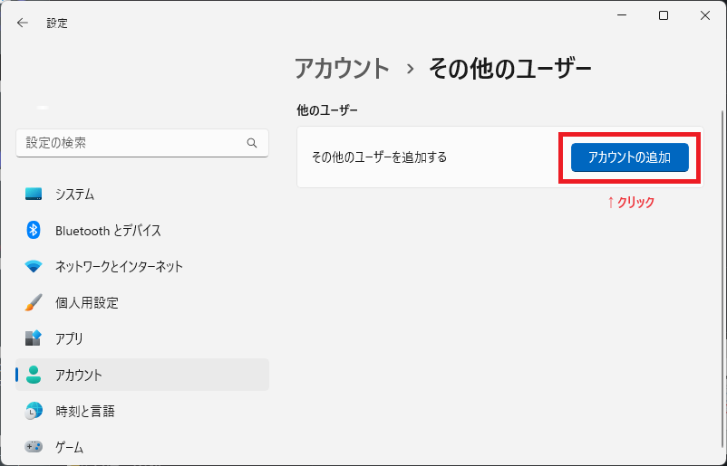
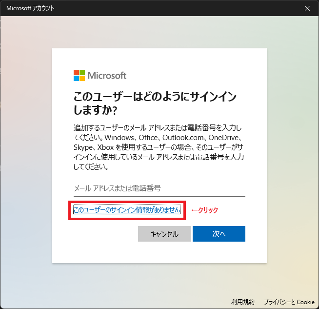
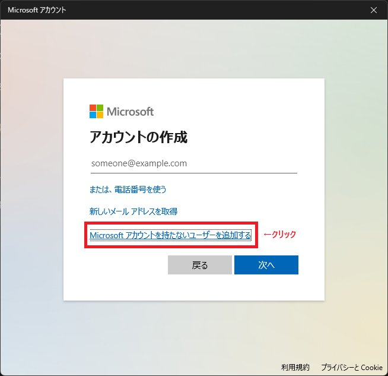
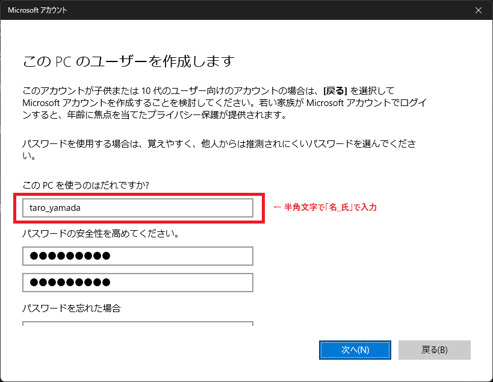

# EPKOTルール　〜　PC貸与

## はじめに

PC貸与に関するルールです。

## お問い合わせ先

お問い合わせは、総務部 荒尾（mao.arao@epkotsoftware.co.jp）までお願いいたします。

## PCセットアップ

### ユーザー作成

#### 注意点

まず、以下の注意点があります。

```txt
■注意点
　・ローカルアカウントユーザーとして作成すること（メールアドレスは入力しない）
　・ユーザー名は下記の「ユーザー名のルール」 通りに入力して下さい。
```

#### ユーザー名のルール

自身のEPKOTメールアドレスのユーザー名（`@`の左部分）の  
「`.`」を「`_`」に変更したものをユーザー名として使って下さい。  

- 例
  - EPKOTメールアドレス: `taro.yamada@epkotsoftware.co.jp`
  - パソコンのユーザー名: `taro_yamada`

名称の付け方によってはアプリケーションの不具合が起こるケースがあるため、必ずルールを守りましょう。

#### ユーザー作成手順

以下の手順で作成して下さい（参考： [Windows 11 ローカル アカウント ユーザーを作成する方法](https://www.pasoble.jp/windows/11/add-local-user.html)）

- 設定 → アカウント → 他のユーザー → アカウントの追加  
    
- 「このユーザーのサインイン情報がありません」をクリック  
    
- 「Microsoft アカウントを持たないユーザーを追加する」をクリック  
    
- ユーザー名に自身の名前を半角文字で入力、パスワード等を入力し「次へ」  
    
- 共有アカウントをログアウトする。
  - 作成した自身のローカルアカウントユーザーにログインする。
    - 必要なものをインストールする。

## 注意事項

- ***PCの初期化は行わないこと***
- ***共有アカウントは返却時も残すこと***

## 返却

### ユーザー削除

自身のユーザー（自身のローカルアカウントユーザー）の削除方法です。

- 現場の指示でインストールしたソフトウェアのアカウント解除が必要な場合
  - 自身のユーザーにログインする。
  - ソフトウェアのアカウント解除などを行う。
  - 自身のユーザーをログアウトする。
- 共有アカウントにログインする。
  - 自身のユーザーを削除する。
