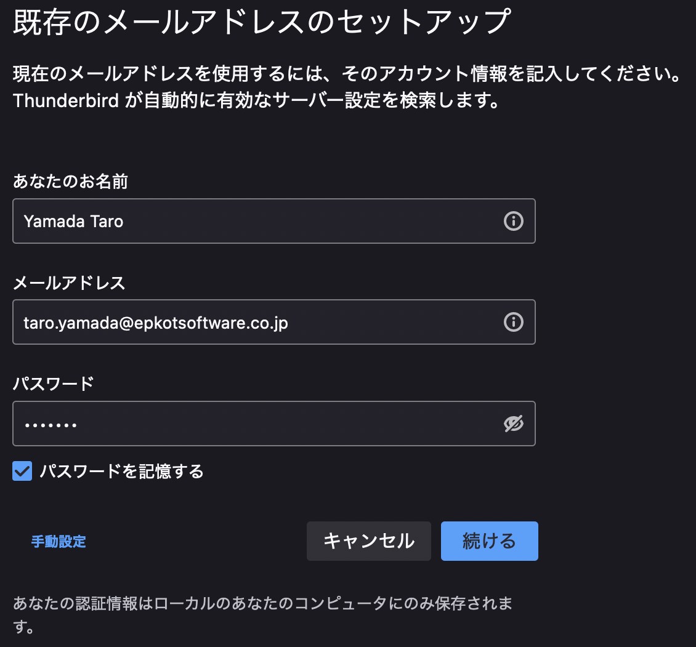
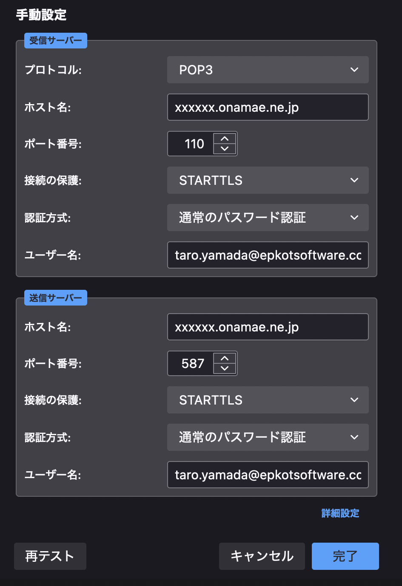

# Thunderbird設定

## 概要

メールソフトの Thunderbird に  
会社メールを設定する方法です。

## インストール

公式サイトからインストールしてください。

- Thunderbird
  - <https://www.thunderbird.net/ja/>

## 既存のメールアドレスセットアップ

メールのセットアップ画面に移り  
「あなたのお名前」・「メールアドレス」・「パスワード」を入力し  
「手動設定」をクリックしてください。

- 設定例  
    

## 手動設定

手動設定を行います。  

- 設定例  ※ ホスト名・ユーザー名は自身の設定情報  
    

### 受信サーバー

```txt
プロトコル: POP3
ホスト名: ≪受信メールサーバー≫
ポート番号: 110
接続の保護: STARTTLS
認証方式: 通常のパスワード認証
ユーザー名: ≪epkotメールアドレス≫
```

### 送信サーバー

```txt
ホスト名: ≪送信メールサーバー≫
ポート番号: 587
接続の保護: STARTTLS
認証方式: 通常のパスワード認証
ユーザー名: ≪epkotメールアドレス≫
```

## 参考

- お名前.com メールクライアントソフトの設定  Thunderbird の設定
  - <https://guide.onamae-server.com/om/details.php?g=35>
