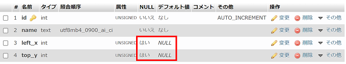

# フロントエンドエンジニア編

## はじめに

フロントエンドエンジニア編は課題提出がありますので予めご確認下さい。  
つまずいたら質問する前に[トラブルシューティング](./../../troubleshoot/index.md)を参照してください。

- [研修課題提出](https://github.com/epkotsoftware/training-docs/blob/main/submission/README.md#研修課題提出)
- [トラブルシューティング](./../../troubleshoot/index.md)

フロントエンドエンジニア編ではCBCの応用コースをやっていきます。  
開発環境については、自身のパソコン内に仮想的に環境を構築します。

## 仮想環境

まず仮想環境について学習しましょう。

- 仮想環境とは？
  - <https://bcblog.sios.jp/what-is-virtualenvironment-vmware/>
- Dockerやってる人向けのVagrant超入門
  - <https://qiita.com/nnishimura/items/b6fd4b665b25a411fbeb>

### Docker

今回はコンテナ型の仮想化環境である「Docker」を使います。

- 動画
  - 【2021年最新】Docker環境構築入門｜14分でdocker-composeまで完全解説！【windows/mac対応】Dockerの使い方
    - <https://youtu.be/VIzLh4BgKck>

#### Dockerインストール

Docker Desktop をインストールしてください。

- [Docker Desktopインストール](./../../docker/install.md)

#### VSCodeの確認

ここまでで、VSCodeが正しく開かれていない方が多いので再度確認しましょう。  
下図のように、左のエクスプローラーの所に「`TRAINING`」と表示されていることを確認してください。  

  

「`TRAINING`」が表示されていなければ、VSCodeを開き直しましょう。  

```txt
メニューバー「ファイル」→「フォルダーを開く」→「training」フォルダーを選択  
```

#### 構築手順

[構築手順](https://github.com/epkotsoftware/training-docs/blob/main/training/03_advanced/README.md) をご覧ください。

- コンテナ起動がうまくいかなかったらご連絡ください。
  - [Docker トラブルシューティング](./../../docker/troubleshoot.md)

## PHP入門

- 動画
  - <https://www.youtube.com/playlist?list=PLCX3wwS3Gg4wr82E46gEdFnT6VTo_uehr>
    - `10:01` サーバーサイドとは？サーバーサイドとクライアントサイド言語の違い
    - `1:02:33` PHPプログラミング入門講座🔰【初心者でも1時間で学べるPHP入門！フル字幕】
    - `4:05` セッション変数とは？【分かりやすい解説シリーズ #17】【プログラミング】

## PHP VSCode拡張機能

以下の導入を推奨します。  
「`PHP DocBlocker`」はPHPDocが必須の現場では重宝します。

- PHP Intelephense
  - コード補完・PSR-12コードフォーマット等、PHPに関する様々な機能が追加されます。
  - <https://marketplace.visualstudio.com/items?itemName=bmewburn.vscode-intelephense-client>
- PHP DocBlocker
  - 関数等のメンバーの上で「`/**`」を入力してEnterキーを押すだけで、自動的にPHPDocが生成されます。
  - <https://marketplace.visualstudio.com/items?itemName=neilbrayfield.php-docblocker>
  - PHPDocリファレンス
    - <https://zonuexe.github.io/phpDocumentor2-ja/references/phpdoc/index.html>

## CBC 応用

CBCと開発環境が異なるので、気を付けてください。  

- 応用1（フロントエンドエンジニア 初級）
  - <https://cbc-study.com/training/advanced/page1>
    - **MAMP、XAMPPは不要です！**
    - 環境はDockerで構築するため内容を確認するだけでOKです。
  - <https://cbc-study.com/training/advanced/page2>
  - <https://cbc-study.com/training/advanced/page3>
  - <https://cbc-study.com/training/advanced/page4>
    - **[②テーブルの作成](https://cbc-study.com/training/advanced/page4#pl-12) でアニメーションGifでは「`left_x`」、「`top_y`」カラムの NULL にチェックを入れ忘れているのでご注意ください（CREATE文で作成した場合は問題なし）。**  
        
- 応用2（フロントエンドエンジニア 中級1）
  - <https://cbc-study.com/training/advanced/page5>
    - PDO(DB_DNS)設定について
      - CBCの設定(host)と異なりますのでご注意ください。詳しくは[フロントエンドエンジニア編課題資料 ～ PHP](https://github.com/epkotsoftware/training-docs/blob/main/training/03_advanced/README.md#php)を参照
        - `define('DB_DNS', 'mysql:host=mysql; dbname=cri_sortable; charset=utf8');`
  - <https://cbc-study.com/training/advanced/page6>
  - <https://cbc-study.com/training/advanced/page7>
  - <https://cbc-study.com/training/advanced/class1>

### エラーが出た場合

- URL(パス)に誤りがないか確認しましょう。
- HTML側（`<input name="xxx">`）とPHP側（`$_POST['xxx']`）の名称が一致していることを確認しましょう。

## フレームワーク

- フレームワークとは
  - <https://www.otsuka-shokai.co.jp/words/framework.html>
- 動画
  - フレームワークとは？プログラミングに必須のフレームワークを初心者向けに解説！
    - <https://youtu.be/eTCjvTo5KgQ>

## 課題提出

以下を参照してください。

- [研修課題提出](https://github.com/epkotsoftware/training-docs/blob/main/submission/README.md#研修課題提出)

## 研修進捗資料の更新

課題提出した日付で「研修進捗」資料の更新をお願いします。

- [研修進捗](https://github.com/epkotsoftware/training-docs/blob/main/training/progress/README.md)
