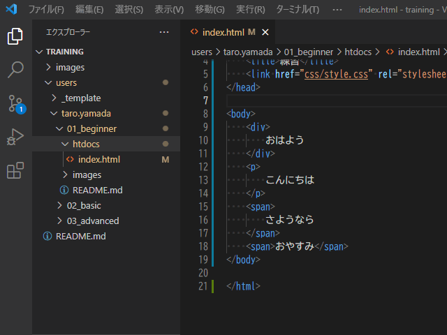

# コーダー編

## はじめに

コーダー編は課題提出がありますので予めご確認下さい。  
つまずいたら質問する前に[トラブルシューティング](./../../troubleshoot/index.md)を参照してください。

- [研修課題提出](https://github.com/epkotsoftware/training-docs/blob/main/submission/README.md#研修課題提出)
- [トラブルシューティング](./../../troubleshoot/index.md)

まずは動画で学習しましょう。

- 動画
  - <https://youtube.com/playlist?list=PLCX3wwS3Gg4wQs1w27nhrURdByT3cSNBp>
    - `10:17` 【2021年最新】HTML入門🔰初心者向けにHTMLの基礎を解説！
    - `11:33` 【CSS入門講座🔰】HTMLとCSSの基本を解説！WEBデザインの言語CSSを理解しよう
      - ※ 動画内で`<header>`タグが出てきますが`<head>`タグの間違いです。`<header>`タグは別の用途で使用します。
    - `11:25` 【Web業界の常識】「パス」の書き方、説明できますか？Webデザイナー・プログラマー志望の皆さんへ 初心者向け【HTML・CSS コーディング】
    - `14:24` 【Webデザイナー・プログラマーになりたい皆さんへ】Web業界の常識シリーズ10選！知らないままではマズいです… キャッシュ/スーパーリロード/アクセス制限の方法etc【初心者必見】
    - `8:22` HTML入門講座 #02：初めてのHTMLページを作ろう／ファイル名の付け方
  - VSCode フォルダ・ファイル追加方法  
    

動画を見終わったら、[CBC](https://cbc-study.com/)の入門コースをやっていきましょう。

- 入門1（コーダー 初級）
  - <https://cbc-study.com/training/beginner/page1>
  - <https://cbc-study.com/training/beginner/page2>
  - <https://cbc-study.com/training/beginner/page3>
  - <https://cbc-study.com/training/beginner/page4>
- 入門2（コーダー 中級）
  - <https://cbc-study.com/training/beginner/page5>
  - <https://cbc-study.com/training/beginner/page6>
  - <https://cbc-study.com/training/beginner/page7>
- 入門3（コーダー 上級）
  - <https://cbc-study.com/training/beginner/page8>
  - **注意: [「8. 枠が完成！」](https://cbc-study.com/training/beginner/page8#pl-12) の「このようになります。」のリンクをクリックすると誤ったサンプルが出てきますので無視してください。**

2022/6/15でブラウザの「`Internet Explorer(IE)`」が廃止されることにより  
CSSの「`grid-template`」が、ほぼ全てのブラウザでサポートされます。  
今後、使われる事が増えそうなので以下も覚えておきましょう。

- 動画
  - 【HTML/CSSレイアウト】Gridを使うとFlexboxより簡単に複雑なレイアウトを組めます
    - <https://youtu.be/cwkkD0ejX8Q>

## 課題

1日で出来る範囲で、自由にページを作成しましょう。  
思いつかなければ「実践を踏まえたコーディング」で作ったページのレイアウト変更でもOKです。  
課題提出についてはGitHubで行います。

- 要件
  - 対応ブラウザ
    - Google Chrome
  - 表示
    - 自分のユーザーディレクトリの「`01_beginner/htdocs/index.html`」をブラウザで開くと、作成したページが見れる。
    - 横幅:`1024px` で表示が崩れないようにする（確認方法は[横幅を指定した確認方法](./../../../public/t/google-chrome/index.md#使用)を参照）
      - 横スクロールできないこと
      - 文字・画像が切れていないこと
  - その他
    - 自分のユーザーディレクトリの「`01_beginner/htdocs/`」ディレクトリ内にHTML・CSSが入っていること
- [フリー素材](./../../../free-materials/index.md)

## 課題提出

以下を参照してください。

- [研修課題提出](https://github.com/epkotsoftware/training-docs/blob/main/submission/README.md#研修課題提出)
