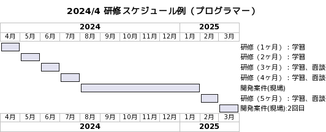
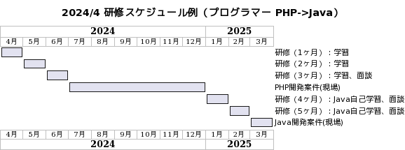
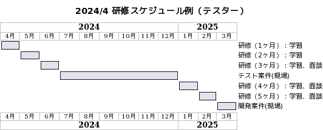

# 新人研修　〜　スケジュール

## スケジュール

本資料は、IT未経験者の場合のスケジュールになります。  

## 案件の判断について

研修を通じて、講師の判断で案件（プロジェクト）の方向性を決めます  
1対1PG研修後に最終決定します。

| プログラマー適正 | 案件 | 備考 |
| :---: | :---: | :---: |
| 低 | テスト |  |
| 中 | テスト or 開発 | 30歳近い場合、開発案件から |
| 高 | 開発 | 20代前半の場合、テストからでも可 |

- 判定材料
  - 提出物の質（勤務表、課題等）
  - 研修進捗
  - 読解力
  - 説明力
  - 論理的思考力
  - コミュニケーション力
  - メンタル
  - 業務態度

## スケジュール例

### 開発案件スタート

#### 通常のケース

- [PlantUML](https://www.plantuml.com/plantuml/umla/bPDFIpf1683lyodc-FiT8bsrefCVe4Ftw33fiAwCix4x7hhLpY73Gn1Hb2KM58Ge1I7zMVJ3lEhcoQ_GvB8m6386UzfzdlVPTzd9-u9umYPS2CG8jwl4fhXCqBxdSE4N2AEuud9HOWTeY-nHXbsE6V45BhYiMk6Oy2Bs7BiaC66EpMaH8U48PLafAxkQnL7hV3ZeGl0EmGi4Ro0VG8OWsyD-VHhMG5w2x43m3F89P5CzceOd26rxRfaM19wzcpyRjP9ILnhjnFEKcWRP6z_K53yDhqUTnsXmjljtWV9YWkT-S8st387OC0bQO6qka344OiCaQ87rkK3sDm-7HvFR-w_sSLBIrALDBRaH9oSNzUZgOtnN6txs_aMd_L7hzRzUICW5O39GVL1hReUSUGTTNThKafd5EsnQeqOpQdIJacOO12qG_uXvTMDspBu1)  
    

#### PHP以外の言語も目指すケース  

- [PlantUML](https://www.plantuml.com/plantuml/umla/bPDFIpf16CVlyohc-FiT95tNkeN7Y0xUeyEaoxgopiRk67IhdOE6Xo2YA2eiA2Wn4iB-jEYBUTJLas-XMMLWC5XQsDFEv_ldUOR9Uuoup2IKCMGJQjQ8QU0AGNkkHPbN9BQ1gmvbPVi0RP5TmyOEnJRn62uwTgrACQ4bx5fccM5YMoOrIWWnYmcLbjRq5Hs7hRFXu0NyJ_2xu7y0Vm0U06yF-yrPq01-0Rm3_Ylm9-2tuWWNDWgfzKsoJsR1CK85rwaOHORdBRsvQIejlWpQNZWBampmtlYw8VXPS3NgF8Q3qvta0eEM99wBS8NNuWEaGXN41wmk1MH_yt1uDBsvdxJhCacH_bMfHguj8iLsf-VDyF9hVDSOVlV-XIVzKUljln8YuHXMsaPJBqsYgtsYMvpKdqVltPYPf4bY3xM6jbGZbxI6D54zajV8Bcf4SEoM5Je6Lepr2CsB7_E7-WC0)  
    

### テスト案件スタート

テスターの場合は、案件終了後にプログラミング学習の期間を取るため  
テスト・データベースの復習をした後に早めに現場に入ります。  

- [PlantUML](https://www.plantuml.com/plantuml/umla/bPFFIiCm783lUOeSzI1kNQVNFO07x-8XRg7ho59fiuCtRK0hEmWYWg8m1RqC1K66VyhwCEbMT-ehcBK6GgLIeQVq-tvVVu6sF8PSPY7A6228MWDaOTX3OD-rAVFQY63OToZhaWEmXVOmWGw517aCjXqow5E8Q0UwjjLb417RehW30BEPj8oQOQwRC1bTnD6pyD-5_oByDy4V10y57yVJOHe6WXzdho9vc8Qd06oxJW-t6So-oik6hDNaKmSx-IGfrGMVp6y2oQVXzUpfCOdET_ylODfHU7E9QxpnTq0PHQ4yi548D7xpul1eSNl_DJxHIqgjQEh9pJpvSy4ycDy5yUTa9JcRpaQlgogYm-Mi6hlSkh29MN4JfLOqzQHHI3Qh9PLQC2ib6tboSJbChZvARqwH9Q0-qCm6jkH9zgTz0m00)  
    
