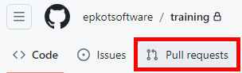
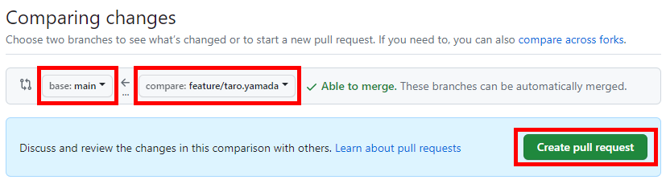
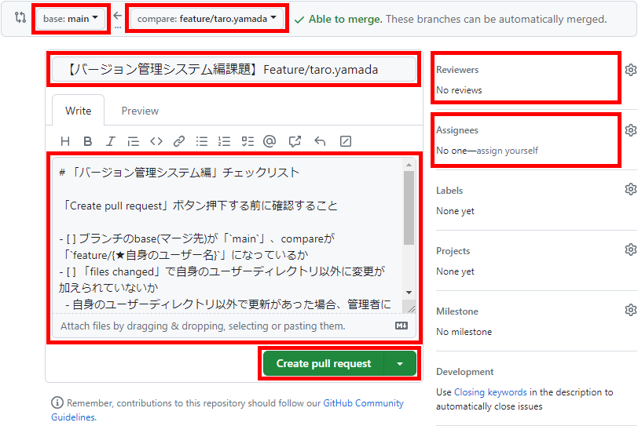
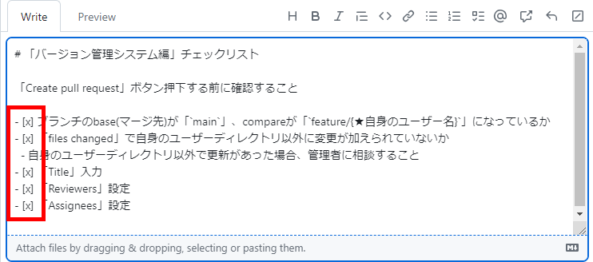

# 新人研修 〜 バージョン管理システム編

## バージョン管理システム編

ここまでバージョン管理システムとしてGit + GitHubを使用してきました。  
他にもSubversion（SVN）等があり、現在でも使われている現場が多いです。  
運用方法についても現場によって様々ですが、一般的なgit flow等の動画も紹介します。

- 動画
  - バージョン管理ツールの2大勢力！Git VS SVN
    - <https://youtu.be/jOFSn59q6IY>
  - 【Git入門】Git + Github使い方入門講座🐒Gitの仕組みや使い方を完全解説！パーフェクトGit入門！
    - <https://youtu.be/LDOR5HfI_sQ>
  - イケてるgitのブランチ運用｜git flowとgithub flowとは！？
    - <https://youtu.be/0ge7ZJQvYLw>

Git で `master` という名称のブランチが使われていることが多いですが  
現在では `main` がデフォルトとなっています。

- Twitter、コードやドキュメント内の用語「Whitelist/Blacklist」「Master/Slave」「Dummy value」などを好ましい用語へ置き換え、具体例も発表
  - <https://www.publickey1.jp/blog/20/twitterwhitelistblacklistmasterslavedummy_value.html>

## 課題

ここまで課題をアップしてきた自分のFeatureブランチを  
`main` ブランチへマージするPR(Pull Request)を出しましょう。

### プルリクエスト (Pull Request)

#### 注意

- 「`Merge pull request`」ボタンはクリックしないでください。  
  - 理由としては、言葉の通りマージしてしまうからです、今回の課題はマージ前の確認を依頼する課題です。  

#### PR一覧

PR一覧画面を出しましょう。  

- GitHubのtrainingリポジトリのページを開きます。
  - <https://github.com/epkotsoftware/training/>
- 画面上部の「`Pull requests`」をクリックし、PR一覧を出します。  
    

#### PR作成

PRを作成していきましょう。  
途中で問題が発生した場合、講師に連絡してください。

- PR一覧画面
  - 「`New pull request`」ボタンをクリックし、「`Compare changes`」画面を出し  
    ブランチを「`base: main` ← `compare: feature/{★ユーザー名}`」に設定してください。  
    下部に出てくる差分を確認し、問題なければ  「`Create pull request`」ボタンでPR作成画面を出します。  
      
- PR作成画面  
      
  1. 「Title」を「【バージョン管理システム編課題】」等、適当に入力してください。
  1. 「Reviewers」講師を選択しましょう。
  1. 「Assignees」に自分を選択しましょう。
  1. コメント入力欄にMarkdownのタスクリストを用意しているので  
    確認したものをチェックしていってください、「x」を入れるとPreviewでチェックがつきます。  
    参考: 基本的な書き方とフォーマットの構文  
      <https://docs.github.com/ja/get-started/writing-on-github/getting-started-with-writing-and-formatting-on-github/basic-writing-and-formatting-syntax>  
      
  1. 「`Create pull request`」ボタンを押下してください。  
  ***※ その後、「`Merge pull request`」ボタンはクリックしないでください。***
- 研修講師へ、レビュー依頼をしてください。
- 問題なければ研修講師がマージ＆Featureブランチを削除します。
  - 今後もtrainingリポジトリの自分のユーザーディレクトリを使用したい場合は`main`ブランチをお使いください。

#### 参考ページ

- Pull request のドキュメント
  - <https://docs.github.com/ja/pull-requests>
