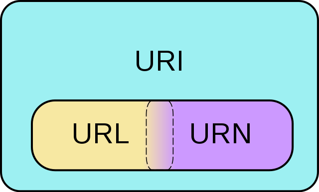

# 株式会社エプコットソフトウェア ～ URL設計

## 目次

| No. |  |
| :---: | --- |
| 1 | [URLとは](#urlとは) |
| 2 | [URLとURI](#urlとuri) |
| 3 | [パス](#パス) |
| 4 | [設計](#設計) |
| 5 | [詳細](#詳細) |

## URLとは

URLとは「Uniform Resource Locator（ユニフォームリソースロケータ）」の略称で  
主にhttpから始まるWebページの住所のようなものと覚えておきましょう。  
例えばGoogleのトップページであれば <https://www.google.com/> になります。

- URLとは？【分かりやすい解説シリーズ #9】【プログラミング】
  - <https://youtu.be/JFmWFh9S4Gs>
- URLの基礎
  - <https://blog.senseshare.jp/url-basic.html>

## URLとURI

**URLとURIは基本的に同じものという考えで問題ありません。**  

URIはURLを抽象化したものなので、幅広い意味になります。  
URNについては実務でも、ほとんど使われることがないため  
覚える必要はありません（恐らく知っている人も少ない）。  

- [Wikipedia - Uniform Resource Identifier](https://ja.wikipedia.org/wiki/Uniform_Resource_Identifier)
- [Wikimedia Commons](https://commons.wikimedia.org/w/index.php?curid=2649934)  
  

## パス

パスについてはWebに限らず、Linuxでも必要になってくるので  
エンジニア必須の知識になります、しっかり学習しておきましょう。

- 【Web業界の常識】「パス」の書き方、説明できますか？Webデザイナー・プログラマー志望の皆さんへ 初心者向け【HTML・CSS コーディング】
  - <https://youtu.be/R7tNviqrMzo>

| パスの種類 | 例 | 解説 |
| --- | --- | --- |
| 絶対パス | `https://example.com/css/common.css` | 目的のファイルまでの道筋を全部書く。 主に外部サイトへのアクセスに使用する。 |
| ルートパス | `/css/common.css` | ルートディレクトリから、目的のファイルまでの道筋を全部書く。 同一サイトで使用可、「`/`」から始まる。 |
| 相対パス | 現在位置がルートの場合 `css/common.css`  現在位置が`/admin`の場合 `../css/common.css` | 現在の位置から、目的のファイルまでの道筋を全部書く。 同一サイトで使用可。 |

## 設計

URL(URI)設計について考えていきましょう。  
現実世界の住所やパソコンのファイルシステム（ファイル・フォルダ）の考え方と同じで  
大項目→中項目→小項目と言ったように階層で考えます。  

- [PlantUML](https://www.plantuml.com/plantuml/umla/SoWkIImgoStCIybDBE0goIp9ILLuihV_MMV3uyPrZvkMF6vU-BXvp-Ec7LpQ2i-cBtqsPmsNjhR2ywNpdYxjUBfzxlCvFI3-qzxc5nCxePndSpS-sRNcPVDUBcqWxycEjK-Nh7lQimlCUx6nw-dcRM0UHBBhsSO5BnPrGxWlbkw7So46GRbWtexrG7rWspPkVBPe1Spg-NkUzu6jTaZDIu5w1000)  
    
- [PlantUML](https://www.plantuml.com/plantuml/umla/SoWkIImgoStCIybDBE0goIp9ILK81_BoouiVDwvxt3prSTFAnysh7pStF6vQyhXvuUFcFO-RTd1fApXRSMbhAuGMfnOLSsa3MPM9kOafYK0caEsVb-fIb5cM2kI1k8-RsnytxNpSjFvnSyVZvkR7pTFX4fsFczO-RbuADdWpK1gYtoM_F2ydFp45ON9LOdOcoBw0elpqeiHS1RVCdDHYBeVKl1Ieqm40)  
    

### 松屋フーズの例

実際に「松屋フーズ(<https://www.matsuyafoods.co.jp/>)」のサイトを例に見ていきます。  
**※ 2022/12時点のリンクのため、サイト更新などでリンク切れになることも考えられます**

- [PlantUML](https://www.plantuml.com/plantuml/uml/bP8zIyD06CVtV8gEbeBMY7kNZdOHSH52Q0uJo5rBSg5al3k7QfU2gDGNEYW8hHGSH17nopmqqc_XdpG1hOYu_lultFCyruYb6qaU28-xNKi6CcILxEPz_ZWWSqRcZVHhXVGJwJio_Un-aFM7LctLSI3MDgfMBUUaPgIFGBWhuqHqKhTKa2Xn3a5RpVrTi9uFA5Xl2NUQhJr0paII0uIlnulpqyLeE9zTGWa37aZc5UB7yHLfHUe2oc6QS1Rx0QHVDSVlEhPTtwxRwxxaOMabDIPrI-gPz0aPjHni9U-qVSPYLZPiRNvfm9QcP1wGWxUTH54ANWWJCXFIBsJGFFtcYrAd4_thITZltuNbGt_sedI4UN0EkEC4-yWFKhKQJ7Z5D_W4)  
    

| URI | ページ | 備考 |
| --- | --- | --- |
| [/](https://www.matsuyafoods.co.jp/) | 松屋フーズ |  |
| [/matsunoya](https://www.matsuyafoods.co.jp/matsunoya) | 松のや |  |
| [/sushimatsu](https://www.matsuyafoods.co.jp/sushimatsu) | すし松 |  |
| [/matsuya](https://www.matsuyafoods.co.jp/matsuya) | 松屋 |  |
| [/matsuya/whatsnew](https://www.matsuyafoods.co.jp/matsuya/whatsnew) | 松屋 NEWS |  |
| [/matsuya/menu](https://www.matsuyafoods.co.jp/matsuya/menu) | 松屋 MENU |  |
| [/matsuya/menu/limited](https://www.matsuyafoods.co.jp/matsuya/menu/limited) | 松屋 MENU 期間限定 | ページには「おすすめ」となっている |
| [/matsuya/menu/gyumeshi](https://www.matsuyafoods.co.jp/matsuya/menu/gyumeshi) | 松屋 MENU 牛めし |  |
| [/matsuya/menu/gyumeshi/gyumeshi_hp_220502.html](https://www.matsuyafoods.co.jp/matsuya/menu/gyumeshi/gyumeshi_hp_220502.html) | 松屋 MENU 牛めし → 牛めし |  |
| [/matsuya/menu/gyumeshi/gyu_cheese_hp_220531.html](https://www.matsuyafoods.co.jp/matsuya/menu/gyumeshi/gyu_cheese_hp_220531.html) | 松屋 MENU 牛めし → たっぷりチーズ牛めし |  |
| [/matsuya/menu/curry](https://www.matsuyafoods.co.jp/matsuya/menu/curry) | 松屋 MENU カレー |  |
| [/matsuya/menu/curry/cry_ori_hp_220502.html](https://www.matsuyafoods.co.jp/matsuya/menu/curry/cry_ori_hp_220502.html) | 松屋 MENU カレー → オリジナルカレー |  |
| [/matsuya/menu/curry/cry_ori_cheese_hp_220502.html](https://www.matsuyafoods.co.jp/matsuya/menu/curry/cry_ori_cheese_hp_220502.html) | 松屋 MENU カレー → たっぷりチーズのオリジナルカレー |  |

### MDNの例

実際に「MDN(<https://developer.mozilla.org/ja/>)」のサイトを例に見ていきます。  

- [PlantUML](https://www.plantuml.com/plantuml/uml/PL7DIiD04BxdANBS4h2lK56eYBLW1Iy5sIOhfBIRibq5RyskWZy7AsfAZmNH8hKUHD0Iz666_FWMJepr1o6PsPdlPvdPKbTI8TikTzgqOqXNjfXPMLutB1Fq4MWDUb3df5WmBCjy3qwJuIpj7KRzS_3nczOvg1jGjw23-AINZYwGwtXsjxZ56YX1pSfcPOra8IzNwHwjsSBjI6J-50Z-HK5DG5s3FYRbNTTX_t2yMD-1lW8r0Zq1_GZg1Hqts0uJZDkv01LHU0R-E0ula-aWkk-JQeS9AZtHdHFYyJ2U1SdJ0VXlwMk8CPi9hGDGpzbawW4NWTRbbjUWhUrgeybiEPTRvg8GT1_XpupTt-s5fkToKa0qEtnBSWkIftmjIxKQmRzWb1XtlXxZ0m00)  
    

ArrayのjoinメソッドのURIを辿っていきましょう。  

- <https://developer.mozilla.org/ja/docs/Web/JavaScript/Reference/Global_Objects/Array/join>

| URI | ページ | 備考 |
| --- | --- | --- |
| [/](https://developer.mozilla.org/ja/) | トップページ |  |
| [/docs/Web](https://developer.mozilla.org/ja/docs/Web) | 開発者向けのウェブ技術 | `/docs`にアクセスすると `/docs/Web`にリダイレクト |
| [/docs/Web/JavaScript](https://developer.mozilla.org/ja/docs/Web/JavaScript) | JavaScript |  |
| [/docs/Web/JavaScript/Reference](https://developer.mozilla.org/ja/docs/Web/JavaScript/Reference) | JavaScript リファレンス |  |
| [/docs/Web/JavaScript/Reference/Global_Objects](https://developer.mozilla.org/ja/docs/Web/JavaScript/Reference/Global_Objects) | 標準組み込みオブジェクト |  |
| [/docs/Web/JavaScript/Reference/Global_Objects/Array](https://developer.mozilla.org/ja/docs/Web/JavaScript/Reference/Global_Objects/Array) | Array |  |
| [/docs/Web/JavaScript/Reference/Global_Objects/Array/join](https://developer.mozilla.org/ja/docs/Web/JavaScript/Reference/Global_Objects/Array/join) | Array.prototype.join() |  |

## 詳細

URL(URI)の詳細について、詳しく学習したい場合は  
以下を参照してください。

- [詳細](./detail/index.md)
