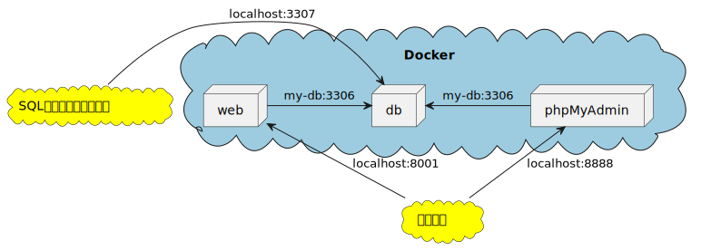
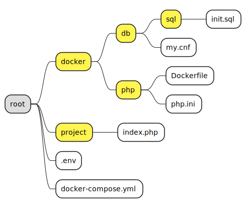
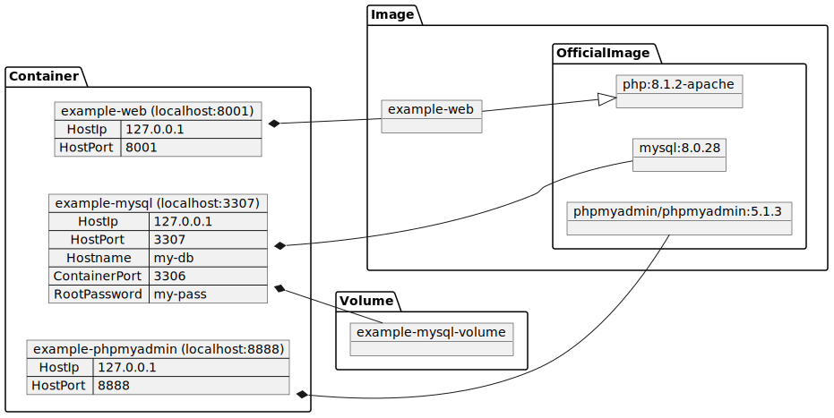

# 株式会社エプコットソフトウェア ～ Docker 例

## 概要

簡易的なPHP環境を構築します。

## 構成

以下、3つのサーバーをDockerで構築します。

- Webサーバー(アプリケーションサーバー)
- DBサーバー(MySQL)
- phpMyAdminサーバー

### 作成する環境

| 項目 | 内容 | 備考 |
| --- | --- | --- |
| Web URL | <http://localhost:8001/> | PHPページの表示 |
| phpMyAdmin URL | <http://localhost:8888/> | データベースの確認 |
| DB名 | `example_db` |  |
| DB接続情報 | ホスト名: localhost<br>ユーザーID: root<br>パスワード: my-pass<br>ポート番号: 3307 | SQLクライアントソフトで接続する。 |

### 構成図

- 簡易ネットワーク構成
  - [PlantUML](https://www.plantuml.com/plantuml/umla/SoWkIImgAStDuKhEoIzDKN39JyvEBL9GjdHnTdOrKAZcKb38oqz9LIXFJO8nK-2iWem2tqh7bDpCFAvQBgW1mO4-ZvlMFsvU-RXfoUEcHO-RDpzkxdZSjFTnyrGWGq7P3GWC3A2A7pTF0wjSzhXf6roA2qLKjxH0rmvalPL2JdvoOav6Vd69bOM1WI4sPGW7eQW60Yu2xb80wav1iSFOsC2SYmjeCKmgjr8NI065pRWGzYZevgIcbM2gS4ZDIm66AW00)  
      
- ディレクトリ構成
  - [PlantUML](https://www.plantuml.com/plantuml/uml/TP31JiOW48Jl-nIRU2IY1xqrfj66e--0i5Kii0XeR8plRg4r_wbxOO1lPf8TIzMv1XTjq0c6KbTF3n3P4lu0ugCsoslcpsYVs7F6AwNKtVqj_49chi-dsDHdmppf-HnJVJPik3cQGM1B1Y7GibaeWsZo1KGxouS7qPMBhih_AuPLcZXtDBsb_Mtgzjbv0d5yoCq5JMP-9rDX3xBqBNSNIefVb-fhmo5n8Ra63oD5Uwpf3m00)  
      
- コンテナ構成
  - [PlantUML](https://www.plantuml.com/plantuml/umla/bL9FJy8m5B_lKxnmKfFE3Q8G4Wd6YvmacdWlMs7LTgrR0OdotNrzcUj6k50Irlt-zFTUt-QruvNRQXKfiNRW35HoKpZ8PIKo9qqPHPPddtmZuCcKZijILF0J0MXkOI2-kRPAiBrOmPKo6LU5gTrqaYJfzG0Uto3p3Ea1df5QM7YOGJeSnmd-qXPVcifvnZiHF4Qd2VfGVwbkncYKZ9iCuYv9yTuMBBaM7jG7bgy8RHljwE-9UJN6BNbTxqsLDnwBhsShjeNL1vvhMVQk1bTJTX1ST4EuAEyO9hFG-4zdcDK7Zgqt60h39xB_-fVrMcQIg-0BJgngEedJUCWuoWj1TWHx8hfnb2NnS4820dgIqDrjs4xlyEGHEG9usisxKLjzlXsAOJiIq2axGhoRlhGRngXLlsViTqQ5PwGXZdPTeF5tPu5mjxYvAFEjLdy0)  
      

## .env

環境変数を定義します。  
定義した変数は後述のymlで使用可能です。  
今回は、CLI環境変数の「COMPOSE_PROJECT_NAME」にプロジェクト名を設定しておきます。

```ini
# .env
# プロジェクト名
COMPOSE_PROJECT_NAME=example
```

- Declare default environment variables in file
  - <https://docs.docker.com/compose/env-file/>
- Compose CLI environment variables
  - <https://docs.docker.com/compose/reference/envvars/>
- Environment variables in Compose
  - <https://docs.docker.com/compose/environment-variables/>

## docker-compose.yml

構築するサービスの情報を定義します。

```yml
# docker-compose.yml
version: "3.1"

services:
  web:
    container_name: "example-web"
    hostname: "example-web-server"
    build:
      context: "./docker/php"
    ports:
      - "127.0.0.1:8001:80"
    volumes:
      - "./project:/var/www/html"
    environment:
      - "TZ=Asia/Tokyo"
    restart: always
  db:
    platform: linux/x86_64 # M1チップ対応
    container_name: "example-mysql"
    hostname: "my-db"
    image: mysql:8.0.28
    ports:
      - "127.0.0.1:3307:3306"
    volumes:
        - "mysql_data_volume:/var/lib/mysql" # volumes -> mysql_data_volume
        - "./docker/db/my.cnf:/etc/mysql/conf.d/my.cnf"
        - "./docker/db/sql:/docker-entrypoint-initdb.d"
    environment:
      - "MYSQL_ROOT_PASSWORD=my-pass"
      - "TZ=Asia/Tokyo"
    restart: always
  phpmyadmin:
    container_name: "example-phpmyadmin"
    hostname: "example-phpmyadmin-server"
    image: phpmyadmin/phpmyadmin:5.1.3
    ports:
      - "127.0.0.1:8888:80"
    environment:
      - "PMA_HOST=my-db" # db -> hostname
      - "PMA_USER=root"
      - "PMA_PASSWORD=my-pass" # db -> environment -> MYSQL_ROOT_PASSWORD
      - "TZ=Asia/Tokyo"
    restart: always
volumes:
  mysql_data_volume:
    name: "example-mysql-volume"
```

| オプション | 説明 |
| --- | --- |
| [image](https://docs.docker.com/compose/compose-file/compose-file-v3/#image) | コンテナを開始するイメージを指定します。<br>指定例: `イメージ名:タグ` |
| [ports](https://docs.docker.com/compose/compose-file/compose-file-v3/#ports) | 設定例: `IPアドレス:ホストPort:コンテナPort` |
| [environment](https://docs.docker.com/compose/compose-file/compose-file-v3/#environment) | 環境変数を追加します。<br>`TZ` でタイムゾーンを設定します（デフォルトはUTC）。 |
| [restart](https://docs.docker.com/compose/compose-file/compose-file-v3/#restart) | `always` を指定するとコンテナが停止されると自動的に再起動されます。 |

- Compose specification
  - <https://docs.docker.com/compose/compose-file/>
  - Compose file version 3 reference - ports
    - <https://docs.docker.com/compose/compose-file/compose-file-v3/#ports>

### webコンテナ

| オプション | 説明 |
| --- | --- |
| [build](https://docs.docker.com/compose/compose-file/compose-file-v3/#build) | contextに`Dockerfile`ファイルが格納されているディレクトリを指定します。 |
| [volumes](https://docs.docker.com/compose/compose-file/compose-file-v3/#volumes) | ローカルの`project`ディレクトリと、コンテナ内の`/var/www/html`ディレクトリを関連付けて同期させます。<br>projectディレクトリ内を更新すると、コンテナのディレクトリも更新されます。 |

```yml
  web:
    container_name: "example-web"
    hostname: "example-web-server"
    build:
      context: "./docker/php"
    ports:
      - "127.0.0.1:8001:80"
    volumes:
      - "./project:/var/www/html"
    environment:
      - "TZ=Asia/Tokyo"
    restart: always
```

- `Php - Official Image | Docker Hub`
  - <https://hub.docker.com/_/php>
- `phpmyadmin/phpmyadmin - Docker Image | Docker Hub`
  - <https://hub.docker.com/r/phpmyadmin/phpmyadmin/>
- `Mysql - Official Image | Docker Hub`
  - <https://hub.docker.com/_/mysql>

#### php.ini

PHP設定ファイルを用意します。  
PHPのバージョンによって設定内容が異なるため  
PHPマニュアルやGitHubの`php.ini-development`を確認して設定してください。  
現在では文字コードがUTF8が標準になってきているので、デフォルト設定で良いものが増えてきました。

```ini
# docker/php/php.ini
[Date]
date.timezone = Asia/Tokyo

[mbstring]
mbstring.language = Japanese
mbstring.substitute_character = none
```

- 実行時設定
  - <https://www.php.net/manual/ja/configuration.php>
- Multibyte String 実行時設定
  - <https://www.php.net/manual/ja/mbstring.configuration.php#ini.mbstring.substitute-character>
- php.ini ディレクティブのリスト
  - <https://www.php.net/manual/ja/ini.list.php>
- GitHub php.ini-development
  - <https://github.com/php/php-src/blob/PHP-8.1.4/php.ini-development>

`mbstring.detect_order` についてはデフォルトでは微妙な部分があるため  
文字化け等の問題が発生したら見直してください。

```bash
root@example-web-server:/var/www/html# # mbstring.language = Japanese の場合
root@example-web-server:/var/www/html# php -r "var_export(mb_detect_order());"
array (
  0 => 'ASCII',
  1 => 'JIS',
  2 => 'UTF-8',
  3 => 'EUC-JP',
  4 => 'SJIS',
)root@example-web-server:/var/www/html# 
```

#### Dockerfile

オフィシャルのPHPイメージをベースに  
イメージを生成するための「Dockerfile」を準備します。

```bash
# docker/php/Dockerfile
FROM php:8.1.4-apache

# php.ini をWebサーバーの「/usr/local/etc/php/」にコピー
COPY ./php.ini /usr/local/etc/php/
# apt(Advanced Package Tool) パッケージインストール
# PDO driver インストール(mysql)
# mod_rewrite 有効化 (apache設定)
RUN apt-get update && apt-get install -y \
    git \
    unzip \
    vim \
    zip \
    && docker-php-ext-install pdo_mysql \
    && a2enmod rewrite
```

- Dockerfile reference
  - <https://docs.docker.com/engine/reference/builder/>

#### index.php

任意のPHPファイルを置きましょう。  
以下は、DB接続や各種設定を確認するためのコードになります。

```php
<?php
// project/index.php

const DB_HOST = 'my-db';
const DB_PORT = 3306;
const DB_DATABASE = 'example_db';
const DB_USERNAME = 'root';
const DB_PASSWORD = 'my-pass';
const DB_CHARSET = 'utf8mb4';

$dsn = 'mysql:host=' . DB_HOST . ';port=' . DB_PORT . ';dbname=' . DB_DATABASE . ';charset=' . DB_CHARSET;
$dbh = new PDO($dsn, DB_USERNAME, DB_PASSWORD);

echo 'DB接続成功';
// PHP の設定情報を出力
phpinfo();
```

- PDO クラス
  - <https://www.php.net/manual/ja/class.pdo.php>
- MySQL 関数 (PDO_MYSQL)
  - <https://www.php.net/manual/ja/ref.pdo-mysql.php>
- phpinfo
  - <https://www.php.net/manual/ja/function.phpinfo.php>

### dbコンテナ

| オプション | 説明 |
| --- | --- |
| [platform](https://docs.docker.com/compose/compose-file/compose-file-v2/#platform) | Mac M1チップで動作させるため `linux/x86_64` を設定 |
| [volumes](https://docs.docker.com/compose/compose-file/compose-file-v3/#volumes) |  |
| [environment](https://docs.docker.com/compose/compose-file/compose-file-v3/#environment) | 環境変数を追加します。<br>`MYSQL_ROOT_PASSWORD` でMySQLのrootパスワードを設定します。 |

```yml
  db:
    platform: linux/x86_64 # M1チップ対応
    container_name: "example-mysql"
    hostname: "my-db"
    image: mysql:8.0.28
    ports:
      - "127.0.0.1:3307:3306"
    volumes:
        - "mysql_data_volume:/var/lib/mysql" # volumes -> mysql_data_volume
        - "./docker/db/my.cnf:/etc/mysql/conf.d/my.cnf"
        - "./docker/db/sql:/docker-entrypoint-initdb.d"
    environment:
      - "MYSQL_ROOT_PASSWORD=my-pass"
      - "TZ=Asia/Tokyo"
    restart: always
```

- Mysql - Official Image | Docker Hub
  - <https://hub.docker.com/_/mysql>
- MySQL8.0 環境変数
  - <https://dev.mysql.com/doc/refman/8.0/en/environment-variables.html>

#### my.cnf

`my.cnf` はMySQLのオプションファイルです。  

DockerのMySQLオフィシャルイメージの `/etc/mysql/my.cnf` ファイルには以下の記載があるため  
`/etc/mysql/conf.d/` ディレクトリに`my.cnf`ファイルを格納することで自動的に読み込まれます。

```ini
# Custom config should go here
!includedir /etc/mysql/conf.d/
```

`docker/db/my.cnf` には以下の設定をしておきます。  

```ini
# docker/db/mysql.cnf
[mysqld]
character-set-server=utf8mb4
collation-server=utf8mb4_unicode_ci

[client]
default-character-set=utf8mb4
```

文字コードには、絵文字や特殊な漢字が含まれる `utf8mb4` を使います。  

- Using Option Files
  - <https://dev.mysql.com/doc/refman/8.0/en/option-files.html>
- MySQL Server Time Zone Support
  - <https://dev.mysql.com/doc/refman/8.0/en/time-zone-support.html>
- Configuring Application Character Set and Collation
  - <https://dev.mysql.com/doc/refman/8.0/en/charset-applications.html>

#### init.sql

初回に実行するSQLを記載します。  
データベース作成やテーブル作成などを行います。

```sql
-- docker/db/sql/init.sql
-- DB生成
CREATE DATABASE `example_db`;
```

### phpmyadminコンテナ

```yml
  phpmyadmin:
    container_name: "example-phpmyadmin"
    hostname: "example-phpmyadmin-server"
    image: phpmyadmin/phpmyadmin:5.1.3
    ports:
      - "127.0.0.1:8888:80"
    environment:
      - "PMA_HOST=my-db" # db -> hostname
      - "PMA_USER=root"
      - "PMA_PASSWORD=my-pass" # db -> environment -> MYSQL_ROOT_PASSWORD
      - "TZ=Asia/Tokyo"
    restart: always
```

## 構築

以下のコマンドでコンテナの構築および起動します。  
実行するディレクトリは`docker-compose.yml`があるディレクトリです。

```bash
# コマンド
docker-compose up -d
```

実行例

```bash
$ # docker-compose.yml があるか確認
$ ls
docker                  docker-compose.yml      project
$ # コンテナ起動
$ docker-compose up -d

　・
　・　※省略
　・

 ⠿ Network env-php_default        Created                                                                                                 0.1s
 ⠿ Volume "env-php-mysql-volume"  Created                                                                                                 0.0s
 ⠿ Container env-php-mysql        Started                                                                                                 0.5s
 ⠿ Container env-php-web          Started                                                                                                 0.5s
 ⠿ Container env-php-phpmyadmin   Started                                                                                                 0.5s
$ 
```

- `docker-compose up`
  - <https://docs.docker.com/compose/reference/up/>

## 動作確認

### Web

- <http://localhost:8001/> がブラウザで開けること
- エラーが出ていないこと

### phpMyAdmin

- <http://localhost:8888/> がブラウザで開けること
- エラーが出ていないこと
- データベース「`example_db`」が出来ていること

### DB

- SQLクライアントソフトで接続できること
  - 「`A5:SQL Mk-2`」の場合
    - MySQL
      - ホスト名: `localhost`
      - ユーザーID: `root`
      - パスワード: `my-pass`
      - ポート番号: `3307`
  - 「`DBeaver`」の場合
    - MySQL
      - Server
        - Server Host: `localhost`
        - Port: `3307`
        - Database: `<未入力でOK>`
      - 認証 (Database Native)
        - ユーザー名: `root`
        - パスワード: `my-pass`

#### SQLクライアントソフトダウンロード

- `A5:SQL Mk-2`
  - <https://a5m2.mmatsubara.com/>
- `DBeaver`
  - <https://dbeaver.io/>
  - YouTube
    - <https://www.youtube.com/channel/UC-yOjsQLSaJVEghg6UB3N7A>

## コンテナ(サーバー)に入る

- web

```bash
# webコンテナに入る
docker exec -it example-web bash
```

- db

```bash
# dbコンテナに入る
docker exec -it example-mysql bash

# MySQLログイン
mysql -uroot -p"$MYSQL_ROOT_PASSWORD"
```
