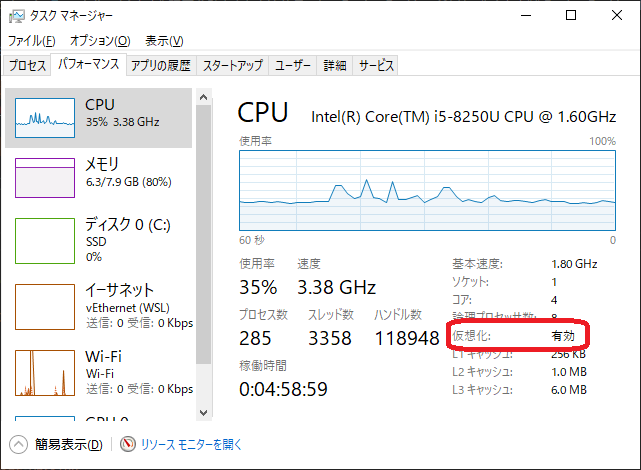
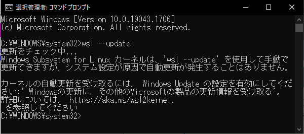
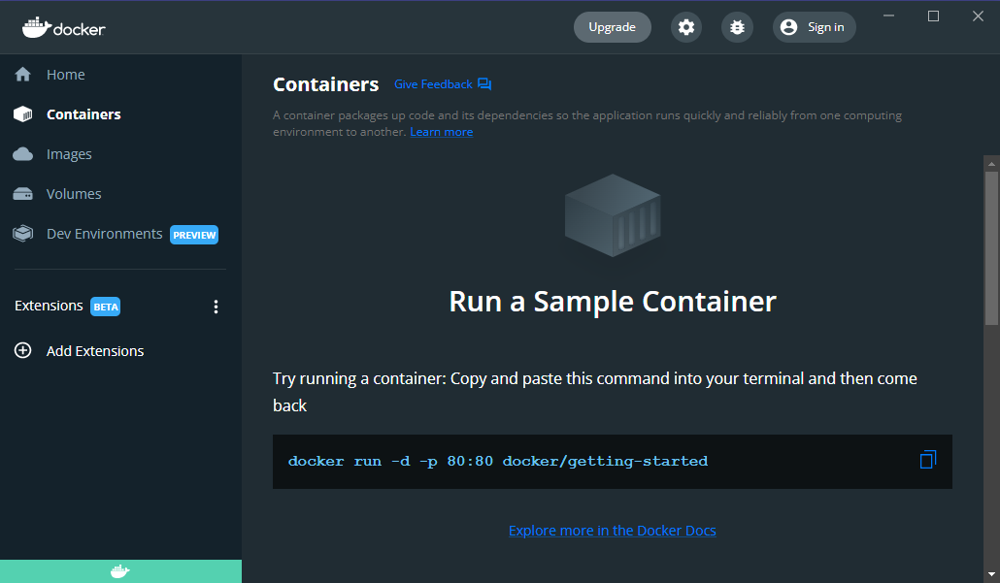

# 株式会社エプコットソフトウェア ～ Docker Desktopインストール

## 公式

- Docker Desktop overview
  - <https://docs.docker.com/desktop/>

## インストール準備(Windows)

### 仮想化の有効確認

まずは仮想化が有効になっているか確認します。  
「Ctrl」と「ALT」を押しながら「DEL」を押し「タスクマネージャー」を開いてください。  
詳細表示にし、「パフォーマンス」タブを選択すると確認できます。  

  

無効になっている場合は有効化してください。  

#### 有効化

BIOS設定についてはパソコンのメーカーによってやり方が異なるため  
各自調べてください。  

- Windows 10 WSL を有効にする方法
  - <https://kb.seeck.jp/archives/8788>
- B350チップセット Mini-ITXモデル 「 CPU仮想化機能 」 を有効に設定する方法 （ Windows10 ）
  - <https://www2.mouse-jp.co.jp/ssl/user_support2/sc_faq_documents.asp?FaqID=28709>

### WSL2アップデート

まずは「コマンドプロンプト」というソフトを使い、WSLの更新を行います。  
「コマンドプロンプト」を「管理者として実行」で開き  
「`wsl --update`」コマンドで更新を行ってください。  

更新がない場合、わかりにくいですが以下のメッセージが表示されます。

  

更新した場合、恐らく「`wsl --shutdown`」コマンド実行を求められますので、指示通り実行しましょう。  

## インストール準備(Mac)

Macでは特別な設定が不要ですが  
Appleシリコン搭載Mac（M1チップ搭載のもの等）では「Rosetta 2」のインストールを推奨されています（筆者の`MacBook Air (M1, 2020)`ではなしで動作している）。  
インストールは任意でお願いします。

```bash
softwareupdate --install-rosetta
```

- Apple シリコン搭載の Mac コンピュータ
  - <https://support.apple.com/ja-jp/HT211814>

## インストール

- `Docker Desktop`
  - <https://www.docker.com/products/docker-desktop>
- インストール完了後のチュートリアルはスキップしてください。
- インストールがうまくいかなかったらトラブルシューティングをご覧ください。
  - [Docker トラブルシューティング](./troubleshoot.md)

以下の画面が確認できればインストール完了です。

  
