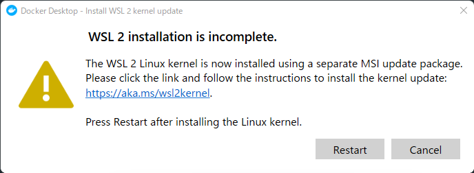
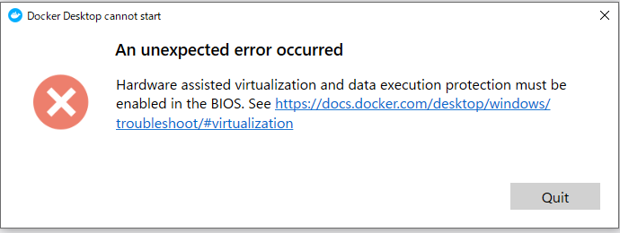
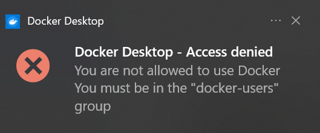

# 株式会社エプコットソフトウェア ～ Docker トラブルシューティング

## 公式

- docker docs 〜 Logs and troubleshooting
  - <https://docs.docker.com/desktop/windows/troubleshoot/>

## Docker Desktopインストール(Windows)

### WSL

  

- Linux kernel のアップデート「`wsl --update`」をコマンドプロンプトで実行する（終わったら次のコマンドが求められるので書かれている通り実行する  
  たしか「`wsl --shutdown`」のコマンド）

### PowerShell

- PowerShell等が起動中のためインストールに失敗
  - 一度、Docker Desktopをアンインストール
  - パソコンを再起動し、余計なアプリを開いていない状態でDocker Desktopをインストール

### BIOS

  

まずは「Windows の機能の有効化または無効化」で  
WSL (Windows Subsystem for Linux)、「Virtual Machine Platform」、「Hyper-V」を有効化します。  
設定済みだった場合、BIOSの可能性が高いのでBIOS設定で仮想化機能を設定する必要があります。  
BIOS設定方法については「`bios 仮想化 有効 {型番・メーカー名}`」で検索すると良いでしょう。  
BIOS設定はWindowsでは行わないため、ブラウザを見ながら出来ないので  
スマートフォンなどの別な端末で確認しながら操作しましょう。

- 参考
  - docker docs 〜 Logs and troubleshooting 〜 Virtualization
    - <https://docs.docker.com/desktop/windows/troubleshoot/#virtualization>
  - Windows 10 WSL を有効にする方法
    - <https://kb.seeck.jp/archives/8788>
  - B350チップセット Mini-ITXモデル 「 CPU仮想化機能 」 を有効に設定する方法 （ Windows10 ）
    - <https://www2.mouse-jp.co.jp/ssl/user_support2/sc_faq_documents.asp?FaqID=28709>

### Access denied

  

他のユーザーでインストールしてしまった等で発生することがあります。  
「`docker-users`」グループに所属させることで解決します。  

- Docker for Windowsで起動時に「Docker for Windows - Access denied」と表示される場合の対処法
  - <https://qiita.com/toro_ponz/items/d75706a3039f00ba1205>
- Windows でローカルのユーザー アカウントまたは管理者アカウントを作成する
  - <https://support.microsoft.com/ja-jp/windows/windows-でローカルのユーザー-アカウントまたは管理者アカウントを作成する-20de74e0-ac7f-3502-a866-32915af2a34d>

## コンテナ起動

### docker-compose が実行出来ない

DockerDesktopは正常にインストール出来たが  
docker-composeコマンド実行時に「command not found」のメッセージが出る場合  
環境変数(Path)の設定に問題があります。

- 対応方法1: 再起動する。
  - 再起動することで環境変数が設定されることがある。
  - 解決しなければ対応方法2へ
- 対応方法2: 環境変数(Path)に設定
  - docker-composeファイル等が置かれているディレクトリパスを探す。
    - デフォルト: `C:\Program Files\Docker\Docker\resources\bin`
  - 環境変数にディレクトリパスを設定する。
    - コントロールパネル → システム → システムの詳細設定 → 環境変数
    - システム環境変数の「Path」を選択して編集ボタン押下
    - 新規ボタンでディレクトリパスを追加する。

### failed: port is already allocated

- docker-compose で 「`failed: port is already allocated`」が出る

他の環境で同一のIPアドレス・ポートが使われていると発生します。  

- 確認点
  - XAMP・MAMP等が立ち上がっていないか？ホストのIPアドレス・ポートが重複していないか？
  - 他のコンテナで同一のホスト(IPアドレス・ポート)が使われていないか？
- 対処方法
  - XAMP・MAMPが立ち上がっていたら停止、不要であればアンインストールを行う。
  - 起動対象以外のコンテナの停止 or 削除を行う。
  - 起動対象コンテナのポートを変更する。ymlの場合、「`ports`」のHOSTのIP、Portを変更する（Macの場合はデフォルトではローカルホストしか使えないので注意）。
    - 指定方法
      - `{HOST Port}:{CONTAINER Port}`
      - `{HOST IP}:{HOST Port}:{CONTAINER Port}`
    - 参考
      - Compose file version 3 reference
        - <https://docs.docker.com/compose/compose-file/compose-file-v3/#short-syntax-1>
      - MacのApacheで127.0.0.1以外のIPアドレスを使用する
        - <https://qiita.com/HanaeKae/items/79d783521b83e350fa42>

## コンテナ起動（Mac）

- docker-compose で 「`docker: no matching manifest for linux/arm64/v8 in the manifest list entries.`」が出る
  - MacのM1チップ搭載のものでエラーが出ることがある。以下のようにymlファイルを編集することで解決可能
    - <https://ryotarch.com/docker/no-matching-manifest-for-linux-arm64-v8-on-m1-mac/>
- docker-compose で File Sharing に関するエラーが出る
  - Macの場合、以下の「File sharing」タブで現在使用しているディレクトリを追加する（今回であればリポジトリのディレクトリ「training」が設定されていればOK）
    - <https://matsuand.github.io/docs.docker.jp.onthefly/desktop/mac/>
