# 株式会社エプコットソフトウェア ～ Git編

## はじめる前に

以下、学習しておきましょう。

- 動画
  - GitHubとは？【分かりやすい解説シリーズ #14】【プログラミング】
    - <https://youtu.be/ycFvHGPZ2LU>
  - 【Git入門】Git + Github使い方入門講座🐒Gitの仕組みや使い方を完全解説！パーフェクトGit入門！
    - <https://youtu.be/LDOR5HfI_sQ>
  - イケてるgitのブランチ運用｜git flowとgithub flowとは！？
    - <https://youtu.be/0ge7ZJQvYLw>

## Git学習準備

### 環境

- OS
  - Windows or Mac (研修資料は、Windowsを想定しています)
- GitHubアカウント
  - <https://github.com/>
- インストール
  - Git
    - <https://git-scm.com/download/>
  - VSCode
    - <https://azure.microsoft.com/ja-jp/products/visual-studio-code/>

### Git設定

Gitを初期設定のままインストールを進めると  
テキストファイルの改行コードが自動変換される設定になります。  
自動変換されないように「`core.autocrlf`」に「`false`」を設定しておきます。  

```bash
git config --global core.autocrlf false
```

「`core.autocrlf`」設定値は3種類あり、Windowsはデフォルトの改行コードがCRLFになるため  
設定値によって以下のように変換されます。

| core.autocrlf | git checkout | git commit | 備考 |
| :---: | :---: | :---: | --- |
| true | LF -> CRLF | CRLF -> LF | ほぼ使われない設定 |
| input | - | CRLF -> LF | 開発する際に便利な設定<br>稀に問題が発生するケースあり |
| false | - | - | 自動変換が行われないので安全<br>コーディングの際の改行コードは自身で確認が必要 |

Linux環境で動作するPHP等では改行コードは「`LF`」とされているため  
PHPファイルの改行コードは「`LF`」とされています（[参照:PSR-12 ～ 2.2 Files](https://www.php-fig.org/psr/psr-12/)）。  

- 「`true`」の場合
  - checkoutした時に「`true`」になっていると  
    ローカルのファイルが自動で「`CRLF`」に変換されてしまうため  
    例えばMacや本番環境で動かした場合、異なる動作をする場合があります。  
    現場でもほぼ使われない設定です。
- 「`input`」の場合
  - checkoutした場合に変換は行われません。  
    コーディング時の改行コードに誤って「`CRLF`」が含まれていた場合でも、自動的に「`LF`」に変換してくれます。
  - デメリット
    - 稀にCRLFのファイルをそのままコミットしたいケース、バイナリファイルをコミットするケースがあり  
      その場合に自動変換されトラブルになることがあります。  

#### VSCode拡張機能

Gitを扱うための拡張機能をご紹介します。

- Git Graph
  - <https://marketplace.visualstudio.com/items?itemName=mhutchie.git-graph>
  - git のログを視覚的に見れるように出来る拡張機能です。  
    Git Graph上から操作も可能ですが  
    今回の学習では、コマンドとVSCodeの標準機能で行うため、ブランチの状態確認のみ行います。
- GitLens
  - <https://marketplace.visualstudio.com/items?itemName=eamodio.gitlens>
  - エディタ内で選択行の最終コミット者が表示されるようになり、ホバーで詳細表示が出来、GitHubへのリンクも出ます。  
    こちらは、学習では使用しません。

### GitHub

まず、自身のアカウントでリポジトリをGitHub上で作成しましょう。

#### リポジトリ作成

- <https://github.com/new> にアクセスする。
- 以下を入力する。
  - Owner: 自分のアカウント **※ 組織アカウントに作らないようにご注意ください。**
  - Repository name: `training-git`  
    (任意の名称でもOK、以降は`training-git`前提で進めるので読み替えてください)
  - 公開範囲: `Public`
  - Initialize this repository with: 「`Add a README file`」のみチェック
- 「`Create repository`」ボタンをクリック

#### developブランチ作成

- リポジトリのメインページに移動 (`https://github.com/{★自身のユーザー名}/training-git/`)
- ブランチ名に「`develop`」を入力し、「`Create branch: develop from 'main'`」をクリック  
  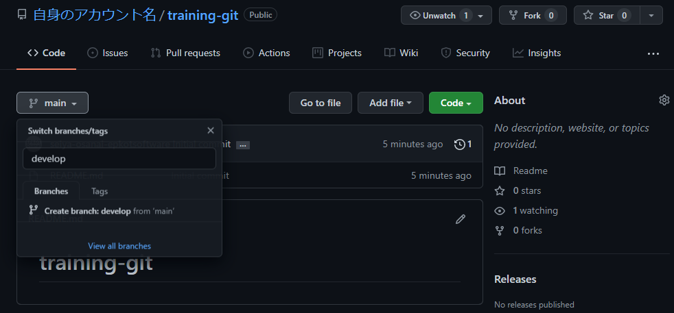

#### ブランチ設定

- リポジトリのメインページに移動
- 「`Settings`」タブをクリック
- 「`Branches`」をクリック
- Default branch ～ デフォルトブランチをdevelopに変更
  - 切り替えアイコンをクリック  
    
  - 「`develop`」を選択して、「`Update`」ボタンをクリック
  - 「`I understand, update the default branch.`」ボタンをクリック
- Branch protection rules ～ ブランチ保護ルール追加
  - 「`Add rule`」ボタンをクリック
    - Branch name pattern: `*[main|develop]*` （mainとdevelopに適用）
    - 以下をチェック
      - 「`Require a pull request before merging`」
        - ※ サブ項目のチェックは外す
      - ~~「`Include administrators`」~~  2022/09現在項目がなくなっており、代わりの項目が見つからないためそのまま進めてください。
  - 「`Create`」ボタンをクリック

※ 今回は、学習のための保護設定にしてあります。  
　学習外にはなりますが、その他のブランチルールについては公式を参照してください。  
　<https://docs.github.com/ja/repositories/configuring-branches-and-merges-in-your-repository/defining-the-mergeability-of-pull-requests/managing-a-branch-protection-rule>

#### タグ作成

今回は不要ですが、開発準備が完了した時点（Laravelだとインストール直後のソースコード等）でタグの作成を行います。  
タグに関しては、管理者が行うことが多いので学習外とし詳細説明を割愛します。  
初回だと「`v0.1`」、リリース時は「`v1.0`」のようなタグが多いでしょうか。  
コマンドでつける場合、「`git tag`」コマンドで行います。  

- GitHub Managing releases in a repository
  - <https://docs.github.com/ja/repositories/releasing-projects-on-github/managing-releases-in-a-repository>
  - 本番リリースしないタグについては「This is a pre-release」にチェックをしましょう。
- Laravel(GitHub)
  - Laravelだと「`v8.6.9`」のようにタグをつけています。
  - <https://github.com/laravel/laravel/tags>
  - タグをつけることで、2つのタグを指定して変更点を確認することが容易に出来ます。
    - <https://github.com/laravel/laravel/compare/v8.6.8...v8.6.9>

## リモートリポジトリ複製

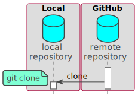
[PlantUML](https://www.plantuml.com/plantuml/umla/PSyn3i8m38NXtQTuPES27L0t63W2YzEwD98ReyIjuFO4bWgnUFZbpvBxwbnyNPGEFiiYs58id9tcD0ecCu_s96e3uMe3Qo1WPEV8LH3qaswvoCDgSYkl0AvGaZnYX-VabpN-oYABkVnHsoaFdZPsQSrmF46xGIqBvUQWCdc7Ut9yuxwirBSBxQ4t)  

リモートリポジトリ（GitHub上のリポジトリ）をローカルに複製します。  

### ローカルディレクトリ準備

複製先を用意します。  
実務でも複数リポジトリ（複数プロジェクト）を扱う事は、よくあるので  
混同しないよう、リポジトリ毎にディレクトリを分けるようにしましょう。  
`training-git`ディレクトリは、複製時に作られるため  
現時点では不要です。

- [PlantUML](https://www.plantuml.com/plantuml/umla/VP7DIiD04CVlynG1Bp5GzA2NMAIer9ll4CnQbhRPibq_H0IxMsqX1psKYeU2AAZuKGyYQ2BwBavCw5ku9Zcc_fdZZvdVyA-qXSD5atfkqsc1eA9135HFg3vGFg3IqqDvZUeHvJEgFghx-DQF-sVHfm_bjjXla6Nmc4kC0p2C5MUpNkDistDNMODnOwPQhIuipiCXSCR4nbHiBOt6odFvIh3i6XLWHc4OTqzdby2oRDAgCz5cMsBNuGJCvBMRl0zGNls9oXjKBzel9IrRS8TwrAjfwd8GVOsrDgeHohViXPnooKvfJmVCdvFZYRgR3Fta8YXYRQO39dP6s1b7uR3uwlTvBnim2vVajuxyA0Z-zowbpwzJCKs_GdHXMMc_)  
  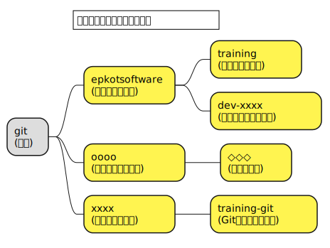  

### URL取得

- 複製する方法はいくつかありますが、今回はHTTPSで行います。
- リポジトリのメインページに移動
- 「`Code`」をクリックし、「`HTTPS`」タブに記載されているURLをコピー  
    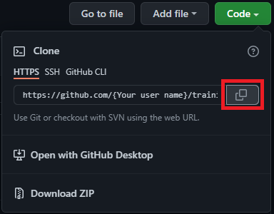
- このURLを `git clone` で使用します。

### git clone

「`Git Bash`」等のターミナルで、任意の場所に
「`git clone "★URL"`」を実行しましょう（上記の例の場合、個人アカウントディレクトリで実行）。  
URLはGitHub上で取得したものを使用します。  

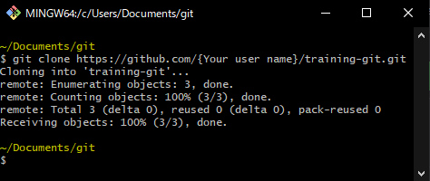  

VSCodeで出来あがった「`training_git`」フォルダを開きましょう。  
ターミナルは、Windowsであれば「`Git Bash`」を選択してください。  
「`Git Graph`」は任意ですが表示方法は以下になります。  

  

## Git学習シナリオ

現場のGit運用については「git flow」や「github flow」をベースにすることが多いかと思います。  
今回は「git flow」を簡単にしたものを想定して実際にGit操作していきましょう。  

### シナリオ

以下はプロジェクト開始～リリースまでのブランチの流れを表しています。  
開発者はあなたを含めて2名で、あなたはA機能を担当  
もう1名はB機能を担当します。

#### 簡易図

[Mermaid](https://mermaid.live/edit#pako:eNqFkMuKAjEQRX8l1GoEcXSbnSLMB8w2m-qkOh0mqTSxIor475NmVNR57Yr7OBT3BDY7Ag0-yFvBcTBsc0pBVHDaQOAgAaP60gwoQd_k_XKxMmC4K8h2UI72FPNo-Kb0hFILveITLo2RErGsp_a9I7STtXrpqu_DYTa5zR_IfuQqf_C7X_ibn_ibf_mJiqd7-KOA35nbS_URmDDwtXyBX5dbLZZTGObQ7JZzbfuTYaUab2i_G9DtdNRjjTIlzy2KVfL7kS1oKZXmUEeHQtuAvmAC3WPc0fkTGJKl_Q)  
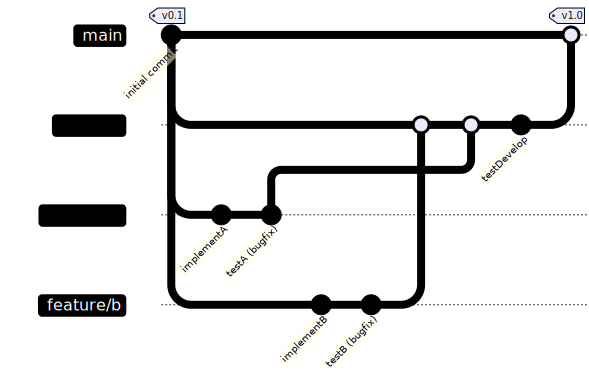  

#### 詳細

[PlantUML](https://www.plantuml.com/plantuml/umla/VP3DJiCm3CVlUGhJdHdRjGUq0-A6X10lu2nEQorEfjOjxErPb4hfOEAIoF-FdomVHiL19mdcGNiIWfdjW55Dpux0fwGsVHjpVQ1v9THfeCO0K5JM2pI-I4_O08xW4JPzqZF7qvsCBHbRCnGTLFmBpHJIUOrtYvIB3ZPT2kvNwGqvhXkIvnmNs0JkUXrF5nicgZKyAi-e16847fz1MewiZ06EIOJLn7GrXznjFx5hOTvjzoNgQjaPbnMFRQGlo2SxzjNrQ3mkFh2S0mb5NMbAeou4UvzWZRUBNmbLAuGoklRz8_z2GqV6qGq4_qzWsSAjLvARj1G91Wg48_qzptwxCmUARfBm0m00)  
  

|  | Mainへのマージ | Developへのマージ | push | 概要 |
| :---: | :---: | :---: | :---: | --- |
| Main | - | △ | × | Production branch<br>本番リリース用ブランチ<br>他のブランチへのマージは、障害があった場合を除いて行われません。 |
| Develop | PRによるマージ | - | × | Development branch<br>開発ブランチ |
| Feature | × | PRによるマージ | 〇 | 開発ブランチ(機能・課題毎に分ける) |

## featureブランチの作成

A機能の実装を開始するため「Feature」ブランチを、リモートリポジトリの「Develop」ブランチから作成します。  


[PlantUML](https://www.plantuml.com/plantuml/umla/NOyxRiD030Lxdk95gWttBW8NGReSWXAvMaBxCIHAYM-VB0n4XXi277AAkQxEYsyvqPj7pOhTXeMBKpHHX5fzg3z4VmFTfx9lYtO4Q77pExhmG6Vkm2i2eu_LRrPcqY8ur0_TDTNRiogwDz8yGJ_L92_E5rjv5dBRstj6dsoAlixt8MrwQ3owxUoAJ1cdTyX1XAIHm9UYtsY9OpokWQbKLoGDVi5aZZ7gEDVDSHhm7ucws6JbB8yQkcgHBQTV)  

作成する前に「`git fetch`」コマンドにより、ローカルリポジトリを最新の状態にします。  
チームで作業している場合、自分が作業している間に変更が加えられている可能性があるためです。

```bash
# リモートリポジトリの最新をローカルリポジトリに取り込む
git fetch
# 「develop」リモートブランチから「feature/a」ブランチを作成
git checkout -b feature/a origin/develop
```

  

### originとは

リモートリポジトリの名前（デフォルト名）と覚えておきましょう。  
「`git clone`」コマンドを実行すると、デフォルトの「`origin`」が設定されます。  

詳細については割愛しますが、先ほどの「`origin/{ブランチ名}`」はリモートトラッキングブランチ(追跡ブランチ)と言って、厳密にはリモートブランチではありません  
「`git fetch`」を実行することで「`origin/{ブランチ名}`」はリモートブランチと同じ状態になると覚えてください。

## A機能

A機能の実装・テストに入りましょう。

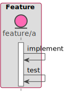
[PlantUML](https://www.plantuml.com/plantuml/umla/JOunhi9034HxdsB-_XhHKw1KtCCXZcAHtOrs9n7S7WiQ6ijwzjFCqAcDUrxbZujbm-5Zqq9PV3BCjNAiJv4OI3TJxisI05ReV27DNtJM1EsO5VzBvURb8LOcV5Izqm-bnLNYuNIDvGBFsnfnXJ-CrYb3Y57d3G00)  

### A機能実装

まずは、A機能を実装します。  
A機能はWEBページとしますので「`htdocs/a.html`」を適当に追加しましょう。

  

### A機能テスト

A機能のテストをします。  
テストと言ってもウォーターフォールで言う単体テストではなく、実装フェーズ内のセルフチェックです。  
今回はシンプルな機能なので割愛しますが  
実際は以下のような確認を行います。

- 表示内容が仕様通りになっているか
- 実装した機能が正常に動作するか
- UnitTestが通るか
  - UnitTestについては以下を参照
    - PHPUnit マニュアル
      - <https://phpunit.readthedocs.io/ja/latest/>
    - Laravel 8.x Testing
      - <https://readouble.com/laravel/8.x/ja/testing.html>

### A機能コミット

動作に問題なければローカルブランチにコミットします。  
コミットに関しては変更内容を確認しながら行うため  
コマンドラインでやることは少ないので、VSCodeでの方法をご紹介します。  
コマンドラインで行う方法も覚えておきましょう。  

- VSCodeの画面左にある「ソース管理」アイコンを選択
- コミット対象のファイルを選択し、「+（変更をステージ）」アイコンをクリックし、「ステージされている変更」に入れる。
- コミットメッセージを入力
- 「✔（コミット）」アイコンをクリックし、「ステージされている変更」に入っているファイルをコミットする。
  - コミットすると同期に関するボタンが出てきますが無視してください。

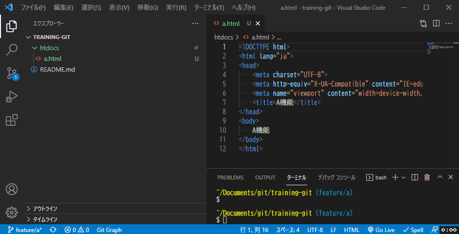  

```bash
# VSCodeの「変更をステージ」と同様
git add htdocs/a.html
# VSCodeの「ステージされている変更」をコミット
git commit -m ":sparkles: htdocs/a.html"
```

※ コミットコメントの「`:sparkles:`」は絵文字を表します。  
※ この時点ではGitHubには反映されません。  

## B機能

ここで一旦、B機能（Bさん）の作業を行いましょう。  
A機能と平行で進めていると仮定します。  

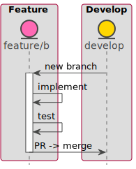
[PlantUML](https://www.plantuml.com/plantuml/umla/JO-zJiKm38LtFuN9dH7x7L07n8nuWwG-QIBoKwLkWRSd5Rrg5rl-hE_87XQrJTUSw4a3CdYBhjcY5AA0VQtgwWzHBspUONLjCCICeb5_sVX_zE8CsuMzurkeEiVoHIZ2f_g63QdELrKEj8l2jwacEINXvzSUTo_uvlsUCP0TDMvMqJ5vT-mvvZaXe-Y5APR7AFUFpxrdj0aak8OCAD8V_mC0)  

### B機能実装

まずは、GitHubでFeatureブランチを作成します。

- リポジトリのメインページに移動
- 「`develop`」ブランチを選択し、ブランチ名に「`feature/b`」を入力し、「`Create branch: feature/b from 'develop'`」をクリック

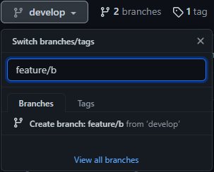  

次にB機能を実装します。

- 「`feature/b`」ブランチを選択し、「`Create new file`」をクリック  
    
- ファイル名に「`htdocs/b.html`」を入力  
    
- ファイル内容に以下を入力

```html
<!DOCTYPE html>
<html lang="ja">
<head>
    <meta charset="UTF-8">
    <meta http-equiv="X-UA-Compatible" content="IE=edge">
    <meta name="viewport" content="width=device-width, initial-scale=1.0">
    <title>B機能</title>
</head>
<body>
    B機能
</body>
</html>
```

- 任意のコミットメッセージを入力
- 「`Commit new file`」ボタンで「`feature/b`」ブランチにコミット


上記の要領で「`htdocs/index.html`」もコミットしてください。  
ファイル内容は以下にしてください。

```html
<!DOCTYPE html>
<html lang="ja">
<head>
    <meta charset="UTF-8">
    <meta http-equiv="X-UA-Compatible" content="IE=edge">
    <meta name="viewport" content="width=device-width, initial-scale=1.0">
    <title>Home</title>
</head>
<body>
    <nav>
        <ul>
            <li><a href="b.html">B画面</a></li>
        </ul>
    </nav>
</body>
</html>
```

### B機能テスト

テストは割愛します。

### B機能PR作成

以下の手順でPRを作成します。

- リポジトリのメインページに移動
- 「`Pull requests`」タブをクリック
- 「`New pull request`」ボタンをクリック
- ブランチを以下のように選択し、「`Create pull request`」をクリック
  - 「`base: develop`」 ← 「`compare: feature/b`」  
    
- 「`Open a pull request`」画面で「`Create pull request`」をクリック

### B機能PRマージ

実際はレビューが通ったらマージを行いますが  
今回はそのままマージします。

- 「`Merge pull request`」ボタンをクリック
- 「`Confirm merge`」ボタンをクリックし、マージを行う。
- 「`Delete branch`」ボタンをクリックし、Featureブランチを削除

以上の手順で「`develop`」ブランチにB機能が実装されました。  
A機能の作業に戻りましょう。

## develop取り込み

「`feature/a`」ブランチに「`develop`」ブランチの取り込みを行いましょう。  


[PlantUML](https://www.plantuml.com/plantuml/umla/JS-nZeCm3CRntK_X2_FfzXigXgfFmMBgBn0LOXGCQj--KHdeObj_wJUuNLsAR_D4FpvY1k-fBvATngJWQEQzFOdgu723-5OGY1dPaxyun2FzIM1PEGete_cIyeEGbKzwnOx9bc-gH_f0vMQmIKyaTq-xE5ZFCmef_rxg_fzH1dJPIfSBUbb1RQNrYpS0)  

A機能のpush前に、トップ画面の「`htdocs/index.html`」にA画面へのリンクを追加することになりました。  
ですが「`feature/a`」ブランチにはトップ画面がないため、「`develop`」ブランチの取り込みを行います。  

まずは「`git fetch`」を実行し、Graphを見てみましょう。

```bash
git fetch
```

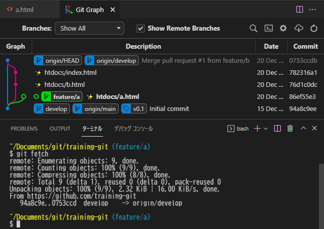  

上記のGraphの通り、「`develop`」ブランチから「`feature/a`」ブランチを作成した後に  
「`develop`」ブランチに2つのコミットが入っていることがわかります（マージコミットを除く）。  

「`develop`」を取り込む方法はいくつかあります。

1. マージする
1. リベースする

やり方は以下を見ていきましょう。  
スクリーンショットではリベースでの手順で行っていきます。

### マージする場合

シンプルな方法で「`develop`」を「`feature/a`」ブランチにマージするだけです。  

```bash
# 現在のブランチを確認（feature/a）
git branch --show-current
# 現在のブランチに「develop」をマージ
git merge origin/develop
```

### リベースする場合

最新の「`develop`」をベースにコミットを再適用します。  

push前であれば、こちらの方法が使えます。  
既にpushしていた場合、コンフリクト(競合)しそうな場合  
リベースに関してよくわからない場合はマージを選択することをおすすめします。

```bash
# 現在のブランチを確認（feature/a）
git branch --show-current
# 現在のブランチを最新「develop」の上にリベース
git pull --rebase origin develop
```

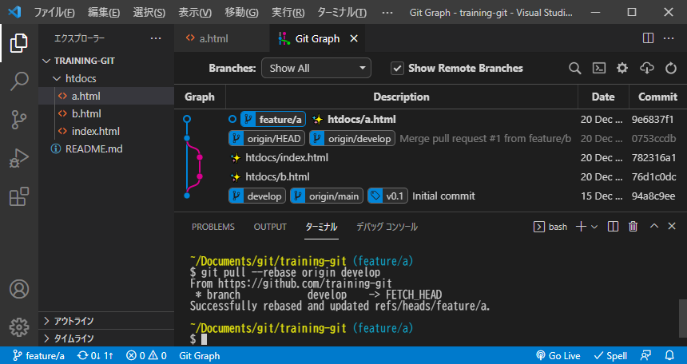  

上記のGraphで分かる通り、最新の「`develop`」ブランチから「`feature/a`」ブランチを作成し、「`htdocs/a.html`」がコミットされたことになっています。  
リベースを使うメリットとしては、マージコミットが減って履歴が綺麗になることです。  

### git pullとは

「git pull」は「git fetch」+「git merge」を一緒にしたコマンドです。  
「git pull」に「--rebase」オプションをつけると「git fetch」+「git rebase」を行います。  

## A機能追加実装

「`htdocs/index.html`」にリンクを追加しましょう。  
ソース管理の対象ファイルを選択すると、変更点を確認することが出来ます。  

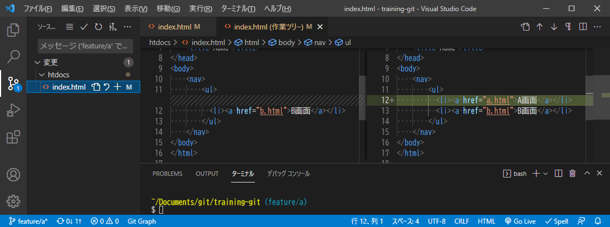  

コマンドで行う場合は「`git diff`」でも可能です。  
表示量が多い場合、抜けられなくなるかと思いますが  
「q」を入力することで終了させることが出来ます。  

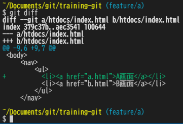  

「`git diff`」の詳細説明については割愛します。  
以下が参考になります。  

- git diff を徹底攻略！よく使うオプションまとめ
  - <https://www-creators.com/archives/755>

変更点について問題なければコミットしましょう。

## A機能push

A機能の実装(テスト)が終わったら、「`feature/a`」ブランチをGitHub上に反映させるため、pushしましょう。

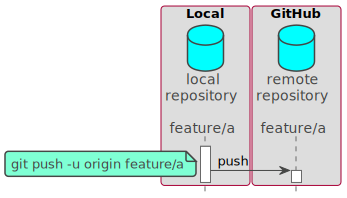
[PlantUML](https://www.plantuml.com/plantuml/umla/VSynRe0m38NXtQTupOwwCrHixT0Zi3XWm5A8KUAWzlQ5fQXB5m-_v4zwGtKktlP4Bxx9BZWr5ivEcyw2nSoZVH5T1-7J9aw1W9cT8rT1I7SQSv73ghgLxp6FUH7sLkIL0xWYaUGPZ_Ak_j7YNwR8RYx_E_OuFBcUx8942TqRh3zQtIZRdMJn7giwxeQkmOgkcl6hFUz6msLUuty0)  

以下、コマンドを実行することで、GitHubに反映されます。

```bash
# 現在のブランチを確認（feature/a）
git branch --show-current
# 現在のブランチをリモートにアップ
git push -u origin feature/a
```

「`-u`」オプションは「`--set-upstream`」の省略形で  
簡単に言うと、リモートブランチへの参照を設定する事が出来て  
以降、「`feature/a`」ブランチは引数なしで「`git push`」、「`git pull`」等を行うことが出来るようになります。  

## A機能PR→マージ

「`feature/a`」ブランチを「`develop`」にマージするPRを作成し、マージをします。

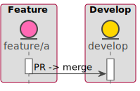
[PlantUML](https://www.plantuml.com/plantuml/umla/JS-n3e9030RWlKzHZzcuEnW6usnyWsB_WujmHuv2zEs5Q78iRVEdt_3NaqcsUUZfO1q6y1AQBD6e2mhsALcJtaJhO7U3s9pXY1dHWdtO-Lzq4iSoiHUkkcHZY2z2L2xqYWLz6lTK_z46bQiszLgGF2qiOc0jfnVomiSBw_d-sFQ0t88K-uyQKTSsNm00)  

### PR作成

GitHub上の操作になりますが「`develop`」ブランチへのマージPRを作成します。  

- リポジトリのメインページに移動
- 「`Compare & pull request`」をクリック  
  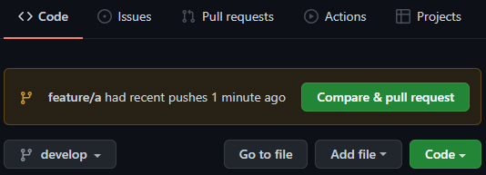  

- 以下を入力（現場に入った場合はルールに従うこと）
  - ブランチ: `base: develop ← compare: feature/a`
  - Title: 任意
  - Comment: 任意
- コミット・変更点の差分について想定通りかを確認
- 「`Create pull request`」ボタンをクリック

以上でPR作成できました。  
実際には他のメンバーにレビューを依頼します。  

### PRマージ

実際はレビューが通ったら(Approveされたら)マージを行いますが  
今回はそのままマージします。

- 「`Merge pull request`」ボタンをクリック
- 「`Confirm merge`」ボタンをクリックし、マージを行う。
- 「`Delete branch`」ボタンをクリックし、Featureブランチを削除

以上の手順で「`develop`」ブランチにA機能が実装されました。  

## ブランチ整理

「`feature/a`」ブランチが「`develop`」ブランチにマージされ  
「`feature/a`」ブランチが削除されました。  
ですが、ローカルブランチはまだ存在しています。  
ブランチを綺麗にしていきましょう。  

まずは現在のブランチを「`develop`」に切り替えます。  

```bash
# developブランチに切り替え
git checkout develop
```

次に不要となったブランチを削除していきます。  

```bash
# 現在のブランチを確認（develop）
git branch --show-current
# developを最新化しつつ、不要となった origin/feature/a を削除
git pull -p
# ローカルの feature/a を削除
git branch -d feature/a
# ブランチ確認（Featureブランチが消えた）
git branch -a
```

最終的なブランチの状態は以下になります（リベースを選択した場合）。

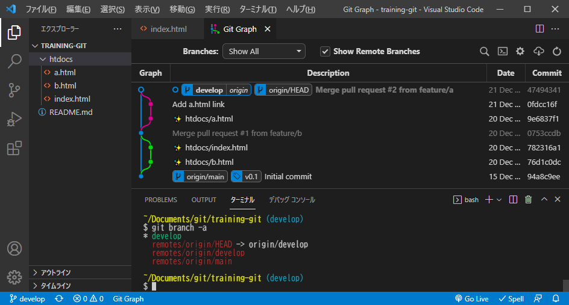

### 一括でローカルブランチを削除する方法

使う場合は**自己責任**で  

Linuxコマンドの xargs を使うとまとめて削除が可能です（Git BashのインストールでWindowsでも使用可能）。  
オプションを「`-D`」にするとマージ前のブランチも対象になります。  

```bash
git checkout develop
# 現在のブランチ以外のローカルブランチを削除
git branch | grep "^ " | xargs git branch -D
```

エラーが出ても気にならなければ、以下でも可能。

```bash
git checkout develop
# 現在のブランチも対象になるため、必ずエラーが発生
git branch | xargs git branch -D
```

上記で「`main`」等も対象になりますが  
リモートブランチが削除されるわけではないので  
「`git checkout main`」を実行すると再生成されます。  

## リリースまで

実装完了後は「`develop`」ブランチで単体テスト・結合テスト・システムテスト等を行い  
「`main`」ブランチへのPR→マージを行った後にリリースします。  
今回は、Git研修のため割愛します。  

## その他

### コンフリクト

今回のシナリオではやりませんでしたが  
複数人が同じファイルの同じ箇所を修正することにより  
コンフリクト（競合）が発生することがあります。  

コンフリクトの解消方法については動画・サイトの記事を参考にしてください。  
GitHubで解消することも出来ます。

- `【Git入門】Git + Github使い方入門講座🐒Gitの仕組みや使い方を完全解説！パーフェクトGit入門！ 〜 コンフリクト(編集の競合)`
  - <https://www.youtube.com/watch?v=LDOR5HfI_sQ&t=2568s>
- GitHub でのマージ コンフリクトを解決する
  - <https://docs.github.com/ja/pull-requests/collaborating-with-pull-requests/addressing-merge-conflicts/resolving-a-merge-conflict-on-github>
- コマンド ラインを使用してマージ コンフリクトを解決する
  - <https://docs.github.com/ja/pull-requests/collaborating-with-pull-requests/addressing-merge-conflicts/resolving-a-merge-conflict-using-the-command-line>

## おわり

以上でGit研修は終わりです。  
追加機能やテストの際に発生したバグ改修については  
再度「`develop`」からブランチを切って行います。  
ここまでのシナリオについてはあくまでも1例に過ぎません。  

実際「git flow」で運用する現場もあり、それをカスタマイズし、更に複雑化している現場もありました。  
逆に「github flow」のようなシンプルな運用もあるかもしれません。  
ここまで実際にやってみたことで、冒頭での動画を  
再度見ると理解が深まるかと思います。

## Gitコマンド

それぞれ使い方についてはHELPを参照したり、WEBで検索してください。

| コマンド | 備考 |
| --- | --- |
| `git clone "★URL"` | リモートリポジトリをローカルに複製 |
| `git checkout "★ブランチ名"` | ブランチ切り替え |
| `git checkout -b "★ブランチ名"` | 新しいブランチを生成してチェックアウト |
| `git push -u origin "★ブランチ名"` | 初回push時に使用（`-u` は `--set-upstream` の省略） |
| `git push` |  |
| `git pull` | 「`git fetch`」+「`git merge`」 |
| `git pull --rebase origin "★ブランチ名"` | 「`git fetch`」+「`git rebase`」 |
| `git fetch -p` | リモートリポジトリで削除されたブランチをローカルに反映 |
| `git status` |  |
| `git merge "★ブランチ名"` | 指定ブランチを現在ブランチにマージする。<br>基本マージはPRで行うので、このコマンドを使う際は注意<br>主に派生元のブランチを取り込む場合に使用する。 |
| `git cherry-pick "★コミットID"` | 別ブランチのコミットを適用するのに使用<br>コンフィグ、定数クラス等軽いコミットの取り込みに使う |
| `git log -n5 --oneline` | コミットログを1コミット1行で、最新の5件表示する<br>1番左に出ている7桁の文字列はコミットIDを短くしたもの |
| `git diff "★コミットID" "★コミットID"` | 指定したコミットの差分を表示する<br>表示内容が多くなるため、中断する場合は「q」を押すと抜けられる。 |
| `git commit --allow-empty -m "★コミットメッセージ"` | 空コミットが可能、ブランチやプロジェクトの開始を表すコミットで使うことがある。<br>使うかは現場次第 |
| `git branch -D "★ブランチ名"` | ローカルブランチ削除（`-D` は `--delete –force` の省略） |
| `git stash` | 操作が複雑なので以下を参照<br><https://qiita.com/chihiro/items/f373873d5c2dfbd03250> |

## 参考

- サイト
  - Git公式
    - <https://git-scm.com/book/ja/>
  - Git チュートリアルとトレーニング
    - <https://www.atlassian.com/ja/git/tutorials>
  - サル先生のGit入門
    - <https://backlog.com/ja/git-tutorial/>
- git help
  - `git help` コマンドでブラウザでヘルプを見れます。
    - 例: `git help checkout`
