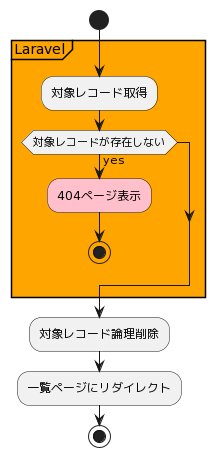

# 株式会社エプコットソフトウェア ～ Laravel CRUD 詳細設計（職業 削除）

## 研修コメント

学習のためLaravel公式サイトへのリンクを追加しています。  

## 概要

jobs テーブルの対象レコードを論理削除する。

| コード | 機能名 |
| --- | --- |
| admin.jobs.destroy | 職業 削除 |

## パラメータ

| パラメータ名 | 説明 | 備考 |
| --- | --- | --- |
| `{job}` | `jobs.id` | URL記載 |
| `_method` | `DELETE` | Laravel 疑似フォームメソッド (`@method('DELETE')`) |
| `_token` | トークン | Laravel CSRFトークン (`@csrf`) |

- `Laravel 9.x ルーティング ～ 疑似フォームメソッド`
  - <https://readouble.com/laravel/9.x/ja/routing.html#form-method-spoofing>
- `Laravel 9.x CSRF保護`
  - <https://readouble.com/laravel/9.x/ja/csrf.html>

## フローチャート

- [PlantUML](https://www.plantuml.com/plantuml/umla/SoWkIImgAStDuG8pkBWAW6HcIMP-de9oVb5YNdggWazYKM9PQev2DPU2WjNJzVjUR5puk7dDuwRDZvltF6xkVDe_xUc-wTPSGDdCD0KDJ0MF6tkUhftnTCwAnutJ7pUkUjpOegbGaf6Qfw1HcLgioQK01Ce5cNdPLYO69e-RPu4qDUruiN35yoMxhC6onINv1K16QbvAPXfNBHSN5aUyM3tj-OIsfvrTBsSkiUQoUhAZuSMovN337ZUkVjoywd5pm-Ec9M1TwnytTm1T33RO0MWkqFy0)  
    

## 対象レコード取得

Laravel機能を利用して行う。

- Laravel 9.x コントローラ ～ リソースコントローラ
  - <https://readouble.com/laravel/9.x/ja/controllers.html#resource-controllers>

---

条件(AND)

| 条件 | 備考 |
| --- | --- |
| jobs.id = パラメータ.`{job}` |  |
| jobs.deleted_at = NULL |  |

取得カラム

| 項目 | 備考 |
| --- | --- |
| jobs.* |  |

```sql
-- SQL例: id=100 の場合
select * from `jobs` where `id` = '100' and `deleted_at` is null
```

## 対象レコード論理削除

Laravel機能を利用して行う。

- Laravel 9.x Eloquentの準備 ～ ソフトデリート
  - <https://readouble.com/laravel/9.x/ja/eloquent.html#soft-deleting>

条件(AND)

| 条件 | 備考 |
| --- | --- |
| jobs.id = URL記載ID(`{job}`) |  |

更新カラム

| 項目 | 値 | 備考 |
| --- | --- | --- |
| jobs.deleted_at | 現在日時 |  |
| jobs.updated_at | 現在日時 |  |

```sql
-- SQL例: id=100 現在日時=2022-07-20 23:58:59 の場合
update `jobs` set `deleted_at` = '2022-07-20 23:58:59', `updated_at` = '2022-07-20 23:58:59' where `id` = 100
```
