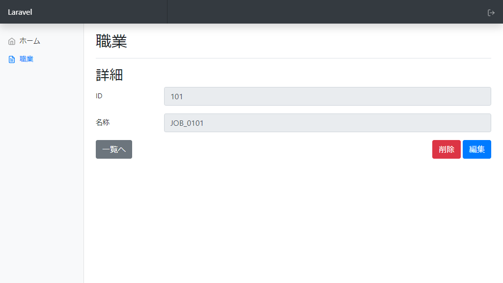

# 株式会社エプコットソフトウェア ～ Laravel CRUD 詳細設計（職業 詳細画面）

## 研修コメント

学習のためLaravel公式サイトへのリンクを追加しています。  

## 概要

| コード | 画面名 |
| --- | --- |
| admin.jobs.show | 職業 詳細画面 |

## パラメータ

| パラメータ名 | 説明 | 備考 |
| --- | --- | --- |
| `{job}` | `jobs.id` | URL記載 |

## 画面

  

- その他レイアウトについて [画面レイアウト(詳細画面)](./../../screens/index.md#詳細画面) 参照

## コントロール定義

| No. | 名称 | 表示 | 種類 | 入<br>力 | 必<br>須 | 桁<br>数 | 書式 | 備考 |
| :---: | --- | --- | :---: | :---: | :---: | :---: | :---: | --- |
| 1 | タイトル | `職業` | label | - | - | - | - | h1 |
| 2 | サブタイトル | `詳細` | label | - | - | - | - | h2 |
| 3 | IDラベル | `ID` | label | - | - | - | - |  |
| 4 | ID入力欄 | DB値: jobs.id | textbox | - | - | - | text |  |
| 5 | 名称ラベル | `名称` | label | - | - | - | - |  |
| 7 | 名称入力欄 | DB値: jobs.name | textbox | - | - | - | text |  |
| 8 | 一覧へボタン | `一覧へ` | button | - | - | - | - |  |
| 9 | 削除ボタン | `削除` | button | - | - | - | - |  |
| 10 | 編集ボタン | `編集` | button | - | - | - | - |  |

## フローチャート

- [PlantUML](https://www.plantuml.com/plantuml/umla/SoWkIImgAStDuG8pkBWAW6HcIMP-de9oVb5YNdggWazYKM9PQev2DPU2WjNJzVjUR5puk7dDuwRDZvltF6xkVDe_xUc-wTPSGDdCD0KDJ0MF6tkUhftnTCwAnutJ7pUkUjpOegbGaf6Qfw1HcLgioQK01Ce5cNdPLYO69e-RPu4qDUruiN35yoMxhC6onINv1K16QbvAPXfNBHUNrTEEkS_cp8SfuGBBEm2bWTu00000)  
    

## 対象レコード取得

Laravel機能を利用して行う。

条件(AND)

| 条件 | 備考 |
| --- | --- |
| jobs.id = パラメータ.`{job}` |  |
| jobs.deleted_at = NULL |  |

取得カラム

| 項目 | 備考 |
| --- | --- |
| jobs.* |  |

```sql
-- SQL例: id=100 の場合
select * from `jobs` where `id` = '100' and `deleted_at` is null
```

## 初期表示

- 対象レコードの情報を画面表示する。
