# Laravel CRUD 画面設計（職業）

## 概要

職業(jobs)テーブルの登録・表示・更新・削除を行う  
各画面の設計です。

## 画面遷移図

- [PlantUML](https://www.plantuml.com/plantuml/umla/TL91Im915Bw_Np7OBH0yxo4yHD1lY0xYZhYWkx8xKX91kH0KMHqYCkiYfIL4aeAHGJzcozqzzHTwpdDis2KFRtpVlFUzxtkpUKyKN56lLg1icPpnQaqqcCczeclLXENOWFU2i-XmCdjuPdkmo3DVRmTHhnzUJkExReOLF6RP9jy56OtPrJ3gdGV-RT3y3FoHGg_Fml7mv-DcSps9V5-qmlumXHwVnEtxFnerc-WpR3xM4uxBsSe6_dAvH8MchkXol00wZB0zZKzVqyJHqmWdQsrUsTc1UJ32oMFSELgs4FYlmCuO5KY6Uir4I0bK1TGe2t3NmdKQoGgQfqdXfYLW7eom-nuDMkcfXEkc7RjakLLOd0R9qXgtLhTPDhkclnt3bBQaSWIaMKQF53HV0dyG-3x-KIKLNX9Ojh02ojAIcGWnf-S26ObPBPXf_IfVMiOaQKPsqtA13WGa6-n3djicVjA_)  
  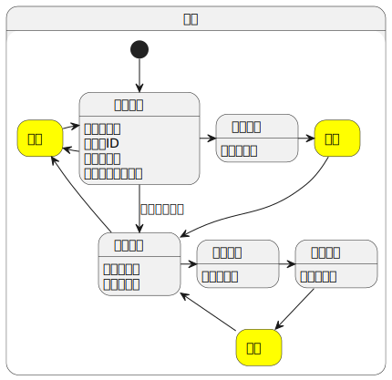  

## 画面レイアウト(一覧画面)

### 一覧画面

| コード | 画面名 |
| --- | --- |
| admin.jobs.index | 職業 一覧画面 |

初期表示

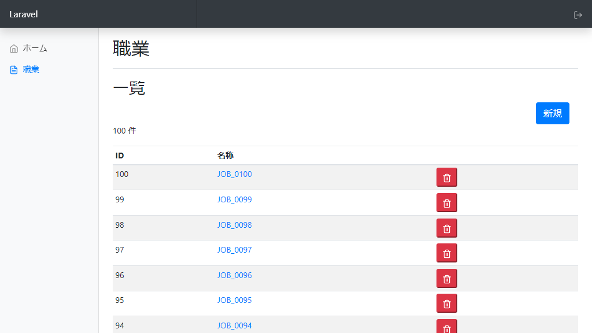  

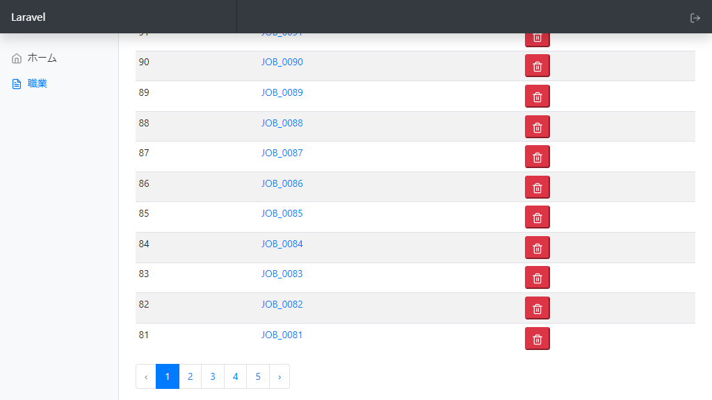  

---

削除ボタンクリック時

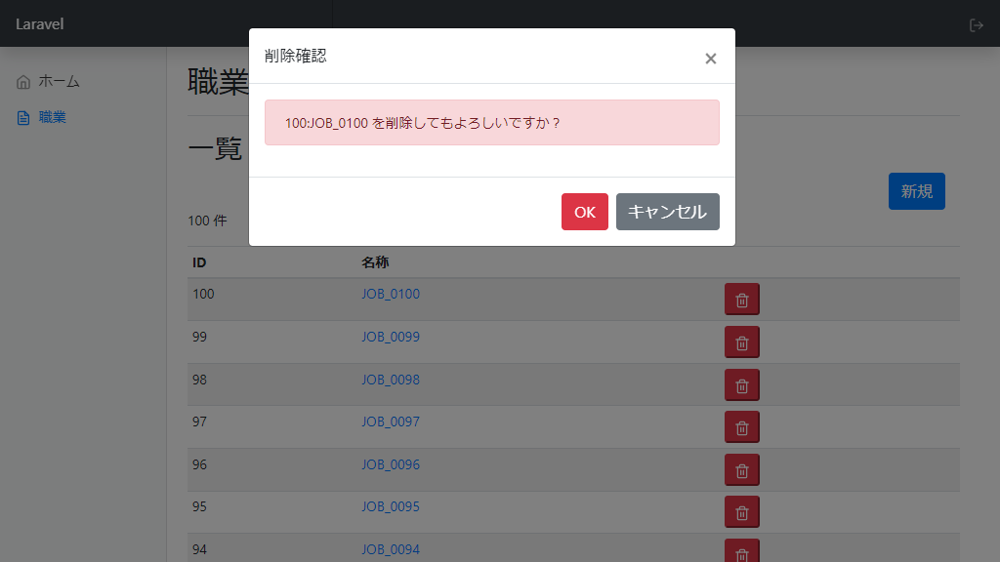  

---

#### 一覧画面 仕様

| 操作 | 動作 |
| --- | --- |
| 初期表示 | 対象テーブルレコードを全件表示する。 ペジネーションによるページ分割(20ページ)を行う |
| 新規ボタンクリック | [新規画面](#新規画面)に遷移する。 |
| 名称リンククリック | 対象レコードの[詳細画面](#詳細画面)に遷移する。 |
| 削除ボタンクリック | 対象レコードの削除確認ダイアログを表示する。 |
| 【削除確認ダイアログ】OKボタンクリック | 対象レコードの論理削除を行う。 |
| 【削除確認ダイアログ】キャンセルボタンクリック | ダイアログを閉じる。 |

※ 論理削除は、Laravelの[ソフトデリート](https://readouble.com/laravel/9.x/ja/eloquent.html#soft-deleting)を指します。

## 画面レイアウト(新規画面)

### 新規画面

| コード | 画面名 |
| --- | --- |
| admin.jobs.create | 職業 新規画面 |

初期表示

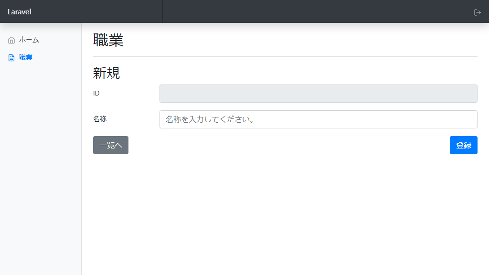  

---

バリデーションエラー

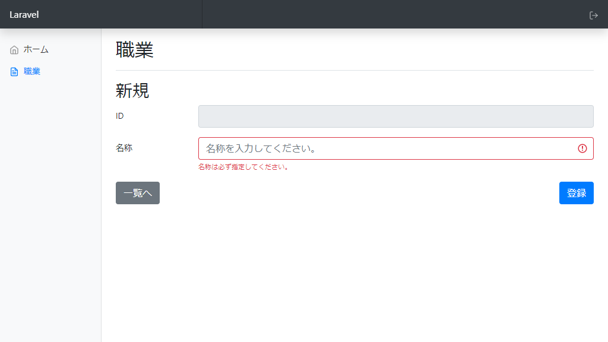  

---

#### 新規画面 仕様

| 操作 | 動作 |
| --- | --- |
| 初期表示 | イメージ通りに表示 |
| 一覧へボタンクリック | [一覧画面](#一覧画面)に遷移 |
| 登録ボタンクリック（正常） | レコード追加後、[詳細画面](#詳細画面)に遷移し、正常メッセージを表示する。 |
| 登録ボタンクリック（バリデーションエラー） | 対象項目下部にエラーメッセージを表示する。 |

## 画面レイアウト(詳細画面)

### 詳細画面

| コード | 画面名 |
| --- | --- |
| admin.jobs.show | 職業 詳細画面 |

初期表示

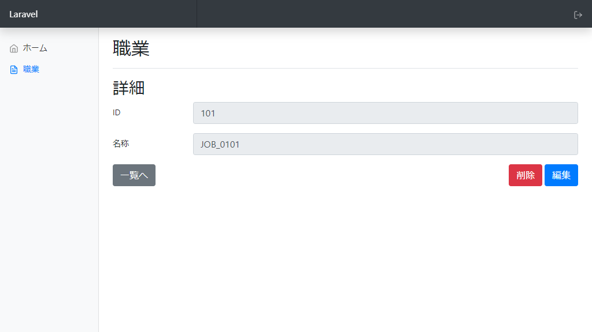  

---

登録完了時

  

---

編集完了時

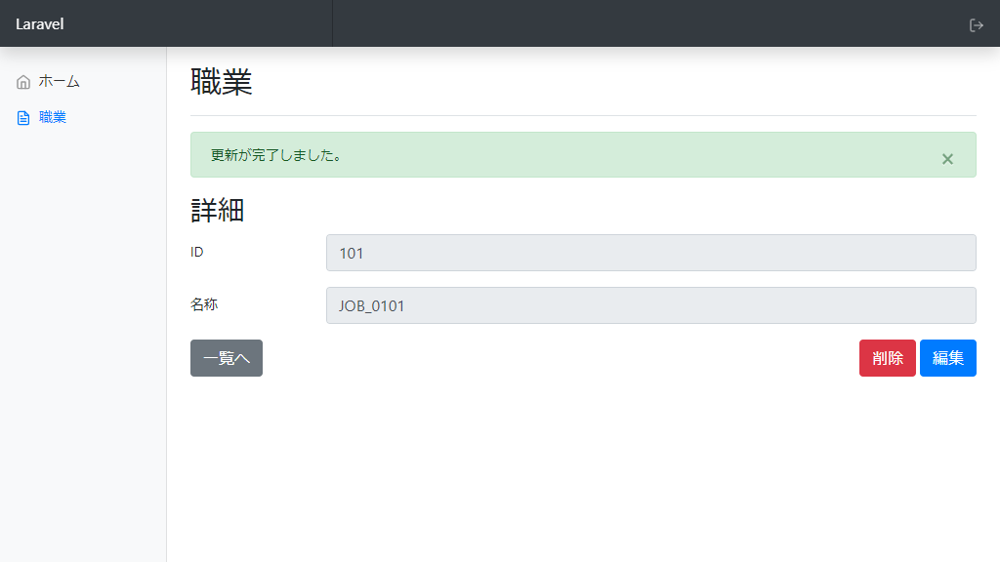  

---

削除ボタンクリック時

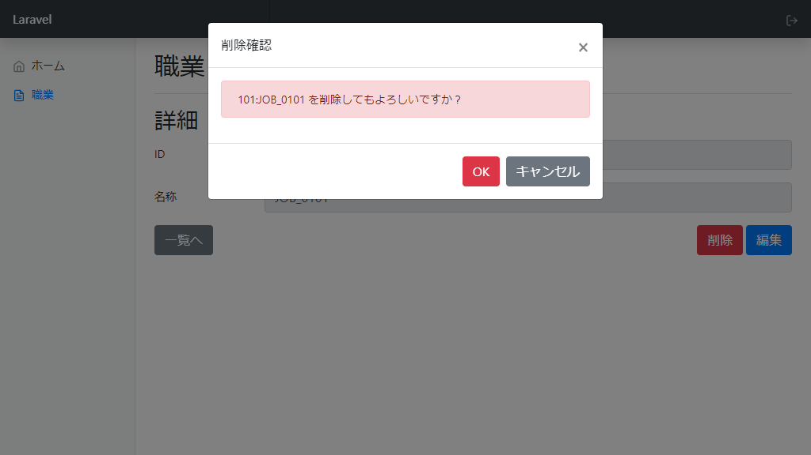  

---

#### 詳細画面 仕様

| 操作 | 動作 |
| --- | --- |
| 初期表示 | 対象テーブルレコードの情報を表示する。 登録・編集完了時に遷移してきた場合、メッセージも表示する。 |
| 一覧へボタンクリック | [一覧画面](#一覧画面)に遷移 |
| 編集ボタンクリック | 対象レコードの[編集画面](#編集画面)に遷移 |
| 削除ボタンクリック | [一覧画面](#一覧画面)と同じ仕様 |

## 画面レイアウト(編集画面)

### 編集画面

| コード | 画面名 |
| --- | --- |
| admin.jobs.edit | 職業 編集画面 |

初期表示

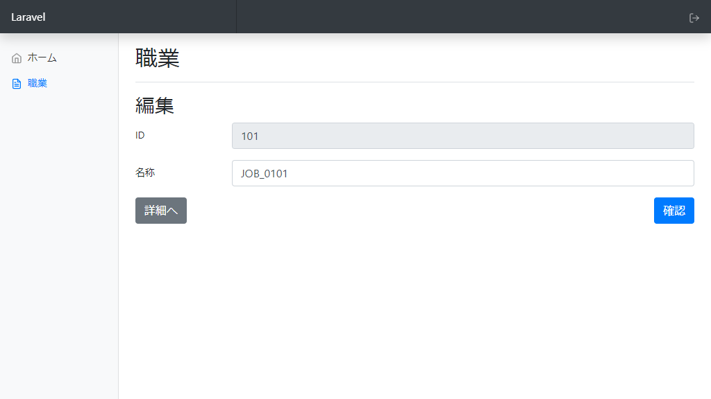  

---

バリデーションエラー

  

---

#### 編集画面 仕様

| 操作 | 動作 |
| --- | --- |
| 初期表示 | 対象テーブルレコードの情報を表示する。 |
| 詳細へボタンクリック | [詳細画面](#詳細画面)に遷移 |
| 確認ボタンクリック（正常） | [編集確認画面](#編集確認画面)に遷移 |
| 確認ボタンクリック（バリデーションエラー） | 対象項目下部にエラーメッセージを表示する。 |

## 画面レイアウト(編集確認画面)

### 編集確認画面

| コード | 画面名 |
| --- | --- |
| admin.jobs.confirm | 職業 編集確認画面 |

初期表示

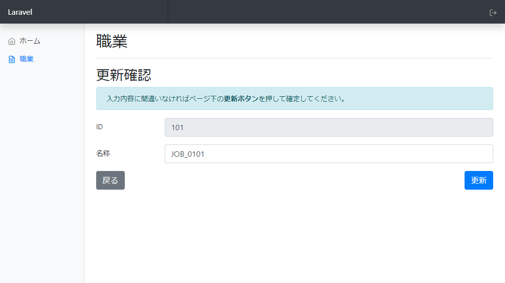  

---

#### 編集確認画面 仕様

| 操作 | 動作 |
| --- | --- |
| 初期表示 | 対象テーブルレコード・編集画面での入力情報を表示する。 |
| 戻るボタンクリック | [詳細画面](#詳細画面)に遷移 |
| 更新ボタンクリック | 対象レコード更新後、[詳細画面](#詳細画面)に遷移し、正常メッセージを表示する。 |
