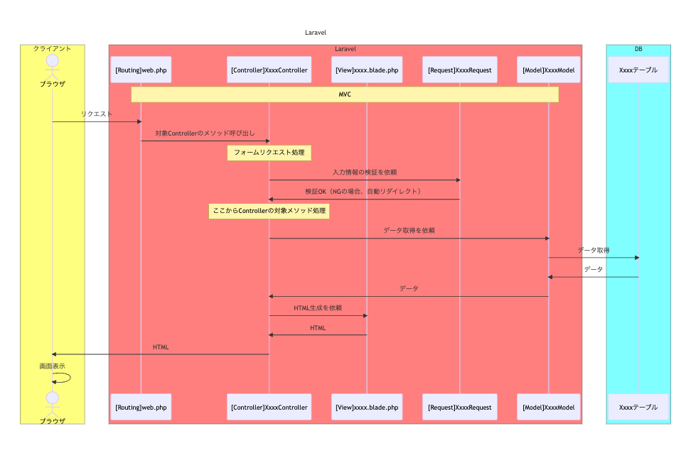

# Laravel CRUD

`TODO: 【作成中】この資料は作成中です。`  

実際にCRUDを作成していきましょう。
PHP・Laravelについては、ある程度の理解があることを前提に進めます。
特に名前空間に関しては、理解していないと正しく動作させることができませんので、
十分に学習しておくことをお勧めします。

## AI

わからない所は、AIに聞いてみましょう。

- [AI](./../../../ai/index.md)

## 環境

- PHP8以上
- Laravel9
- Bootstrap4
- jQuery

### 実行環境

以下のテンプレートリポジトリを使用することで、
Docker上で手軽にLaravel9の開発環境を構築することができます。
テンプレートから自身のリポジトリを作成してみましょう。
（ダウンロードしてGit管理外で、学習用の環境を作成することも可能です。）

- `Laravel9 テンプレートリポジトリ`
  - <https://github.com/epkotsoftware/template-laravel9-jp>

```txt
■注意点
　Git管理下のフォルダ内にクローンする場合を避けるよう、お気をつけください。
```

## 設計書

以下を参照してください。

- [Laravel CRUD 設計](./design/index.md)

## 各ファイルを生成

`jobs`テーブルに対応したModelクラス及び、関連クラスを生成します。  
今回は以下のコマンドで一括で生成します。

```bash
# コマンド
php artisan make:model Job --all
```

以下でも作成が可能です。

```bash
# コマンド
## Model・Factory・Migration・Seederを作成
php artisan make:model Job -mfs
## Controller・Requestを作成
php artisan make:controller JobController --model=Job -rR
```

`--all`オプションを使用してModelクラス及び関連クラスを作成した場合、  
「`app/Policies/JobPolicy.php`」も一緒に生成されますが  
今回は単純なCRUDの学習ということで、使用しないので削除しましょう。  
将来的に実務で使用する可能性があるため、必要に応じて公式ページの「認可」を学習することをお勧めします。  

- 参考:Eloquentの準備
  - <https://readouble.com/laravel/9.x/ja/eloquent.html>
- 参考:認可
  - <https://readouble.com/laravel/9.x/ja/authorization.html>

## Database

データベースの環境を作っていきます。  
先ほどのコマンド実行で、必要なファイルが既に出来ているので  
編集し、コマンドを実行して構築していきます。

| 作成するファイル | 説明 |
| --- | --- |
| Migration | PHPコードでデータベースの構造を定義し、コマンドで実行することで、データベースにテーブル作成・変更を行う。 |
| Factory | デフォルトのレコードを生成するクラス |
| Seeder | Factoryを使って、対象テーブルに初期データやテストデータを挿入するためのクラス |

### Migrations

以下のような生成日時が記載されたmigrationファイルが作成されているため、  
`up`メソッドを編集して、DBの仕様に従って定義します。

- [テーブル定義書](./design/db/tables/laravel.jobs.html)

---

```txt
database/migrations/YYYY_MM_DD_hhmmss_create_jobs_table.php
```

```php
    public function up()
    {
        $tableName = 'jobs';
        Schema::create($tableName, function (Blueprint $table) {
            // $table->id() は $table->bigIncrements('id') でも同じ
            $table->id()->comment('ID'); // id
            $table->string('name')->comment('名称'); // name
            $table->softDeletes()->comment('削除日時'); // deleted_at
            // コメントが不要であれば $table->timestamps() でcreated_at、updated_atの作成が可能
            $table->timestamp('created_at')->nullable()->comment('作成日時'); // created_at
            $table->timestamp('updated_at')->nullable()->comment('更新日時'); // updated_at
        });
        // Illuminate\Support\Facades\DB
        DB::statement("ALTER TABLE {$tableName} COMMENT '職業'");
    }
```

`comment`メソッドを用いることによって、テーブルやカラムにコメントを追加することが可能です。  
通常は、論理名（日本語名）を入力します。  

SQLクライアントに`A5:SQL Mk-2`を使っている場合、`[論理名]:[コメント]`のルールになっているので  
予め設定しておくとテーブル定義書の自動出力時に便利です。  
例えばコメントを「`ユーザーID:FK:users.id`」とすると、論理名が「`ユーザーID`」、コメントが「`FK:users.id`」になります。  

編集が完了したら、以下のコマンドを使ってmigrationファイルを実行し、テーブルを作成してください。

```bash
# コマンド
php artisan migrate
```

- 参考: マイグレーション
  - <https://readouble.com/laravel/9.x/ja/migrations.html>

### Factories

テスト用のテーブルレコードを生成する処理を定義します。  
後述の`\App\Models\Job::factory()`メソッドを使用するために必要なクラスです。  
今回は、`JobSeeder`クラスでレコードの定義を行うため、ここでは編集を行いません。

```txt
database/factories/JobFactory.php
```

- 参考
  - Eloquent:ファクトリ
    - <https://readouble.com/laravel/9.x/ja/eloquent-factories.html>
  - データベーステスト
    - <https://readouble.com/laravel/9.x/ja/database-testing.html>

### Seeders

初期レコードやテスト用レコードを追加するために、Seederクラスを使用します。  
開発環境の場合に限り、JobFactoryクラスで生成したレコード100件を追加する処理を記述します。

---

```txt
database/seeders/JobSeeder.php
```

```php
    public function run()
    {
        // 開発環境のみ100レコードを追加する。
        if (app()->isLocal()) {
            // \App\Models\Job
            Job::factory()
                ->count(100) // 100レコード追加
                ->sequence(function ($sequence) {
                    // 追加レコード定義
                    return [
                        'name' => sprintf('JOB_%04d', $sequence->index + 1),
                        'deleted_at' => null,
                        'created_at' => '2022-12-30 11:22:33',
                        'updated_at' => '2022-12-31 23:58:59',
                    ];
                })
                ->create();
        }
    }
```

開発環境の判定については、`isLocal`メソッドをご利用ください。  
`.env`ファイルの`APP_ENV`に「`local`」と設定されている場合にtrueとなります。  

`DatabaseSeeder`クラスの`call`メソッドを使用し、`JobSeeder`クラスを指定します。

---

```txt
database/seeders/DatabaseSeeder.php
```

```php
    public function run()
    {
        $this->call([
            JobSeeder::class,
        ]);
    }

```

編集が終わったら、レコードを追加するためにSeederを実行してみましょう。

```bash
# コマンド
php artisan db:seed
```

- 参考
  - データベース：シーディング
    - <https://readouble.com/laravel/9.x/ja/seeding.html>
    - 連続データ
      - <https://readouble.com/laravel/9.x/ja/eloquent-factories.html#sequences>

### テーブル初期化

ここまでの手順でレコードが複数登録されてしまったり、  
余計なテーブルが作成されてしまった場合は、  
以下のコマンドによって初期化を行うことができます。

```bash
# 全テーブル初期化（全テーブル削除、マイグレーション・シーダー再実行）
php artisan migrate:fresh --seed
```

- 参考
  - データベース：シーディング - シーダの実行
    - <https://readouble.com/laravel/9.x/ja/seeding.html#running-seeders>

### データベースについてAIに聞く

本ページや公式資料がわかりにくい場合、AIに聞いてみましょう。

```txt
Laravelの「Migration」、「Factory」、「Seeder」について
例を挙げて説明してください。
```

## MVCイメージ

- [Mermaid](https://mermaid.live/edit#pako:eNp9VF1LG0EU_SvDPlVIhApS2AehKrRQY0FFCm4eJtkxLmx2083EpIhgdtAk9aFp68dDK00klWhLRSyF2m36Y6abxCf_QudjY8wmNizh7sy55545d_ZuKElbR4qqRKNRzcIGNpEKNGUOOnAdmZqiWWIji17mkJVEswZMOTCtWZoF2C9hF4CTSjyYmJyMAPH3cOLRGKDuOSWn1G1Q95iSS0rKEg6T2HbAtGPns8gBjxcBJQcCeELdHxKCLF0GIwow7qBAT57AZKCDjaSRgRYGC3YOG1aKc68EcTyPEuOZtcwweMa2sGObptSy0n-NvygUCv3X4cxlA-VFDg_iDFwYT5hQR6PrLHDzsliKkrGoEMTDCTHWElPARSTAIgp51HNHGNPrwRiYnR6mXIIJE3FKzkXJDiWeMP_LHUoZztsYAXudmRIYGBGlVRBbnpGIoIHRqakAobJGnvGmu03q_rxtd7DLcH0vVeCft7oX9f4KLX6jpE7d35QQSir-W48WL_3SFS0ehgXdpaFkn7qn4hi1UHW_dNKp7sjkfgqXKw1nGrY_-68_tMm2X7tg9duNj92mR913f1tH1zUvUC_BIfUS-vzZjVeef8JS_dp3v1qmW8Vu6czf3edKyBa_-eSr-ArKN17lv8covhfPLnUrA55Imwacue9YQX8oKXE73D_-mwO_dRg6jgAxsLgIQ2CJEXsjCAcZBrswABmQxb8NFTxdis119j61y9WQIL4dYuPYEUTBfbu737-Ct5udvV_XR8fderPTuJIgJaKkkZOGhs7m2wZf0xS8htJIU_iM09EqzJmYz7hNBoU5bC--spKKip0ciii5jA5xb-Ap6io0s2wV6QabYTE5M8Xo3PwHV4svyQ)  
  

## Model

Jobモデルクラスの設定を行います。  
詳細につきましては、公式サイトをご参照ください。

---

```txt
app/Models/Job.php
```

```php
class Job extends Model
{
    use HasFactory;
    // Illuminate\Database\Eloquent\SoftDeletes
    use SoftDeletes;

    /**
     * 複数代入可能な属性
     *
     * @var array
     */
    protected $fillable = ['name'];
}
```

「HasFactory」と「SoftDeletes」は、クラスではなくトレイトとして提供されており、  
useキーワードを利用することでメソッドを追加することができます。  
今回の場合、「HasFactory」をuseし、factoryメソッドを追加しており、JobSeederクラスで使用されています。

- 参考
  - Eloquentの準備 〜 複数代入
    - <https://readouble.com/laravel/9.x/ja/eloquent.html#mass-assignment>
  - Eloquentの準備 〜 ソフトデリート
    - <https://readouble.com/laravel/9.x/ja/eloquent.html#soft-deleting>
  - データベーステスト 〜 ファクトリの生成
    - <https://readouble.com/laravel/9.x/ja/database-testing.html#generating-factories>
  - PHP
    - トレイト
      - <https://www.php.net/manual/ja/language.oop5.traits.php>

### ModelについてAIに聞く

本ページや公式資料がわかりにくい場合、AIに聞いてみましょう。

```txt
LaravelのModelについて
例を挙げて説明してください。
```

## Routes

ルーティングを仕様通りに設定しましょう。  
また、`{id}`につきましては、Modelクラス名に合わせて`{job}`という名前に変更しています。

---

```txt
routes/web.php
```

```php
Route::prefix('admin')->name('admin')->group(function () {
    // admin    admin
    Route::view('', 'admin.index')->name('.index'); // admin    admin.index
    // \App\Http\Controllers\JobController
    Route::prefix('jobs')->name('.jobs')->controller(JobController::class)->group(function () {
        // admin/jobs    admin.jobs
        Route::get('', 'index')->name('.index'); // admin/jobs    admin.jobs.index › JobController@index
        Route::post('', 'store')->name('.store'); // admin/jobs    admin.jobs.store › JobController@store
        Route::get('create', 'create')->name('.create'); // admin/jobs/create    admin.jobs.create › JobController@create
        Route::get('{job}', 'show')->name('.show'); // admin/jobs/{job}    admin.jobs.show › JobController@show
        Route::patch('{job}', 'update')->name('.update'); // admin/jobs/{job}    admin.jobs.update › JobController@update
        Route::delete('{job}', 'destroy')->name('.destroy'); // admin/jobs/{job}    admin.jobs.destroy › JobController@destroy
        Route::get('{job}/edit', 'edit')->name('.edit'); // admin/jobs/{job}/edit    admin.jobs.edit › JobController@edit
        Route::post('{job}/confirm', 'confirm')->name('.confirm'); // admin/jobs/{job}/confirm    admin.jobs.confirm › JobController@confirm
    });
});
```

上記の設定を行うと、下記の通りのルーティングになります。

```bash
root@training-laravel-web:/var/www/app# # コマンド　（出力結果は抜粋）
root@training-laravel-web:/var/www/app# php artisan route:list

  GET|HEAD   admin ........................................................ admin.index
  GET|HEAD   admin/jobs ........................ admin.jobs.index › JobController@index
  POST       admin/jobs ........................ admin.jobs.store › JobController@store
  GET|HEAD   admin/jobs/create ............... admin.jobs.create › JobController@create
  GET|HEAD   admin/jobs/{job} .................... admin.jobs.show › JobController@show
  PATCH      admin/jobs/{job} ................ admin.jobs.update › JobController@update
  DELETE     admin/jobs/{job} .............. admin.jobs.destroy › JobController@destroy
  POST       admin/jobs/{job}/confirm ...... admin.jobs.confirm › JobController@confirm
  GET|HEAD   admin/jobs/{job}/edit ............... admin.jobs.edit › JobController@edit

root@training-laravel-web:/var/www/app# 
```

「`{job}`」には、「`jobs`」テーブルの「`id`」が入ります。  
例えば、「`admin/jobs/12`」と指定すると、自動的にDBから「`jobs.id = 12`」のレコードを取得し、  
Controllerの引数にModelがセットされます。  
もし存在しないIDの場合は、404ページに遷移します。

- 参考
  - Laravel
    - [ルーティング](./../routing/index.md)
    - ビュー
      - <https://readouble.com/laravel/9.x/ja/views.html>

### ルーティングについてAIに聞く

本ページや公式資料がわかりにくい場合、AIに聞いてみましょう。

```txt
Laravelのルーティングの「prefix」メソッドや「group」メソッドについて
例を挙げて説明してください。
```

## Views

Viewに関しては割愛します。  
以下のリンクからダウンロードして、組み込んでください。  

---

```txt
public/css/dashboard.css
```

- ダウンロード
  - [css.zip](./files/css.zip)

---

```txt
resources/views
```

- ダウンロード
  - [views.zip](./files/views.zip)

- 参考
  - HTML
    - readonly
      - <https://developer.mozilla.org/ja/docs/Web/HTML/Attributes/readonly>
  - PHP
    - 三項演算子
      - <https://www.php.net/manual/ja/language.operators.comparison.php#language.operators.comparison.ternary>
    - Null 合体演算子
      - <https://www.php.net/manual/ja/language.operators.comparison.php#language.operators.comparison.coalesce>
  - Laravel
    - ビュー
      - <https://readouble.com/laravel/9.x/ja/views.html>
    - Bladeテンプレート
      - <https://readouble.com/laravel/9.x/ja/blade.html>
    - Database：ペジネーション
      - <https://readouble.com/laravel/9.x/ja/pagination.html>
  - Bootstrap（CSS）
    - サンプル (Dashboardを使用)
      - <https://getbootstrap.jp/docs/4.3/examples/>
    - Grid system
      - <https://getbootstrap.jp/docs/4.3/layout/grid/>
    - Forms
      - <https://getbootstrap.jp/docs/4.3/components/forms/>
    - Buttons
      - <https://getbootstrap.jp/docs/4.3/components/buttons/>
    - Alerts
      - <https://getbootstrap.jp/docs/4.3/components/alerts/>
    - Modal
      - <https://getbootstrap.jp/docs/4.3/components/modal/>
  - Feather (アイコン)
    - <https://feathericons.com/>

### Blade についてAIに聞く

本ページや公式資料がわかりにくい場合、AIに聞いてみましょう。

```txt
LaravelのBladeテンプレートの「@extends」ディレクティブについて
例を挙げて説明してください。
```

## Providers

CSSフレームワークにBootstrapを採用していて、ぺジネーションを使用する場合  
以下の設定が必要になります。  

---

```txt
app/Providers/AppServiceProvider.php
```

```php
    public function boot()
    {
        // Illuminate\Pagination\Paginator
        // Bootstrap4を使用
        Paginator::useBootstrapFour();

        // Laravel8の場合
        // Paginator::useBootstrap();
    }
```

- 参考: ペジネーション(Laravel9)
  - <https://readouble.com/laravel/9.x/ja/pagination.html#using-bootstrap>
- 参考: ペジネーション(Laravel8)
  - <https://readouble.com/laravel/8.x/ja/pagination.html#using-bootstrap>

## Controllers

confirmメソッドは元々含まれていないので、追加する必要があります。

---

```txt
app/Http/Controllers/JobController.php
```

```php
<?php

namespace App\Http\Controllers;

use App\Http\Requests\StoreJobRequest;
use App\Http\Requests\UpdateJobRequest;
use App\Models\Job;

class JobController extends Controller
{
    public function index()
    {
        // 一覧画面
        //   id 降順でレコードセットを取得(Illuminate\Pagination\LengthAwarePaginator)
        $jobs = Job::orderByDesc('id')->paginate(20);
        return view('admin.jobs.index', [
            'jobs' => $jobs,
        ]);
    }

    public function create()
    {
        // 新規画面
        return view('admin.jobs.create');
    }

    public function store(StoreJobRequest $request)
    {
        // 新規登録
        $job = Job::create([
            'name' => $request->name
        ]);
        return redirect(
            route('admin.jobs.show', ['job' => $job])
        )->with('messages.success', '新規登録が完了しました。');
    }

    public function show(Job $job)
    {
        // 詳細画面
        return view('admin.jobs.show', [
            'job' => $job,
        ]);
    }

    public function edit(Job $job)
    {
        // 編集画面
        return view('admin.jobs.edit', [
            'job' => $job,
        ]);
    }

    public function confirm(UpdateJobRequest $request, Job $job)
    {
        // 更新確認画面
        $job->name = $request->name;
        return view('admin.jobs.confirm', [
            'job' => $job,
        ]);
    }

    public function update(UpdateJobRequest $request, Job $job)
    {
        // 更新
        $job->name = $request->name;
        $job->update();
        return redirect(
            route('admin.jobs.show', ['job' => $job])
        )->with('messages.success', '更新が完了しました。');
    }

    public function destroy(Job $job)
    {
        // 削除
        $job->delete();
        return redirect(route('admin.jobs.index'));
    }
}
```

- 参考
  - コントローラ
    - <https://readouble.com/laravel/9.x/ja/controllers.html>
  - バリデーション
    - <https://readouble.com/laravel/9.x/ja/validation.html>
  - Eloquentの準備
    - <https://readouble.com/laravel/9.x/ja/eloquent.html>
  - Database：ペジネーション
    - <https://readouble.com/laravel/9.x/ja/pagination.html>

### Controller についてAIに聞く

本ページや公式資料がわかりにくい場合、AIに聞いてみましょう。

```txt
LaravelのControllerについて
例を挙げて説明してください。
```

## Requests

フォームリクエストは、リクエストデータのバリデーション（検証）を担当するクラスです。  
コントローラーのメソッドに対して引数として渡すことで、リクエストデータのバリデーションを行い、  
バリデーションエラーがある場合は自動的にリダイレクトさせることができます。

---

```txt
app/Http/Requests/StoreJobRequest.php
```

```php
<?php

namespace App\Http\Requests;

use Illuminate\Foundation\Http\FormRequest;

class StoreJobRequest extends FormRequest
{
    public function authorize()
    {
        return true;
    }

    public function rules()
    {
        return [
            'name' => 'required|max:255',
        ];
    }

    public function attributes()
    {
        return [
            'name' => '名称',
        ];
    }
}
```

---

```txt
app/Http/Requests/UpdateJobRequest.php
```

```php
<?php

namespace App\Http\Requests;

use Illuminate\Foundation\Http\FormRequest;

class UpdateJobRequest extends FormRequest
{
    public function authorize()
    {
        return true;
    }

    public function rules()
    {
        return [
            'name' => 'required|max:255',
        ];
    }

    public function attributes()
    {
        return [
            'name' => '名称',
        ];
    }

    /**
     * 検証エラーでリダイレクトする URL を取得します。 (Get the URL to redirect to on a validation error.)
     * @see https://github.com/laravel/framework/blob/v9.27.0/src/Illuminate/Foundation/Http/FormRequest.php#L143-L161
     */
    protected function getRedirectUrl()
    {
        if (request()->routeIs('*.update')) {
            // 確認画面→更新バリデーションエラーの場合、編集画面に遷移。
            //   親クラスのgetRedirectUrlでは、パラメータつきURL生成に対応していないため、以下の方法をとる。
            $url = $this->redirector->getUrlGenerator();
            // 編集画面のURLを取得
            return $url->route('admin.jobs.edit', ['job' => request()->route()->parameter('job')]);
        }
        // 親クラス(Illuminate\Foundation\Http\FormRequest) の getRedirectUrl を実行
        return parent::getRedirectUrl();
    }
}
```

`getRedirectUrl`メソッドは、バリデーションエラーが発生した場合に呼び出されるメソッドであり、  
リダイレクト先を動的に変更するためにオーバーライド（上書き）しています。  
詳細な処理の理解は必要ないので、「リダイレクト先を変更できる」という程度の理解で問題ありません。

- 参考
  - バリデーション
    - <https://readouble.com/laravel/9.x/ja/validation.html>
  - HTTPリクエスト
    - <https://readouble.com/laravel/9.x/ja/requests.html>
  - GitHub(Laravel)
    - `Illuminate\Foundation\Http\FormRequest`
      - <https://github.com/laravel/framework/blob/9.x/src/Illuminate/Foundation/Http/FormRequest.php>
    - `Illuminate\Routing\UrlGenerator`
      - <https://github.com/laravel/framework/blob/9.x/src/Illuminate/Routing/UrlGenerator.php>
  - PHP
    - スコープ定義演算子
      - <https://www.php.net/manual/ja/language.oop5.paamayim-nekudotayim.php>
    - オブジェクトの継承
      - <https://www.php.net/manual/ja/language.oop5.inheritance.php>

### フォームリクエストについてAIに聞く

本ページや公式資料がわかりにくい場合、AIに聞いてみましょう。

```txt
Laravelのフォームリクエストについて
例を挙げて説明してください。
```

## 機能拡張

上記の手順で、正常に動作できるようになっています。
ここからは機能拡張をしてみましょう。

- [職業一覧画面 CSVダウンロード機能](./csv/index.md)
