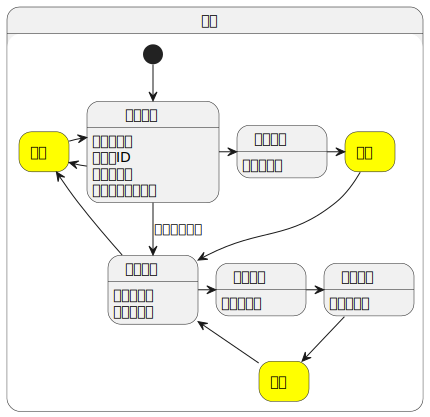

# 株式会社エプコットソフトウェア ～ Laravel CRUD

`TODO: 【作成中】この資料は作成中です。`  

実際にCRUDを作っていきましょう。  
Laravelについては、ある程度理解している前提で進めていきます。

## 環境

- PHP8以上
- Laravel9
- Bootstrap4
- jQuery

## 仕様

データベースのjobs(職業)テーブルを参照・更新する機能を開発します。

### 機能一覧

| URI | HTTP<br>メソッド | ルート名 | 種別 | 機能名 | 備考 |
| --- | --- | --- | --- | --- | --- |
| admin/jobs              | GET    | admin.jobs.index   | 画面 | 職業 一覧画面     |  |
| admin/jobs              | POST   | admin.jobs.store   | 機能 | 職業 新規         |  |
| admin/jobs/create       | GET    | admin.jobs.create  | 画面 | 職業 新規画面     |  |
| admin/jobs/{id}         | GET    | admin.jobs.show    | 画面 | 職業 詳細画面     |  |
| admin/jobs/{id}         | PATCH  | admin.jobs.update  | 機能 | 職業 更新         |  |
| admin/jobs/{id}         | DELETE | admin.jobs.destroy | 機能 | 職業 削除         |  |
| admin/jobs/{id}/edit    | GET    | admin.jobs.edit    | 画面 | 職業 編集画面     |  |
| admin/jobs/{id}/confirm | POST   | admin.jobs.confirm | 画面 | 職業 編集確認画面 |  |

### 画面遷移図

- [PlantUML](https://www.plantuml.com/plantuml/umla/TL91Im915Bw_Np7OBH0yxo4yHD1lY0xYZhYWkx8xKX91kH0KMHqYCkiYfIL4aeAHGJzcozqzzHTwpdDis2KFRtpVlFUzxtkpUKyKN56lLg1icPpnQaqqcCczeclLXENOWFU2i-XmCdjuPdkmo3DVRmTHhnzUJkExReOLF6RP9jy56OtPrJ3gdGV-RT3y3FoHGg_Fml7mv-DcSps9V5-qmlumXHwVnEtxFnerc-WpR3xM4uxBsSe6_dAvH8MchkXol00wZB0zZKzVqyJHqmWdQsrUsTc1UJ32oMFSELgs4FYlmCuO5KY6Uir4I0bK1TGe2t3NmdKQoGgQfqdXfYLW7eom-nuDMkcfXEkc7RjakLLOd0R9qXgtLhTPDhkclnt3bBQaSWIaMKQF53HV0dyG-3x-KIKLNX9Ojh02ojAIcGWnf-S26ObPBPXf_IfVMiOaQKPsqtA13WGa6-n3djicVjA_)  
  

### DB

#### jobs(職業)

`TODO: 【作成中】後で表にする`

```sql
CREATE TABLE `jobs` (
  `id` bigint unsigned NOT NULL AUTO_INCREMENT COMMENT 'ID',
  `name` varchar(255) COLLATE utf8_unicode_ci NOT NULL COMMENT '名称',
  `deleted_at` timestamp NULL DEFAULT NULL COMMENT '削除日時',
  `created_at` timestamp NULL DEFAULT NULL COMMENT '作成日時',
  `updated_at` timestamp NULL DEFAULT NULL COMMENT '更新日時',
  PRIMARY KEY (`id`)
) ENGINE=InnoDB DEFAULT CHARSET=utf8mb3 COLLATE=utf8_unicode_ci COMMENT='職業'
```

## 各ファイルを生成

`jobs`テーブルに対応したModelクラス及び、関連クラスを生成します。  
今回は以下のコマンドで一括で生成します。

```bash
# コマンド
php artisan make:model Job --all
```

「`app/Policies/JobPolicy.php`」も生成されますが  
本研修では単純なCRUDの学習としているため、使用しないので削除してください。  
現場で使用する可能性は高いので、公式ページの「認可」で必要になったら学習しておきましょう。

- 参考:Eloquentの準備
  - <https://readouble.com/laravel/9.x/ja/eloquent.html>
- 参考:認可
  - <https://readouble.com/laravel/9.x/ja/authorization.html>

## Database

### Migrations

以下のような生成日時が入ったmigrationファイルが出来ているので`up`メソッドを編集します。  
DB仕様通りに定義します。  

```txt
database/migrations/YYYY_MM_DD_hhmmss_create_jobs_table.php
```

```php
    public function up()
    {
        $tableName = 'jobs';
        Schema::create($tableName, function (Blueprint $table) {
            $table->id()->comment('ID'); // id
            $table->string('name')->comment('名称'); // name
            $table->softDeletes()->comment('削除日時'); // deleted_at
            // コメントが不要であれば $table->timestamps() でcreated_at、updated_atの作成が可能
            $table->timestamp('created_at')->nullable()->comment('作成日時'); // created_at
            $table->timestamp('updated_at')->nullable()->comment('更新日時'); // updated_at
        });
        DB::statement("ALTER TABLE {$tableName} COMMENT '職業'");
    }
```

commentメソッドを使うことで、テーブル・カラムにコメントを追加することが出来ます。  
基本的には論理名（日本語名）を入れることが多いです。  
編集が終わったら、migrationを実行してテーブルを作成しましょう。

```bash
# コマンド
php artisan migrate
```

- 参考: マイグレーション
  - <https://readouble.com/laravel/9.x/ja/migrations.html>

### Factories

テスト用のテーブルレコードを生成する処理を定義します。  

```txt
database/factories/JobFactory.php
```

```php
class JobFactory extends Factory
{
    private int $i = 1;

    public function definition()
    {
        return [
            'name' => sprintf('JOB_%04d', $this->i++),
            'deleted_at' => null,
            'created_at' => '2021-12-30 11:22:33',
            'updated_at' => '2021-12-31 23:58:59',
        ];
    }
}
```

- 参考: データベーステスト
  - <https://readouble.com/laravel/9.x/ja/database-testing.html>

### Seeders

Seederクラスを使って初期レコードやテスト用のレコードを追加します。  
開発環境の場合のみ、JobFactoryクラスで生成したレコード100件を追加する処理を記述します。

```txt
database/seeders/JobSeeder.php
```

```php
    public function run()
    {
        // 開発環境のみ100レコードを追加する。
        if (app()->isLocal()) {
            // 全件削除
            Job::truncate();
            // JobFactoryクラスを使って100件追加
            Job::factory()
                ->count(100)
                ->create();
        }
    }
```

開発環境の判定については`isLocal`メソッドを使います。  
`.env`ファイルの`APP_ENV`に「`local`」が設定されていた場合、trueとなります。  

DatabaseSeederクラスのcallメソッドを使用して  
JobSeederクラスを指定します。

```txt
database/seeders/DatabaseSeeder.php
```

```php
    public function run()
    {
        $this->call([
            JobSeeder::class,
        ]);
    }

```

編集が終わったら、Seederを実行してレコードを追加しましょう。

```bash
# コマンド
php artisan db:seed
```

- 参考: データベース：シーディング
  - <https://readouble.com/laravel/9.x/ja/seeding.html>

## Model

Jobモデルクラスの設定を行います。  
詳細については公式を参照してください。

```txt
app/Models/Job.php
```

```php
class Job extends Model
{
    use HasFactory;
    use SoftDeletes;

    /**
     * 複数代入可能な属性
     *
     * @var array
     */
    protected $fillable = ['name'];
}
```

- 参考: Eloquentの準備
  - <https://readouble.com/laravel/9.x/ja/eloquent.html>

## Routes

ルーティングを仕様通りに設定します。  
`{id}`はあえて`{job}`としています。  

```txt
routes/web.php
```

```php
// admin
Route::prefix('admin')->as('admin')->group(function () {
    // admin/
    Route::view('', 'admin.index')->name('.index');
    // admin/jobs    admin.jobs
    Route::prefix('jobs')->as('.jobs')->controller(JobController::class)->group(function () {
        Route::get('', 'index')->name('.index');
        Route::post('', 'store')->name('.store');
        Route::get('create', 'create')->name('.create');
        Route::get('{job}', 'show')->name('.show');
        Route::patch('{job}', 'update')->name('.update');
        Route::delete('{job}', 'destroy')->name('.destroy');
        Route::get('{job}/edit', 'edit')->name('.edit');
        Route::post('{job}/confirm', 'confirm')->name('.confirm');
    });
});
```

上記の設定を行うと下記のルーティングになります。

```bash
root@training-laravel-web:/var/www/app# # コマンド　（出力結果は抜粋）
root@training-laravel-web:/var/www/app# php artisan route:list

  GET|HEAD   admin ........................................................ admin.index
  GET|HEAD   admin/jobs ........................ admin.jobs.index › JobController@index
  POST       admin/jobs ........................ admin.jobs.store › JobController@store
  GET|HEAD   admin/jobs/create ............... admin.jobs.create › JobController@create
  GET|HEAD   admin/jobs/{job} .................... admin.jobs.show › JobController@show
  PATCH      admin/jobs/{job} ................ admin.jobs.update › JobController@update
  DELETE     admin/jobs/{job} .............. admin.jobs.destroy › JobController@destroy
  POST       admin/jobs/{job}/confirm ...... admin.jobs.confirm › JobController@confirm
  GET|HEAD   admin/jobs/{job}/edit ............... admin.jobs.edit › JobController@edit

root@training-laravel-web:/var/www/app# 
```

`{job}`には`jobs`テーブルの`id`が入ります。  
例えば`admin/jobs/12`と指定すると自動的にDBから`id=12`のレコードを取得し、Controllerの引数にModelがセットされます。  
存在しないIDの場合、404ページに遷移します。

- 参考: ルーティング
  - <https://readouble.com/laravel/9.x/ja/routing.html>

## Views

Viewに関しては割愛します。  
以下からダウンロードして組み込んでください。  

```txt
public/css/dashboard.css
```

- ダウンロード
  - [css.zip](./files/css.zip)

```txt
resources/views
```

- ダウンロード
  - [views.zip](./files/views.zip)

- 参考
  - HTML
    - readonly
      - <https://developer.mozilla.org/ja/docs/Web/HTML/Attributes/readonly>
  - PHP
    - 三項演算子
      - <https://www.php.net/manual/ja/language.operators.comparison.php#language.operators.comparison.ternary>
    - Null 合体演算子
      - <https://www.php.net/manual/ja/language.operators.comparison.php#language.operators.comparison.coalesce>
  - Laravel
    - Bladeテンプレート
      - <https://readouble.com/laravel/9.x/ja/blade.html>
    - Database：ペジネーション
      - <https://readouble.com/laravel/9.x/ja/pagination.html>
  - Bootstrap（CSS）
    - サンプル (Dashboardを使用)
      - <https://getbootstrap.jp/docs/4.3/examples/>
    - Grid system
      - <https://getbootstrap.jp/docs/4.3/layout/grid/>
    - Forms
      - <https://getbootstrap.jp/docs/4.3/components/forms/>
    - Buttons
      - <https://getbootstrap.jp/docs/4.3/components/buttons/>
    - Alerts
      - <https://getbootstrap.jp/docs/4.3/components/alerts/>
    - Modal
      - <https://getbootstrap.jp/docs/4.3/components/modal/>
  - Feather (アイコン)
    - <https://feathericons.com/>

## Providers

CSSフレームワークにBootstrapを採用していて、ぺジネーションを使用する場合  
以下の設定が必要になります。  

```txt
app/Providers/AppServiceProvider.php
```

```php
    public function boot()
    {
        // Bootstrap4を使用
        Paginator::useBootstrapFour();

        // Laravel8の場合
        // Paginator::useBootstrap();
    }
```

- 参考: ペジネーション(Laravel9)
  - <https://readouble.com/laravel/9.x/ja/pagination.html#using-bootstrap>
- 参考: ペジネーション(Laravel8)
  - <https://readouble.com/laravel/8.x/ja/pagination.html#using-bootstrap>

## Controllers

confirmメソッドは元々入っていないので追加してください。

```txt
app/Http/Controllers/JobController.php
```

```php
<?php

namespace App\Http\Controllers;

use App\Http\Requests\StoreJobRequest;
use App\Http\Requests\UpdateJobRequest;
use App\Models\Job;

class JobController extends Controller
{
    public function index()
    {
        // 一覧画面
        //   id 降順でレコードセットを取得(Illuminate\Pagination\LengthAwarePaginator)
        $jobs = Job::orderByDesc('id')->paginate(20);
        return view('admin.jobs.index', [
            'jobs' => $jobs,
        ]);
    }

    public function create()
    {
        // 新規画面
        return view('admin.jobs.create');
    }

    public function store(StoreJobRequest $request)
    {
        // 新規登録
        $job = Job::create([
            'name' => $request->name
        ]);
        return redirect(
            route('admin.jobs.show', ['job' => $job])
        )->with('messages.success', '新規登録が完了しました。');
    }

    public function show(Job $job)
    {
        // 詳細画面
        return view('admin.jobs.show', [
            'job' => $job,
        ]);
    }

    public function edit(Job $job)
    {
        // 編集画面
        return view('admin.jobs.edit', [
            'job' => $job,
        ]);
    }

    public function confirm(UpdateJobRequest $request, Job $job)
    {
        // 更新確認画面
        $job->name = $request->name;
        return view('admin.jobs.confirm', [
            'job' => $job,
        ]);
    }

    public function update(UpdateJobRequest $request, Job $job)
    {
        // 更新
        $job->name = $request->name;
        $job->update();
        return redirect(
            route('admin.jobs.show', ['job' => $job])
        )->with('messages.success', '更新が完了しました。');
    }

    public function destroy(Job $job)
    {
        // 削除
        $job->delete();
        return redirect(route('admin.jobs.index'));
    }
}
```

- 参考
  - コントローラ
    - <https://readouble.com/laravel/9.x/ja/controllers.html>
  - バリデーション
    - <https://readouble.com/laravel/9.x/ja/validation.html>
  - Eloquentの準備
    - <https://readouble.com/laravel/9.x/ja/eloquent.html>
  - Database：ペジネーション
    - <https://readouble.com/laravel/9.x/ja/pagination.html>

## Requests

```txt
app/Http/Requests/StoreJobRequest.php
```

```php
<?php

namespace App\Http\Requests;

use Illuminate\Foundation\Http\FormRequest;

class StoreJobRequest extends FormRequest
{
    public function authorize()
    {
        return true;
    }

    public function rules()
    {
        return [
            'name' => 'required|max:255',
        ];
    }

    public function attributes()
    {
        return [
            'name' => '名称',
        ];
    }
}
```

```txt
app/Http/Requests/UpdateJobRequest.php
```

```php
<?php

namespace App\Http\Requests;

use Illuminate\Foundation\Http\FormRequest;

class UpdateJobRequest extends FormRequest
{
    public function authorize()
    {
        return true;
    }

    public function rules()
    {
        return [
            'name' => 'required|max:255',
        ];
    }

    public function attributes()
    {
        return [
            'name' => '名称',
        ];
    }

    protected function getRedirectUrl()
    {
        if (request()->routeIs('*.update')) {
            // 確認画面→更新バリデーションエラーの場合、編集画面に遷移。
            //   親クラスのgetRedirectUrlでは、パラメータつきURL生成に対応していないため、以下の方法をとる。
            $url = $this->redirector->getUrlGenerator();
            return $url->route('admin.jobs.edit', ['job' => request()->route()->parameter('job')]);
        }
        return parent::getRedirectUrl();
    }
}
```

- 参考
  - バリデーション
    - <https://readouble.com/laravel/9.x/ja/validation.html>
  - GitHub(Laravel)
    - `Illuminate\Foundation\Http\FormRequest`
      - <https://github.com/laravel/framework/blob/9.x/src/Illuminate/Foundation/Http/FormRequest.php>
  - PHP
    - スコープ定義演算子
      - <https://www.php.net/manual/ja/language.oop5.paamayim-nekudotayim.php>
    - オブジェクトの継承
      - <https://www.php.net/manual/ja/language.oop5.inheritance.php>
