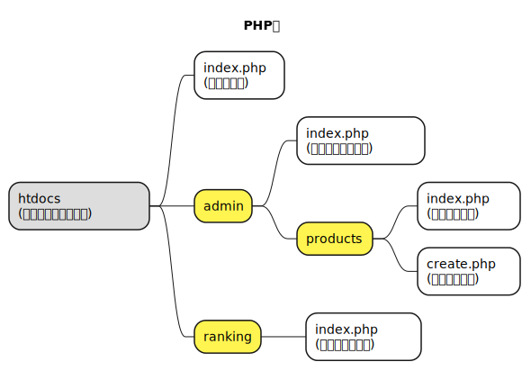

# 株式会社エプコットソフトウェア ～ Laravel ルーティング

## 目次

| No. |  |
| :---: | --- |
| 1 | [ルーティングとは](#ルーティングとは) |
| 2 | [PHPフレームワークを使わない場合](#phpフレームワークを使わない場合) |
| 3 | [Laravelルーティング](#laravelルーティング) |
| 4 | [Laravel公式ページ](#laravel公式ページ) |

## ルーティングとは

Laravelのルーティングは簡単に言うと  
ルート設定により、URLと処理を紐付ける事が出来ます。

## PHPフレームワークを使わない場合

PHP標準でのURLについて見ていきます。  
画面毎にPHPファイルを用意し、以下のように配置していたとします。

- [PlantUML](https://www.plantuml.com/plantuml/umla/SoWkIImgoStCIybDBE0goIp9ILK8y0Xuig-RowQuf38drOuhBpybLQ6QIq71AJ4vExqelpGlnJa_9xz8GTdDpSt4r82hbgieFx_43wSo5p00Aij9JKp3hSmD383ARFIXDdDfMMMKfEGd5tDfF6xkVDoqzd7pqiVD2nytRtxStF6uUVNZvZr0XgOrbvQM5T07gHLw1Ha58BMpmJ8Bda_P_NBk8h2yGc8Aq9D01ehAv-iMFf_GzhXvxUEc3O-RbW0DHcW1wYaeoayfJIuf1d9GzJsTslPqSkEJ7GqlbYs7wO0eIYvAJIn9HLRrRDg65ylwaPrIb9YNdPcN3cIYENibo6TDQy7a1hWEXzIy56W40G00)  
    

ドメインが「`example.com`」とすると  
URLは以下になります。  

| ファイルパス<br>（ドキュメントルートのパス） | 画面名 | URL(※) |
| --- | --- | --- |
| `index.php` | ホーム画面 | `https://example.com/index.php` |
| `admin/index.php` | 管理ログイン画面 | `https://example.com/admin/index.php` |
| `admin/products/index.php` | 商品一覧画面 | `https://example.com/admin/products/index.php` |
| `admin/products/create.php` | 商品新規画面 | `https://example.com/admin/products/create.php` |
| `admin/ranking/index.php` | ランキング画面 | `https://example.com/ranking/index.php` |

※ **URLの`index.php`は省略可**  

Apacheサーバーであれば「`.htaccess`」ファイルの設定でカスタマイズ可能ですが割愛します。  

## Laravelルーティング

Laravelで、URLとControllerのメソッドを紐付けてみましょう。  
予めControllerは用意されているものとします。

### 仕様

| 画面名 | URL(※) | Controller名::メソッド名 |
| --- | --- | --- |
| ホーム画面 | `https://example.com/` | `HomeController::index` |
| 管理ログイン画面 | `https://example.com/admin/` | `AdminController::index` |
| 商品一覧画面 | `https://example.com/admin/products/` | `ProductController::index` |
| 商品新規画面 | `https://example.com/admin/products/create/` | `ProductController::create` |
| 商品新規画面 | `https://example.com/ranking/` | `RankingController::index` |

※ **URLはドメインが「`example.com`」の場合**

### ルート設定

`routes/web.php`ファイルにルートを設定していきます。  
ルート設定を行う方法は、以下のように行います。

```php
Route::HTTPメソッド('URI', アクション);
```

`アクション`には関数を指定し、処理を直接記述したり  
Controllerクラスのメソッドを指定することが出来ます。

---

```php
// 処理を直接記述
Route::HTTPメソッド('URI', function (Request $request) {
    // ...
});
```

```php
// Controllerクラスのメソッド
Route::HTTPメソッド('URI', [Controllerクラス::class, 'メソッド名']);
```

---

[仕様](#仕様)通りにルート設定を行います。  
今回は、全てGETメソッドなのでRouteクラスの「`get`」メソッドを使います。

```php
// URL: https://example.com/
Route::get('/', [HomeController::class, 'index']);
// URL: https://example.com/admin/
Route::get('/admin', [AdminController::class, 'index']);
// URL: https://example.com/admin/products/
Route::get('/admin/products', [ProductController::class, 'index']);
// URL: https://example.com/admin/products/create/
Route::get('/admin/products/create', [ProductController::class, 'create']);
// URL: https://example.com/ranking
Route::get('/ranking', [RankingController::class, 'index']);
```

Routeクラスの「`controller`」メソッド、「`group`」メソッドを使って  
Controllerでグループ化する事が可能です。  
今回の場合、ProductControllerクラスのメソッドが2つあるので  
以下のように定義することもできます。

```php
Route::controller(ProductController::class)->group(function () {
    // URL: https://example.com/admin/products/
    Route::get('/admin/products', 'index');
    // URL: https://example.com/admin/products/create/
    Route::get('/admin/products/create', 'create');
});
```

ルート設定が終わったら「`php artisan route:list`」コマンドで、設定の確認ができます。

```bash
php artisan route:list
```

正しく設定されている場合、以下のようにルートの一覧が出力されます。

```bash
  GET|HEAD   / ........................................................................................................................ HomeController@index
  GET|HEAD   admin ................................................................................................................... AdminController@index
  GET|HEAD   admin/products ........................................................................................................ ProductController@index
  GET|HEAD   admin/products/create ................................................................................................ ProductController@create
  GET|HEAD   ranking ............................................................................................................... RankingController@index
```

ルート設定で、よくあるエラーとしては、以下のようなメッセージが表示されます。

```bash
Target class [Controllerクラス名] does not exist.
```

Controllerクラスはデフォルトで「`App\Http\Controllers`」という名前空間に定義されており
クラスにアクセスするには完全修飾名（名前空間＋クラス名）にする必要があります。  
今回の場合は`routes/web.php`ファイルの上部に、以下を追記する必要があります。  

```php
// 「\App\Http\Controllers\AdminController」クラスに「AdminController」という名前でアクセス出来るようにする。
use App\Http\Controllers\AdminController;
// 「\App\Http\Controllers\HomeController」クラスに「HomeController」という名前でアクセス出来るようにする。
use App\Http\Controllers\HomeController;
// 「\App\Http\Controllers\ProductController」クラスに「ProductController」という名前でアクセス出来るようにする。
use App\Http\Controllers\ProductController;
// 「\App\Http\Controllers\RankingController」クラスに「RankingController」という名前でアクセス出来るようにする。
use App\Http\Controllers\RankingController;
```

名前空間に関しては、他のプログラミング言語にもあり  
実務では必須となってくるので、しっかり理解しておきましょう。

- [PHPプログラミング編 名前空間](./../../programming/php/namespaces/index.md)

## Laravel公式ページ

資料作成で参考にしたLaravel公式ページのリンクです。

- `Laravel 9.x ルーティング`
  - <https://readouble.com/laravel/9.x/ja/routing.html>
