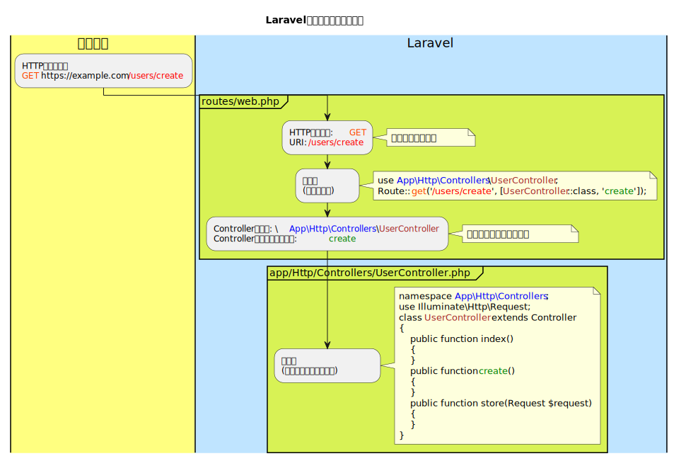

# Laravel ルーティング

## ルーティングとは

Laravelのルーティングは簡単に言うと  
ルート設定により、URLと処理を紐付ける事が出来ます。

## URL

URL(URI)・ルートパスについては理解しておきましょう。

- [URL設計](./../../../public/t/design/url/index.md)

## PHPフレームワークを使わない場合

PHP標準でのURLについて見ていきます。  
画面毎にPHPファイルを用意し、以下のように配置していたとします。

- [PlantUML](https://www.plantuml.com/plantuml/umla/SoWkIImgoStCIybDBE0goIp9ILK8y0Xuig-RowQuf38drOuhBpybLQ6QIq71AJ4vExqelpGlnJa_9xz8GTdDpSt4r82hbgieFx_43wSo5p00Aij9JKp3hSmD383ARFIXDdDfMMMKfEGd5tDfF6xkVDoqzd7pqiVD2nytRtxStF6uUVNZvZr0XgOrbvQM5T07gHLw1Ha58BMpmJ8Bda_P_NBk8h2yGc8Aq9D01ehAv-iMFf_GzhXvxUEc3O-RbW0DHcW1wYaeoayfJIuf1d9GzJsTslPqSkEJ7GqlbYs7wO0eIYvAJIn9HLRrRDg65ylwaPrIb9YNdPcN3cIYENibo6TDQy7a1hWEXzIy56W40G00)  
    

ドメインが「`example.com`」とすると  
URLは以下になります。  

| ファイルパス<br>（ドキュメントルートのパス） | 画面名 | URL(※) |
| --- | --- | --- |
| `index.php` | ホーム画面 | `https://example.com/index.php` |
| `admin/index.php` | 管理ログイン画面 | `https://example.com/admin/index.php` |
| `admin/products/index.php` | 商品一覧画面 | `https://example.com/admin/products/index.php` |
| `admin/products/create.php` | 商品新規画面 | `https://example.com/admin/products/create.php` |
| `admin/ranking/index.php` | ランキング画面 | `https://example.com/ranking/index.php` |

※ **URLの`index.php`は省略可**  

Apacheサーバーであれば「`.htaccess`」ファイルの設定でカスタマイズ可能ですが割愛します。  

## Laravelルーティング

[PHPフレームワークを使わない場合](#phpフレームワークを使わない場合)では、ファイルの格納場所に応じてURLが決まっていましたが  
Laravelではファイル格納場所ではなく、web.phpにURLと処理を紐づけるルート設定を行なっていきます。  

### ルーティングイメージ

- [PlantUML](https://www.plantuml.com/plantuml/umla/hLBVInL157wVlsB0m2k86v4WeroiY1I4ug9FRGzpzvwzBipEJhEpANXzk3DG-X9KKFHeHVG3iX0Yo_fd3aP_HdDNbzMyw7redvOptpdVzvtppUU6QrEaWfZ42A1BNFC78D1zH7U0xY7Qr-Zsq7v6-mRTpg1elv7UMEo_cSkzwprqpz6zH_iMxLTVRyTmDOvxIxtZGOHu364Boyjtq7r0kuls7TfzT5kXd8ioaMbsMtFPXHPqchTkBiy5PR59LurHEGi2MEUf4Z0LPUanNdjaKEIWyo3Im0rKFRE4U6AYkFPUaapIiSvCV6LwckgiC907Qz2UKgkARbHwTj3-HEVGRJDwdXYoqbfaz69wcHcWEkck6aQn_mpxdwezRg5z-llnA-o_90pjNbdR3cNZSFVNdoyxMA4cJiuWdgGYROi2cjUK2XUCKU6DJ1gT2U4rLEHX1TJPccokU7arg1RO6Yo2iJDUks0gK6Fy8f_Za_Jk26oCHOBd-IIj1dOrW6p-C-kUjmooGmUs2Qkd-AIKiTfdDFoVEo13AFoTXcIX4ZpAaUjcV-V39mVOtpjyz1txByWc6P97hbGmC16SC16Srbi5zMnOQjdknqdcqzcHF8LSyMZq1CsMULiKeaWJoGqS0Ljmlu3Sp9Boc7I43LDODo0xEQsVo0QX_bD5MoGHZGiPbUj8P0VM6nFbsn5YSoZkd7ECq9sRJ4FZs0Uzf8z-JlTjrXcSztz5Alu2kot)  
    

### ルート設定(web.php)

`routes/web.php`ファイルのルート設定方法です。  
URIにはルートパスを入れます。

```php
Route::HTTPメソッド('URI', アクション);
```

#### HTTPメソッド

Routeクラスのメソッドが  
そのままHTTPメソッドになります。  

```php
Route::get('URI', アクション); // GET or HEAD
Route::post('URI', アクション); // POST
Route::put('URI', アクション); // PUT
Route::patch('URI', アクション); // PATCH
Route::delete('URI', アクション); // DELETE
Route::options('URI', アクション); // OPTIONS
```

**※ メソッド名は小文字で記載する必要があります。**

#### アクション

`アクション`には関数を指定し、処理を直接記述したり  
Controllerクラスのメソッドを指定することが出来ます。

---

```php
// 処理を直接記述（無名関数を指定）
Route::HTTPメソッド('URI', function (Request $request) {
    // ...
});
```

```php
// Controllerクラスのメソッド（配列でクラス名とメソッド名を指定）
Route::HTTPメソッド('URI', [Controllerクラス::class, 'メソッド名']);
```

Controllerクラスは完全修飾名にするかuseを使ってエイリアス（別名）を作成する必要があります。  
よくわからなければ名前空間の学習をしましょう。

- [PHPプログラミング編 名前空間](./../../../public/t/php/namespaces/index.md)

##### Laravel8以前のアクション記述方法

現場では古いバージョンのLaravelが使われているケースがあるため  
バージョンに合わせた記述をしてください。  

- 旧：Laravel8以前
  - <https://readouble.com/laravel/7.x/ja/routing.html>

```php
Route::get('/user', 'UserController@index');
```

- 新：Laravel8以上
  - <https://readouble.com/laravel/8.x/ja/routing.html>

```php
use App\Http\Controllers\UserController;

Route::get('/user', [UserController::class, 'index']);
```

#### ルート確認

ルート設定が終わったら「`php artisan route:list`」コマンドで、設定の確認ができます。

```bash
php artisan route:list
```

正常に設定できていれば以下のようにコマンドの実行結果が表示されます（Laravel9での出力例）。

```bash
  {HTTPメソッド}   {URI} ................................................................................................. {Controllerクラス名}@{メソッド名}
```

## URL生成

web.phpで作成したルートへアクセスするためのURLを作成したい場合は  
urlヘルパ関数・routeヘルパ関数を使います。  

### urlヘルパ関数

urlヘルパ関数は指定したパスへのURLを生成します。

```php
// web.php
Route::get('/users/create', [UserController::class, 'create']);
```

```php
<!-- *.blade.php -->
<a href="{{ url('/users/create') }}">新規登録</a>
```

　↓ HTML出力

```html
<a href="https://example.com/users/create">新規登録</a>
```

### routeヘルパ関数

routeヘルパ関数は、ルート名を指定してURLを生成します。  
ルート名を付けるには、ルート設定時にnameメソッドを使って設定します。

```php
// web.php
Route::get('/users/create', [UserController::class, 'create'])->name('users.create');
```

```php
<!-- *.blade.php -->
<a href="{{ route('users.create') }}">新規登録</a>
```

　↓ HTML出力

```html
<a href="https://example.com/users/create">新規登録</a>
```

### 疑似フォームメソッド

HTMLの`<form>`は、`GET`、`POST`以外のメソッドをサポートしていません。  
疑似フォームメソッドを使用します。  

以下の例のようにDELETEメソッドで送信したい場合、  
form要素のmethod属性を`POST`にして  
`_method`パラメータに`DELETE`を設定して送信します。  

```php
Route::delete('/example', アクション); // DELETE
```

```html
<form action="{{ url('/example') }}" method="POST">
    @method('DELETE') <!-- <input type="hidden" name="_method" value="DELETE"> と同じ -->
    @csrf <!-- <input type="hidden" name="_token" value="{{ csrf_token() }}"> と同じ -->
    <input type="submit" value="送信" /><!-- 送信ボタン -->
</form>
```

- `<form>: フォーム要素 - HTML: HyperText Markup Language | MDN`
  - <https://developer.mozilla.org/ja/docs/Web/HTML/Element/form#attr-method>
- `Laravel 9.x ルーティング　〜　疑似フォームメソッド`
  - <https://readouble.com/laravel/9.x/ja/routing.html#form-method-spoofing>

## Laravelルーティングの例

URLとControllerのメソッドを紐付けていきます。  

### 画面一覧

URLと紐付けたいController・メソッドの一覧です。  

| 画面名 | URL(※) | URI | Controller名::メソッド名 |
| --- | --- | --- | --- |
| ホーム画面 | `https://example.com/` | `/` | `HomeController::index` |
| 管理ログイン画面 | `https://example.com/admin/` | `/admin` | `AdminController::index` |
| 商品一覧画面 | `https://example.com/admin/products/` | `/products` | `ProductController::index` |
| 商品新規画面 | `https://example.com/admin/products/create/` | `/products/create` | `ProductController::create` |
| ランキング画面 | `https://example.com/ranking/` | `/ranking` | `RankingController::index` |

※ **URLはドメインが「`example.com`」の場合**

### Controller

ProductControllerクラスを作成する場合は以下のコマンドになります。

```bash
# app/Http/Controllers/ProductController.php にProductControllerクラスを作成
php artisan make:controller ProductController
```

上記コマンドではクラスしかできないため、メソッドを定義していきます。  
ProductControllerクラスのindex・createメソッド定義例です。  

```php
<?php
// 名前空間
namespace App\Http\Controllers;
/** ProductControllerクラス */
class ProductController extends Controller
{
    /** ProductControllerクラス indexメソッド */
    public function index()
    {
        // ...
    }

    /** ProductControllerクラス createメソッド */
    public function create()
    {
        // ...
    }
}
```

ここではルーティング説明のみのため、処理は省略します。  
HomeController・AdminController・RankingControllerも同様に作られているものとします。

### web.php

[画面一覧](#画面一覧)通りにルート設定を行います。  
今回は、全てGETメソッドなのでRouteクラスの「`get`」メソッドを使います。

```php
// URL: https://example.com/
Route::get('/', [HomeController::class, 'index']);
// URL: https://example.com/admin/
Route::get('/admin', [AdminController::class, 'index']);
// URL: https://example.com/admin/products/
Route::get('/admin/products', [ProductController::class, 'index']);
// URL: https://example.com/admin/products/create/
Route::get('/admin/products/create', [ProductController::class, 'create']);
// URL: https://example.com/ranking
Route::get('/ranking', [RankingController::class, 'index']);
```

Routeクラスの「`controller`」メソッド、「`group`」メソッドを使って  
Controllerでグループ化する事が可能です。  
今回の場合、ProductControllerクラスのメソッドが2つあるので  
以下のように定義することもできます。

```php
Route::controller(ProductController::class)->group(function () {
    // URL: https://example.com/admin/products/
    Route::get('/admin/products', 'index');
    // URL: https://example.com/admin/products/create/
    Route::get('/admin/products/create', 'create');
});
```

ルート設定が終わったら「`php artisan route:list`」コマンドで、設定の確認ができます。

```bash
php artisan route:list
```

正しく設定されている場合、以下のようにルートの一覧が出力されます。

```bash
  GET|HEAD   / ........................................................................................................................ HomeController@index
  GET|HEAD   admin ................................................................................................................... AdminController@index
  GET|HEAD   admin/products ........................................................................................................ ProductController@index
  GET|HEAD   admin/products/create ................................................................................................ ProductController@create
  GET|HEAD   ranking ............................................................................................................... RankingController@index
```

ルート設定で、よくあるエラーとしては、以下のようなメッセージが表示されます。

```bash
Target class [Controllerクラス名] does not exist.
```

Controllerクラスはデフォルトで「`App\Http\Controllers`」という名前空間に定義されており
クラスにアクセスするには完全修飾名（名前空間＋クラス名）にする必要があります。  
今回の場合は`routes/web.php`ファイルの上部に、以下を追記する必要があります。  

```php
// 「\App\Http\Controllers\AdminController」クラスに「AdminController」という名前でアクセス出来るようにする。
use App\Http\Controllers\AdminController;
// 「\App\Http\Controllers\HomeController」クラスに「HomeController」という名前でアクセス出来るようにする。
use App\Http\Controllers\HomeController;
// 「\App\Http\Controllers\ProductController」クラスに「ProductController」という名前でアクセス出来るようにする。
use App\Http\Controllers\ProductController;
// 「\App\Http\Controllers\RankingController」クラスに「RankingController」という名前でアクセス出来るようにする。
use App\Http\Controllers\RankingController;
```

名前空間に関しては、他のプログラミング言語にもあり  
実務では必須となってくるので、しっかり理解しておきましょう。

- [PHPプログラミング編 名前空間](./../../../public/t/php/namespaces/index.md)

## Laravel公式ページ

資料作成で参考にしたLaravel公式ページのリンクです。

- `Laravel 9.x ルーティング`
  - <https://readouble.com/laravel/9.x/ja/routing.html>
- `Laravel 9.x URL生成`
  - <https://readouble.com/laravel/9.x/ja/urls.html>
- `Laravel 9.x CSRF保護`
  - <https://readouble.com/laravel/9.x/ja/csrf.html>
- `Laravel 9.x ヘルパ`
  - <https://readouble.com/laravel/9.x/ja/helpers.html>

## PHPマニュアル

資料作成で参考にしたPHPマニュアルのリンクです。

- `無名関数`
  - <https://www.php.net/manual/ja/functions.anonymous.php>
