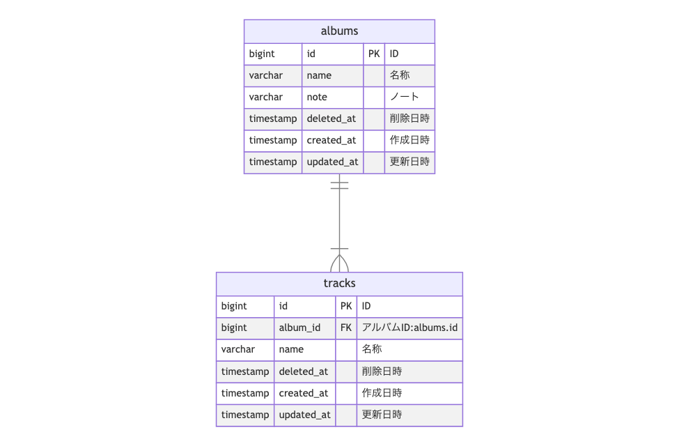
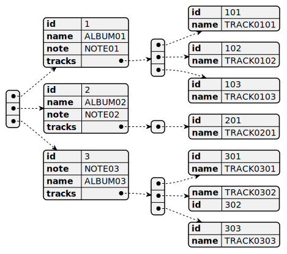

# プログラミング実践

## はじめに

本研修では現場での実装(プログラミング)を想定し  
プログラミングの基礎知識、検索力等を見ていきます。  
よって、わからない用語については検索することは許可します。  

## 休憩

- 1時間で10分休憩をとりましょう。

## 禁止事項

現場に入っていることを想定しているのと、検索力・読解力をみるため  
以下を禁止します。  

- ネット環境で閲覧出来ない情報
  - アナログノートの閲覧
  - 書籍の閲覧
  - ネットで非公開のメモ
- 動画の閲覧

## 課題1

指定した3つの値が完全一致した場合は true  
それ以外の場合は false を返すHelperクラス・メソッドを作成してください。  

### kadai01.php

Helperクラス・メソッドの使用例です。  
動作確認にご利用ください。  

※ **確認用のファイルのため、内容は変更しないこと。**  

```php
<?php
error_reporting(-1); // 全ての PHP エラーを表示する

require_once(__DIR__ . '/app/Helper.php');

use App\Helper;

ob_start(); // 出力バッファリング開始（echo、var_dumpした内容を内部バッファに保存）

// 結果が true のパターン
$actualValuesForTrueCase = [];
$actualValuesForTrueCase[] = Helper::same(1, 1, 1);
$actualValuesForTrueCase[] = Helper::same(2, 2, 2);
$actualValuesForTrueCase[] = Helper::same('a', 'a', 'a');

// 結果が false のパターン
$actualValuesForFalseCase = [];
$actualValuesForFalseCase[] = Helper::same(1, 1, 2);
$actualValuesForFalseCase[] = Helper::same(1, 2, 1);
$actualValuesForFalseCase[] = Helper::same(2, 1, 1);
$actualValuesForFalseCase[] = Helper::same(2, 2, '2');
$actualValuesForFalseCase[] = Helper::same(2, '2', 2);
$actualValuesForFalseCase[] = Helper::same('2', 2, 2);
$actualValuesForFalseCase[] = Helper::same('b', 'a', 'a');
$actualValuesForFalseCase[] = Helper::same('a', 'b', 'a');
$actualValuesForFalseCase[] = Helper::same('a', 'a', 'b');

$outContents = ob_get_clean(); // 出力バッファ取得・出力バッファ消去・出力バッファリング停止
?>
<!-- ↓↓↓HTML -->
<!DOCTYPE html>
<html lang="ja">

<head>
    <meta charset="UTF-8" />
    <meta name="viewport" content="width=device-width, initial-scale=1.0" />
    <title>課題01</title>
    <style>
        pre {
            border: 1px solid black;
            padding: 6px;
        }
    </style>
</head>

<body>
    <h1>課題01</h1>
    <?php if (!empty($outContents)) { ?>
    <section>
        <h2>不正出力</h2>
        <p>メソッド内で不正な出力を検知しました（var_dump、echo等）。</p>
        <pre><?= $outContents ?></pre>
    </section>
    <?php } ?>
    <section>
        <h2>trueパターン</h2>
        <p>結果が全て bool(true) になっていること</p>
        <pre><?php
            foreach ($actualValuesForTrueCase as $actualValue) {
                var_dump($actualValue);
            }
        ?></pre>
    </section>
    <section>
        <h2>falseパターン</h2>
        <p>結果が全て bool(false) になっていること</p>
        <pre><?php
            foreach ($actualValuesForFalseCase as $actualValue) {
                var_dump($actualValue);
            }
        ?></pre>
    </section>
</body>

</html>
```

## 課題2

レコードを格納した配列(array)をTSV(string)に変換するクラス・メソッドを作成してください。  

### 仕様

#### ER図

テーブルの関連図です。

- [Mermaid](https://mermaid.live/edit#pako:eNrNkkFLwzAYhv9KyHnzB_RchCGC4LUwvjXftmDTjjQVpOtluUxB6UkZehBRPHjZwaP-mmjFf2HSdupgiN78ckreJwk8vDkNE4bUoyh9DiMJIoiJHYgGmUjJdNrtTnOiJIQHKfFIQO2K15C82bkZ8BGPFeGM7O1YtOc7eBUeggzHIEkMAm34Wp6-3S83AolygNFnRj8ZPf_OKC4wVSAmhGGEClkflHvs-OR9cVtd3FWL2WY8lAif-MvzVTUvf8KzCfvCq8vH6ny5jhcrC62a31pow9pd3yLbDjGzG6MfjC6Nvu75XiN2i7M_6ftPamiHCpQCOLPNqtUEVI1RYEBdhxgOIYuUu1BYFDKV7B_FIfWUzLBDmx_aOlJvCFFqT5Fxlcjdpq11aYsPc7IAMQ)  
    

#### TSV

TSVの仕様です。

- TSVのヘッダー行は出力対象外
- 改行コードは「LF」
- 出力イメージは[出力例](#出力例)を参照。

| No. | TSVカラム | テーブルカラム | 備考 |
| :---: | --- | --- | --- |
| 1 | id | albums.id |  |
| 2 | name | albums.name |  |
| 3 | note | albums.note |  |
| 4 | track_names | tracks.name | 「,」区切りで連結して出力する |

#### テーブルレコード

テーブルから取得した配列の仕様です。

- 連想配列内の順番は保障しない。
- レコード配列のイメージ
  - [PlantUML](https://www.plantuml.com/plantuml/umla/bP8_3u903CNt-nHDvnkWtPX0u-GV4uEJOI32e4P8u3R2T_TomKEX9Dg9zBqytY-zk3LvO-vjNQcB0ZkTWc7mLc04eHuNLVuixGgJtUgy3qByb6hZfCCntNmhficlZzPgBjzFDyG7eHw3qrEotWPsXxsMtIIuQT7DWfknz-RCVVLQ88S8Q8eEdfrcxF269m4U97htYn4VV4Ux_BaZB_PWNAxF_tHagICBDvfx23Nu59hwlS9Ild0dbQcuh0htMby0)  
    

### kadai02.php

Helperクラス・メソッドの使用例です。  
動作確認にご利用ください。  

※ **確認用のファイルのため、内容は変更しないこと。**  

```php
<?php
error_reporting(-1); // 全ての PHP エラーを表示する

require_once(__DIR__ . '/app/AlbumHelper.php');

// 多次元配列
$albums = [
    [
        "id" => 1,
        "name" => "ALBUM01",
        "note" => "NOTE01",
        "tracks" => [
            ["id" => 101, "name" => "TRACK0101"],
            ["id" => 102, "name" => "TRACK0102"],
            ["id" => 103, "name" => "TRACK0103"],
        ],
    ],
    [
        "id" => 2,
        "name" => "ALBUM02",
        "note" => "NOTE02",
        "tracks" => [
            ["id" => 201, "name" => "TRACK0201"],
        ],
    ],
    [
        "id" => 3,
        "note" => "NOTE03",
        "name" => "ALBUM03",
        "tracks" => [
            ["id" => 301, "name" => "TRACK0301"],
            ["name" => "TRACK0302", "id" => 302],
            ["id" => 303, "name" => "TRACK0303"],
        ],
    ],
];

ob_start(); // 出力バッファリング開始（echo、var_dumpした内容を内部バッファに保存）

// 対象メソッドの実行
$result = \App\AlbumHelper::albumsToTsvString($albums);

$outContents = ob_get_clean(); // 出力バッファ取得・出力バッファ消去・出力バッファリング停止

// 戻り値エラー判定（$isError が true の場合にエラー）
$isError = !is_string($result) || empty($result);

// TSVファイルダウンロード判定（tsvパラメータが「true」になっているか）
if (($_REQUEST['tsv'] ?? '') === 'true') {
    if ($isError) {
        // エラー
        http_response_code(500);
        exit(1); // ここで処理終了
    }

    // TSVファイルダウンロード
    header('Content-type: text/tab-separated-values');
    header("Content-Disposition: attachment;filename=kadai02.tsv");
    echo $result;
    exit(0); // ここで処理終了
}

// 画面表示処理
$newLine = '-';
$urlTsvDownload = $_SERVER['PHP_SELF'] . '?tsv=true';
if ($isError) {
    $urlTsvDownload = null;
    // var_dumpの内容を文字列として取得し、$result に格納
    ob_start();
    var_dump($result);
    $result = "エラー: 戻り値が不正です。\r\n\r\n" . ob_get_clean();
} else {
    // 改行コードチェック
    $crlfCount = substr_count($result, "\r\n");
    $lfCount = substr_count($result, "\n");
    if (0 < $crlfCount) {
        $newLine = ($crlfCount === $lfCount) ? 'CRLF' : 'CRLF と LFが混在しています。';
    } elseif(0 < $lfCount) {
        $newLine = 'LF';
    }
}

?>
<!-- ↓↓↓HTML -->
<!DOCTYPE html>
<html lang="ja">

<head>
    <meta charset="UTF-8" />
    <meta name="viewport" content="width=device-width, initial-scale=1.0" />
    <title>課題02</title>
    <style>
        pre {
            border: 1px solid black;
            padding: 6px;
        }

        /** Bootstrapっぽいボタン */
        a {
            padding: 6px 12px;
            display: inline-block;
            font-weight: 400;
            line-height: 1.5;
            color: #fff;
            text-align: center;
            text-decoration: none;
            vertical-align: middle;
            cursor: pointer;
            -webkit-user-select: none;
            -moz-user-select: none;
            user-select: none;
            border-radius: 0.375rem;
            background-color: #0d6efd;
        }
    </style>
</head>

<body>
    <h1>課題02</h1>
    <?php if (!empty($outContents)) { ?>
    <section>
        <h2>不正出力</h2>
        <p>メソッド内で不正な出力を検知しました（var_dump、echo等）。</p>
        <pre><?= $outContents ?></pre>
    </section>
    <?php } ?>

    <section>
        <h2>TSV出力結果</h2>
        <p>改行コード: <?= htmlspecialchars($newLine) ?></p>
        <pre><?= htmlspecialchars($result) ?></pre>
        <?php if (!empty($urlTsvDownload)) { ?>
            <a href="<?= $urlTsvDownload ?>">TSVダウンロード</a>
        <?php } ?>
    </section>
</body>

</html>
```

### 出力例

```tsv
1	ALBUM01	NOTE01	TRACK0101,TRACK0102,TRACK0103
2	ALBUM02	NOTE02	TRACK0201
3	ALBUM03	NOTE03	TRACK0301,TRACK0302,TRACK0303
```

## 課題3

課題2の仕様変更をしましょう。  
仕様変更内容は以下です。

| 項目 | 変更前 | 変更後 |
| --- | --- | --- |
| TSVヘッダー行 | なし | あり |
| TSV改行コード | LF | CRLF |

## プログラミング力を身につけるには

単純なプログラミング力を身につけるには  
競技プログラミングがおすすめです。  
ただ、これで上位に上がったからと言って実務で通用するわけではないので  
基礎が身につき、プログラミングのスピードが向上したら  
別の学習をする方が良いです。

- AtCoder
  - <https://atcoder.jp/>
  - 新規登録後、チュートリアルがあります。  
    使用経験はないですが、競技プログラミングで人気があるようです。
- paiza
  - <https://paiza.jp/challenges/info>
  - こちらはランク毎に問題が選べます。  
    - Cランクの難しい問題が解けるようになると、十分なレベルと言えます。

JavaScriptを身につけるには、競技プログラミングは向いていないので  
実際にHTMLを作り、DOM操作に慣れておきましょう。  

## 今後の流れ

研修は引き続きやっていきますが  
並行して、以下を進めていきます。

- スキルシート作成
  - 社長の方でスキルシートを作成します。  
    不備等がないか確認して下さい。
  - 作戦会議までに、面談対策資料や内部開発案件の内容には  
    目を通しておきましょう。
    - [面談対策資料](./../interview.md)
    - [社内開発](https://github.com/epkotsoftware/training#社内開発)
- 作戦会議
  - 社長・営業・講師を含め会議を行い  
    スキルシートの修正を行います。
- 営業開始
  - 営業を開始し、案件情報を持ってきます。
- 面談
- 参画
