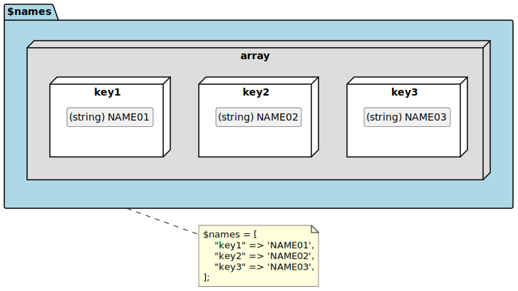
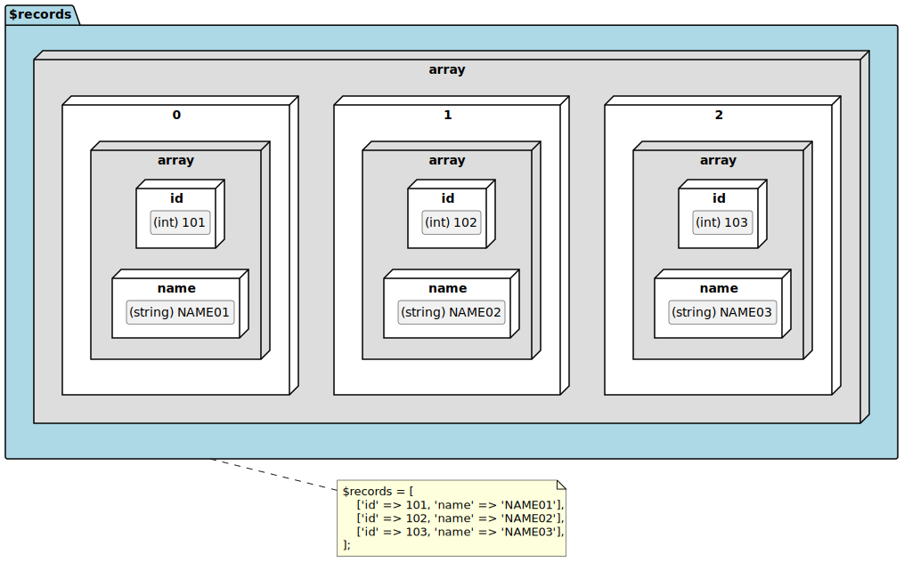

# PHPプログラミング編 配列

## 目次

| No. |  |
| :---: | --- |
| 1 | [インデックス付き配列](#インデックス付き配列) |
| 2 | [連想配列](#連想配列) |
| 3 | [多次元配列](#多次元配列) |
| 4 | [PHPマニュアル](#phpマニュアル) |

## インデックス付き配列

インデックス付き配列(Indexed Arrays)の定義方法や値を取り出す例です。

### 配列定義

配列の定義方法は以下のように行います。  
添字(インデックス)は`0`から順番に与えられます。

```php
// 定義
$配列変数 = [値1, 値2, 値3, ...値n];
```

```php
// 値を取り出す
$変数 = 配列[添字];
```

```php
<?php

// これでも同じ　→ $names = array('NAME01', 'NAME02', 'NAME03');
$names = ['NAME01', 'NAME02', 'NAME03'];

var_dump($names[0]);
// string(6) "NAME01"

var_dump($names[1]);
// string(6) "NAME02"

var_dump($names[2]);
// string(6) "NAME03"

var_dump($names);
//array(3) {
//  [0]=>
//  string(6) "NAME01"
//  [1]=>
//  string(6) "NAME02"
//  [2]=>
//  string(6) "NAME03"
//}
```

- [PlantUML](https://www.plantuml.com/plantuml/umla/VS_FIiD040Rm-pp5a7fGiALDG0HHgk9HBnvB3sjccYxTFylizb2ax-vsZRH1xPxopSuloJUFIKdQMWE6LmcJHz7TEY5fuJPfxo1kj0jAbCMWsetg-3tj3AFpnB3MnDXgQKt_p3Qa7Lgs7opnDyLFm7oUSkh4RnqzU-C5HwjoO7yYLjuGotz04TtoJGRGxrKNJbcE5Qg8eQYVJoeHjSCH4PNnyM9QTcVz5B4rAaQiBcCIxRehV7jyVPdEgdAx7yXPaVLvMVybwoARyx8volsXelE93yx1TqcynqNPgFfVl3v9zI0rEItlW1qTNWAGwuuNQqt4RZb-o1qWrCD90m4d4tGmpsXhpHS0)  
    

要素数が増えてくると読みにくくなるので改行しても問題ありません。  
最後の値の後ろに「,」をつけてもエラーにはなりません。

```php
$names = [
    'NAME01',
    'NAME02',
    'NAME03',
];
```

後から値を追加することも可能です。  

```php
// 空配列を定義
$names = [];

$names[] = 'NAME01';
$names[] = 'NAME02';
$names[] = 'NAME03';
```

## 連想配列

連想配列(Associative Arrays)の定義方法や値を取り出す例です。

### 連想配列定義

連想配列の定義方法は以下のように行います。  

```php
$連想配列変数 = [キー1 => 値1, キー2 => 値2, キー3 => 値3, ...キーn => 値n];
```

```php
// 値を取り出す
$変数 = 連想配列['キー'];
```

```php
<?php

// これでも同じ　→ $names = array('key1' => 'NAME01', 'key2' => 'NAME02', 'key3' => 'NAME03');
$names = ['key1' => 'NAME01', 'key2' => 'NAME02', 'key3' => 'NAME03'];

var_dump($names['key1']);
// string(6) "NAME01"

var_dump($names['key2']);
// string(6) "NAME02"

var_dump($names['key3']);
// string(6) "NAME03"

var_dump($names);
// array(3) {
//   ["key1"]=>
//   string(6) "NAME01"
//   ["key2"]=>
//   string(6) "NAME02"
//   ["key3"]=>
//   string(6) "NAME03"
// }
```

- [PlantUML](https://www.plantuml.com/plantuml/umla/VS_FIiD040Rm-pp5a0fLiCKa88AqLCMZNZoM7jRCD5swVvRTxI58tztDMcrKsZqbtyoFuLk4A7pSQGMArn6ZHI_RJKIIdfiehO6mbSO9BpGwqMn5os-nKup64iD64cCZVQCEtwnTx52pVcSV_bFy04plCVsrtkuCFLbbFOxM-S5-8DPM4VjJG13TyMq2SDWhBepG70eK0LrMtoU5zwB34H7b-3ZOSbVczV8mG6oK206Bon2zDEqLlZwyFD-KHPxk_-8gu-eyhaxWEkFwFAwFUDztDJPoxmnyjSKPBlD6qNSfS3R7SORb-FedhmPvDSZhGLwdV7KFRAW_0U1Ad2mtaeZDQZ9F9S5LlvCQ74wdQ62Hq4whJm00)  
    

配列と同様に改行しても問題ありません。

```php
$names = [
    'key1' => 'NAME01',
    'key2' => 'NAME02',
    'key3' => 'NAME03',
];
```

後から値を追加することも可能です。  

```php
// 空配列を定義
$names = [];

$names['key1'] = 'NAME01';
$names['key2'] = 'NAME02';
$names['key3'] = 'NAME03';
```

## 多次元配列

配列要素として配列を持つ配列を多次元配列(Multidimensional Arrays)と呼びます。

- 動画
  - PHPの多次元連想配列徹底攻略【PHPによるWebアプリケーション開発講座#ex1】
    - <https://youtu.be/PDG7tD2FZrc>

以下、レコード配列のイメージです。

```php
<?php
// レコード配列 (連想配列を要素に持つ配列)
$records = [
    ['id' => 101, 'name' => 'NAME01'],
    ['id' => 102, 'name' => 'NAME02'],
    ['id' => 103, 'name' => 'NAME03'],
];

var_dump($records[0]['id']);   // int(101)
var_dump($records[0]['name']); // string(6) "NAME01"
var_dump($records[1]['id']);   // int(102)
var_dump($records[1]['name']); // string(6) "NAME02"
var_dump($records[2]['id']);   // int(103)
var_dump($records[2]['name']); // string(6) "NAME03"

var_dump($records);
// array(3) {
//   [0]=>
//   array(2) {
//     ["id"]=>
//     int(101)
//     ["name"]=>
//     string(6) "NAME01"
//   }
//   [1]=>
//   array(2) {
//     ["id"]=>
//     int(102)
//     ["name"]=>
//     string(6) "NAME02"
//   }
//   [2]=>
//   array(2) {
//     ["id"]=>
//     int(103)
//     ["name"]=>
//     string(6) "NAME03"
//   }
// }
```

以下は取得方法です。  
`$name1`と`$name2`は同じ内容になります。

```php
// ■取得方法1
// $records[0] で連想配列（['id' => 101, 'name' => 'NAME01']）を取り出し
// その連想配列からnameの値を取り出し、$name1変数に格納
$name1 = $records[0]['name'];
var_dump($name1); // string(6) "NAME01"

// ■取得方法2
// $records[0] で連想配列（['id' => 101, 'name' => 'NAME01']）を取り出し $rec 変数に格納
$rec = $records[0];
// $rec変数（連想配列）からnameの値を取り出し、$name1変数に格納
$name2 = $rec['name'];
var_dump($name2); // string(6) "NAME01"

// ■取得方法3
foreach ($records as $record) {
    // 1回目 $record = ['id' => 101, 'name' => 'NAME01'];
    // 2回目 $record = ['id' => 102, 'name' => 'NAME02'];
    // 3回目 $record = ['id' => 103, 'name' => 'NAME03'];
    $name = $record['name'];
    var_dump($name);
    // 1回目 string(6) "NAME01"
    // 2回目 string(6) "NAME02"
    // 3回目 string(6) "NAME03"
}
```

- [PlantUML](https://www.plantuml.com/plantuml/umla/hPBFIiD048Vl-nH3AiH2Mve4H91ALJpgnMFfOSrCqwNx9ynk3qNoxYQnrTRKejIz9BFp_NO_s9dw83ciZHQQ5W620rR5CW0gfZmePuLVALjAbWPAcQzaGIzXemciGn9BXGIvubnl_ycKOGE6p2knxqRXJK2zxkkgOBUs-E2qO-WjsYMglSJ2QIJ-AI0Hh-cg3eWj5rtKlexHHo0zb6rkTwbabXle8MAx_TKOR-iJw7vJxMy2v5fw3z6big4FoJY9FdjL9sgbeQDX7rZPeW_FTq-FtIDst-f0Epcb_MVlz7plz7VUwRzwP-TxPwUygsQwh0lK39GLk_c22SnQPXOhZ65osppz0EBcnhQCFvuodW--OsaNIuzWMHVB6cn-8yXYOoJ6C1pEbWgHxBoEYEIWJaK9en5OCQtvjT7l)  
    

上記の場合、変数 `records` は連想配列と思われがちですが  
実際は連想配列の配列になります。  
以下のように一つ一つ分解するとわかりやすいです。  
変数 `records` は上記と同一の内容になります。

```php
// レコード (連想配列)
$record1 = ['id' => 101, 'name' => 'NAME01'];
$record2 = ['id' => 102, 'name' => 'NAME02'];
$record3 = ['id' => 103, 'name' => 'NAME03'];

// レコード配列 (連想配列を要素に持つ配列)
$records = [
    $record1,
    $record2,
    $record3,
];
```

上記のレコード配列からid値配列を作る関数の例です。

```php
<?php

function pluckId(array $recs): array
{
    // ids配列(空配列)
    $ids = [];

    // recs の要素数分ループ、rec変数にはレコード(連想配列)が入る
    foreach ($recs as $rec) {
        // 1回目 $rec = ['id' => 101, 'name' => 'NAME01'];
        // 2回目 $rec = ['id' => 102, 'name' => 'NAME02'];
        // 3回目 $rec = ['id' => 103, 'name' => 'NAME03'];

        // レコード(連想配列)のキー'id' の値を取り出し、ids配列に追加
        $ids[] = $rec['id'];
        // 1回目 $ids = [101]
        // 2回目 $ids = [101, 102]
        // 3回目 $ids = [101, 102, 103]
    }

    // ids配列を戻り値として返す
    return $ids;
}

$records = [
    ['id' => 101, 'name' => 'NAME01'],
    ['id' => 102, 'name' => 'NAME02'],
    ['id' => 103, 'name' => 'NAME03'],
];
// pluckId 関数を使う
$result = pluckId($records);
var_dump($result); // [101, 102, 103]
```

## PHPマニュアル

資料作成で参考にしたPHPマニュアルのリンクです。

- `配列`
  - <https://www.php.net/manual/ja/language.types.array.php>
