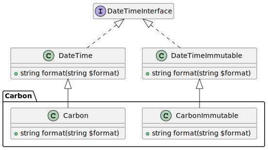

# 株式会社エプコットソフトウェア ～ PHPプログラミング編 課題(datetime)

## はじめに

- 使用するもの
  - [関数](./../../functions/index.md)
  - [名前空間](./../../namespaces/index.md)
  - クラス
    - DateTimeInterface
      - <https://www.php.net/manual/ja/class.datetimeinterface.php>

## 課題

日時オブジェクト（DateTime, DateTimeImmutable, Carbonなど）を文字列に変換するメソッドを持つ  
`DateTimeHelper`クラスを作成してください。

## 仕様

- 名前空間: `App\Helpers`
- クラス名: `DateTimeHelper`
- メソッド名: (static)
ymd_slash_format_string
  - `toHMString`
  - `toHMSString`
  - `toYMDString`
  - `toYMDSlashString`
  - `toYMDHMSSlashString`
  - `toYMDHMSFFFSlashString`
  - `toYMDHMSFFFFFFSlashString`
- パラメータ(引数): (DateTimeInterface)`$datetime` - 日時オブジェクト
- 戻り値: (string)メソッドに対応した文字列

| メソッド名 | 戻り値の書式 | 戻り値の例1 | 戻り値の例2 | 書式の解説 |
| --- | --- | --- | --- | --- |
| toHMString | HH:mm | 23:58 | 00:00 | 時分フォーマット |
| toHMSString | HH:mm:ss | 23:58:59 | 00:00:00| 時分秒フォーマット |
| toYMDString | yyyyMMdd | 29991231 | 20000101| 年月日フォーマット（区切り文字なし） |
| toYMDSlashString | yyyy/MM/dd | 2999/12/31 | 2000/01/01 | 年月日フォーマット（/区切り） |
| toYMDHMSSlashString | yyyy/MM/dd HH:mm:ss | 2999/12/31 23:58:59 | 2000/01/01 00:00:00 | 年月日時分秒フォーマット<br>（年月日は/区切り） |
| toYMDHMSFFFSlashString | yyyy/MM/dd HH:mm:ss | 2999/12/31 23:58:59.456 | 2000/01/01 00:00:00.000 | 年月日時分秒ミリ秒フォーマット<br>（年月日は/区切り） |
| toYMDHMSFFFFFFSlashString | yyyy/MM/dd HH:mm:ss | 2999/12/31 23:58:59.456789 | 2000/01/01 00:00:00.000000 | 年月日時分秒マイクロ秒フォーマット<br>（年月日は/区切り） |

実行例

```php
// 実行
$dt = new \DateTime('2999-12-31 23:58:59.456789', new \DateTimeZone('Asia/Tokyo'));
var_dump(\App\Helpers\DateTimeHelper::toHMString($dt)); // string(5) "23:58"
var_dump(\App\Helpers\DateTimeHelper::toHMSString($dt)); // string(8) "23:58:59"
var_dump(\App\Helpers\DateTimeHelper::toYMDString($dt)); // string(8) "29991231"
var_dump(\App\Helpers\DateTimeHelper::toYMDSlashString($dt)); // string(10) "2999/12/31"
var_dump(\App\Helpers\DateTimeHelper::toYMDHMSSlashString($dt)); // string(19) "2999/12/31 23:58:59"
var_dump(\App\Helpers\DateTimeHelper::toYMDHMSFFFSlashString($dt)); // string(23) "2999/12/31 23:58:59.456"
var_dump(\App\Helpers\DateTimeHelper::toYMDHMSFFFFFFSlashString($dt)); // string(26) "2999/12/31 23:58:59.456789"
```

### 引数($datetime)

[DateTimeInterface](https://www.php.net/manual/ja/class.datetimeinterface.php#class.datetimeinterface)インターフェイスを実装したクラスのオブジェクトを受け取ります。  
誤った値を受け取らないように**DateTimeInterfaceの型宣言を必ず行なってください。**  

- 型宣言
  - <https://www.php.net/manual/ja/language.types.declarations.php>

PHPフレームワークのLaravelでも使われる[Carbon・CarbonImmutable](https://carbon.nesbot.com/)クラスもDateTime・DateTimeImmutableを継承したクラスなので指定が可能になります。

- [PlantUML](https://www.plantuml.com/plantuml/umla/hSun3i8m30NGtQVmm03Y4fLWwSu5tDOj4N5QnQw4X79t4Aaob4emCFx_avTKQXHj5Wyk6CUUMiOp6L-SS5sQ1oIukcvh4fQ6emAqdbJB0NGoUHOEffiUub4jkZ1WFqOXsozfb-C1qbgiHMQZnl-5dgYzqS1uejYCuNqflxOKV3SENV4p-nL6J2keVFf3BCllT8BgHSpYdm00)  
    

### 戻り値

[仕様](#仕様)通りにメソッドに対応する書式の文字列に変換した値を返します。  
こちらも型宣言をするようにしましょう。  

## テストコード付きサンプル

テストコード付きのサンプルです。  
TODOコメントの箇所にクラスを定義しましょう。

```php
<?php
// TODO: ここにクラスを定義します。

// ↓↓↓テストケース（code=実行コード  expected=期待結果）
$dtString1 = 'new \DateTime("2999-12-31 23:58:59.456789", new \DateTimeZone("Asia/Tokyo"))';
$dtString2 = 'new \DateTime("2000-01-01 00:00:00.000000", new \DateTimeZone("Asia/Tokyo"))';
$cases = [
    ['code' => "\App\Helpers\DateTimeHelper::toHMString({$dtString1})", 'expected' => '23:58'],
    ['code' => "\App\Helpers\DateTimeHelper::toHMSString({$dtString1})", 'expected' => '23:58:59'],
    ['code' => "\App\Helpers\DateTimeHelper::toYMDString({$dtString1})", 'expected' => '29991231'],
    ['code' => "\App\Helpers\DateTimeHelper::toYMDSlashString({$dtString1})", 'expected' => '2999/12/31'],
    ['code' => "\App\Helpers\DateTimeHelper::toYMDHMSSlashString({$dtString1})", 'expected' => '2999/12/31 23:58:59'],
    ['code' => "\App\Helpers\DateTimeHelper::toYMDHMSFFFSlashString({$dtString1})", 'expected' => '2999/12/31 23:58:59.456'],
    ['code' => "\App\Helpers\DateTimeHelper::toYMDHMSFFFFFFSlashString({$dtString1})", 'expected' => '2999/12/31 23:58:59.456789'],
    ['code' => "\App\Helpers\DateTimeHelper::toHMString({$dtString2})", 'expected' => '00:00'],
    ['code' => "\App\Helpers\DateTimeHelper::toHMSString({$dtString2})", 'expected' => '00:00:00'],
    ['code' => "\App\Helpers\DateTimeHelper::toYMDString({$dtString2})", 'expected' => '20000101'],
    ['code' => "\App\Helpers\DateTimeHelper::toYMDSlashString({$dtString2})", 'expected' => '2000/01/01'],
    ['code' => "\App\Helpers\DateTimeHelper::toYMDHMSSlashString({$dtString2})", 'expected' => '2000/01/01 00:00:00'],
    ['code' => "\App\Helpers\DateTimeHelper::toYMDHMSFFFSlashString({$dtString2})", 'expected' => '2000/01/01 00:00:00.000'],
    ['code' => "\App\Helpers\DateTimeHelper::toYMDHMSFFFFFFSlashString({$dtString2})", 'expected' => '2000/01/01 00:00:00.000000'],
];
// ↑↑↑テストケース
// ↓↓↓テスト用クラス
class PhpFunctionTest
{
    public static function executeCasesToHtmlTable(array $cases): string
    {
        $executedCases = self::executeCases($cases);
        $trInnerHtmlList = [];
        foreach ($executedCases as $executedCase) {
            $trInnerHtmlList[] = '<td>' . implode('</td><td>', [
                htmlspecialchars($executedCase['code']),
                htmlspecialchars($executedCase['expected']),
                htmlspecialchars($executedCase['actual']),
                $executedCase['result'] === 'OK' ? '<span class="ok">OK</span>' : '<span class="ng">NG</span>',
            ]) . '</td>';
        }
        $style = '<style>table {border-collapse: collapse;} th, td {padding: 8px; border: 1px solid #000;} td span {border-radius: 8px; padding: 4px; color: #fff} .ok {background-color: #198754;} .ng {background-color: #dc3545;}</style>';
        $tbodyInnerHtml = '<tr>' . implode('</tr><tr>', $trInnerHtmlList) . '</tr>';
        $theadInnerHtml = '<tr><th>実行コード</th><th>期待結果<br />(expected)</th><th>実行結果<br />(actual)</th><th>テスト結果</th></tr>';
        return "{$style}<table><thead>{$theadInnerHtml}</thead><tbody>{$tbodyInnerHtml}</tbody></table>";
    }

    public static function executeCases(array $cases): array
    {
        $executedCases = [];
        foreach ($cases as $i => $case) {
            $actual = null;
            try {
                $actual = self::valueToString(eval('return ' . $case['code'] . ';'));
            } catch (\Throwable $th) {
                $actual = 'エラー: ' . self::valueToString($th);
            }
            $expected = self::valueToString($case['expected']);
            $executedCases['Case' . ($i + 1)] = [
                'code' => $case['code'],
                'expected' => $expected,
                'actual' => $actual,
                'result' => $expected === $actual ? 'OK' : 'NG',
            ];
        }
        return $executedCases;
    }

    private static function valueToString($value): string
    {
        if ($value === null) {
            return 'null';
        } elseif (is_int($value)) {
            return '(int)' . var_export($value, true);
        } elseif (is_bool($value)) {
            return '(bool)' . var_export($value, true);
        }
        return '(' . gettype($value) . ')' . var_export($value, true);
    }
}
// ↑↑↑テスト用クラス
// テストコード実行
echo  PhpFunctionTest::executeCasesToHtmlTable($cases);
```

## プログラムの実行

プログラムの実行については「paiza.io」でも可能です。  
テストコード付きサンプルはHTMLで出力されるので  
「Text」から「HTML」に変更してください。

- `paiza.io`
  - <https://paiza.io/ja/projects/new>

## 解答例

課題が出来たら解答例も見てみましょう。

- [解答例](./example-answer/index.md)
