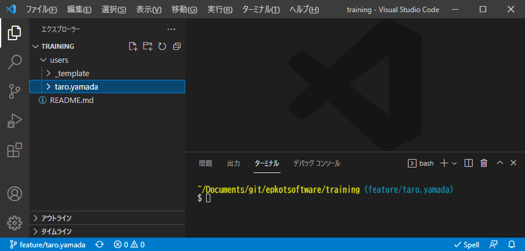

# 新人研修

## スケジュール

### 7月入社

- 7月 研修
- 8月 研修
- 9月 研修、1対1PG研修、内部開発再現
- 10月 内部開発再現、営業開始（面談）
- 11月 現場参画
- 12月 予備月

### 8月入社

- 8月 研修
- 9月 研修
- 10月 研修、1対1PG研修、内部開発再現
- 11月 内部開発再現、営業開始（面談）
- 12月 現場参画
- 1月 予備月

### 9月入社

- 9月 研修
- 10月 研修
- 11月 研修、1対1PG研修、内部開発再現
- 12月 内部開発再現、営業開始（面談）
- 1月 現場参画
- 2月 予備月

## カリキュラム

カリキュラムは、1〜4ヶ月が目安です。

| No. | 終了目安<br>(営業日数) | 開始月 | 内容 | 備考 |
| :---: | ---: | ---: | --- | --- |
| 1 | - | 0ヶ月 | [はじめに](#はじめに) |  |
| 2 | 半日 | 0ヶ月 | [準備](#準備) |  |
| 3 | 1-3日 | 0ヶ月 | [コーダー編](#コーダー編) |  |
| 4 | 1-5日 | 0ヶ月 | [マークアップエンジニア編](#マークアップエンジニア編) |  |
| 5 | 1-7日 | 0ヶ月 | [フロントエンドエンジニア編](#フロントエンドエンジニア編) |  |
| 6 | 0-3日 | 0ヶ月 | [Linux編](#linux編) |  |
| 7 | 1日 | 1ヶ月 | [開発手法編](#開発手法編) |  |
| 8 | 1-5日 | 1ヶ月 | [設計編](#設計編) |  |
| 9 | 1-3日 | 1ヶ月 | [テスト編](#テスト編) |  |
| 10 | 1日 | 1ヶ月 | [ファイル編](#ファイル編) |  |
| 11 | 1日 | 1ヶ月 | [セキュリティ編](#セキュリティ編) |  |
| 12 | 2-10日 | 1ヶ月 | [バックエンド編](#バックエンド編) |  |
| 13 | 1日 | 2ヶ月 | [バージョン管理システム編](#バージョン管理システム編) |  |
| 14 | 1-2日 | 2ヶ月 | [Git編](#git編) |  |
| 15 | 1-20日 | 2ヶ月 | [PHPプログラミング編](#phpプログラミング編) |  |
| 16 | 1-2日 | 3ヶ月 | [1対1PG研修](#1対1pg研修) |  |
| 17 | 2-15日 | 3ヶ月 | [データベース編](#データベース編) |  |
| 18 | 1-20日以上 | 4ヶ月 | [カリキュラム終了](#カリキュラム終了) | 面談対策・自己学習等 |

## はじめに

- [はじめに](./curriculum/introduction/index.md)

## 準備

- [準備](./curriculum/preparation/index.md)

## コーダー編

- [コーダー編](./cbc/beginner/index.md)

## マークアップエンジニア編

マークアップエンジニア編は課題提出がありますので予めご確認下さい。  
つまずいたら質問する前に[トラブルシューティング](./troubleshoot/index.md)を参照してください。

- [研修課題提出](https://github.com/epkotsoftware/training-docs/blob/main/submission/README.md#研修課題提出)
- [トラブルシューティング](./troubleshoot/index.md)

まずは動画で学習しましょう。

- 動画
  - <https://youtube.com/playlist?list=PLCX3wwS3Gg4y99r2bSBpir2nmMv4rzfcL>
    - `12:56` HTTPの仕組み｜GET・POSTリクエスト/ステータスコード/サーバー通信/ユーザエージェントなどの基礎を解説
    - `15:56` IPアドレスの仕組みとは🔰プライベートIP/パブリックIPやIPv6など、IPアドレスの基本を解説
    - `5:57` ポートとは？【TCP/IP基礎】｜プログラマー養成講座
    - `6:28` ドメイン、サーバーとは？ホームページの仕組みを解説😃これでDNSやIPアドレスもわかるようになる！
    - `6:24` WEBサーバーの仕組み入門｜ApacheやNginxなどWEBサーバーの基本を初心者向けに解説
    - `16:19` 【超入門】初心者向け レスポンシブデザイン完全攻略！メディアクエリ等解説【HTML・CSS コーディング】

### Excel

[CBC](https://cbc-study.com/)の基礎コースをやっていきましょう。  
Excelをお持ちでない方は、無料のOffice OnlineでもOKです。

- Microsoft Office Online (Excel)
  - <https://www.office.com/launch/excel>

```txt
■ GoogleスプレッドシートでのExcelファイル(.xlsx)の開き方
Googleマイドライブ → 「新規」 → 「ファイルのアップロード」→ アップロードしたファイルをダブルクリック

■ GoogleスプレッドシートでのExcelファイル(.xlsx)のダウンロード
「ファイル」→「ダウンロード」→「Microsoft Excel (.xlsx)」
```

- 基礎1（マークアップエンジニア 初級）
  - CBC基礎コースを読むだけです。
  - <https://cbc-study.com/training/basic/page1>
  - <https://cbc-study.com/training/basic/page2>
  - <https://cbc-study.com/training/basic/page3>
- 基礎2（マークアップエンジニア 中級）
  - <https://cbc-study.com/training/basic/page4>
  - <https://cbc-study.com/training/basic/page5>
  - `https://cbc-study.com/training/basic/page6` ※ page6はないようです。

### jQuery

- 基礎2（マークアップエンジニア 中級）#5 jQueryってなに？〜
  - <https://cbc-study.com/training/basic/page7>  
      → 「`02_basic/htdocs/kadai_07.html`」
  - <https://cbc-study.com/training/basic/page8>  
      → 「`02_basic/htdocs/kadai_08.html`」

**※ 基礎3（マークアップエンジニア 上級） は研修外とします。興味があれば自己学習でお願いします。**  
**※ `css/common.css` はindex.htmlにも使われているCSSファイルで、共通で使うスタイルを想定しています。**  
　**ページ固有のスタイルは入れないように注意しましょう（よくあるのが #change_btn 等のスタイルを入れてしまっている）。**

### マークアップエンジニア編課題

- 作成したエクセルファイル
  - 必須: 「`#2 エクセル関数（売上票を作る）`」、「`#3 エクセル関数（成績表を作る）`」
  - 任意: 「`#4 オートカレンダーを作る`」
- jQuery課題
  - 必須
    - 「`#7 簡単な機能をjQueryで実装しよう`」  
      → 「`02_basic/htdocs/kadai_07.html`」
    - 「`#8 変数を使う`」、「`#9 関数を使う`」、「`#10 コンソールでデータの確認`」、「`#11 モーダルウィンドウを作ろう`」  
      見た目も`kadai_07.html`と似せましょう。
      → 「`02_basic/htdocs/kadai_08.html`」

#### マークアップエンジニア編課題提出

以下を参照してください。

- [研修課題提出](https://github.com/epkotsoftware/training-docs/blob/main/submission/README.md#研修課題提出)

## フロントエンドエンジニア編

フロントエンドエンジニア編は課題提出がありますので予めご確認下さい。  
つまずいたら質問する前に[トラブルシューティング](./troubleshoot/index.md)を参照してください。

- [研修課題提出](https://github.com/epkotsoftware/training-docs/blob/main/submission/README.md#研修課題提出)
- [トラブルシューティング](./troubleshoot/index.md)

フロントエンドエンジニア編ではCBCの応用コースをやっていきます。  
開発環境については以下の仮想環境を構築します。

### 仮想環境

まず仮想環境について学習しましょう。

- 仮想環境とは？
  - <https://bcblog.sios.jp/what-is-virtualenvironment-vmware/>
- Dockerやってる人向けのVagrant超入門
  - <https://qiita.com/nnishimura/items/b6fd4b665b25a411fbeb>

#### Docker

今回はコンテナ型の仮想化環境である「Docker」を使います。

- 動画
  - 【2021年最新】Docker環境構築入門｜14分でdocker-composeまで完全解説！【windows/mac対応】Dockerの使い方
    - <https://youtu.be/VIzLh4BgKck>

##### Dockerインストール

Docker Desktop をインストールしてください。

- [Docker Desktopインストール](./docker/install.md)

##### VSCodeの確認

ここまでで、VSCodeが正しく開かれていない方が多いので再度確認しましょう。  
下図のように、左のエクスプローラーの所に「`TRAINING`」と表示されていることを確認してください。  



「`TRAINING`」が表示されていなければ、VSCodeを開き直しましょう。

```txt
メニューバー「ファイル」→「フォルダーを開く」→「training」フォルダーを選択  
```

##### 構築手順

[構築手順](https://github.com/epkotsoftware/training-docs/blob/main/training/03_advanced/README.md) をご覧ください。

- コンテナ起動がうまくいかなかったらご連絡ください。
  - [Docker トラブルシューティング](./docker/troubleshoot.md)

### PHP入門

- 動画
  - <https://www.youtube.com/playlist?list=PLCX3wwS3Gg4wr82E46gEdFnT6VTo_uehr>
    - `10:01` サーバーサイドとは？サーバーサイドとクライアントサイド言語の違い
    - `1:02:33` PHPプログラミング入門講座🔰【初心者でも1時間で学べるPHP入門！フル字幕】
    - `4:05` セッション変数とは？【分かりやすい解説シリーズ #17】【プログラミング】

### PHP VSCode拡張機能

以下の導入を推奨します。  
「`PHP DocBlocker`」はPHPDocが必須の現場では重宝します。

- PHP Intelephense
  - コード補完・PSR-12コードフォーマット等、PHPに関する様々な機能が追加されます。
  - <https://marketplace.visualstudio.com/items?itemName=bmewburn.vscode-intelephense-client>
- PHP DocBlocker
  - 関数等のメンバーの上で「`/**`」を入力してEnterキーを押すだけで、自動的にPHPDocが生成されます。
  - <https://marketplace.visualstudio.com/items?itemName=neilbrayfield.php-docblocker>
  - PHPDocリファレンス
    - <https://zonuexe.github.io/phpDocumentor2-ja/references/phpdoc/index.html>

### CBC 応用

CBCと開発環境が異なるので、気を付けてください。  

- 応用1（フロントエンドエンジニア 初級）
  - <https://cbc-study.com/training/advanced/page1>
    - **MAMP、XAMPPは不要です！**
    - 環境はDockerで構築するため内容を確認するだけでOKです。
  - <https://cbc-study.com/training/advanced/page2>
  - <https://cbc-study.com/training/advanced/page3>
  - <https://cbc-study.com/training/advanced/page4>
    - **[②テーブルの作成](https://cbc-study.com/training/advanced/page4#pl-12) でアニメーションGifでは「`left_x`」、「`top_y`」カラムの NULL にチェックを入れ忘れているのでご注意ください（CREATE文で作成した場合は問題なし）。**
      
- 応用2（フロントエンドエンジニア 中級1）
  - <https://cbc-study.com/training/advanced/page5>
    - PDO(DB_DNS)設定について
      - CBCの設定(host)と異なりますのでご注意ください。[詳しくは03_advanced/README.md ～ PHP 参照](https://github.com/epkotsoftware/training/blob/template/users/_template/03_advanced/README.md#php)
        - `define('DB_DNS', 'mysql:host=mysql; dbname=cri_sortable; charset=utf8');`
  - <https://cbc-study.com/training/advanced/page6>
  - <https://cbc-study.com/training/advanced/page7>
  - <https://cbc-study.com/training/advanced/class1>

#### エラーが出た場合

- URL(パス)に誤りがないか確認しましょう。
- HTML側（`<input name="xxx">`）とPHP側（`$_POST['xxx']`）の名称が一致していることを確認しましょう。

### フレームワーク

- フレームワークとは
  - <https://www.otsuka-shokai.co.jp/words/framework.html>
- 動画
  - フレームワークとは？プログラミングに必須のフレームワークを初心者向けに解説！
    - <https://youtu.be/eTCjvTo5KgQ>

### フロントエンドエンジニア編課題

- 「フロントエンドエンジニア編」で作成したファイル

#### フロントエンドエンジニア編課題提出

以下を参照してください。

- [研修課題提出](https://github.com/epkotsoftware/training-docs/blob/main/submission/README.md#研修課題提出)  

## Linux編

LPIC（エルピック）、LinuC（リナック）等のLinux資格をお持ちの方は、こちらの研修は免除となります。  

- [Linux編](./../public/t/linux/index.md)

## 開発手法編

- [開発手法編](./../public/t/development-methods/index.md)

## 設計編

- [設計編](./../public/t/design/index.md)

## テスト編

- [テスト編](./../public/t/test/index.md)

## ファイル編

画像ファイルやCSV等のファイルについて学習します。

- [ファイル編](./../public/t/file/index.md)

## セキュリティ編

- [セキュリティ編](./../public/t/security/index.md)

## バックエンド編

バックエンド編課題は課題提出がありますので予めご確認下さい。  
つまずいたら質問する前に[トラブルシューティング](./troubleshoot/index.md)を参照してください。

- [研修課題提出](https://github.com/epkotsoftware/training-docs/blob/main/submission/README.md#研修課題提出)
- [トラブルシューティング](./troubleshoot/index.md)

バックエンド編ではCBCの実践（バックエンド Laravel）をやっていきます。  
開発環境についてはフロントエンドエンジニア編と同様に以下、Dockerで構築します。

### Laravel開発環境構築

[構築手順](https://github.com/epkotsoftware/training-docs/blob/main/training/05_laravel/README.md) をご覧ください。

### CBC 実践（バックエンド Laravel）

LaravelのバージョンがCBCと異なるため、一つ一つコードを理解して進めましょう。  
  CBC → Laravel6(2022/09/06にセキュリティ修正終了)  
  EPKOT → Laravel9  

- `#1`～`#3` は環境構築になりますがDockerで構築済みのため、読み込みだけ行います。
  - <https://cbc-study.com/training/backend/laravel1>
- `#4`～`#9` は手順通り進めてみましょう。
  - 注意
    - RoutingについてはLaravel6は手法が古いため、以下で学習し実装してください（「`#7 Laravelでデータベースのデータを表示する方法`」の手法が古いです）。
      - [ルーティング](./laravel/routing/index.md)
    - 「`Target class [SortableController] does not exist.`」のエラーが出る  
      - [名前空間](./../public/t/php/namespaces/index.md) について学習して下さい、「use」を使用します。
    - ディレクトリ構成がCBCと違うので読み替えてください。
      - 「`CBC_Laravel/resources/views/`」の場合、「`05_laravel/app/resources/views/`」
    - Laravel9では、Modelクラスが追加される個所が変わります。
      - 「`05_laravel/app/app/Models`」ディレクトリ内に追加され、名前空間(namespace)も変わります。
  - <https://cbc-study.com/training/backend/laravel2>
  - <https://cbc-study.com/training/backend/laravel3>
  - <https://cbc-study.com/training/backend/laravel4> (`#9`まで)
- `#10` からの「タスク管理ツール」ですが、同一プロジェクト・DBに作ってみましょう。
  - <https://cbc-study.com/training/backend/laravel4#s10>
  - 「前準備」は飛ばしましょう。
  - マイグレーションを使ってDB(cbc_laravel)に「tasks」テーブルを作成してください。
  - Routingについては以下で「タスク管理ツール」にアクセスできるようにしてください。
    - <http://localhost:8026/task>

### バックエンド編課題

#### バックエンド編課題題提出

以下を参照してください。

- [研修課題提出](https://github.com/epkotsoftware/training-docs/blob/main/submission/README.md#研修課題提出)  

この時点でのレビュー依頼は不要です。  
[バージョン管理システム編](#バージョン管理システム編) にて、PR(Pull Request)の確認で行うため、そのまま次へお進みください。  

## バージョン管理システム編

ここまでバージョン管理システムとしてGit + GitHubを使用してきました。  
他にもSubversion（SVN）等があり、現在でも使われている現場が多いです。  
運用方法についても現場によって様々ですが、一般的なgit flow等の動画も紹介します。

- 動画
  - バージョン管理ツールの2大勢力！Git VS SVN
    - <https://youtu.be/jOFSn59q6IY>
  - 【Git入門】Git + Github使い方入門講座🐒Gitの仕組みや使い方を完全解説！パーフェクトGit入門！
    - <https://youtu.be/LDOR5HfI_sQ>
  - イケてるgitのブランチ運用｜git flowとgithub flowとは！？
    - <https://youtu.be/0ge7ZJQvYLw>

Git で `master` という名称のブランチが使われていることが多いですが  
現在では `main` がデフォルトとなっています。

- Twitter、コードやドキュメント内の用語「Whitelist/Blacklist」「Master/Slave」「Dummy value」などを好ましい用語へ置き換え、具体例も発表
  - <https://www.publickey1.jp/blog/20/twitterwhitelistblacklistmasterslavedummy_value.html>

### バージョン管理システム編課題

ここまで課題をアップしてきた自分のFeatureブランチを  
`main` ブランチへマージするPR(Pull Request)を出しましょう。

- 「Compare changes」画面
  1. <https://github.com/epkotsoftware/training/compare/main...feature/{user}>
  1. ブランチを `base: main ← compare: feature/{★ユーザー名}` に設定してください。
  1. 「Create pull request」ボタンを押下してください。「Open a pull request」画面に遷移します。
- 「Open a pull request」画面
  1. 「Title」を「【バージョン管理システム編課題】」等、適当に入力してください。
  1. 「Reviewers」講師を選択しましょう。
  1. 「Assignees」に自分を選択しましょう。
  1. 「Create pull request」ボタンを押下してください。
- 研修講師へ、レビュー依頼をしてください。
- 問題なければ研修講師がマージ＆Featureブランチを削除します。
  - 今後もtrainingリポジトリの自分のユーザーディレクトリを使用したい場合は`main`ブランチをお使いください。

## Git編

Gitについて、より深く学んでいきます。  
別資料で用意していますので、以下を参照してください。  

- [Git編](./git/index.md)

## PHPプログラミング編

プログラミングの基礎について、より深く学んでいきます。  
別資料で用意していますので、以下を参照してください。  
こちらは課題の提出はありません。  

### 開発環境

実行環境は`paiza.IO`ではなく、`Docker`を使用してください。  

以下のテンプレートリポジトリを使うと、Dockerで簡単にPHPの開発環境が作れます。  
最新バージョンのテンプレートから自分のリポジトリを作ってみましょう。  
データベースやフレームワークは使いません。  
（ダウンロードしてGit管理外で、学習用の環境を作ってもOK）

- [開発環境 〜 PHP](./../environments/index.md#php)

```txt
■注意点
　Git管理下のフォルダ内に clone しないようにしましょう。
　例えば、ここまでの研修で使った、trainingフォルダ内でcloneしてしまうのは避けましょう。
```

- [PHPプログラミング編](./../public/t/php/index.md)

## 1対1PG研修

- [1対1PG研修](./curriculum/individual-pg-training/index.md)

## データベース編

- [データベース編](./../public/t/database/index.md)

## カリキュラム終了

新人研修の必須科目としては以上となります。  
これからは面談対策・自己学習に入っていきます。

### Laravel CRUD

LaravelでのCRUD機能を作成出来るレベルまで学習しましょう。  
※ **作成中の部分もあるため、カリキュラム外となっていますが、今後カリキュラムに組み込み予定です。**

- [Laravel CRUD](./laravel/crud/index.md)

### 内部開発チーム

内部開発チームに加入する際、以下の資料を読んでおいてください。

- 内部開発
  - <https://github.com/epkotsoftware/dev-docs/blob/main/developers.md>

### 面談準備・内部開発再現

面談に関する情報や、内部開発の資料は以下にまとめています。  
アクセス出来ない場合は講師までお問い合わせください。  

- 面談準備
  - <https://github.com/epkotsoftware/dev-proposal/tree/main/documents/training/interview>
- [面談対策](./interview/index.md)

### 自己学習

ここまでのカリキュラムの復習をしたら  
自己学習に進みましょう。  
書籍一覧や、HTML・JavaScript資料及び課題もあります。

- [自己学習](./../self-learning/index.md)
