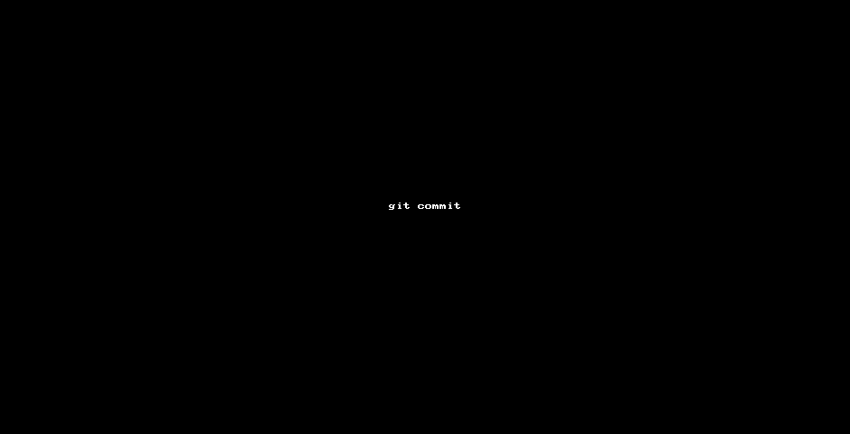

# 株式会社エプコットソフトウェア ～ 新人研修

## 目次

| No. |  |  |
| :---: | --- | --- |
| 1 | 入社前 | [入社前の準備](#入社前の準備) |
| 2 | 入社1日目 | [入社された方へ](#入社された方へ) |
| 3 | 入社2日目以降 | [カリキュラム](#カリキュラム) |

## 入社前の準備

- [パソコン](#パソコン)
- [予習](#予習)

### パソコン

パソコンをお持ちではない方は準備をお願いします。  

#### パソコン推奨スペック

研修では Windows・Mac どちらでもOKです。  
Windows の現場が多いため、慣れていなければ Windows 推奨です。  
既に Windows での開発に慣れている場合、iOSアプリ開発やMacを使用する現場も視野に入れて Mac を推奨します。  
  
個人利用（ゲーム・動画編集等）で必要なスペックについてはご自身で調べて購入するようお願いします。  
  
以下、研修での使用や、今後長く使う上での推奨スペックになります。  

##### Windows

|  |  |  |
| --- | --- | --- |
| メーカー | 自由 | Lenovo、マウスコンピューターは比較的安価です。 |
| メモリ | 8GB以上 |  |
| ストレージ | SSD 256GB以上 |  |
| CPU | Windows11の要件を満たすもの |  |
| OS | Windows11<br>または<br>Windows10 (Windows11 に無償アップグレード可能なもの) | 無償アップグレードが可能か分からない場合<br>メーカーに問い合わせてください。<br>（メモリ・CPU要件満たせていてもアップグレード出来ないケースがあります） |

- Lenovo
  - <https://www.lenovo.com/jp/ja/jpad/d/deals/promo-offers?sort=price-asc&resultsLayoutType=grid&visibleDatas=facet_freeform4%3AWindows11%20無料アップグレード対象%3Bfacet_Memory%3A8%20GB%3Bfacet_Memory%3A16%20GB>
- マウスコンピューター
  - <https://www.mouse-jp.co.jp/store/goods/search.aspx?fmt=json&limit=40&po%5B%5D=形状・タイプから探す%3Aノートパソコン&s4%5B%5D=8GB&s4%5B%5D=16GB&s4%5B%5D=32GB&s4o=1&s6%5B%5D=256GB&s6%5B%5D=512GB&s6%5B%5D=1TB&s6o=1&search=x&k_uid=a3932b4cff82a99fbc6d2d914bde6308&sort=price&style=D>

##### Mac

「MacBook Pro」推奨、最近のモデルであれば「MacBook Air」でも問題ありません。  

- MacBook Air (115,280円～)
  - <https://www.apple.com/jp/shop/buy-mac/macbook-air>
  - 講師が使用しているパソコン（MacBook Airの一番安いモデル）
    - 研修は問題なく進められます。
    - 機種 ID：MacBookAir10,1
      - <https://support.apple.com/kb/SP825>
- MacBook Pro (【14インチ】239,800円～)
  - <https://www.apple.com/jp/shop/buy-mac/macbook-pro>
  - 13インチについてはAirと比べスペックの大きい違いがない
- 「MacBook Air」「MacBook Pro」シリーズ4機種の違いをチェック【2022年2月版】
  - <https://www.itmedia.co.jp/fav/articles/2202/04/news168.html>

### 予習

必須ではないですが、入社前に学習したい方は以下の予習を行なってください。  
研修ではパソコンの使用は慣れている前提で話が進みます。

- 「[新人研修に参加する方へ](./index.md)」で予習を行ってください。
  - 「[パソコンが不慣れな方へ](./index.md#パソコンが不慣れな方へ)」は必須知識になります（時間が足りない場合はご相談ください）。
  - 「`パソコンが不慣れ`」の定義として、以下のいずれかに該当する場合とします。
    - 基本操作が出来ない。
    - ファイル・フォルダがわからない。
    - 保存するショートカットキーがわからない。
    - コピー・ペーストのショートカットキーがわからない。
    - ひとつ前に戻るショートカットキーがわからない。
    - パソコン画面のスクリーンショットを撮る方法がわからない。
    - 拡張子が何かわからない。

## 入社された方へ

入社初日は以下の作業をお願いします。  
翌営業日から[カリキュラム](#カリキュラム)に入ります。

### 入社初日の作業

| No. | 作業 |
| :---: | --- |
| 1 | [エプコット用PCユーザー作成](#エプコット用pcユーザー作成]) |
| 2 | [Teamsアカウント作成](#teamsアカウント作成) |
| 3 | [GitHub組織アカウントへの参加](#github組織アカウントへの参加) |
| 4 | [インストール](#インストール) |
| 5 | [入社初日の予習](#入社初日の予習) |

#### エプコット用PCユーザー作成

プライベートのユーザーアカウントと  
仕事で使用するユーザーアカウントは分けることを推奨します。  
分けなかった場合、実際に問題が起きたことがあります。  

- 誤って情報を流出してしまった。
- 画面共有でプライベートの見られたくないファイルを見られてしまった。
  - 相手が自分のPCを遠隔で操作することもあります。
- プライベートのGitHubアカウントでコミットしてしまった（アカウントを分けている場合）。

また、退職した際にパソコン内のソースコードや設計書などの情報を削除する必要があるため  
ユーザーアカウントを作っておくと削除が容易になります。  
Windowsの場合、会社のメールアドレスでアカウントを作成しましょう(Teamsでも使うため)。

- 参考
  - 【Windows 10】ユーザーアカウントを追加して仕事とプライベートなどを分ける
    - <https://atmarkit.itmedia.co.jp/ait/articles/2010/08/news033.html>
  - リモートで仕事するならPC（Mac）に仕事とプライベートのログインアカウントをそれぞれ設定し、使い分けよう
    - <https://20ro.diary.to/archives/27810909.html>

#### Teamsアカウント作成

- 研修中のビデオ通話・画面共有・研修の進捗報告や質問は「Microsoft Teams」を使用します。
- 講師が招待URLをお送りしますので、案内に従い会社メールアドレスでアカウントを作成して参加してください。
  - 途中でTeamsアプリのインストールを勧められますのでインストールしてください（パソコンにインストールしてください）。

#### GitHub組織アカウントへの参加

GitHubの管理者は講師になりますので  
アカウントを作成しましたら、講師までご連絡ください。

- 「[GitHub組織アカウントへの参加](./../github.md)」参照

#### インストール

- 【ブラウザ】`Google Chrome` (クローム)
  - <https://www.google.co.jp/intl/ja/chrome/>
- 【エディタ】`Visual Studio Code` (ビジュアル スタジオ コード)
  - <https://azure.microsoft.com/ja-jp/products/visual-studio-code/>

Visual Studio Code(VSCode) が初めての方へ

- VSCode最初の1歩（インストール／日本語化／基本的な使い方）
  - <https://youtu.be/auGKppIIV4Y>

##### Visual Studio Code 詳細設定

難しければ飛ばしてもOKです。

- 拡張機能のインストール
  - 「`Japanese Language Pack for Visual Studio Code`」 VSCodeを日本語化出来ます。
    - <https://marketplace.visualstudio.com/items?itemName=MS-CEINTL.vscode-language-pack-ja>
  - 「`Trailing Spaces`」 行末のスペースを可視化してくれる機能です。
    - <https://marketplace.visualstudio.com/items?itemName=shardulm94.trailing-spaces>
  - 「`markdownlint`」 Markdown(`.md`)ファイルのスタイルチェックをしてくれる機能です。
    - <https://marketplace.visualstudio.com/items?itemName=DavidAnson.vscode-markdownlint>
  - 「`Code Spell Checker`」 スペルミスを検出してくれる機能です（名詞等はかかりやすいので ignoreWords に設定）
    - <https://marketplace.visualstudio.com/items?itemName=streetsidesoftware.code-spell-checker>
  - 「`Rainbow CSV`」 CSV・TSVファイルが見やすくなる機能です。
    - <https://marketplace.visualstudio.com/items?itemName=mechatroner.rainbow-csv>
  - 「`open in browser`」 HTMLをブラウザで開く機能です。
    - <https://marketplace.visualstudio.com/items?itemName=techer.open-in-browser>
- `setting.json` の開き方
  - メニューバー「表示」→「コマンドパレット」で「`Open Settings (JSON)`」
  - `setting.json` の以下の設定は任意で

  ```json
  {
      "explorer.copyRelativePathSeparator": "/", // 「相対パスをコピー」の時の区切り文字
      "editor.fontFamily": "'BIZ UDゴシック', Consolas, 'Courier New', monospace",
      "editor.rulers": [120], // エディタの120文字目の所にルーラーを表示
      "editor.renderWhitespace": "all", // スペースを可視化
      "editor.linkedEditing": true, // HTMLタグ等の編集時、関連する記号が更新される（PHPには無効）
      "editor.bracketPairColorization.enabled": true, // 「{}」のペアに色がつく
      "editor.bracketPairColorization.independentColorPoolPerBracketType": true, // 異なるタイプのブラケットは同じ色にする
      "editor.guides.bracketPairs": true, // アクティブな「{}」のペアを強調表示
      "workbench.colorCustomizations": {
          // ブラケットの色（お好みで）
          "editorBracketHighlight.foreground1": "#D3D3D3",
          "editorBracketHighlight.foreground2": "#DCDCAA",
          "editorBracketHighlight.foreground3": "#C586BB",
      },
      "files.eol": "\n", // 既定の改行文字、新規作成時のデフォルト
      "files.trimTrailingWhitespace": true, // 保存時に行末のスペースを削除する
      "[log]": {
          // LOG ファイル設定
          "editor.wordWrap": "off", // 行を折り返さない
          "editor.insertSpaces": false, // Tabキーを押した時にスペースに変換されない
      },
      "[csv]": {
          // CSV ファイル設定
          "editor.wordWrap": "off", // 行を折り返さない
      },
      "[tsv]": {
          // TSV ファイル設定
          "editor.wordWrap": "off", // 行を折り返さない
          "editor.insertSpaces": false, // Tabキーを押した時にスペースに変換されない
      },
      "[markdown]": {
          // Markdown(.md) ファイル設定
          "files.trimTrailingWhitespace": false, // 保存時に行末のスペースを削除しない
          "editor.tabSize": 2
      },
      // 拡張機能: markdownlint 設定
      "markdownlint.config": {
          "MD033": false // html: Markdown のテーブル内改行で<br>を使うことがあるため
      },
      // 拡張機能: Code Spell Checker 設定
      "cSpell.ignoreWords": [
          // チェック対象外のワード
          "epkot",
          "markdownlint",
          "laravel",
      ],
      // ↓↓↓ その他設定は略
  }
  ```

#### 入社初日の予習

入社初日は予習をしておいてください。

- [予習](#予習)

## カリキュラム

| No. | 日数 | 内容 |
| :---: | --- | --- |
| 1 | - | [`はじめに`](#はじめに) |
| 2 | - | [`準備`](#準備) |
| 3 | - | [`コーダー編`](#コーダー編) |
| 4 | - | [`マークアップエンジニア編`](#マークアップエンジニア編) |
| 5 | - | [`フロントエンドエンジニア編`](#フロントエンドエンジニア編) |
| 6 | 3.0 | [`Linux編`](#linux編) |
| 7 | - | [`開発手法編`](#開発手法編) |
| 8 | - | [`設計編`](#設計編) |
| 9 | - | [`テスト編`](#テスト編) |
| 10 | - | [`ファイル編`](#ファイル編) |
| 11 | - | [`セキュリティ編`](#セキュリティ編) |
| 12 | - | [`バックエンド編`](#バックエンド編) |
| 13 | - | [`バージョン管理システム編`](#バージョン管理システム編) |
| 14 | - | [`Git編`](#git編) |
| 15 | - | [`プログラミング編`](#プログラミング編) |
| 16 | 0.5 | [`コーディング規約編`](#コーディング規約編) |
| 17 | - | [`データベース編`](#データベース編) |
| 18 | 20 | [`自己学習`](#自己学習) |

## はじめに

前提として、全てを理解する必要はありません。  
研修では広く浅く楽しみながら学び、分からない所は  
研修担当者に聞いたり、後で調べるためのワードだけ覚えておき  
必要になった時、時間が出来た時に深く学習していきましょう。  

まずは、Webプログラミングのイメージをつかみましょう。  
課題の提出は「GitHub」を使うので何をするものか確認してください  
提出の仕方については、提出時にお教えします。  
また、エンジニアになると検索することが多くなりますので検索力も身につけましょう。

- 動画
  - <https://youtube.com/playlist?list=PLCX3wwS3Gg4x7RMa9JE5uelCqvzmdmVfA>
    - `4:57` 【初心者向け】Webエンジニアとして独り立ちするために学ぶべきスキルマップ【プログラミング】
    - `6:56` 【初心者向け】Webプログラミングの始め方 スキル0⇒1のためにやるべき具体的な手順
    - `11:02` GitHubとは？【分かりやすい解説シリーズ #14】【プログラミング】
    - `12:30` 8割の人が知らない検索術・ググり方【知らないと損】
    - `23:25` エンジニアは検索力が大事。プログラミングスキル向上にググり力は必須です。

### 休止時間

ほぼ全てがPCを使った研修となるため  
VDT症候群予防の観点から、1時間連続でPC上で作業した場合、10分程度の休止時間(ディスプレイを見ない時間)を設けましょう。  
休止時間の使い方はお任せします（情報整理、書籍での学習、小休憩、運動等）  

上記の休止時間を考慮して、1日の研修時間は**8.0h**ではなく**6.5h**程度が目安です。

## 準備

### PC設定・インストール

- 「[新人研修に参加する方へ（PC設定・インストール）](./index.md#pc設定)」参照

### Git設定確認

[GitHub ～ Git設定確認](./../github.md#git設定確認) の設定が漏れていると  
コミットが失敗しますので再度ご確認ください。

### ユーザーディレクトリ作成

開発環境を構築し、プログラムファイルを格納するための  
ブランチ(`feature/{★ユーザー名}`)及び、個人フォルダー（ディレクトリ）を作成します。  
詳しくは [研修用リポジトリ(training)](https://github.com/epkotsoftware/training) のREADMEをご覧ください。  

  ※ GitHubを開く時に Microsoft Edge を使用している場合、自動翻訳されることがあるので翻訳を解除してください。  
    URLの右の方に「`aあ`」のアイコンがあり、翻訳設定が可能です。  
  ※ [研修用リポジトリ(training)](https://github.com/epkotsoftware/training)の権限がないと失敗します。リポジトリが見えない方は管理者にご連絡ください。  

上記の手順でGitHub上には「`feature/{★ユーザー名}`」ブランチにユーザーディレクトリが出来ていて  
ローカルには「`training`」ディレクトリが出来ているので  
Visual Studio Code(VSCode) で開きましょう。  
メニューバー「ファイル」→「フォルダーを開く」→「`training`」フォルダーを選択  


ターミナルが表示されていない場合は  
メニューバー「表示」→「ターミナル」を押下してください。  

ターミナルの種類はお好みで良いですが「Git Bash」がおすすめです。  
ターミナルの「`+`」のすぐ横にあるアイコンで選択可能です。

#### ユーザーディレクトリ作成報告

研修担当者にユーザーディレクトリを作成した旨、報告をお願いします。  
正しく出来ているか確認します。  

**※ 以降は自分のユーザーディレクトリ内で作業をお願いします。**

## コーダー編

| 課題 | 格納フォルダ・ファイル |
| --- | --- |
| [コーダー編課題](#コーダー編課題) (HTML・CSS等) | `users/自分のユーザー名/01_beginner/htdocs/index.html` |

まずは動画で学習しましょう。

- 動画
  - <https://youtube.com/playlist?list=PLCX3wwS3Gg4wQs1w27nhrURdByT3cSNBp>
    - `10:17` 【2021年最新】HTML入門🔰初心者向けにHTMLの基礎を解説！
    - `11:33` 【CSS入門講座🔰】HTMLとCSSの基本を解説！WEBデザインの言語CSSを理解しよう
      - ※ 動画内で`<header>`タグが出てきますが`<head>`タグの間違いです。`<header>`タグは別の用途で使用します。
    - `11:25` 【Web業界の常識】「パス」の書き方、説明できますか？Webデザイナー・プログラマー志望の皆さんへ 初心者向け【HTML・CSS コーディング】
    - `14:24` 【Webデザイナー・プログラマーになりたい皆さんへ】Web業界の常識シリーズ10選！知らないままではマズいです… キャッシュ/スーパーリロード/アクセス制限の方法etc【初心者必見】
    - `8:22` HTML入門講座 #02：初めてのHTMLページを作ろう／ファイル名の付け方
  - VSCode フォルダ・ファイル追加方法
    

動画を見終わったら、[CBC](https://cbc-study.com/)の入門コースをやっていきましょう。

- 入門1（コーダー 初級）
  - <https://cbc-study.com/training/beginner/page1>
  - <https://cbc-study.com/training/beginner/page2>
  - <https://cbc-study.com/training/beginner/page3>
  - <https://cbc-study.com/training/beginner/page4>
- 入門2（コーダー 中級）
  - <https://cbc-study.com/training/beginner/page5>
  - <https://cbc-study.com/training/beginner/page6>
  - <https://cbc-study.com/training/beginner/page7>
- 入門3（コーダー 上級）
  - <https://cbc-study.com/training/beginner/page8>
  - **注意: [「8. 枠が完成！」](https://cbc-study.com/training/beginner/page8#pl-12) の「このようになります。」のリンクをクリックすると誤ったサンプルが出てきますので無視してください。**

2022/6/15でブラウザの「`Internet Explorer(IE)`」が廃止されることにより  
CSSの「`grid-template`」が、ほぼ全てのブラウザでサポートされます。  
今後、使われる事が増えそうなので以下も覚えておきましょう。

- 動画
  - 【HTML/CSSレイアウト】Gridを使うとFlexboxより簡単に複雑なレイアウトを組めます
    - <https://youtu.be/cwkkD0ejX8Q>

### コーダー編課題

1日で出来る範囲で、自由にページを作成しましょう。  
思いつかなければ「実践を踏まえたコーディング」で作ったページのレイアウト変更でもOKです。  
課題提出についてはGitHubで行います。

- 要件
  - 対応ブラウザ
    - Google Chrome
  - 表示
    - 自分のユーザーディレクトリの「`01_beginner/htdocs/index.html`」をブラウザで開くと、作成したページが見れる。
    - 横幅:`1024px` で表示が崩れないようにする（横スクロールバーが出ないようにする）
  - その他
    - 自分のユーザーディレクトリの「`01_beginner/htdocs/`」ディレクトリ内にHTML・CSSが入っていること
- フリー素材  ***※ フリー素材を使用する際は、利用規約は確認してください。***
  - `商用利用可能なアイコン・イラスト素材ならICON HOIHOI`
    - <http://iconhoihoi.oops.jp/>
  - `O-DAN (オーダン）- 無料写真素材・フリーフォト検索`
    - <https://o-dan.net/ja/>
  - `ぱくたそ - すべて無料の写真素材（フリー素材）人物や背景・テクスチャなどの写真をダウンロード`
    - <https://www.pakutaso.com/>
  - `かわいいフリー素材集 いらすとや`
    - <https://www.irasutoya.com/>

横幅を指定した確認方法

1. Google Chrome のDevToolsを開く(Windowsであれば「F12」キー)
1. デバイスツールバーを開く
  
1. デバイスを選択する（今回の場合`iPad Pro`の縦表示で横幅が1024pxになるのでちょうど良い）  
  「`Responsive`」で自由にピクセル指定も可能です。
  

- Edit でデバイスを追加することも可能です、以下は入力例
  - Device Name: Desktop Test
  - Width: 1024
  - Height: 620
  - Device pixel ratio: 1
  - User agent string: 未入力
  - User agent type: Desktop

#### コーダー編課題チェックリスト

- 要件通り作られていること
  - 自分のユーザーディレクトリの「`01_beginner/htdocs/index.html`」をブラウザで開くと、作成したページが見れこと
  - Google Chrome で見れること
  - 横幅:`1024px` で表示が崩れないこと、横スクロールバーが出ないこと

### コーダー編課題GitHubアップロード

VSCodeでのアップ方法は以下を参考にしてください。

- Gitクライアントはもういらない！ VSCodeで、Gitを使いこなそう (3:09～)
  - <https://youtu.be/vMZ0C06soxA?t=189s>

#### アップ先

trainingリポジトリの [users/{★ユーザー名}/01_beginner/README.md](https://github.com/epkotsoftware/training/blob/template/users/_template/01_beginner/README.md) にアップ先が記載されています。  

- アップ方法 (OR)
  - VSCodeで行う（コマンドと比べると簡単）。
  - `Git Bash` でコマンドで行う。
- 禁止事項
  - 自分のユーザーディレクトリ以外のコミットを禁止（`users/_template` 内のファイル等）
  - GitHub上でのアップロードは禁止します（Gitの学習を兼ねているため）

Git・GitHubについては、「[バージョン管理システム編](#バージョン管理システム編)」で深く学習します。

#### 課題提出例

VSCodeを使用した提出例です。

1. 「`ソース管理`」アイコンをクリック
1. 「`ツリーとして表示`」アイコンをクリックし、アップするファイルに間違いがないか確認する。
1. コミット対象ファイル・フォルダの「`+`」アイコン(変更をステージ)をクリックし、ステージする。  
  **※ 対象外のファイルはステージしないこと**
1. コミットメッセージを入力
1. 「`コミット`」アイコンをクリックし、ステージしたファイルをコミットする。
1. 「`git push`」コマンドでコミットした内容をGitHubへ反映する。
1. GitHubでコミットが反映されたか確認する  
  <https://github.com/epkotsoftware/training/commits/>



### Chrome DevTools

- Chrome DevToolsの使い方を徹底解説！Chrome Developer Toolsを使いこなすと開発効率が上がる！
  - <https://youtu.be/awRkFcv51r4>
  - 設計やテストエビデンス等で、スクリーンショットを撮る事が多いです。
    - DevToolで 「Ctrl」 + 「Shift」を押しながら 「P」 を押すと、コマンドパレットが出るので  
      「screenshot」と打つと、いくつかのキャプチャ方法が出てきます。
      - 
      - `Capture area screenshot` : 手動で選択範囲を指定してキャプチャ、画面上のカーソルが「+」になるのでドラッグして範囲を決める。
      - `Capture full size screenshot` : スクロールした分も含めてページ全体をキャプチャ
      - `Capture node screenshot` : 選択しているノードをキャプチャ
      - `Capture screenshot` : iPhone等のフレームも含めてキャプチャ、顧客向けの資料作成に便利。

## マークアップエンジニア編

| 課題 | 格納フォルダ・ファイル |
| --- | --- |
| Excel(売上表・成績表) | `users/自分のユーザー名/02_basic/excel` |
| jQuery(#7 簡単な機能をjQueryで実装しよう) | `users/自分のユーザー名/02_basic/htdocs/kadai_07.html` |
| jQuery(#8 変数を使う 〜 #11 モーダルウィンドウを作ろう) | `users/自分のユーザー名/02_basic/htdocs/kadai_08.html` |

- 動画
  - <https://youtube.com/playlist?list=PLCX3wwS3Gg4y99r2bSBpir2nmMv4rzfcL>
    - `12:56` HTTPの仕組み｜GET・POSTリクエスト/ステータスコード/サーバー通信/ユーザエージェントなどの基礎を解説
    - `15:56` IPアドレスの仕組みとは🔰プライベートIP/パブリックIPやIPv6など、IPアドレスの基本を解説
    - `5:57` ポートとは？【TCP/IP基礎】｜プログラマー養成講座
    - `6:28` ドメイン、サーバーとは？ホームページの仕組みを解説😃これでDNSやIPアドレスもわかるようになる！
    - `6:24` WEBサーバーの仕組み入門｜ApacheやNginxなどWEBサーバーの基本を初心者向けに解説
    - `16:19` 【超入門】初心者向け レスポンシブデザイン完全攻略！メディアクエリ等解説【HTML・CSS コーディング】

[CBC](https://cbc-study.com/)の基礎コースをやっていきましょう。  
Excelをお持ちでない方は、無料のOffice OnlineでもOKです。

- Microsoft Office Online (Excel)
  - <https://www.office.com/launch/excel>

```txt
■ GoogleスプレッドシートでのExcelファイル(.xlsx)の開き方
Googleマイドライブ → 「新規」 → 「ファイルのアップロード」→ アップロードしたファイルをダブルクリック

■ GoogleスプレッドシートでのExcelファイル(.xlsx)のダウンロード
「ファイル」→「ダウンロード」→「Microsoft Excel (.xlsx)」
```

- 基礎1（マークアップエンジニア 初級）
  - CBC基礎コースを読むだけです。
  - <https://cbc-study.com/training/basic/page1>
  - <https://cbc-study.com/training/basic/page2>
  - <https://cbc-study.com/training/basic/page3>
- 基礎2（マークアップエンジニア 中級）
  - <https://cbc-study.com/training/basic/page4>
  - <https://cbc-study.com/training/basic/page5>
  - `https://cbc-study.com/training/basic/page6` ※ page6はないようです。
  - <https://cbc-study.com/training/basic/page7>  
      → 「`02_basic/htdocs/kadai_07.html`」
  - <https://cbc-study.com/training/basic/page8>  
      → 「`02_basic/htdocs/kadai_08.html`」

**※ 基礎3（マークアップエンジニア 上級） は研修外とします。興味があれば自己学習でお願いします。**  
**※ `css/common.css` はindex.htmlにも使われているCSSファイルで、共通で使うスタイルを想定しています。**  
　**ページ固有のスタイルは入れないように注意しましょう。**

### マークアップエンジニア編課題

- 作成したエクセルファイル
  - 必須: 「`#2 エクセル関数（売上票を作る）`」、「`#3 エクセル関数（成績表を作る）`」
  - 任意: 「`#4 オートカレンダーを作る`」
- jQuery課題
  - 必須
    - 「`#7 簡単な機能をjQueryで実装しよう`」  
      → 「`02_basic/htdocs/kadai_07.html`」
    - 「`#8 変数を使う`」、「`#9 関数を使う`」、「`#10 コンソールでデータの確認`」、「`#11 モーダルウィンドウを作ろう`」  
      見た目も`kadai_07.html`と似せましょう。
      → 「`02_basic/htdocs/kadai_08.html`」

trainingリポジトリの [users/{★ユーザー名}/02_basic/README.md](https://github.com/epkotsoftware/training/tree/template/users/_template/02_basic/README.md) にアップ先が記載されています。

#### マークアップエンジニア編課題チェックリスト

- `css/common.css` にページ固有のスタイルが入っていないこと
  - 例えばモーダル関連のスタイル等
- 全ページのデザインが統一されていること
- `kadai_07.html` 用のJavaScriptおよびスタイルが他ページに適用されないこと
- `kadai_08.html` 用のJavaScriptおよびスタイルが他ページに適用されないこと
- TODOコメントが全て削除されていること

## フロントエンドエンジニア編

| 課題 | 格納フォルダ・ファイル |
| --- | --- |
| #1 PHPとjsで簡単なアプリを作ってみよう 〜 | `users/自分のユーザー名/03_advanced/htdocs/` |
| #11 PHPでClassクラスを理解するための準備 | `users/自分のユーザー名/03_advanced/htdocs/sortable2/` |
| #12 PHPアプリケーションをクラス化してみよう | `users/自分のユーザー名/03_advanced/htdocs/sortable3/` |
| 任意課題 | `users/自分のユーザー名/03_advanced/htdocs/epkot/` |

フロントエンドエンジニア編ではCBCの応用コースをやっていきます。  
開発環境については以下の仮想環境を構築します。

### 仮想環境

まず仮想環境について学習しましょう。

- 仮想環境とは？
  - <https://bcblog.sios.jp/what-is-virtualenvironment-vmware/>
- Dockerやってる人向けのVagrant超入門
  - <https://qiita.com/nnishimura/items/b6fd4b665b25a411fbeb>

#### Docker

今回はコンテナ型の仮想化環境である「Docker」を使います。

- 動画
  - 【2021年最新】Docker環境構築入門｜14分でdocker-composeまで完全解説！【windows/mac対応】Dockerの使い方
    - <https://youtu.be/VIzLh4BgKck>

##### Dockerインストール

Docker Desktop をインストールしてください。

- [Docker Desktopインストール](./docker/install.md)

##### 構築手順

trainingリポジトリの [users/{★ユーザー名}/03_advanced/README.md](https://github.com/epkotsoftware/training/blob/template/users/_template/03_advanced/README.md) をご覧ください。

- コンテナ起動がうまくいかなかったらご連絡ください。
  - [Docker トラブルシューティング](./docker/troubleshoot.md)

### PHP入門

- 動画
  - <https://www.youtube.com/playlist?list=PLCX3wwS3Gg4wr82E46gEdFnT6VTo_uehr>
    - `10:01` サーバーサイドとは？サーバーサイドとクライアントサイド言語の違い
    - `1:02:33` PHPプログラミング入門講座🔰【初心者でも1時間で学べるPHP入門！フル字幕】
    - `4:05` セッション変数とは？【分かりやすい解説シリーズ #17】【プログラミング】

### PHP VSCode拡張機能

以下の導入を推奨します。  
「`PHP DocBlocker`」はPHPDocが必須の現場では重宝します。

- PHP Intelephense
  - コード補完・PSR-12コードフォーマット等、PHPに関する様々な機能が追加されます。
  - <https://marketplace.visualstudio.com/items?itemName=bmewburn.vscode-intelephense-client>
- PHP DocBlocker
  - 関数等のメンバーの上で「`/**`」を入力してEnterキーを押すだけで、自動的にPHPDocが生成されます。
  - <https://marketplace.visualstudio.com/items?itemName=neilbrayfield.php-docblocker>
  - PHPDocリファレンス
    - <https://zonuexe.github.io/phpDocumentor2-ja/references/phpdoc/index.html>

### CBC 応用

CBCと開発環境が異なるので、気を付けてください。  

- 応用1（フロントエンドエンジニア 初級）
  - <https://cbc-study.com/training/advanced/page1>
    - **MAMP、XAMPPは不要です！**
    - 環境はDockerで構築するため内容を確認するだけでOKです。
  - <https://cbc-study.com/training/advanced/page2>
  - <https://cbc-study.com/training/advanced/page3>
  - <https://cbc-study.com/training/advanced/page4>
    - **[②テーブルの作成](https://cbc-study.com/training/advanced/page4#pl-12) でアニメーションGifでは「`left_x`」、「`top_y`」カラムの NULL にチェックを入れ忘れているのでご注意ください（CREATE文で作成した場合は問題なし）。**
      
- 応用2（フロントエンドエンジニア 中級1）
  - <https://cbc-study.com/training/advanced/page5>
    - PDO(DB_DNS)設定について
      - CBCの設定(host)と異なりますのでご注意ください。[詳しくは03_advanced/README.md ～ PHP 参照](https://github.com/epkotsoftware/training/blob/template/users/_template/03_advanced/README.md#php)
        - `define('DB_DNS', 'mysql:host=mysql; dbname=cri_sortable; charset=utf8');`
  - <https://cbc-study.com/training/advanced/page6>
  - <https://cbc-study.com/training/advanced/page7>
  - <https://cbc-study.com/training/advanced/class1>

#### エラーが出た場合

- URL(パス)に誤りがないか確認しましょう。
- HTML側（`<input name="xxx">`）とPHP側（`$_POST['xxx']`）の名称が一致していることを確認しましょう。

### フレームワーク

- フレームワークとは
  - <https://www.otsuka-shokai.co.jp/words/framework.html>
- 動画
  - フレームワークとは？プログラミングに必須のフレームワークを初心者向けに解説！
    - <https://youtu.be/eTCjvTo5KgQ>

### フロントエンドエンジニア編課題

- 「フロントエンドエンジニア編」で作成したファイル

trainingリポジトリの [users/{★ユーザー名}/03_advanced/README.md](https://github.com/epkotsoftware/training/blob/template/users/_template/03_advanced/README.md) にアップ先が記載されています。  

#### フロントエンドエンジニア編課題チェックリスト

- `htdocs/index.php`
  - 登録ボタン
    - 男性での登録が可能なこと
    - 女性での登録が可能なこと
  - ドラッグ
    - 移動することが出来、DBも更新されること
- `htdocs/sortable2/index.php`
  - 登録ボタン
    - 男性での登録が可能なこと
    - 女性での登録が可能なこと
  - ドラッグ
    - 移動することが出来、DBも更新されること
- `htdocs/sortable3/index.php`
  - 登録ボタン
    - 男性での登録が可能なこと
    - 女性での登録が可能なこと
  - ドラッグ
    - 移動することが出来、DBも更新されること

**※ CBCのソースコードのコピーではうまくいかない部分もあるので、レビュー依頼前に自身でテストしましょう。**

## Linux編

Linuxコマンドについて学んでいきましょう。  
フロントエンドエンジニア編で作成した環境の[WEB Server](https://github.com/epkotsoftware/training/blob/template/users/_template/03_advanced/README.md#web-server)へ入ると操作が出来ます（OSはDebian）。  
[04_linux](https://github.com/epkotsoftware/training/tree/template/users/_template/04_linux) にUbuntu環境も用意しました（どちらもコマンドに大きい違いはありません）。
情報量が多く全て覚えるのは難しいので、「[vi](#vi)」までを2日、「[Linux模擬問題](#linux模擬問題)」を1日の計3日を目安としてください。

- Linux OS
  - Ubuntu
    - <https://www.ubuntulinux.jp/ubuntu>
  - Debian
    - <https://www.debian.or.jp/using/>
  - CentOS
    - <<https://www.centos.org/>
    - 「CentOS Linux」は開発終了となり、今後は「CentOS Stream」に移行。
    - Comparing Centos Linux and CentOS Stream
      - <https://www.centos.org/cl-vs-cs/>
    - 「CentOS Stream 9」、ダウンロード提供が開始
      - <https://japan.zdnet.com/article/35180408/>
  - 12月Webサイト向けLinuxシェア、Ubuntuの増加傾向続く
    - <https://news.mynavi.jp/techplus/article/20211203-2211480/>
- 動画
  - <https://youtube.com/playlist?list=PLCX3wwS3Gg4zOMS9ezkea4tDt5U7s2yRa>
    - `13:03` Linuxコマンドの使い方入門｜CUIとGUIの違いやシェルについて解説！【プログラマー必須スキル】
    - `6:31` シェルスクリプトとは？【分かりやすい解説シリーズ #68】【プログラミング】
    - `7:47` CRONとは？【分かりやすい解説シリーズ #64】【プログラミング】
- 初心者マークのUNIX/Linux
  - <https://www.creatology.jp/unix/>
  - UNIX/Linux コマンド「超」基本操作
    - <https://www.creatology.jp/unix/beginner.html>
  - UNIX/Linux 設定「超」基本知識
    - <https://www.creatology.jp/unix/settei.html>
  - 図解：標準入力、標準出力、標準エラー出力、パイプとは ?
    - <https://www.creatology.jp/unix/outin.html>
- 【bash入門】bashシェルスクリプトの書き方
  - <https://tech-blog.rakus.co.jp/entry/20210525/shellscript>
  - bashの実行例

```bash
root@training-web:/var/www/html# # hoge.sh を作成
root@training-web:/var/www/html# cat << 'EOF' > hoge.sh
> #!/bin/bash
>
> NUM=8
> MESSAGE=Hello_bash
>
> echo $NUM
> echo $MESSAGE
> EOF
root@training-web:/var/www/html# # hoge.sh をテキスト表示
root@training-web:/var/www/html# cat hoge.sh
#!/bin/bash

NUM=8
MESSAGE=Hello_bash

echo $NUM
echo $MESSAGE
root@training-web:/var/www/html# # hoge.sh を実行
root@training-web:/var/www/html# bash hoge.sh
8
Hello_bash
root@training-web:/var/www/html# 
```

- 初心者必見！よく使うLinuxコマンド一覧表【全33種】
  - <https://www.sejuku.net/blog/5465>
- ターミナルソフト（今の所、研修では使用しない）
  - RLogin
    - <https://kmiya-culti.github.io/RLogin/>
  - Tera Term
    - <https://forest.watch.impress.co.jp/library/software/utf8teraterm/>
  - ターミナルソフトはTeratermよりRLoginがおすすめの理由
    - <https://infrasenavi.com/mibunrui/361>

### シェル実行の注意点

UbuntuやDebianでシェルを実行する際に「`sh "ファイル名"`」で実行すると「`bash`」ではなく「`Debian Almquist shell(dash)`」で実行されます。  
「`#!/bin/bash`」の記載があるシェルを実行する際は、「`bash "ファイル名"`」で実行します。  

```bash
bash hoge.sh
```

Debian(Ubuntu)の「`/bin/sh`」のシンボリックリンクが「`/bin/dash`」になっているため  
このようなことが発生します。  

### vi

vi（ヴィーアイ）はLinuxのテキストエディタです。  
サーバー上のcronやコンフィグファイル等の修正を行うことがあるので  
適当なテキストファイルを配置し、実際に編集してみましょう。

- Linuxの標準エディタvi(vim)の超基本的な使い方！動画で初心者にもわかりやすく解説！
  - <https://blog.proglus.jp/4194/>

### Linux模擬問題

Linux技術者認定試験(LPIC)の一部にチャレンジしてみましょう。  
問題数が多く、現場ではほぼ使用しないものもあるため1日で出来る範囲でOKです。  
全問正解する必要はありませんが、答えの解説はしっかり確認してください。

- LPIC模擬問題
  - <https://lpic-study.com/>
    - LPIC102 シェル、スクリプト、およびデータ管理の問題
      - <https://lpic-study.com/exam/LPIC+102-no_1-next.php>
    - LPIC101 GNUとUnixのコマンド **※ 問題数が多いため出来るところまで**
      - <https://lpic-study.com/exam/LPIC+101-GNUとUnixのコマンド-no_1-next.php>

## 開発手法編

- 動画
  - ウォーターフォール型の開発手法とは？要件定義・基本設計などシステム開発の進め方を解説！
    - <https://youtu.be/qVsRGd2bvcU>
  - アジャイル開発入門！スクラムで実践するアジャイル開発のやり方と勉強法とは
    - <https://youtu.be/Jm3I6QXzjXw>
- 基本情報技術者試験で問われるシステム開発手法の解説！
  - <https://www.foresight.jp/fe/column/system-development-method/>

## 設計編

- システム設計の流れ｜基本設計と詳細設計の違いや、設計書の書き方を解説！
  - <https://youtu.be/OXJtc_aBm9M>
- システム設計とは？基本情報技術者試験の重要用語解説！
  - <https://www.foresight.jp/fe/column/system-design/>
- DB設計
  - データベース入門講座
    - <https://www.youtube.com/playlist?list=PL-1KBX2gDRujQaRgEByueezHBiqHP8KDD>
  - テーブル定義書サンプル
    - SQLクライアントソフトの「`A5:SQL Mk-2`」を使い、データベースからテーブル定義書を自動出力したサンプルです。  
      フロントエンドエンジニア編で作成したテーブルの定義書になります。
      - [テーブル定義書.xlsx](./files/テーブル定義書.xlsx)
      - [テーブル定義書.pdf](./files/テーブル定義書.pdf) （ExcelをPDF変換したもの）
  - 基本情報技術者試験の鬼門であるデータベースの正規化について解説
    - <https://www.foresight.jp/fe/column/normalization/>
- 設計書テンプレート
  - テンプレートが多くありますが現場で使うのは「基本設計」・「詳細設計書」になります。  
    基本設計では「テーブル定義書」「画面レイアウト」は、ほぼ確実に現場で見ることになります。
  - 設計書仕様書テンプレート PocketDOC
    - <https://pocket9.net/pocketdoc>
- UML
  - UMLとは？クラス図・シーケンス図など種類や書き方、ツールを解説！【統一モデリング言語】UML入門
    - <https://youtu.be/EvO_BvCJUCA>
  - diagrams.net（Draw.io）
    - こちらで無料で図の作成が可能です。
    - <https://app.diagrams.net/>
  - PlantUML
    - こちらでもシーケンス図やER図等の作成が可能です。
      - コードを書いて作成するため、細かいレイアウト調整は難しいですが、簡易的な図を作成する場合に有用です。
      - SVG形式で出力することで、リンクも使用でき。Markdownでの設計書作成時に使われる事がある。
    - <https://plantuml.com/ja/>
    - サンプル: 別ページに現場で使用経験のあるものを集めました。
      - [PlantUML](./training_plantuml.md)

### 画面設計

以下、参考程度にご覧ください。  
特にiOSアプリはデザインで審査が通らなくなるケースもあるので  
画面設計時は注意が必要です（実際に手戻りが発生した事がありました）。

- 画面設計書のイメージ
  - 発注者ビューガイドラインの公開
    - <https://www.ipa.go.jp/sec/softwareengineering/reports/20080710_3.html>
- iOS
  - ユーザーインターフェイスのデザインのヒント
    - <https://developer.apple.com/jp/design/tips/>
  - Human Interface Guidelines
    - <https://developer.apple.com/design/human-interface-guidelines/>
- Android
  - Android 向けのデザイン
    - <https://developer.android.com/design?hl=ja>
- マテリアルデザイン
  - <https://material.io/design>
  - <https://material.io/develop>
- WEB
  - ボタンやアラートの色は「Bootstrap」で学ぶと良いです。
    - Laravelの標準が現在では「Tailwind CSS」となっているので情報を載せておきます。
  - Bootstrap（ブートストラップ）
    - Alerts (アラート) <https://getbootstrap.jp/docs/5.0/components/alerts/>
    - Buttons (ボタン) <https://getbootstrap.jp/docs/5.0/components/buttons/>
    - Forms (フォーム) <https://getbootstrap.jp/docs/5.0/forms/overview/>
    - サンプル <https://getbootstrap.jp/docs/5.0/examples/>
  - Tailwind CSS（テールウィンドCSS）
    - Colors <https://tailwindcss.com/docs/customizing-colors>
    - Alerts <https://v1.tailwindcss.com/components/alerts>
    - Buttons <https://v1.tailwindcss.com/components/buttons>
    - Forms <https://v1.tailwindcss.com/components/forms>
    - Laravel で使える Dashboard template
      - <https://github.com/tailwindcomponents/dashboard>

## テスト編

- 動画
  - <https://www.youtube.com/playlist?list=PLCX3wwS3Gg4woCtbeXq9KTT4_HevW-vVz>
    - `11:58` テスト入門講座01 テストの概要・流れ・前提知識
    - `13:42` テスト入門講座02 テストケース設計のコツ・ポイント
    - `6:58` テスト入門講座03 テストデータ作成のコツ・ポイント
    - `9:13` テスト入門講座04 テスト自動化！JUnitの使い方
    - `19:24` テスト入門講座05 バッチ処理のテスト自動化！生産性を劇的に上げるDBUnitの使い方
- システム開発におけるテストとは？基本情報技術者試験の重要用語解説！
  - <https://www.foresight.jp/fe/column/conducting-test/>
- PHPUnit
  - <https://phpunit.readthedocs.io/ja/latest/>
  - テストダブル
    - <https://phpunit.readthedocs.io/ja/latest/test-doubles.html>
- Laravel
  - Laravel テスト
    - <https://readouble.com/laravel/8.x/ja/>
    - Laravel データベーステスト
      - <https://readouble.com/laravel/8.x/ja/database-testing.html>
    - Laravel モック
      - <https://readouble.com/laravel/8.x/ja/mocking.html>
  - Mockery
    - <https://readouble.com/mockery/1.0/ja/>

## ファイル編

XML・CSV・JSON・画像(JPG・PNG・GIF・WEBP・SVG) について学習しましょう。

- 動画
  - <https://youtube.com/playlist?list=PLCX3wwS3Gg4yh-k4eOBoRq1Muco5ianO8>
    - `8:07` XMLとは？8分でわかるXML形式データの使い方入門
    - `11:48` CSVファイルとは？CSV形式の基本から作成方法を完全解説！
    - `8:04` JSONとは？8分でわかるJSON形式データの使い方入門
    - `20:10` Webやブログで重要なJPG・PNG・WEBPなどの【画像拡張子】の特徴や違い＆その使い方を徹底解説！

## セキュリティ編

セキュリティについて学習していきます。  
いずれも開発で求められる知識になります。  
  
参考コードとして載せている処理については、現場では既に用意されていたり  
フレームワークを使用していることが多いので、参考程度に見ておきましょう。

- 動画
  - <https://youtube.com/playlist?list=PLCX3wwS3Gg4xfAHP_c5aGDzfO7r22u-ed>
    - `6:21` バリデーションとは何なのか、現役エンジニアが解説【超入門編】
    - `3:34` 【初心者向け】ハッシュ化と暗号化の違いとは？不可逆変換とは？
    - `7:27` CSRFとは？ サイバー攻撃＆対策【分かりやすい解説シリーズ #58】【プログラミング】
    - `8:03` SQLインジェクション【サイバー攻撃＆対策】【分かりやすい解説シリーズ #60】【プログラミング】
    - `8:09` SSHとは？【分かりやすい解説シリーズ #65】【プログラミング】
    - `4:56` 公開鍵認証とは？【分かりやすい解説シリーズ #24】【プログラミング】
- 基本情報技術者試験で問われる情報セキュリティの基本を解説！
  - <https://www.foresight.jp/fe/column/information-security/>
- PHP
  - PHPマニュアル 安全なパスワードハッシュ
    - <https://www.php.net/manual/ja/faq.passwords.php>
  - PHPマニュアル password_hash
    - <https://www.php.net/manual/ja/function.password-hash.php>
  - PHPマニュアル openssl_encrypt
    - <https://www.php.net/manual/ja/function.openssl-encrypt.php>
  - 参考コード
    - [Illuminate\Hashing\BcryptHasher::make](https://github.com/illuminate/hashing/blob/master/BcryptHasher.php)
    - [Illuminate\Encryption\Encrypter::encrypt](https://github.com/illuminate/encryption/blob/master/Encrypter.php)
- Laravel
  - Laravel 基礎、安全、データベース
    - <https://readouble.com/laravel/8.x/ja/>
    - Laravel ハッシュ
      - <https://readouble.com/laravel/8.x/ja/hashing.html>
    - Laravel 暗号化
      - <https://readouble.com/laravel/8.x/ja/encryption.html>
    - Laravel CSRF保護
      - <https://readouble.com/laravel/8.x/ja/csrf.html>
    - Laravel データベース：クエリビルダ
      - <https://readouble.com/laravel/8.x/ja/queries.html>

## バックエンド編

| 課題 | 格納フォルダ・ファイル |
| --- | --- |
| Laravel | `users/自分のユーザー名/05_laravel/` |

バックエンド編ではCBCの実践（バックエンド Laravel）をやっていきます。  
開発環境についてはフロントエンドエンジニア編と同様に以下、Dockerで構築します。

### Laravel開発環境構築

trainingリポジトリの [users/{★ユーザー名}/05_laravel/README.md](https://github.com/epkotsoftware/training/blob/template/users/_template/05_laravel/README.md) をご覧ください。

### CBC 実践（バックエンド Laravel）

LaravelのバージョンがCBCと異なるため、一つ一つコードを理解して進めましょう。  
  CBC → Laravel6  
  EPKOT → Laravel8

- `#1`～`#3` は環境構築になりますがDockerで構築済みのため、読み込みだけ行います。
  - <https://cbc-study.com/training/backend/laravel1>
- `#4`～`#9` は手順通り進めてみましょう。
  - 注意
    - RoutingについてはLaravel8から手法が変わっているので、以下で学習し実装してください（「`#7 Laravelでデータベースのデータを表示する方法`」の手法が古いです）。
      - <https://readouble.com/laravel/8.x/ja/routing.html>
    - ディレクトリ構成がCBCと違うので読み替えてください。
      - 「`CBC_Laravel/resources/views/`」の場合、「`05_laravel/app/resources/views/`」
    - Laravel8では、Modelクラスが追加される個所が変わります。
      - 「`05_laravel/app/app/Models`」ディレクトリ内に追加され、名前空間(namespace)も変わります。
  - <https://cbc-study.com/training/backend/laravel2>
  - <https://cbc-study.com/training/backend/laravel3>
  - <https://cbc-study.com/training/backend/laravel4> (`#9`まで)
- `#10` からの「タスク管理ツール」ですが、同一プロジェクト・DBに作ってみましょう。
  - <https://cbc-study.com/training/backend/laravel4#s10>
  - 「前準備」は飛ばしましょう。
  - マイグレーションを使ってDB(cbc_laravel)に「tasks」テーブルを作成してください。
  - Routingについては以下で「タスク管理ツール」にアクセスできるようにしてください。
    - <http://localhost:8026/task>

### バックエンド編課題

- 「バックエンド編」で作成したファイル
  - 対象ディレクトリ: `users/{★ユーザー名}/05_laravel/`
  - 対象機能
    - 移植した画面が動作していること
    - 「タスク管理ツール」が動作していること
- レビュー依頼
  - [バージョン管理システム編](#バージョン管理システム編) にて、PR(Pull Request)の確認で行うため、そのまま次へお進みください。

## バージョン管理システム編

ここまでバージョン管理システムとしてGit + GitHubを使用してきました。  
他にもSubversion（SVN）等があり、現在でも使われている現場が多いです。  
運用方法についても現場によって様々ですが、一般的なgit flow等の動画も紹介します。

- 動画
  - バージョン管理ツールの2大勢力！Git VS SVN
    - <https://youtu.be/jOFSn59q6IY>
  - 【Git入門】Git + Github使い方入門講座🐒Gitの仕組みや使い方を完全解説！パーフェクトGit入門！
    - <https://youtu.be/LDOR5HfI_sQ>
  - イケてるgitのブランチ運用｜git flowとgithub flowとは！？
    - <https://youtu.be/0ge7ZJQvYLw>

Git で `master` という名称のブランチが使われていることが多いですが  
現在では `main` がデフォルトとなっています。

- Twitter、コードやドキュメント内の用語「Whitelist/Blacklist」「Master/Slave」「Dummy value」などを好ましい用語へ置き換え、具体例も発表
  - <https://www.publickey1.jp/blog/20/twitterwhitelistblacklistmasterslavedummy_value.html>

### バージョン管理システム編課題

ここまで課題をアップしてきた自分のFeatureブランチを  
`main` ブランチへマージするPR(Pull Request)を出しましょう。

- 「Compare changes」画面
  1. <https://github.com/epkotsoftware/training/compare/main...feature/{user}>
  1. ブランチを `base: main ← compare: feature/{★ユーザー名}` に設定してください。
  1. 「Create pull request」ボタンを押下してください。「Open a pull request」画面に遷移します。
- 「Open a pull request」画面
  1. 「Title」を「【バージョン管理システム編課題】」等、適当に入力してください。
  1. 「Reviewers」講師を選択しましょう。
  1. 「Assignees」に自分を選択しましょう。
  1. 「Create pull request」ボタンを押下してください。
- 研修講師へ、レビュー依頼をしてください。
- 問題なければ研修講師がマージ＆Featureブランチを削除します。
  - 今後もtrainingリポジトリの自分のユーザーディレクトリを使用したい場合は`main`ブランチをお使いください。

## Git編

Gitについて、より深く学んでいきます。  
別資料で用意していますので、以下を参照してください。  

- [Git編](./training_git.md)

## プログラミング編

プログラミングの基礎について、より深く学んでいきます。  
別資料で用意していますので、以下を参照してください。  

- [プログラミング編](./programming/index.md)

## コーディング規約編

3時間を目安に学習してください。
  
現場に入ると、コーディング規約が設けられている事が多いです  
一般的なコーディング規約のリンクをまとめました。  
  
現場ではベースになるコーディング規約 + α になることが多いかと思います。  
現場が決まっていない場合は、PHPのコーディング規約を見て  
わからないところが出てきたら調べてみましょう。
  
ベテランでも意味を理解していなかったり、違反する事が多いので  
今は「こういうのがあるんだ」程度の理解で大丈夫です。

- PHP
  - PSR （Laravelが採用しているコーディング規約）
    - PSR-1: Basic Coding Standard
      - <https://www.php-fig.org/psr/psr-1/>
    - PSR-4: Autoloader
      - <https://www.php-fig.org/psr/psr-4/>
    - PSR-12: Extended Coding Style
      - <https://www.php-fig.org/psr/psr-12/>
  - PSRは全て英語なので、日本語にしたい場合はブラウザの翻訳を使うか、翻訳しているサイトをご覧ください。
    - 個人によるPSRの日本語訳
      - <https://github.com/thatblue/fig-standards>
- C#
  - コーディングスタイル(Microsoft公式)
    - 識別子名
      - <https://docs.microsoft.com/ja-jp/dotnet/csharp/fundamentals/coding-style/identifier-names>
    - C# のコーディング規則
      - <https://docs.microsoft.com/ja-jp/dotnet/csharp/fundamentals/coding-style/coding-conventions>
- Visual Basic(`VB.Net`)
  - プログラム構造とコード規則(Microsoft公式)
    - <https://docs.microsoft.com/ja-jp/dotnet/visual-basic/programming-guide/program-structure/program-structure-and-code-conventions>
- Java
  - Javaコーディング規約
    - <https://future-architect.github.io/coding-standards/documents/forJava/Javaコーディング規約.html>
- Swift
  - Swift Style Guide(Google公式)
    - <https://google.github.io/swift/>

## データベース編

フロントエンドエンジニア編等で使ったDocker環境に  
MySQL・phpMyAdmin環境が入っているので、練習してみましょう。

- 基本情報技術者試験で覚えておきたいSQL文の基本構文について
  - <https://www.foresight.jp/fe/column/sql/>
- 動画
  - SQL入門講座
    - <https://www.youtube.com/playlist?list=PLs3eD4QT7ow6mguoDEUsS-dRbzf_nkeei>
      - `1:02:14`【SQL入門講座 合併版】SQLの基本をたった1時間で学べます【初心者向けデータベース入門】
      - `15:34` 小学生でもわかるSQLの基本【SQL講座①】
      - `8:22` 小学生でもわかるSQLのGROUP BYと集計関数【SQL講座②】
      - `11:49` 小学生でもわかるSQLのテーブル結合【SQL講座③】
      - `8:21` 小学生でもわかるSQLのCASE式【SQL講座④】
      - `11:56` 小学生でもわかるサブクエリ【SQL講座⑤】
      - `6:46` 知らないと恥をかくIT用語「SQL」を解説！DBとの違いを説明できますか？
  - 【MySQL入門決定版】2時間半で学ぶ初心者向けMySQLデータベースチュートリアル【MySQLの基本とSQLの基礎文法の徹底的にマスター】
    - <https://youtu.be/kKMm1acGt3I>
  - こんな設計してない？ダメな理由を知って良い設計にしていこう！DB設計・SQLアンチパターン
    - <https://youtu.be/CephPUUS09k>
    - 補足
      - アンチパターンとはなっていますが、状況によってはアンチパターンを採用することもある事は覚えておきましょう。
      - IDリクワイアド
        - 昔はナチュラルキー（idカラムは使わない）のパターンが多かったんですが  
          最近ではサロゲートキーを設けるパターンが多くなりました。  
          サロゲートキーを採用しないデメリットとして、フレームワークやシステムなどに対応していなかったり  
          コード体系の変更（例:品目CDの先頭をIからCIに変更する）に弱く、サロゲートキーを採用しなかったことによる失敗は実際に多くみてきました。  
          サロゲートキーを追加する改修も何度か経験しています。
        - サロゲートキーを設ける際、動画のパターンだと「受注ID」、「品目CD」はユニーク制約を設ける必要があります。
      - キーレスエントリ
        - 経験上データベースに外部キーを設定するパターンはかなり少なかったです。  
          通常問題はありませんが、テーブルに大きい変更の必要がある際に外部キーを設定していたことにより  
          対象外のレコードを更新する必要が出たりと手間・時間がかかることがあります。  
- SQL練習問題 – 一覧まとめ
  - <https://tech.pjin.jp/blog/2016/12/05/sql練習問題-一覧まとめ/>

## 自己学習

新人研修の必須科目としては以上となります。  
自己学習に入る方は講師にご報告ください。  
ここからは決められた研修や課題等はありませんので  
各自で目標を決めて学習をしてください。

- これまで学習したことの復習、更に深い学習。
- CBCで未着手の学習
  - CBC 基礎3（マークアップエンジニア 上級）等
- 伸ばしたいスキルの学習
  - フロントエンド
  - バックエンド
  - フレームワーク (Laravel、Ruby on Rails等)
  - 言語 (Java、C#、Python、Swift、Ruby等)
- 現場で求められる技術の学習（現場が決まった場合）

何を学習したら良いかわからないという場合、研修講師にご相談ください。  
現場に入った後でもサポート致します。  

### 内部開発

以下を参照

- <https://github.com/epkotsoftware/training#社内開発>

### 面談対策

面談時に聞かれそうなことや、実際に聞かれたこと  
用語等を資料にまとめました。

- [面談](./interview.md)

面談練習をしたい方は講師までお願いします。  
開始前に以下の準備をお願いします。  

- 面談資料について読み込んでおくこと
  - [開発手法編](#開発手法編)、[設計編](#設計編)も復習しておくこと（実際の面談でも聞かれることが多いため）
- 経歴について説明できるようになっておくこと
- 案件情報
  - まだ、決まっていない方はPHP・Laravel等の現場を想定して行います。
- スキルシート(ファイル)
  - 紙媒体でしかもらっていない場合、社長・営業に問い合わせてください。

#### 案件例

| 案件 | 社内システムの画面改修 |
| --- | --- |
| 内容 | 画面周りの開発、テスト |
| 工程 | 開発、テスト |
| 必要スキル | PHP、Laravelでの開発経験 |

### 書籍

おすすめの書籍がありましたら、追記しますので講師までご連絡ください。

- HTML・CSS
  - `HTML&CSS全事典 改訂版 HTML Living Standard & CSS3/4対応`
    - <https://www.amazon.co.jp/dp/4295008281>
- DB
  - `スッキリわかるSQL入門 第2版 ドリル222問付き! (スッキリわかる入門シリーズ)`
    - <https://www.amazon.co.jp/dp/4295005096>
    - わかりやすいと評判らしいです。
    - dokoQL(DBはPostgreSQL)というのを使用しています（評判は良くない）。
      - <https://dokoql.com/>
  - `SQLアンチパターン 大型本 – 2013/1/26`
    - <https://www.amazon.co.jp/dp/4873115892>
    - [データベース編](#データベース編) の動画でも紹介されている書籍です。  
      参考になる書籍になりますが古い書籍なので、情報が古いところもあったりします。  
      この書籍のアンチパターンを使用するケースもあるので、状況に応じてどちらが良いか判断しましょう。
- PHP
  - `気づけばプロ並みPHP 改訂版--ゼロから作れる人になる!`
    - <https://www.amazon.co.jp/dp/4865940650>
    - 以前、研修で使用していた書籍です。
    - 内容は初心者向けではあり、わかりやすい書籍です。  
      しかし、現在では非推奨の機能を使用していたり、現場ではほぼ使うことのない`TeraPad`を使わせたりと  
      古い情報が目立ち、学習後の知識のアップデートに時間がかかりそうなので研修外としています。  
    - この書籍ではECサイトを作成しているので、Laravelで同じものを作ってみたりするのも良いかもしれません。
  - `初心者からちゃんとしたプロになる PHP基礎入門〈PHP8対応〉`
    - <https://www.amazon.co.jp/dp/4295201103>
    - こちらは比較的内容も新しくVSCodeを使った学習となっています。
    - 「変数」等のプログラミングの基礎を学んだあとに物を作っていくので入門書としては良さそうです。
- JavaScript
  - 確かな力が身につくJavaScript「超」入門 第2版
    - <https://www.amazon.co.jp/dp/4815601577>
- Linux
  - `Ubuntuスタートアップバイブル`
    - <https://www.amazon.co.jp/dp/4839964866>
    - こちらは実際に読んだことはありませんが、評価が高そうなのでピックアップしました。
    - 仮想環境にVirtualBoxを使用しています。
    - Ubuntuデスクトップ（Windowsのような画面）の学習をするのに良さそうです。
    - コマンドライン操作の基本と応用の学習も出来ます。
    - 「Windows Subsystem for Linux(WSL)」について触れているので、Mac向けではないかもしれません。

#### 書籍の購入

読みたい書籍がある場合は、マネージャーにお問い合わせください。  
会社にない書籍については、会社負担で購入も可能です（会社負担での購入の場合も借用扱いになるので、返却すること）。

### Docker自己学習

現場でDockerについて深い知識が必要になるケースは稀ですが  
様々な環境を構築出来るので興味がある方や、Dockerの使い方がよくわからない方は学習してみましょう。

- [Docker](./docker/index.md)

### Laravel自己学習

- [Laravel](./laravel/index.md)

### CodeIgniter4自己学習

こちらは研修では触れていないCodeIgniter4に関する資料です。  
Laravelに非常に似ているため、参考までに。

- [CodeIgniter4](./codeigniter4.md)

### Bootstrap自己学習

CSSフレームワークのBootstrapは日本語対応で、比較的学習しやすいのでおすすめです。  
スターターテンプレートで、すぐに使用出来るようになります。  
CBC研修でもレスポンシブデザインについてありますが、フレームワークを利用するのが一般的です。

- Bootstrap
  - <https://getbootstrap.jp/>
  - スターターテンプレート
    - <https://getbootstrap.jp/docs/5.0/getting-started/introduction/#スターターテンプレート>
  - サンプル
    - Dashboard・Checkout・Gridの学習をおすすめします。
    - <https://getbootstrap.jp/docs/5.0/examples/>

### 別チームの研修

別チームの研修情報はスプレッドシートにまとめてあります  
Laravel課題等もありますので興味がある方は研修講師まで
