# 株式会社エプコットソフトウェア ～ Git

## はじめる前に

以下、学習しておきましょう。

- 動画
  - GitHubとは？【分かりやすい解説シリーズ #14】【プログラミング】
    - <https://youtu.be/ycFvHGPZ2LU>
  - 【Git入門】Git + Github使い方入門講座🐒Gitの仕組みや使い方を完全解説！パーフェクトGit入門！
    - <https://youtu.be/LDOR5HfI_sQ>
  - イケてるgitのブランチ運用｜git flowとgithub flowとは！？
    - <https://youtu.be/0ge7ZJQvYLw>

## Git学習準備

### 環境

- GitHubアカウント
- インストール
  - Git Bash
  - VSCode

#### VSCode拡張機能

Gitを扱うための拡張機能をご紹介します。

- Git Graph
  - <https://marketplace.visualstudio.com/items?itemName=mhutchie.git-graph>
  - git のログを視覚的に見れるように出来る拡張機能です。  
    Git Graph上から操作も可能ですが  
    今回の学習では、コマンドとVSCodeの標準機能で行うため、ブランチの状態確認のみ行います。
- GitLens
  - <https://marketplace.visualstudio.com/items?itemName=eamodio.gitlens>
  - エディタ内で選択行の最終コミット者が表示されるようになり、ホバーで詳細表示が出来、GitHubへのリンクも出ます。  
    こちらは、学習では使用しません。

### GitHub

まず、自身のアカウントでリポジトリをGitHub上で作成しましょう。

#### リポジトリ作成

- <https://github.com/new> にアクセスする。
- 以下を入力する。
  - Owner: 自分のアカウント **※ 組織アカウントに作らないようにご注意ください。**
  - Repository name: `training-git`  
    (任意の名称でもOK、以降は`training-git`前提で進めるので読み替えてください)
  - 公開範囲: `Public`
  - Initialize this repository with: 「`Add a README file`」のみチェック
- 「`Create repository`」ボタンをクリック

#### developブランチ作成

- リポジトリのメインページに移動 (`https://github.com/{★自身のユーザー名}/training-git/`)
- ブランチ名に「`develop`」を入力し、「`Create branch: develop from 'main'`」をクリック  
  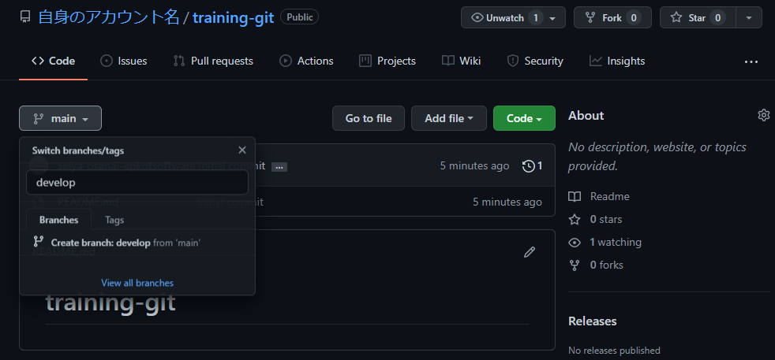

#### ブランチ設定

- リポジトリのメインページに移動
- 「`Settings`」タブをクリック
- 「`Branches`」をクリック
- Default branch ～ デフォルトブランチをdevelopに変更
  - 切り替えアイコンをクリック  
    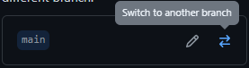
  - 「`develop`」を選択して、「`Update`」ボタンをクリック
  - 「`I understand, update the default branch.`」ボタンをクリック
- Branch protection rules ～ ブランチ保護ルール追加
  - 「`Add rule`」ボタンをクリック
    - Branch name pattern: `*[main|develop]*` （mainとdevelopに適用）
    - 以下をチェック
      - 「`Require a pull request before merging`」
        - ※ サブ項目のチェックは外す
      - 「`Include administrators`」
  - 「`Create`」ボタンをクリック

※ 今回は、学習のための保護設定にしてあります。  
　学習外にはなりますが、その他のブランチルールについては公式を参照してください。  
　<https://docs.github.com/ja/repositories/configuring-branches-and-merges-in-your-repository/defining-the-mergeability-of-pull-requests/managing-a-branch-protection-rule>

#### タグ作成

今回は不要ですが、開発準備が完了した時点（Laravelだとインストール直後のソースコード等）でタグの作成を行います。  
タグに関しては、管理者が行うことが多いので学習外とし詳細説明を割愛します。  
初回だと「`v0.1`」、リリース時は「`v1.0`」のようなタグが多いでしょうか。  
コマンドでつける場合、「`git tag`」コマンドで行います。  

- GitHub Managing releases in a repository
  - <https://docs.github.com/ja/repositories/releasing-projects-on-github/managing-releases-in-a-repository>
  - 本番リリースしないタグについては「This is a pre-release」にチェックをしましょう。
- Laravel(GitHub)
  - Laravelだと「`v8.6.9`」のようにタグをつけています。
  - <https://github.com/laravel/laravel/tags>
  - タグをつけることで、2つのタグを指定して変更点を確認することが容易に出来ます。
    - <https://github.com/laravel/laravel/compare/v8.6.8...v8.6.9>

#### CloneするためのURLを取得

- Cloneする方法はいくつかありますが、今回はHTTPSで行います。
- リポジトリのメインページに移動
- 「`Code`」をクリックし、「`HTTPS`」タブに記載されているURLをコピー  
    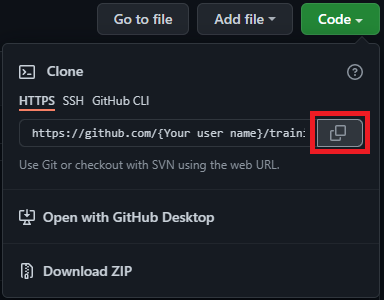
- このURLを `git clone` で使用します。

## リモートリポジトリ複製

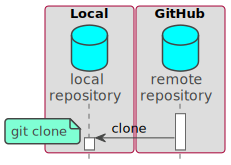
[PlantUML](https://www.plantuml.com/plantuml/umla/PSyn3i8m38NXtQTuPES27L0t63W2YzEwD98ReyIjuFO4bWgnUFZbpvBxwbnyNPGEFiiYs58id9tcD0ecCu_s96e3uMe3Qo1WPEV8LH3qaswvoCDgSYkl0AvGaZnYX-VabpN-oYABkVnHsoaFdZPsQSrmF46xGIqBvUQWCdc7Ut9yuxwirBSBxQ4t)  

リモートリポジトリ（GitHub上のリポジトリ）をローカルに複製します。  
「`Git Bash`」で任意の場所に「`git clone "★URL"`」を実行しましょう。  
URLはGitHub上で取得したものを使用します。  

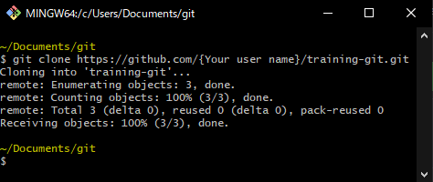  

VSCodeで「`training_git`」フォルダを開きましょう。  
ターミナルは「`Git Bash`」を選択してください。  
「`Git Graph`」は任意ですが表示方法は以下になります。  

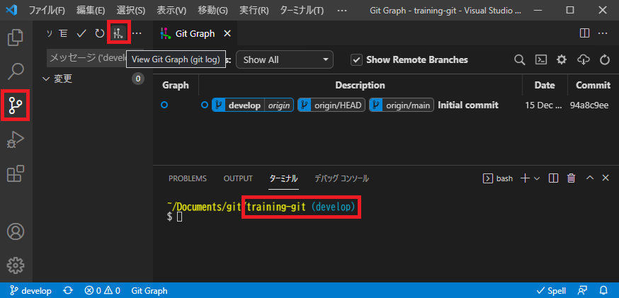  

## Git学習シナリオ

現場のGit運用については「git flow」や「github flow」をベースにすることが多いかと思います。  
今回は「git flow」を簡単にしたものを想定して実際にGit操作していきましょう。  

### シナリオ

以下はプロジェクト開始～リリースまでのブランチの流れを表しています。  
開発者はあなたを含めて2名で、あなたはA機能を担当  
もう1名はB機能を担当します。

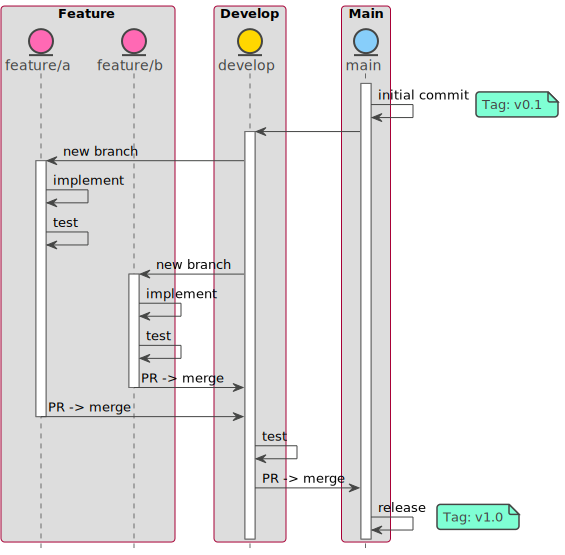
[PlantUML](https://www.plantuml.com/plantuml/umla/VP3DJiCm3CVlUGhJdHdRjGUq0-A6X10lu2nEQorEfjOjxErPb4hfOEAIoF-FdomVHiL19mdcGNiIWfdjW55Dpux0fwGsVHjpVQ1v9THfeCO0K5JM2pI-I4_O08xW4JPzqZF7qvsCBHbRCnGTLFmBpHJIUOrtYvIB3ZPT2kvNwGqvhXkIvnmNs0JkUXrF5nicgZKyAi-e16847fz1MewiZ06EIOJLn7GrXznjFx5hOTvjzoNgQjaPbnMFRQGlo2SxzjNrQ3mkFh2S0mb5NMbAeou4UvzWZRUBNmbLAuGoklRz8_z2GqV6qGq4_qzWsSAjLvARj1G91Wg48_qzptwxCmUARfBm0m00)  

|  | Mainへのマージ | Developへのマージ | push | 概要 |
| :---: | :---: | :---: | :---: | --- |
| Main | - | △ | × | Production branch<br>本番リリース用ブランチ<br>他のブランチへのマージは、障害があった場合を除いて行われません。 |
| Develop | PRによるマージ | - | × | Development branch<br>開発ブランチ |
| Feature | × | PRによるマージ | 〇 | 開発ブランチ(機能・課題毎に分ける) |

## featureブランチの作成

A機能の実装を開始するため「Feature」ブランチを、リモートリポジトリの「Develop」ブランチから作成します。  

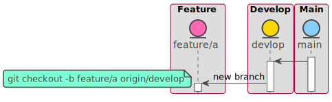
[PlantUML](https://www.plantuml.com/plantuml/umla/NOyxRiD030Lxdk95gWttBW8NGReSWXAvMaBxCIHAYM-VB0n4XXi277AAkQxEYsyvqPj7pOhTXeMBKpHHX5fzg3z4VmFTfx9lYtO4Q77pExhmG6Vkm2i2eu_LRrPcqY8ur0_TDTNRiogwDz8yGJ_L92_E5rjv5dBRstj6dsoAlixt8MrwQ3owxUoAJ1cdTyX1XAIHm9UYtsY9OpokWQbKLoGDVi5aZZ7gEDVDSHhm7ucws6JbB8yQkcgHBQTV)  

作成する前に「`git fetch`」コマンドにより、ローカルリポジトリを最新の状態にします。  
チームで作業している場合、自分が作業している間に変更が加えられている可能性があるためです。

```bash
# リモートリポジトリの最新をローカルリポジトリに取り込む
git fetch
# 「develop」リモートブランチから「feature/a」ブランチを作成
git checkout -b feature/a origin/develop
```

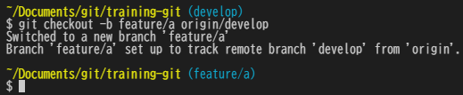  

### originとは

リモートリポジトリの名前（デフォルト名）と覚えておきましょう。  
「`git clone`」コマンドを実行すると、デフォルトの「`origin`」が設定されます。  

詳細については割愛しますが、先ほどの「`origin/{ブランチ名}`」はリモートトラッキングブランチ(追跡ブランチ)と言って、厳密にはリモートブランチではありません  
「`git fetch`」を実行することで「`origin/{ブランチ名}`」はリモートブランチと同じ状態になると覚えてください。

## A機能

A機能の実装・テストに入りましょう。

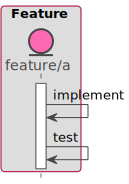
[PlantUML](https://www.plantuml.com/plantuml/umla/JOunhi9034HxdsB-_XhHKw1KtCCXZcAHtOrs9n7S7WiQ6ijwzjFCqAcDUrxbZujbm-5Zqq9PV3BCjNAiJv4OI3TJxisI05ReV27DNtJM1EsO5VzBvURb8LOcV5Izqm-bnLNYuNIDvGBFsnfnXJ-CrYb3Y57d3G00)  

### A機能実装

まずは、A機能を実装します。  
A機能はWEBページとしますので「`htdocs/a.html`」を適当に追加しましょう。

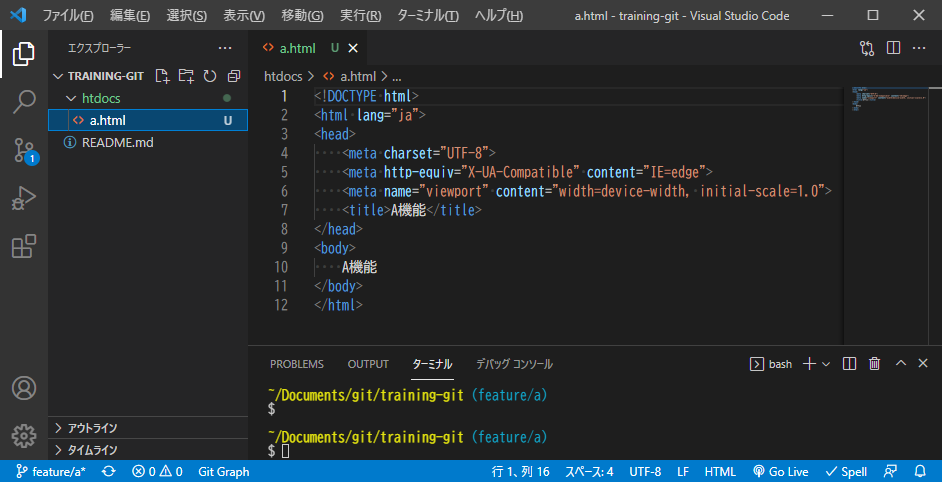  

### A機能テスト

A機能のテストをします。  
テストと言ってもウォーターフォールで言う単体テストではなく、実装フェーズ内のセルフチェックです。  
今回はシンプルな機能なので割愛しますが  
実際は以下のような確認を行います。

- 表示内容が仕様通りになっているか
- 実装した機能が正常に動作するか
- UnitTestが通るか
  - UnitTestについては以下を参照
    - PHPUnit マニュアル
      - <https://phpunit.readthedocs.io/ja/latest/>
    - Laravel 8.x Testing
      - <https://readouble.com/laravel/8.x/ja/testing.html>

### A機能コミット

動作に問題なければローカルブランチにコミットします。  
コミットに関しては変更内容を確認しながら行うため  
コマンドラインでやることは少ないので、VSCodeでの方法をご紹介します。  
コマンドラインで行う方法も覚えておきましょう。  

- VSCodeの画面左にある「ソース管理」アイコンを選択
- コミット対象のファイルを選択し、「+（変更をステージ）」アイコンをクリックし、「ステージされている変更」に入れる。
- コミットメッセージを入力
- 「✔（コミット）」アイコンをクリックし、「ステージされている変更」に入っているファイルをコミットする。
  - コミットすると同期に関するボタンが出てきますが無視してください。

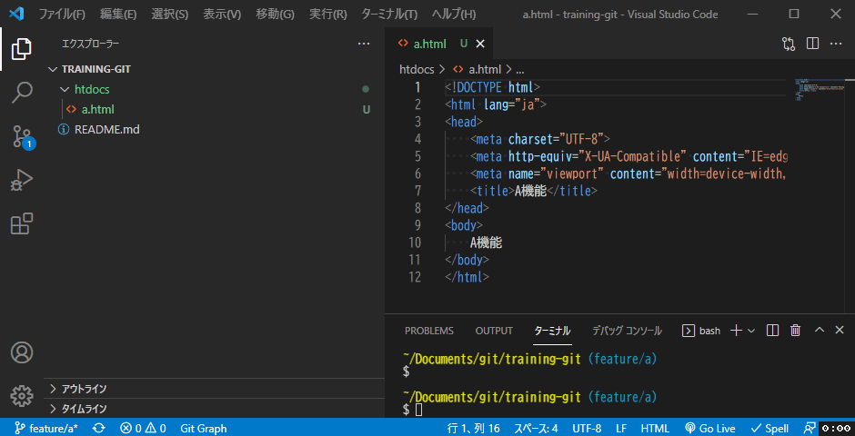  

```bash
# VSCodeの「変更をステージ」と同様
git add htdocs/a.html
# VSCodeの「ステージされている変更」をコミット
git commit -m ":sparkles: htdocs/a.html"
```

※ コミットコメントの「`:sparkles:`」は絵文字を表します。  
※ この時点ではGitHubには反映されません。

## B機能

ここで一旦、B機能（Bさん）の作業を行いましょう。  
A機能と平行で進めていると仮定します。  

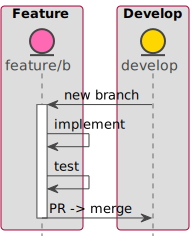
[PlantUML](https://www.plantuml.com/plantuml/umla/JO-zJiKm38LtFuN9dH7x7L07n8nuWwG-QIBoKwLkWRSd5Rrg5rl-hE_87XQrJTUSw4a3CdYBhjcY5AA0VQtgwWzHBspUONLjCCICeb5_sVX_zE8CsuMzurkeEiVoHIZ2f_g63QdELrKEj8l2jwacEINXvzSUTo_uvlsUCP0TDMvMqJ5vT-mvvZaXe-Y5APR7AFUFpxrdj0aak8OCAD8V_mC0)  

### B機能実装

まずは、GitHubでFeatureブランチを作成します。

- リポジトリのメインページに移動
- 「`develop`」ブランチを選択し、ブランチ名に「`feature/b`」を入力し、「`Create branch: feature/b from 'develop'`」をクリック

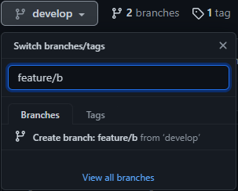  

次にB機能を実装します。

- 「`feature/b`」ブランチを選択し、「`Create new file`」をクリック  
  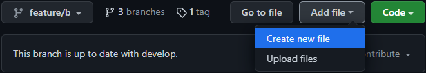  
- ファイル名に「`htdocs/b.html`」を入力  
  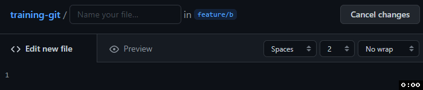  
- ファイル内容に以下を入力

```html
<!DOCTYPE html>
<html lang="ja">
<head>
    <meta charset="UTF-8">
    <meta http-equiv="X-UA-Compatible" content="IE=edge">
    <meta name="viewport" content="width=device-width, initial-scale=1.0">
    <title>B機能</title>
</head>
<body>
    B機能
</body>
</html>
```

- 任意のコミットメッセージを入力
- 「`Commit new file`」ボタンで「`feature/b`」ブランチにコミット

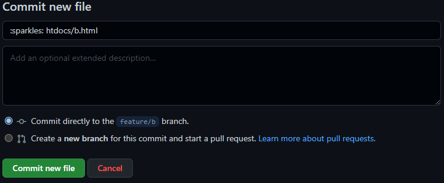

上記の要領で「`htdocs/index.html`」もコミットしてください。  
ファイル内容は以下にしてください。

```html
<!DOCTYPE html>
<html lang="ja">
<head>
    <meta charset="UTF-8">
    <meta http-equiv="X-UA-Compatible" content="IE=edge">
    <meta name="viewport" content="width=device-width, initial-scale=1.0">
    <title>Home</title>
</head>
<body>
    <nav>
        <ul>
          <li><a href="b.html">B画面</a></li>
        </ul>
    </nav>
</body>
</html>
```

### B機能テスト

テストは割愛します。

### B機能PR作成

以下の手順でPRを作成します。

- リポジトリのメインページに移動
- 「`Pull requests`」タブをクリック
- 「`New pull request`」ボタンをクリック
- ブランチを以下のように選択し、「`Create pull request`」をクリック
  - 「`base: develop`」 ← 「`compare: feature/b`」  
  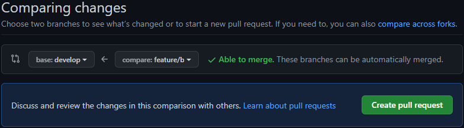  
- 「`Open a pull request`」画面で「`Create pull request`」をクリック

### B機能PRマージ

実際はレビューが通ったらマージを行いますが  
今回はそのままマージします。

- 「`Merge pull request`」ボタンをクリック
- 「`Confirm merge`」ボタンをクリックし、マージを行う。
- 「`Delete branch`」ボタンをクリックし、Featureブランチを削除

以上の手順で「`develop`」ブランチにB機能が実装されました。  
A機能の作業に戻りましょう。

## 参考

TODO

- サイト
  - サル先生のGit入門
    - <https://backlog.com/ja/git-tutorial/>
- git help
  - `git help` コマンドでブラウザでヘルプを見れます。
    - 例: `git help checkout`
