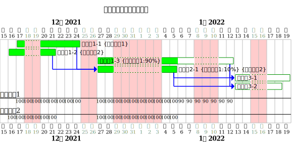
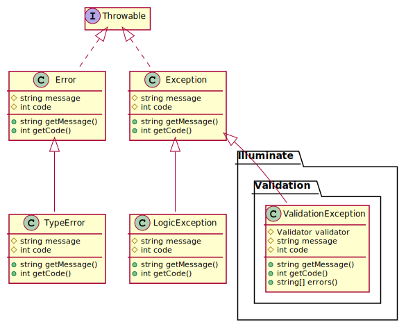
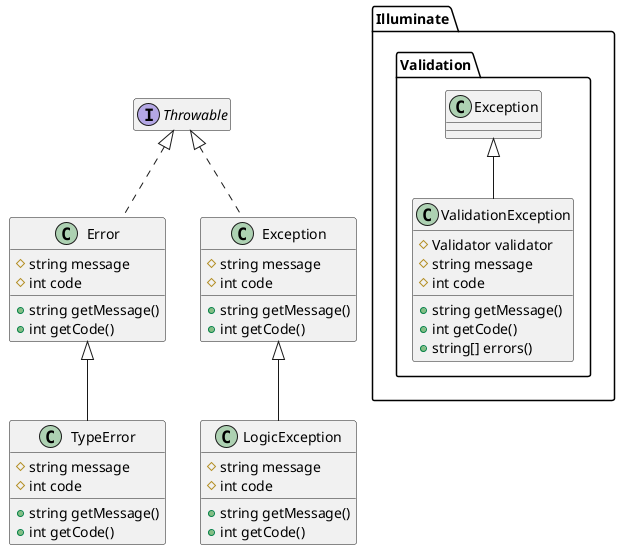
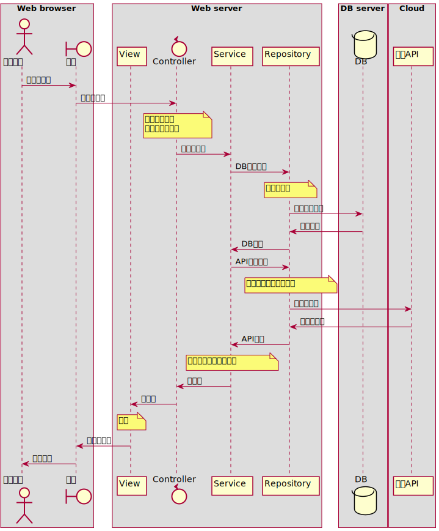
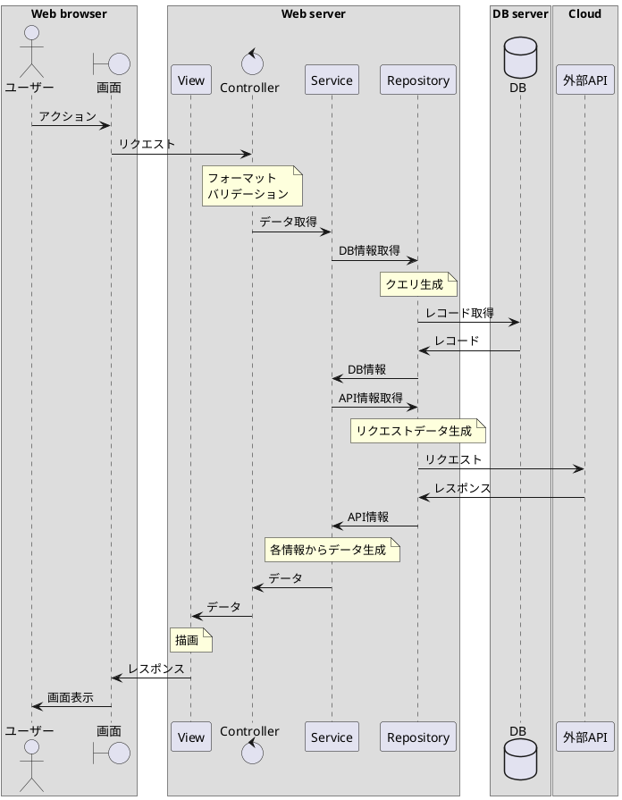
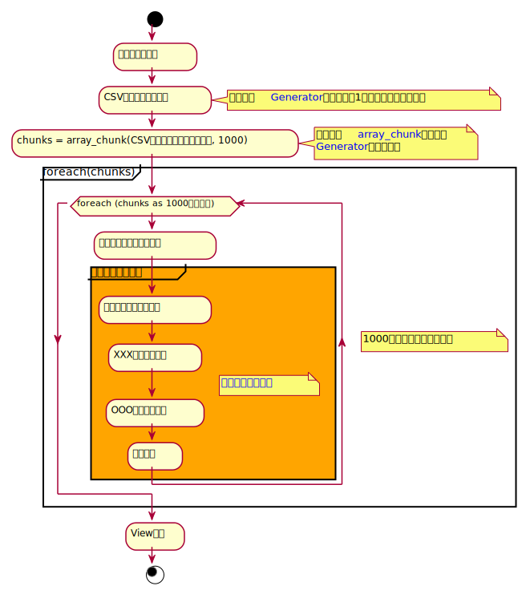
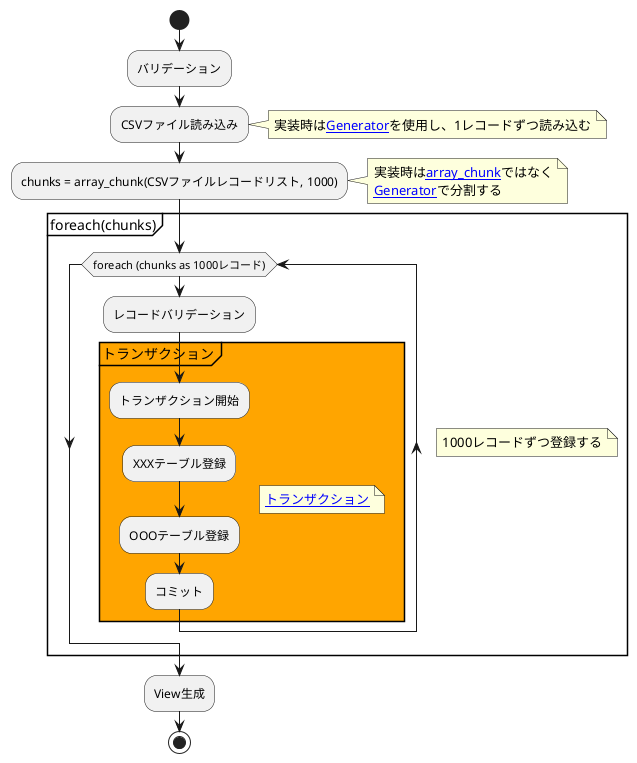

# 株式会社エプコットソフトウェア ～ PlantUML

- PlantUML
  - <https://plantuml.com/ja/>

## ガントチャート

- [ガントチャート](https://www.plantuml.com/plantuml/umla/fPJFYXD14CRlzHG5ikmfsDDZDaIMPN4bNZnuyBPuA6QQCBkTxgMx1maX1sSk7lMqPn5F2Xx4Wx3WmxJu7FOqwKr26n0C1BxvgkfNt_oPERUEZ6iN4k3KkgKKPp0dvTpJXkQ65hW2H4VsEWh49rHTFpEwLVM5bjhW0yPcCyPYxNcZnBqxPT5TXtybjHNr8S1iTX5-crOoHh_6LOuRriIUDPm-tEG4IMhUqbpW5S6DQPIp5Kc1DJLo2QvnGVlkY--_-Vwjxz_u_gFlxmRTVO_chUy_0y3nhxltlsy_WINNcfgMI4PiGeDjrU3WhiSPBqO57_4fEetXY8zOCM8bDZQr9BDWEoOS--wdxtxuxYjStilGz0h9ukLB5gLMkFBzXnZmNSXRh56ITHPFC2InIAeUc0LZHrZfnOqKJjHxFBxbyPp74-_Hl_BAn8ioo_TuoeuISxB7nF419j-USvGvimZC_yjTRdSCSZCytXi-EChJw22plTael33wIbGEuyjaCJqXnHWmtTYiDaardjTEKgtCQdoomnoTfMku0ylDCfdbtqqUp3IJTIOpTPuBLG_VYpy0)
  - スケジュール・進捗管理等で使用しました。



```plantuml
@startuml
<style>
ganttDiagram {
  task {
    BackGroundColor #00FF00
    LineColor #009000
  }
  closed {
    BackGroundColor #FFCCCC
  }
  arrow {
    LineColor #0000FF
  }
}
</style>

language ja
printscale daily
title ガントチャートサンプル


'休日
saturday are closed
sunday   are closed
2021-12-29 to 2022-01-03 is closed
2022-01-10 is closed

'タスク
[タスク1-1] as [T01-1] on {メンバー1} lasts 6 days and is 100% completed
[タスク1-2] as [T01-2] on {メンバー2} lasts 4 days and is 100% completed
[タスク1-3] as [T01-3] on {メンバー1:90%} lasts 7 days and is  50% completed
[タスク2-1] as [T02-1] on {メンバー1:10%} {メンバー2} lasts 4 days and is 100% completed
[タスク3-1] as [T03-1] lasts 5 days and is 0% completed
[タスク3-2] as [T03-2] lasts 4 days and is 0% completed

Project starts 2021-12-15
  [T01-1] starts 2021-12-17
  [T01-2] starts 2021-12-16
  [T01-3] starts 2021-12-27
  [T01-1] -> [T02-1]
  [T01-2] -> [T02-1]
  [T01-3] -> [T03-1]
  [T01-3] -> [T03-2]
  [T02-1] -> [T03-1]
  [T02-1] -> [T03-2]
@enduml
```

## クラス図

- [PlantUML クラス図](https://www.plantuml.com/plantuml/umla/lP5FIyH03CNlyoa2Ur7y4WlYGT3RuaKyP6TYTt3-b2IhAzBlRaFRqIBYPJ5G2B_toijhjwB8Uip9nQB4p-W9TWUkRxXF11zkS8SOlgDCUKyiplc48d33N1bYxXDbAYghbm4seXnB1vb4i2CZOmxu6co_cjMEz7uoN5mQDil8hcimCBIiawTUOot_bBTxxsdgHoUb4fQsPm-wgrtqhLrBQ-ISYJtwbr65svIEEHRKwSCj-05J3DX20QOBl_1VPzfiPdjbU5ssHVhH0c3T1E3NDZRhHcl_unEG_I6PXS7PCxWjbN3CwHC0)
        - 実装前のクラス設計が必須の現場で使用しました。





## シーケンス図

- [PlantUML シーケンス図](https://www.plantuml.com/plantuml/umla/TPEzRXGn4CTxFyLeUrxW2XIID7G896XeRA-BbOxroTxTa18RH2AAkoA4Adn44Hm82Q5883u43pFQE_8MZ6rqwopGdApv-VznS-Sjst3JjFUcJEZxKDnH0eJHUrQPWW5msMW31VhNwB-Z-qIV1N0BBJ6XsxhaPX-AzT6tYvFJ20HJTGbaDTYHLPVSPfHKoMh6wmQAsvNQYvAEYDHrO_GKYfrqc2eJcHohRf5P9LM4TWnlgfcs5JNUZznSxhAxdLKfUSC5jogCu-NoykMTgMxBlphtPySNVddjnlKeuHi9Q-7ALH0m0NIdw3wW-up-3Vfp9WAG0VXt4IpHVK5_m6hTAD3K1cI0Jz6z3Ilspz5xudThz8kWyOzfFFZ9u6UZNm8_-_bn_-CPim4O0hlRA_-eV_anpRCSCu7KW6pNHozM1mjcWgYCRk_HdSS2Xt-4PJGSiQImMSmGJ6lvV_Bews_QvqNuFzR4inPnT49ReCEco12R1Te9z8k7QOmFdg0x70V6rZBVOrfjbuyonsu2g_cS_kYis_pKeqOYW9P0UWw_NYtNPr_PbgfBUbs_0G00)
  - 業務フロー・基本設計・詳細設計等、様々な用途に使われます。





## アクティビティ図

- [PlantUML アクティビティ図](https://www.plantuml.com/plantuml/umla/hLJFQnD16BtFNp6abmHqDpruIH0gGZtc89H0N6H8fzbeEhlipYOHANHciAP4i4Yjn4iG2z7ues114QlzOpxJfF-5aqbgXzgq8CrXoSpttZVllVcOXPYJY2UhDMJ-85GgpO7Q0jK7zHJK0SXle7gWzZqlT-v-tb3ASHtKIv1lGEw2-Z3gVm9nEFfreB-QUFlkqgng7h60KnnLApxFuS7dxkZjawEE1B5NAlcSXt7ETHkDXXFweSCeTrS9IqZDVK3S6c6LX5IeKw6CHeG7KUm4THhLgzJ0yPsJVSy3-UBtpyFXzZiGhs1Tp8Fw279_R4DjWdWDOlTKarn7A5Vs4_OmnZSnYIBowBvPfi_Oi9kCSv7VGRMkuVbiDflvJrkKkIi9A_Dgm1npydLpih5ZAT66H4_t0j47yVmUkzAeH6_GsXXiVW7H0Tb6A2GHhuuLuTHA455IzjEJT38f_1XXtF2hDOhJqngU5Z69JH9sI9aCmlfd9sD1hCiOTduSFpiHO3XcAYtOp0cz19EVjBCyWMg1UgzB8B-2tFkBJE6vnSLRDx9PO_AixiiI3vS3XqU4nSHSPcnIddMKvnbL4vkpGCSxxK6lRJnU1CXRhPhD9gWDayQEdjT9ghf3iLZyTzyc1a5mBh5GA5nCDE5tGIajKkFjvHIsfh-KBPkXGMlcxLZIKpZSxXwrjZJbTA49CGz2jA3X-dtw0m00)
  - 機能単位で詳細設計に使用しました。




