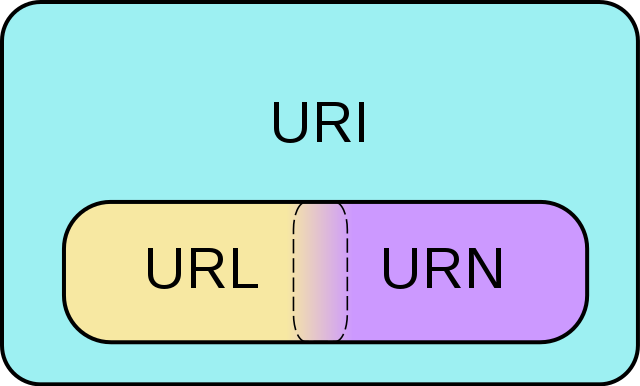

# 株式会社エプコットソフトウェア ～ URL

## 目次

| No. |  |
| :---: | --- |
| 1 | [はじめに](#はじめに) |
| 2 | [URLとURI](#urlとuri) |
| 3 | [URI](#uri) |
| 4 | [パス](#パス) |
| 5 | [パーセントエンコーディング](#パーセントエンコーディング) |
| 6 | [参考](#参考) |

## はじめに

実務において、全てを理解する必要はありません。  
以下については覚えておきましょう。

- URLとURIはほぼ同じ
- クエリ（引数）
- フラグメント（アンカー）
- パス（絶対パス、ルートパス、相対パス）
- パーセントエンコーディング（URLエンコード）

## URLとURI

**URLとURIは基本的に同じものという考えで問題ありません。**  

URIはURLを抽象化したものなので、幅広い意味になります。  
URNについては実務でも、ほとんど使われることがないため  
覚える必要はありません（恐らく知っている人も少ない）。  

- [Wikipedia - Uniform Resource Identifier](https://ja.wikipedia.org/wiki/Uniform_Resource_Identifier)
- [Wikimedia Commons](https://commons.wikimedia.org/w/index.php?curid=2649934)  
  

WHATWGによってURLに統一する動きもあります。  
※ 文中のIRIはURIを拡張したものです。

```txt
Standardize on the term URL.
URI and IRI are just confusing.
In practice a single algorithm is used for both so keeping them distinct is not helping anyone.
URL also easily wins the search result popularity contest.

URL という用語で標準化する。
URI と IRI は混同され易い。
実際には、どちらに対しても同じアルゴリズムが利用されるので、それらを区別する利点は無い。
Web の検索結果 でも URL の方が優位にある。
```

- URL Standard
  - <https://url.spec.whatwg.org/>
  - 日本語訳
    - <https://triple-underscore.github.io/URL-ja.html>
- 検索キーワードの比較
  - <https://trends.google.com/trends/explore?q=url,uri>

## URI

- 構文：`<scheme>://<host><port><path><query><fragment>`
- 例：`http://localhost:443/admin/index.php?k1=v1&k2=v2#a`

| コンポーネント | 例 | 解説 |
| --- | --- | --- |
| スキーム<br>(scheme) | `https`<br>`http` | 最初のうちは`https`または`http`を使うことを覚えておきましょう。 |
| ホスト<br>(host) | `www.example.com`<br>`localhost`<br>`127.0.0.1` | WebサイトのFQDN（完全修飾ドメイン名）、IPアドレスを記述します。<br>サーバー名or住所を記述すると覚えておきましょう。<br>開発時は「`localhost`」や「`127.0.0.1`」をよく使います。 |
| ポート<br>(port) | `:443`<br>`:80` | 【省略可】`:`の後ろにポート番号を記述します。<br>HTTPSは443、HTTPは80が標準ポートになり省略可能になっています。<br>それ以外のポートを使う場合に必須です。 |
| パス<br>(path) | `/admin/index.php` | 対象へのルートパス（`/`から始める）を記述します。<br>詳細については「[パス](#パス)」参照 |
| クエリ<br>(query) | `?k1=v1&k2=v2` | 【省略可】引数(Parameters)とも呼ばれます。<br>`?`の後ろにクエリを記述します。<br>クエリはKeyとValueのペアを`&`で区切ることで複数のパラメータを設定できます。<br>用途としては、検索ワードやページ番号などのユーザーに見られても問題ない情報を設定します。 |
| フラグメント<br>(fragment) | `#a` | 【省略可】アンカー(Anchor)とも呼ばれます。<br>`#`の後ろにフラグメントを記述します。<br>主にページ内リンクなどに使われます。 |

### 例

URIの例です。  
**※表は横スクロールができます。**

| URI | Scheme | Host | Port | Path | Query | Fragment |
| --- | --- | --- | --- | --- | --- | --- |
| `https://www.example.com` | `https` | `www.example.com` | - | - | - | - |
| `http://localhost` | `http` | `localhost` | - | - | - | - |
| <https://www.google.com/search?q=url+uri&tbm=isch> | `https` | `www.google.com` | - | `/search` | `q=url+uri&tbm=isch` | - |
| <https://epkotsoftware.github.io/training/url/#パス> | `https` | `epkotsoftware.github.io` | - | `/training/url/` | - | `パス` |
| `https://www.example.com:8080/admin/index.php?key1=value1&key2=value2#contents` | `https` | `www.example.com` | `8080` | `/admin/index.php` | `key1=value1&key2=value2` | `contents` |

JavaScriptの[URL API](https://developer.mozilla.org/ja/docs/Web/API/URL_API)で生成したオブジェクトを  
`console.log`で出力すると構成がわかりやすいです。

```js
const uri = 'https://www.example.com:8080/admin/index.php?key1=value1&key2=value2#contents';

console.log(new URL(uri));
// URL {
//   href: 'https://www.example.com/admin/index.php?key1=value1&key2=value2#contents',
//   origin: 'https://www.example.com',
//   protocol: 'https:',
//   username: '',
//   password: '',
//   host: 'www.example.com',
//   hostname: 'www.example.com',
//   port: '8080',
//   pathname: '/admin/index.php',
//   search: '?key1=value1&key2=value2',
//   searchParams: URLSearchParams { 'key1' => 'value1', 'key2' => 'value2' },
//   hash: '#contents'
// }
```

## パス

パスについてはWebに限らず、Linuxでも必要になってくるので  
エンジニア必須の知識になります、しっかり学習しておきましょう。

- 【Web業界の常識】「パス」の書き方、説明できますか？Webデザイナー・プログラマー志望の皆さんへ 初心者向け【HTML・CSS コーディング】
  - <https://youtu.be/R7tNviqrMzo>

| パスの種類 | 例 | 解説 |
| --- | --- | --- |
| 絶対パス | `https://example.com/css/common.css` | 目的のファイルまでの道筋を全部書く。<br>主に外部サイトへのアクセスに使用する。 |
| ルートパス | `/css/common.css` | ルートディレクトリから、目的のファイルまでの道筋を全部書く。<br>同一サイトで使用可、「`/`」から始まる。 |
| 相対パス | 現在位置がルートの場合<br>`css/common.css`<br><br>現在位置が`/admin`の場合<br>`../css/common.css` | 現在の位置から、目的のファイルまでの道筋を全部書く。<br>同一サイトで使用可。 |

## パーセントエンコーディング

クエリ・フラグメントなどで  
URIに使用できない文字を使うにはパーセントエンコーディングを行います。  
URLエンコードとも呼ばれます。  

例えば以下の様に変換されます（暗記する必要なし）。

| 文字 | パーセントエンコーディング |
| :---: | :---: |
| `#` | `%23` |
| `%` | `%25` |
| `&` | `%26` |
| `<` | `%3C` |
| `=` | `%3D` |
| `>` | `%3E` |
| `?` | `%3F` |
| `あ` | `%E3%81%82` |
| `ん` | `%E3%82%93` |
| `ア` | `%E3%82%A2` |
| `ン` | `%E3%83%B3` |

### プログラミング言語でのエンコーディング方法

以下の関数が用意されています。  
利用する際は、公式サイトの説明を読んだ上でご利用ください。

- JavaScript
  - [encodeURIComponent](https://developer.mozilla.org/ja/docs/Web/JavaScript/Reference/Global_Objects/encodeURIComponent)
  - [decodeURIComponent](https://developer.mozilla.org/ja/docs/Web/JavaScript/Reference/Global_Objects/decodeURIComponent)

```js
const value = 'パス';

const encodedValue = encodeURIComponent(value);
const decodedValue = decodeURIComponent(encodedValue);

console.log({value, encodedValue, decodedValue});
// { value: 'パス', encodedValue: '%E3%83%91%E3%82%B9', decodedValue: 'パス' }
```

クエリを生成する場合、URLSearchParamsも使えます。

- JavaScript
  - [URLSearchParams](https://developer.mozilla.org/ja/docs/Web/API/URLSearchParams)

```js
const params = {'k1': 'パス', 'k2': '<value>'};

const urlSearchParams = new URLSearchParams(params);

console.log(urlSearchParams.toString());
// k1=%E3%83%91%E3%82%B9&k2=%3Cvalue%3E
```

- PHP
  - [rawurlencode](https://www.php.net/manual/ja/function.rawurlencode.php)
  - [rawurldecode](https://www.php.net/manual/ja/function.rawurldecode.php)

```php
<?php

$value = 'パス';

$encodedValue = rawurlencode($value);
$decodedValue = rawurldecode($encodedValue);

var_export(compact('value', 'encodedValue', 'decodedValue'));
// array (
//   'value' => 'パス',
//   'encodedValue' => '%E3%83%91%E3%82%B9',
//   'decodedValue' => 'パス',
// )
```

## 参考

本資料作成に参考にしたページです。

- `Internationalized Resource Identifier - Wikipedia`
  - <https://ja.wikipedia.org/wiki/Internationalized_Resource_Identifier>
- `RFC 1737: Functional Requirements for Uniform Resource Names`
  - <https://www.rfc-editor.org/rfc/rfc1737>
- `RFC 1738: Uniform Resource Locators (URL)`
  - <https://www.rfc-editor.org/rfc/rfc1738>
- `RFC 3986: Uniform Resource Identifier (URI): Generic Syntax`
  - <https://www.rfc-editor.org/rfc/rfc3986>
- `RFC 3987: Internationalized Resource Identifiers (IRIs)`
  - <https://www.rfc-editor.org/rfc/rfc3987>
- `URL とは？ - MDN`
  - <https://developer.mozilla.org/ja/docs/Learn/Common_questions/What_is_a_URL>
- `The Real Difference Between a URL and a URI`
  - <https://danielmiessler.com/study/difference-between-uri-url/>
- `URL Standard`
  - <https://url.spec.whatwg.org/>
